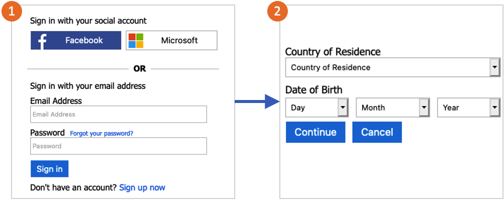

# Enable age gating in Azure Active Directory B2C

[!INCLUDE [active-directory-b2c-choose-user-flow-or-custom-policy](../../includes/active-directory-b2c-choose-user-flow-or-custom-policy.md)]

Age gating in Azure Active Directory B2C (Azure AD B2C) enables you to identify minors that want to use your application, with, or without parental consent. You can choose to block the minor from sign-in into the application. Or allow uses to complete the sign-in, and provide the application the minor status. 

>[!IMPORTANT]
>This feature is in public preview. Do not use feature for production applications.
>

When age gating is enabled for a user flow, users are asked for their date of birth, and country of residence. If a user signs in that hasn't previously entered the information, they'll need to enter it the next time they sign in. The rules are applied every time a user signs in.

Azure AD B2C uses the information that the user enters to identify whether they're a minor. The **ageGroup** field is then updated in their account. The value can be `null`, `Undefined`, `Minor`, `Adult`, and `NotAdult`.  The **ageGroup** and **consentProvidedForMinor** fields are then used to calculate the value of **legalAgeGroupClassification**.

## Prerequisites

[!INCLUDE [active-directory-b2c-customization-prerequisites](../../includes/active-directory-b2c-customization-prerequisites.md)]

## Set up your tenant for age gating

To use age gating in a user flow, you need to configure your tenant to have extra properties.

1. Make sure you're using the directory that contains your Azure AD B2C tenant by selecting the **Directory + subscription** icon in the portal toolbar.
1. On the **Portal settings | Directories + subscriptions** page, find your Azure AD B2C directory in the **Directory name** list, and then select **Switch**.
1. Select **All services** in the top-left corner of the Azure portal, search for and select **Azure AD B2C**.
1. Select **Properties** for your tenant in the menu on the left.
1. Under the **Age gating**, select **Configure**.
1. Wait for the operation to complete and your tenant will be set up for age gating.

::: zone pivot="b2c-user-flow"

## Enable age gating in your user flow

After your tenant is set up to use age gating, you can then use this feature in [user flows](user-flow-versions.md) where it's enabled. You enable age gating with the following steps:

1. Create a user flow that has age gating enabled.
1. After you create the user flow, select **Properties** in the menu.
1. In the **Age gating** section, select **Enabled**.
1. For **Sign-up or sign-in**, select how you want to manage users:
    - Allow minors to access your application.
    - Block only minors below age of consent from accessing your application.
    - Block all minors from accessing your application.
1. For **On block**, select one of the following options:
    - **Send a JSON back to the application** - this option sends a response back to the application that a minor was blocked.
    - **Show an error page** -  the user is shown a page informing them that they can't access the application.

## Test your user flow

1. To test your policy, select **Run user flow**.
1. For **Application**, select the web application named *testapp1* that you previously registered. The **Reply URL** should show `https://jwt.ms`.
1. Select the **Run user flow** button.
1. Sign-in with a local or social account. Then select your country of residence, and date of birth that simulate a minor. 
1. Repeat the test, and select a date of birth that simulates an adult.  

When you sign-in as a minor, you should see the following error message: *Unfortunately, your sign on has been blocked. Privacy and online safety laws in your country prevent access to accounts belonging to children.*

::: zone-end

::: zone pivot="b2c-custom-policy"

## Enable age gating in your custom policy

1. Get the example of an age gating policy on [GitHub](https://github.com/azure-ad-b2c/samples/tree/master/age-gating).
1. In each file, replace the string `yourtenant` with the name of your Azure AD B2C tenant. For example, if the name of your B2C tenant is *contosob2c*, all instances of `yourtenant.onmicrosoft.com` become `contosob2c.onmicrosoft.com`.
1. Upload the policy files.

::: zone-end

## Next steps

- Learn how to [Manage user access in Azure AD B2C](manage-user-access.md).

