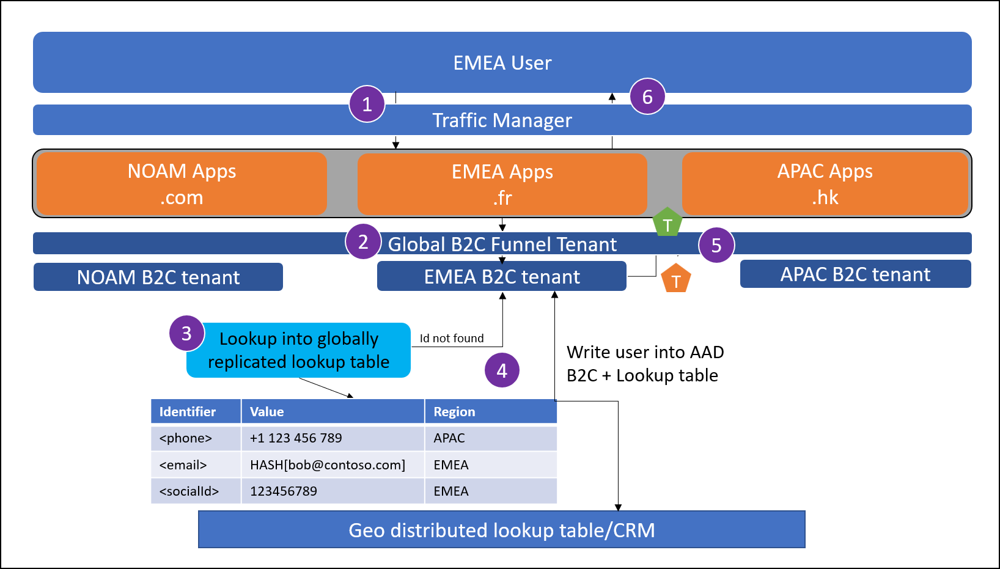
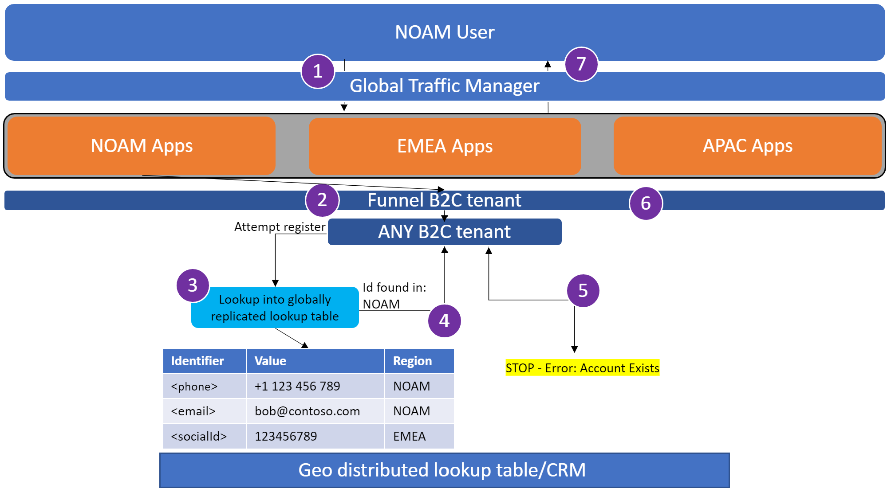
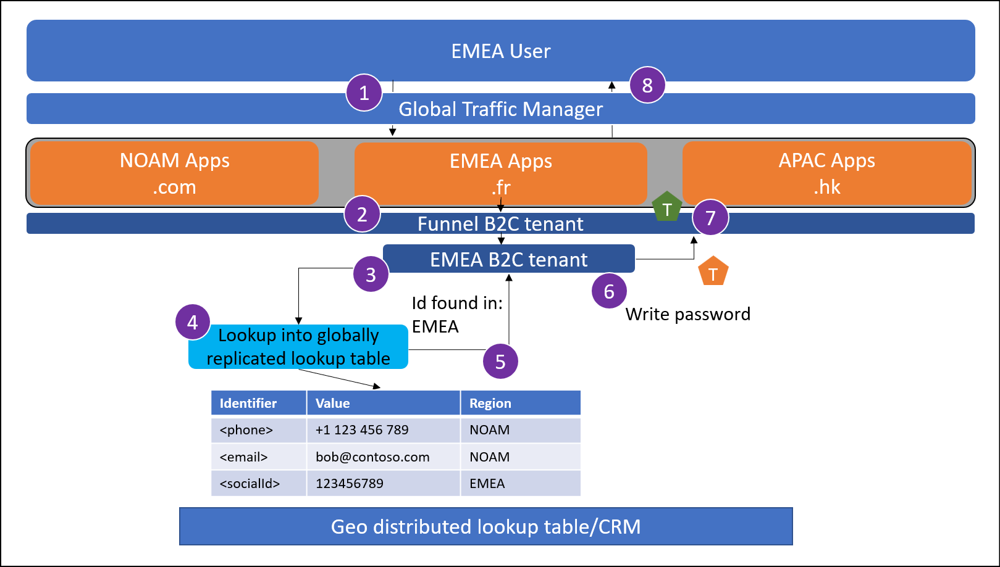
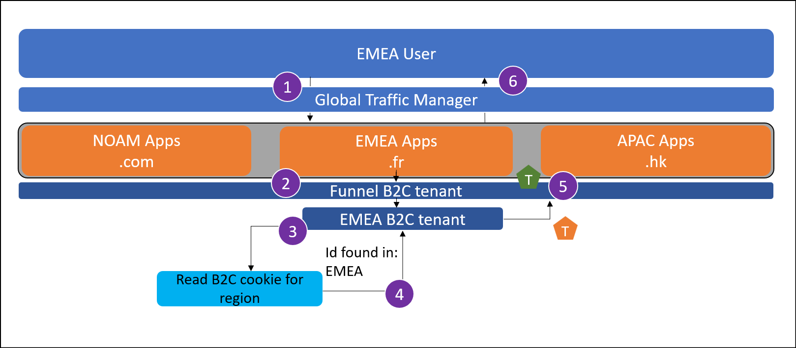
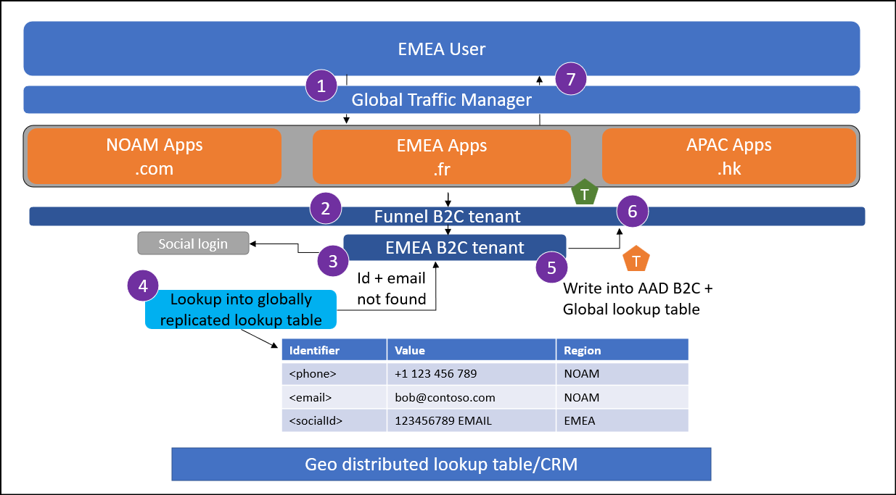
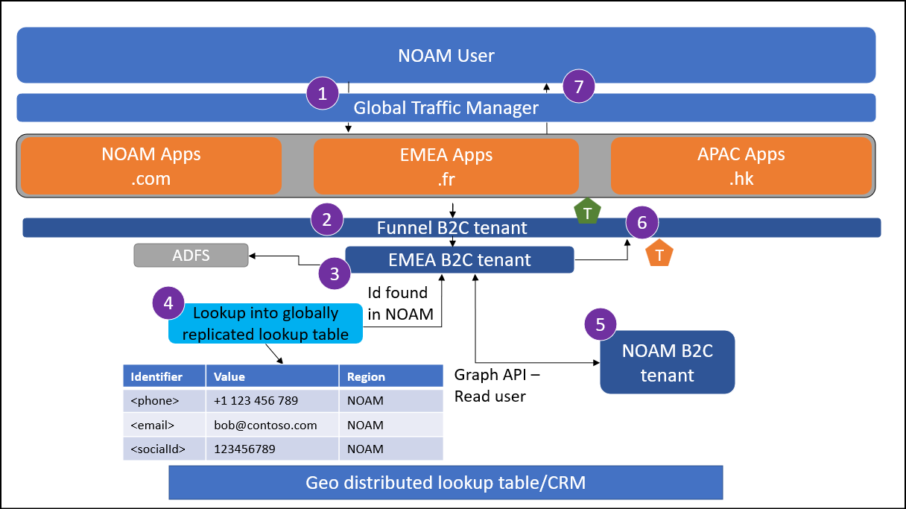

# Build a solution with cross tenant communication

The architecture you decide to model the solution after requires making choices based on the trade-offs between the two models described. For example, the funnel model enables you to maintain a single set of applications. The following section describes the capabilities, selection criteria, and performance that might impact the design you choose.

## Capabilities

The following table describes the capabilities provided using a regional versus funnel-based design:

| Capability| Region-based| Funnel-based |
| - | - | - |
| Supports local account sign-up and sign-in| |  |
| Supports federated account sign-up and sign-in| |  |
| Supports authenticating local accounts for users signing in from outside their registered region| |  |
| Supports authenticating federated accounts for users signing in from outside their registered region using cross-tenant API-based look up| |  |
| Prevents sign up from multiple different regions| |  |
| Applications in each region have a set of endpoints to connect with| |  |
| All applications connect to a single set of endpoints, regardless of which region they're hosted| |  |
| Supports fine-grained Conditional Access policies.| |  |
| Optimized for cost.| |  |

## Considerations

In Azure Active Directory B2C (Azure AD B2C), the resource owner password credentials (ROPC) flow is an OAuth standard authentication flow. In this flow, an application, also known as the relying party, exchanges valid credentials for tokens. The credentials include a user ID and password. The tokens returned are an ID token, access token, and a refresh token.

* When using the region-based approach, the primary consideration is that the approach requires applications spanning multiple regions to have respective configurations for each regional Azure AD B2C tenant.

* When using the funnel-based approach

  * there's a double-token cost

  * custom domains will be required on many tenants

  * Conditional Access is applied at the tenant level, not application level

  * Single sign out through multiple IdPs might introduce challenges

The approach you choose will be based on the number of applications you host and the specific requirements for access to the applications.

## Performance

Performance is mostly unaffected from connecting directly to the native regions Azure AD B2C tenant. This is because the funnel tenant, albeit registered in a specific region, performs policy execution in a DC local to the client. Therefore, there's no impact of connecting to a funnel tenant from any region. A performance loss is encountered due to the extra redirect between funnel and regional tenants.

Based on the above diagram, the funnel tenant will involve the Azure AD Gateway and Azure AD B2C Policy Engine components. These components are globally distributed. Therefore, the funnel isn't constrained from a performance perspective, regardless of where the Azure AD B2C funnel tenant is provisioned.

The regional tenants will perform directory calls into the Core Store, which is a regionalized component. Since most of the traffic will be from local regional users, they won't experience any additional latency.

Additional latency is only encountered when the user has performed an authentication away from the region in which they've signed up in. This is because, the global lookup table will indicate to their local Azure AD B2C tenant (at the time of travel), to make external API calls to the Core Store of the Azure AD B2C tenant in which they signed up into, which maybe across the globe.

## Local account sign-in use cases

The following use cases are typical in a global Azure AD B2C environment. The local account use cases also cover accounts where the user travels. Each provides a diagram and workflow steps for each use case.

### Local user sign-up

This use case demonstrates how a user from their home country/region performs a sign-up with an Azure AD B2C Local Account.

1. User from Europe, Middle East, and Africa (EMEA) attempts to sign up at myapp.fr. If the user isn't being sent to their local hostname, the traffic manager will enforce a redirect.

1. User reaches the Global Funnel Azure AD B2C tenant. This tenant is configured to redirect to a regional Azure AD B2C tenant based on defined criteria using OpenId federation. This can be a lookup based on clientId.

1. The user attempts to sign up. The sign-up process checks a global lookup table to determine if the user exists in any of the regional Azure AD B2C tenants.

1. The user isn't found in the global lookup table. The user’s account is written into Azure AD B2C, and a record is created into the global lookup table.

1. The regional tenant issues a token back to the funnel tenant.

1. The funnel tenant issues a token to the application.

### Existing local user attempts sign up

This use case demonstrates how a user re-registering the same email from their own country, or a different region, is blocked.

1. User from EMEA attempts to sign up at myapp.fr. If the user isn't being sent to their local hostname, the traffic manager will enforce a redirect.

1. User reaches the Global Funnel Azure AD B2C tenant. This tenant is configured to redirect to a regional Azure AD B2C tenant based on some criteria using OpenId federation. This can be a lookup based on clientId.

1. The user attempts to sign up. The sign-up process checks a global lookup table to determine if the user exists in any of the regional Azure AD B2C tenants.

1. The user’s email is found in the global lookup table, indicating the user has registered this email in the solution at some prior point in time.

1. The user is presented with an error, indicating their account exists.

### Local user sign-in

This use case demonstrates how a user from their home country/region performs a sign-in with an Azure AD B2C Local Account.

1. User from EMEA attempts to sign in at myapp.fr. If the user isn't being sent to their local hostname, the traffic manager will enforce a redirect.

1. User reaches the Global Funnel Azure AD B2C tenant. This tenant is configured to redirect to a regional Azure AD B2C tenant based on some criteria using OpenId federation. This can be a lookup based on clientId.

1. User enters their credentials at the regional tenant.

1. The regional tenant issues a token back to the funnel tenant.

1. The funnel tenant issues a token to the application.

### Traveling user sign-in

This use case demonstrates how a user can travel across regions and maintain their user profile and credentials stored in their regional tenant respective to their sign-up.

1. User from NOAM attempts to sign in at myapp.fr since there's a holiday in France. If the user isn't being sent to their local hostname, the traffic manager will enforce a redirect.

1. User reaches the Global Funnel Azure AD B2C tenant. This tenant is configured to redirect to a regional Azure AD B2C tenant based on some criteria using OpenId federation. This can be a lookup based on clientId.

1. User enters their credentials at the regional tenant.

1. The regional tenant performs a lookup into the global lookup table, since this user’s email wasn't found in the EMEA Azure AD B2C directory.

1. The user’s email is located to have been signed up in NOAM Azure AD B2C tenant.

1. The EMEA Azure AD B2C tenant performs an Azure AD ROPC flow against the NOAM Azure AD B2C tenant to verify credentials.
   >[!NOTE]
   >This call will also fetch a token for the user to perform a Graph API call.
   The EMEA Azure AD B2C tenant performs a Graph API call to the NOAM Azure AD B2C. tenant to fetch the user’s profile. This call is authenticated by the access token for Graph API acquired in the last step.

7. The regional tenant issues a token back to the funnel tenant.

8. The funnel tenant issues a token to the application.

### Local user forgot password

This use case demonstrates how a user can reset their password when they are within their home country.

1. User from EMEA attempts to sign in at myapp.fr. If the user isn't being sent to their local hostname, the traffic manager will enforce a redirect.

1. User reaches the Global Funnel Azure AD B2C tenant. This tenant is configured to redirect to a regional Azure AD B2C tenant based on some criteria using OpenId federation. This can be a lookup based on clientId.

1. The user arrives at the EMEA Azure AD B2C tenant and selects “forgot password”. The user enters and verifies their email.

1. Email lookup is performed to determine which regional tenant the user exists in.

1. The user provides a new password.

1. The new password is written into the EMEA Azure AD B2C tenant.

1. The regional tenant issues a token back to the funnel tenant.

1. The funnel tenant issues a token to the application.

### Traveling user forgot password

This use case demonstrates how a user can reset their password when they're traveling away from the region in which they registered their account.

1. User from NOAM attempts to sign in at myapp.fr since they are on holiday in France. If the user isn't being sent to their local hostname, the traffic manager will enforce a redirect.

1. User reaches the Global Funnel Azure AD B2C tenant. This tenant is configured to redirect to a regional Azure AD B2C tenant based on some criteria using OpenId federation. This can be a lookup based on clientId.

1. The user arrives at the EMEA Azure AD B2C tenant and selects “forgot password”. The user enters and verifies their email.

1. Email lookup is performed to determine which regional tenant the user exists in.

1. The email is found to exist in the NOAM Azure AD B2C tenant. The user provides a new password.

1. The new password is written into the NOAM Azure AD B2C tenant through a Graph API call.

1. The regional tenant issues a token back to the funnel tenant.

1. The funnel tenant issues a token to the application.

### Local user password change

This use case demonstrates how a user can change their password after they've logged into the region in which they registered their account.

1. User from EMEA attempts selects “change password” after logging into myapp.fr.

1. User reaches the Global Funnel Azure AD B2C tenant. This tenant is configured to redirect to a regional Azure AD B2C tenant based on some criteria using OpenId federation. This can be a lookup based on clientId.

1. The user arrives at the EMEA Azure AD B2C tenant, and the SSO cookie set allows the user to change their password immediately.

1. New password is written to the users account in the EMEA Azure AD B2C tenant.

1. The regional tenant issues a token back to the funnel tenant.

1. The funnel tenant issues a token to the application.

### Traveling user password change

This use case demonstrates how a user can change their password after they've logged in, away from the region in which they registered their account.

1. User from NOAM attempts “change password” after logging into myapp.fr.

1. User reaches the Global Funnel Azure AD B2C tenant. This tenant is configured to redirect to a regional Azure AD B2C tenant based on some criteria using OpenId federation. This can be a lookup based on clientId.

1. The user arrives at the EMEA Azure AD B2C tenant, and the SSO cookie set allows the user to change their password immediately.

1. The user’s email is found to be in the NOAM tenant after checking the global lookup table.

1. The new password is written to the users account in the NOAM Azure AD B2C tenant by MS Graph API call.

1. The regional tenant issues a token back to the funnel tenant.

1. The funnel tenant issues a token to the application.

## Federated IdP authentications

The following use cases show examples of using federated identities to sign up or sign in as an Azure AD B2C client.

### Local federated ID sign-up

This use case demonstrates how a user from their local region signs up to the service using a federated ID.

1. User from EMEA attempts to sign up at myapp.fr. If the user isn't being sent to their local hostname, the traffic manager will enforce a redirect.

1. User reaches the Global Funnel Azure AD B2C tenant. This tenant is configured to redirect to a regional Azure AD B2C tenant based on some criteria using OpenId federation. This can be a lookup based on clientId.

1. User selects to sign in with a federated identity provider.

1. Perform a lookup into the global lookup table.
   1. **If account linking is in scope**: Proceed if the federated IdP identifier nor the email that came back from the federated IdP doesn't exist in the lookup table.
   1. **If account linking is not in scope**: Proceed if the federated IdP identifier that came back from the federated IdP doesn't exist in the lookup table.

1. Write the users account to the EMEA Azure AD B2C tenant.

1. The regional tenant issues a token back to the funnel tenant.

1. The funnel tenant issues a token to the application.

### Local federated user sign-in

This use case demonstrates how a user from their local region signs into the service using a federated ID.

1. User from EMEA attempts to sign in at myapp.fr. If the user isn't being sent to their local hostname, the traffic manager will enforce a redirect.

2. User reaches the Global Funnel Azure AD B2C tenant. This tenant is configured to redirect to a regional Azure AD B2C tenant based on some criteria using OpenId federation. This can be a lookup based on clientId.

3. User selects to sign in with a federated identity provider.

4. Perform a lookup into the global lookup table and confirm the user’s federated ID is registered in EMEA.

5. The regional tenant issues a token back to the funnel tenant.

6. The funnel tenant issues a token to the application.

### Traveling federated user sign-in

This use case demonstrates how a user located away from the region in which they signed up signs into the service using a federated IdP.

1. User from NOAM attempts to sign in at myapp.fr. If the user isn't being sent to their local hostname, the traffic manager will enforce a redirect.

1. User reaches the Global Funnel Azure AD B2C tenant. This tenant is configured to redirect to a regional Azure AD B2C tenant based on some criteria using OpenId federation. This can be a lookup based on clientId.

1. User selects to sign in with a federated identity provider.

1. Perform a lookup into the global lookup table and determine the user’s federated ID is registered in NOAM.

1. Read the account data from the NOAM Azure AD B2C tenant using MS Graph API.

1. The regional tenant issues a token back to the funnel tenant.

1. The funnel tenant issues a token to the application.

### Merge or link local accounts with matching criteria

This use case demonstrates how users are able to perform account linking when matching criteria is satisfied. The matching criteria is typically an email address.

1. User from EMEA attempts to sign in at myapp.fr. If the user isn't being sent to their local hostname, the traffic manager will enforce a redirect.

1. User reaches the Global Funnel Azure AD B2C tenant. This tenant is configured to redirect to a regional Azure AD B2C tenant based on some criteria using OpenId federation. This can be a lookup based on clientId.

1. User selects to sign in with a federated identity provider/social IdP.

1. A lookup is performed into the global lookup table for the ID returned from the federated IdP.

1. Where the ID doesn't exist, but the email from the federated IdP does exist in EMEA Azure AD B2C – this is an account linking use case.

1. Read the user from the directory and determine which authentication methods are enabled on the account. Present a screen for the user to sign in with an existing authentication method on this account.

1. Once the user proves they own the account in Azure AD B2C, add the new social ID to the existing account, and add the social ID to the account in the global lookup table.

1. The regional tenant issues a token back to the funnel tenant.

1. The funnel tenant issues a token to the application.  

### Traveling user merge/link accounts

This use case demonstrates how non-local users are able to perform account linking when matching criteria is satisfied. As with local accounts, the matching criteria is an email address.

1. User from NOAM attempts to sign in at myapp.fr. If the user isn't being sent to their local hostname, the traffic manager will enforce a redirect.

1. User reaches the Global Funnel Azure AD B2C tenant. This tenant is configured to redirect to a regional Azure AD B2C tenant based on some criteria using OpenId federation. This can be a lookup based on clientId.

1. User selects to sign in with a federated identity provider/social IdP.

1. A lookup is performed into the global lookup table for the ID returned from the federated IdP.

1. Where the ID doesn't exist, and the email from the federated IdP exists in another region -this is a traveling user account linking use case.

1. Create an id_token_hint link asserting the users currently collected claims. Bootstrap a journey into the NOAM Azure AD B2C tenant using federation. The user will prove that they own the account via the NOAM Azure AD B2C tenant.
   >[!NOTE]
   >This method is used to re-use existing account linking logic in the home tenant and reduce external API calls to manipulate the identities collection.

1. Once the user proves they own the account in Azure AD B2C, add the new social ID to the existing account by making a Graph API call to the NOAM Azure AD B2C tenant. Add the social ID to the account in the global lookup table.

1. The regional tenant issues a token back to the funnel tenant.

1. The funnel tenant issues a token to the application.

### Next steps

* [Azure AD B2C global identity framework](azure-ad-b2c-global-identity-solutions.md)

* [Azure AD B2C global identity framework proof of concept](azure-ad-b2c-global-identity-proof-of-concept.md)
