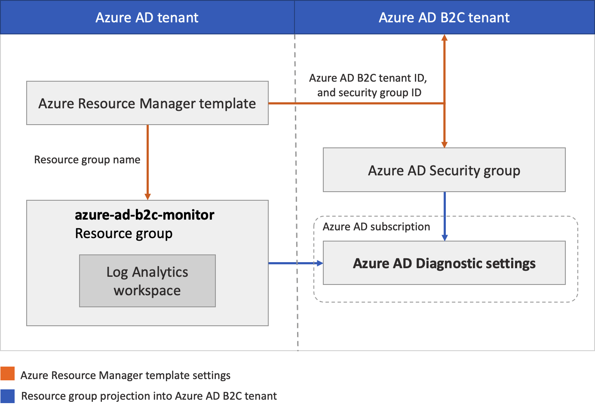
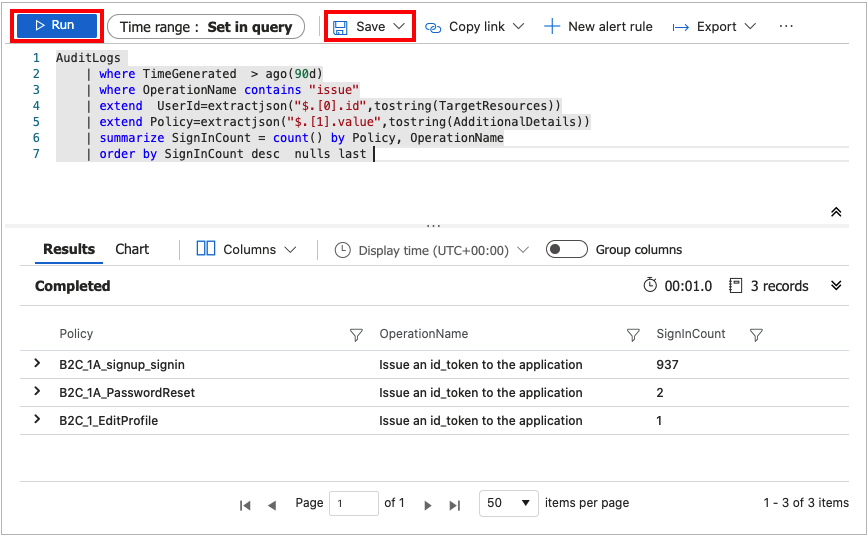
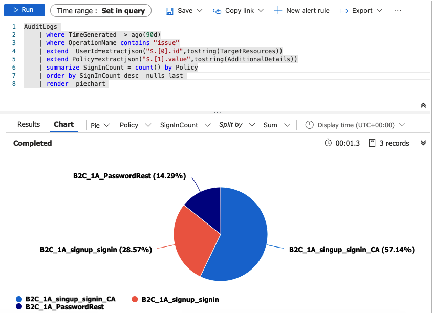
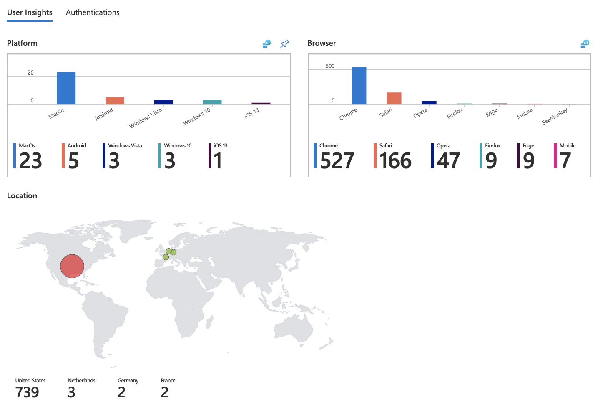
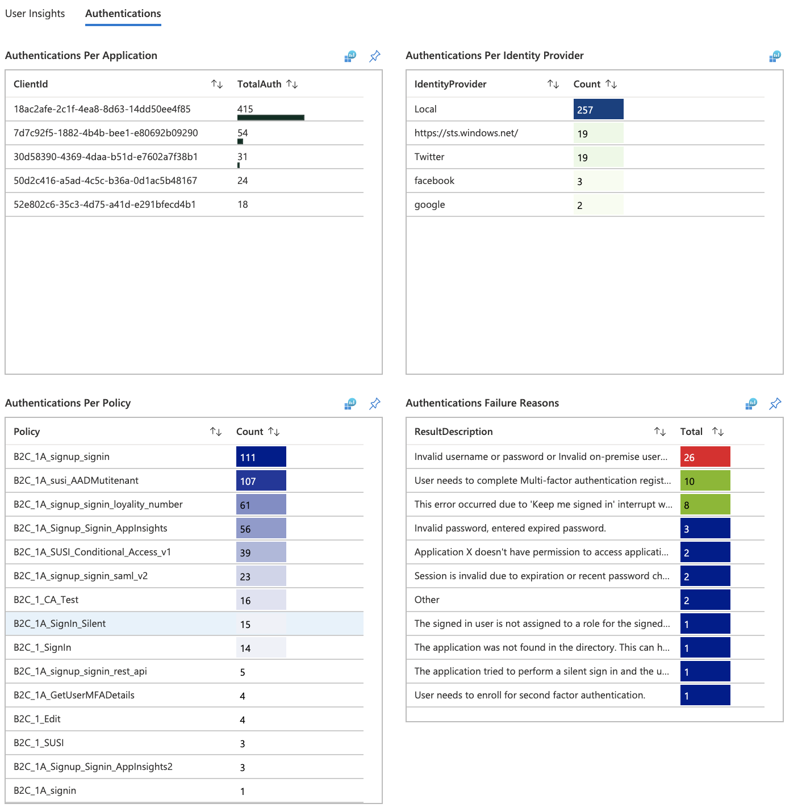
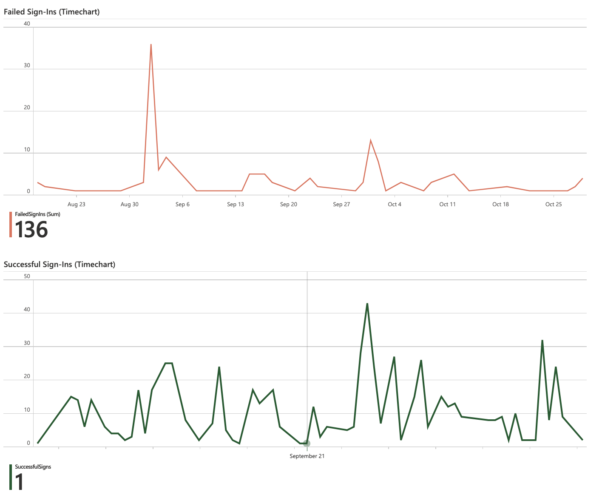
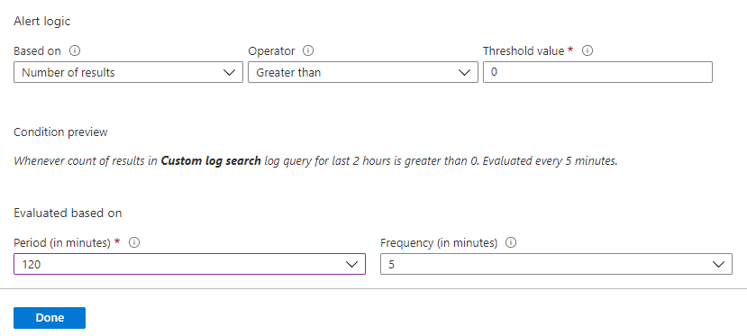
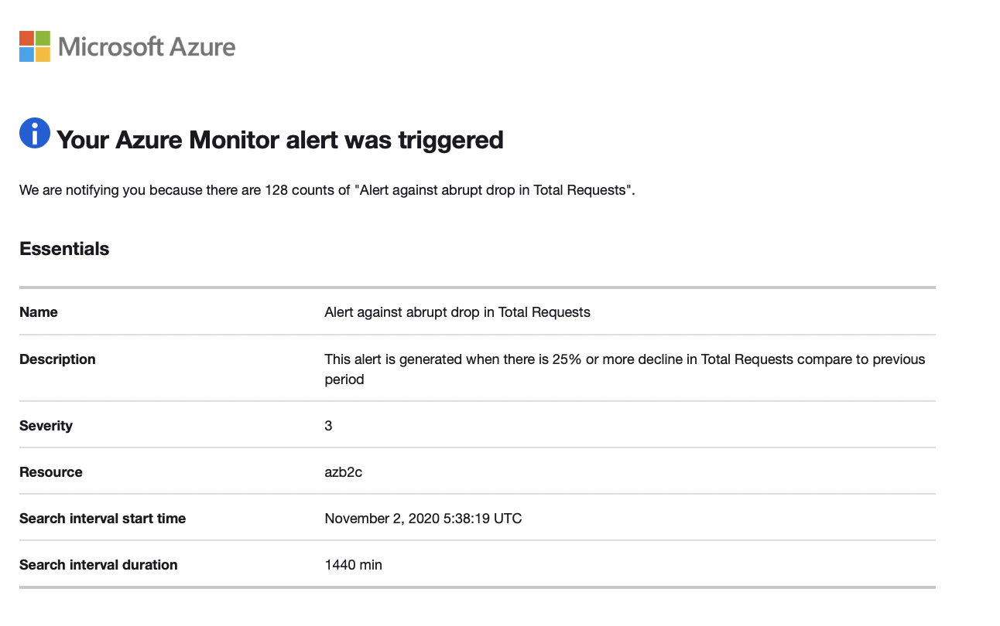

# Monitor Azure AD B2C with Azure Monitor

Use Azure Monitor to route Azure Active Directory B2C (Azure AD B2C) sign-in and [auditing](view-audit-logs.md) logs to different monitoring solutions. You can retain the logs for long-term use or integrate with third-party security information and event management (SIEM) tools to gain insights into your environment.

You can route log events to:

- An Azure [storage account](../storage/blobs/storage-blobs-introduction.md).
- A [Log Analytics workspace](../azure-monitor/essentials/resource-logs.md#send-to-log-analytics-workspace) (to analyze data, create dashboards, and alert on specific events).
- An Azure [event hub](../event-hubs/event-hubs-about.md) (and integrate with your Splunk and Sumo Logic instances).


In this article, you learn how to transfer the logs to an Azure Log Analytics workspace. Then you can create a dashboard or create alerts that are based on Azure AD B2C users' activities.

> [!IMPORTANT]
> When you plan to transfer Azure AD B2C logs to different monitoring solutions, or repository, consider the following. Azure AD B2C logs contain personal data. Such data should be processed in a manner that ensures appropriate security of the personal data, including protection against unauthorized or unlawful processing, using appropriate technical or organizational measures.

Watch this video to learn how to configure monitoring for Azure AD B2C using Azure Monitor.  

>[!Video https://www.youtube.com/embed/tF2JS6TGc3g]

## Deployment overview

Azure AD B2C leverages [Azure Active Directory monitoring](../active-directory/reports-monitoring/overview-monitoring.md). Because an Azure AD B2C tenant, unlike Azure AD tenants, can't have a subscription associated with it, we need to take some additional steps to enable the integration between Azure AD B2C and Log Analytics, which is where we'll send the logs.
To enable _Diagnostic settings_ in Azure Active Directory within your Azure AD B2C tenant, you use [Azure Lighthouse](../lighthouse/overview.md) to [delegate a resource](../lighthouse/concepts/architecture.md), which allows your Azure AD B2C (the **Service Provider**) to manage an Azure AD (the **Customer**) resource.

> [!TIP]
> Azure Lighthouse is typically used to manage resources for multiple customers. However, it can also be used to manage resources **within an enterprise that has multiple Azure AD tenants of its own**, which is what we are doing here, except that we are only delegating the management of single resource group.

After you complete the steps in this article, you'll have created a new resource group (here called _azure-ad-b2c-monitor_) and have access to that same resource group that contains the [Log Analytics workspace](../azure-monitor/logs/quick-create-workspace.md) in your **Azure AD B2C** portal. You'll also be able to transfer the logs from Azure AD B2C to your Log Analytics workspace.

During this deployment, you'll authorize a user or group in your Azure AD B2C directory to configure the Log Analytics workspace instance within the tenant that contains your Azure subscription. To create the authorization, you deploy an [Azure Resource Manager](../azure-resource-manager/index.yml) template to the subscription containing the Log Analytics workspace.

The following diagram depicts the components you'll configure in your Azure AD and Azure AD B2C tenants.



During this deployment, you'll configure both your Azure AD B2C tenant and Azure AD tenant where the Log Analytics workspace will be hosted. The Azure AD B2C accounts used (such as your admin account) should be assigned the [Global Administrator](../active-directory/roles/permissions-reference.md#global-administrator) role on the Azure AD B2C tenant. The Azure AD account used to run the deployment must be assigned the [Owner](../role-based-access-control/built-in-roles.md#owner) role in the Azure AD subscription. It's also important to make sure you're signed in to the correct directory as you complete each step as described.

In summary, you will use Azure Lighthouse to allow a user or group in your Azure AD B2C tenant to manage a resource group in a subscription associated with a different tenant (the Azure AD tenant). After this authorization is completed, the subscription and log analytics workspace can be selected as a target in the Diagnostic settings in Azure AD B2C.

## 1. Create or choose resource group

First, create, or choose a resource group that contains the destination Log Analytics workspace that will receive data from Azure AD B2C. You'll specify the resource group name when you deploy the Azure Resource Manager template.

1. Sign in to the [Azure portal](https://portal.azure.com).
1. Make sure you're using the directory that contains your Azure AD tenant. Select the **Directories + subscriptions** icon in the portal toolbar.
1. On the **Portal settings | Directories + subscriptions** page, find your Azure AD directory in the **Directory name** list, and then select **Switch**.
1. [Create a resource group](../azure-resource-manager/management/manage-resource-groups-portal.md#create-resource-groups) or choose an existing one. This example uses a resource group named _azure-ad-b2c-monitor_.

## 2. Create a Log Analytics workspace

A **Log Analytics workspace** is a unique environment for Azure Monitor log data. You'll use this Log Analytics workspace to collect data from Azure AD B2C [audit logs](view-audit-logs.md), and then visualize it with queries and workbooks, or create alerts.

1. Sign in to the [Azure portal](https://portal.azure.com).
1. Make sure you're using the directory that contains your Azure AD tenant. Select the **Directories + subscriptions** icon in the portal toolbar.
1. On the **Portal settings | Directories + subscriptions** page, find your Azure AD directory in the **Directory name** list, and then select **Switch**.
1. [Create a Log Analytics workspace](../azure-monitor/logs/quick-create-workspace.md). This example uses a Log Analytics workspace named _AzureAdB2C_, in a resource group named _azure-ad-b2c-monitor_.

## 3. Delegate resource management

In this step, you choose your Azure AD B2C tenant as a **service provider**. You also define the authorizations you need to assign the appropriate Azure built-in roles to groups in your Azure AD tenant.

### 3.1 Get your Azure AD B2C tenant ID

First, get the **Tenant ID** of your Azure AD B2C directory (also known as the directory ID).

1. Sign in to the [Azure portal](https://portal.azure.com/).
1. Select the **Directories + subscriptions** icon in the portal toolbar.
1. On the **Portal settings | Directories + subscriptions** page, find your Azure AD B2C directory in the **Directory name** list, and then select **Switch**.
1. Select **Azure Active Directory**, select **Overview**.
1. Record the **Tenant ID**.

### 3.2 Select a security group

Now select an Azure AD B2C group or user to which you want to give permission to the resource group you created earlier in the directory containing your subscription.

To make management easier, we recommend using Azure AD user _groups_ for each role, allowing you to add or remove individual users to the group rather than assigning permissions directly to that user. In this walkthrough, we'll add a security group.

> [!IMPORTANT]
> In order to add permissions for an Azure AD group, the **Group type** must be set to **Security**. This option is selected when the group is created. For more information, see [Create a basic group and add members using Azure Active Directory](../active-directory/fundamentals/active-directory-groups-create-azure-portal.md).

1. With **Azure Active Directory** still selected in your **Azure AD B2C** directory, select **Groups**, and then select a group. If you don't have an existing group, create a **Security** group, then add members. For more information, follow the procedure [Create a basic group and add members using Azure Active Directory](../active-directory/fundamentals/active-directory-groups-create-azure-portal.md).
1. Select **Overview**, and record the group's **Object ID**.

### 3.3 Create an Azure Resource Manager template

To create the custom authorization and delegation in Azure Lighthouse, we use an Azure Resource Manager template that grants Azure AD B2C access to the Azure AD resource group you created earlier (for example, _azure-ad-b2c-monitor_). Deploy the template from the GitHub sample by using the **Deploy to Azure** button, which opens the Azure portal and lets you configure and deploy the template directly in the portal. For these steps, make sure you're signed in to your Azure AD tenant (not the Azure AD B2C tenant).

1. Sign in to the [Azure portal](https://portal.azure.com).
1. Make sure you're using the directory that contains your Azure AD tenant. Select the **Directories + subscriptions** icon in the portal toolbar.
1. On the **Portal settings | Directories + subscriptions** page, find your Azure AD directory in the **Directory name** list, and then select **Switch**.
1. Use the **Deploy to Azure** button to open the Azure portal and deploy the template directly in the portal. For more information, see [create an Azure Resource Manager template](../lighthouse/how-to/onboard-customer.md#create-an-azure-resource-manager-template).

   [](https://portal.azure.com/#create/Microsoft.Template/uri/https%3A%2F%2Fraw.githubusercontent.com%2Fazure-ad-b2c%2Fsiem%2Fmaster%2Ftemplates%2FrgDelegatedResourceManagement.json)

1. On the **Custom deployment** page, enter the following information:

   | Field                 | Definition                                                                                                                                                                                                                                                                                                                                                                                                                                                                                                                   |
   | --------------------- | ---------------------------------------------------------------------------------------------------------------------------------------------------------------------------------------------------------------------------------------------------------------------------------------------------------------------------------------------------------------------------------------------------------------------------------------------------------------------------------------------------------------------------- |
   | Subscription          | Select the directory that contains the Azure subscription where the _azure-ad-b2c-monitor_ resource group was created.                                                                                                                                                                                                                                                                                                                                                                                                       |
   | Region                | Select the region where the resource will be deployed.                                                                                                                                                                                                                                                                                                                                                                                                                                                                       |
   | Msp Offer Name        | A name describing this definition. For example, _Azure AD B2C Monitoring_. This is the name that will be displayed in Azure Lighthouse.                                                                                                                                                                                                                                                                                                                                                                                          |
   | Msp Offer Description | A brief description of your offer. For example, _Enables Azure Monitor in Azure AD B2C_.                                                                                                                                                                                                                                                                                                                                                                                                                                     |
   | Managed By Tenant Id  | The **Tenant ID** of your Azure AD B2C tenant (also known as the directory ID).                                                                                                                                                                                                                                                                                                                                                                                                                                              |
   | Authorizations        | Specify a JSON array of objects that include the Azure AD `principalId`, `principalIdDisplayName`, and Azure `roleDefinitionId`. The `principalId` is the **Object ID** of the B2C group or user that will have access to resources in this Azure subscription. For this walkthrough, specify the group's Object ID that you recorded earlier. For the `roleDefinitionId`, use the [built-in role](../role-based-access-control/built-in-roles.md) value for the _Contributor role_, `b24988ac-6180-42a0-ab88-20f7382dd24c`. |
   | Rg Name               | The name of the resource group you create earlier in your Azure AD tenant. For example, _azure-ad-b2c-monitor_.                                                                                                                                                                                                                                                                                                                                                                                                              |

   The following example demonstrates an Authorizations array with one security group.

   ```json
   [
     {
       "principalId": "<Replace with group's OBJECT ID>",
       "principalIdDisplayName": "Azure AD B2C tenant administrators",
       "roleDefinitionId": "b24988ac-6180-42a0-ab88-20f7382dd24c"
     }
   ]
   ```

After you deploy the template, it can take a few minutes (typically no more than five) for the resource projection to complete. You can verify the deployment in your Azure AD tenant and get the details of the resource projection. For more information, see [View and manage service providers](../lighthouse/how-to/view-manage-service-providers.md).

## 4. Select your subscription

After you've deployed the template and waited a few minutes for the resource projection to complete, follow these steps to associate your subscription with your Azure AD B2C directory.

1. Sign out of the Azure portal if you're currently signed in (this allows your session credentials to be refreshed in the next step).
1. Sign in to the [Azure portal](https://portal.azure.com) with your **Azure AD B2C** administrative account. This account must be a member of the security group you specified in the [Delegate resource management](#3-delegate-resource-management) step.
1. Select the **Directories + subscriptions** icon in the portal toolbar.
1. On the **Portal settings | Directories + subscriptions** page, in the **Directory name** list,  find your Azure AD directory that contains the Azure subscription and the _azure-ad-b2c-monitor_ resource group you created, and then select **Switch**.
1. Verify that you've selected the correct directory and subscription.

## 5. Configure diagnostic settings

Diagnostic settings define where logs and metrics for a resource should be sent. Possible destinations are:

- [Azure storage account](../azure-monitor/essentials/resource-logs.md#send-to-azure-storage)
- [Event hubs](../azure-monitor/essentials/resource-logs.md#send-to-azure-event-hubs) solutions
- [Log Analytics workspace](../azure-monitor/essentials/resource-logs.md#send-to-log-analytics-workspace)

In this example, we use the Log Analytics workspace to create a dashboard.

### 5.1 Create diagnostic settings

You're ready to [create diagnostic settings](../active-directory/reports-monitoring/overview-monitoring.md) in the Azure portal.

To configure monitoring settings for Azure AD B2C activity logs:

1. Sign in to the [Azure portal](https://portal.azure.com/) with your Azure AD B2C administrative account. This account must be a member of the security group you specified in the [Select a security group](#32-select-a-security-group) step.
1. Select the **Directories + subscriptions** icon in the portal toolbar.
1. On the **Portal settings | Directories + subscriptions** page, find your Azure AD B2C directory in the **Directory name** list, and then select **Switch**.
1. Select **Azure Active Directory**
1. Under **Monitoring**, select **Diagnostic settings**.
1. If there are existing settings for the resource, you'll see a list of settings already configured. Either select **Add diagnostic setting** to add a new setting, or select **Edit** to edit an existing setting. Each setting can have no more than one of each of the destination types.

   

1. Give your setting a name if it doesn't already have one.
1. Check the box for each destination to send the logs. Select **Configure** to specify their settings **as described in the following table**.
1. Select **Send to Log Analytics**, and then select the **Name of workspace** you created earlier (`AzureAdB2C`).
1. Select **AuditLogs** and **SignInLogs**.
1. Select **Save**.

> [!NOTE]
> It can take up to 15 minutes after an event is emitted for it to [appear in a Log Analytics workspace](../azure-monitor/logs/data-ingestion-time.md). Also, learn more about [Active Directory reporting latencies](../active-directory/reports-monitoring/reference-reports-latencies.md), which can impact the staleness of data and play an important role in reporting.

If you see the error message "To set up Diagnostic settings to use Azure Monitor for your Azure AD B2C directory, you need to set up delegated resource management," make sure you sign in with a user who is a member of the [security group](#32-select-a-security-group) and [select your subscription](#4-select-your-subscription).

## 6. Visualize your data

Now you can configure your Log Analytics workspace to visualize your data and configure alerts. These configurations can be made in both your Azure AD tenant and your Azure AD B2C tenant.

### 6.1 Create a Query

Log queries help you to fully leverage the value of the data collected in Azure Monitor Logs. A powerful query language allows you to join data from multiple tables, aggregate large sets of data, and perform complex operations with minimal code. Virtually any question can be answered and analysis performed as long as the supporting data has been collected, and you understand how to construct the right query. For more information, see [Get started with log queries in Azure Monitor](../azure-monitor/logs/get-started-queries.md).

1. From **Log Analytics workspace**, select **Logs**
1. In the query editor, paste the following [Kusto Query Language](/azure/data-explorer/kusto/query/) query. This query shows policy usage by operation over the past x days. The default duration is set to 90 days (90d). Notice that the query is focused only on the operation where a token/code is issued by policy.

   ```kusto
   AuditLogs
   | where TimeGenerated  > ago(90d)
   | where OperationName contains "issue"
   | extend  UserId=extractjson("$.[0].id",tostring(TargetResources))
   | extend Policy=extractjson("$.[1].value",tostring(AdditionalDetails))
   | summarize SignInCount = count() by Policy, OperationName
   | order by SignInCount desc  nulls last
   ```

1. Select **Run**. The query results are displayed at the bottom of the screen.
1. To save your query for later use, select **Save**.

   

1. Fill in the following details:

   - **Name** - Enter the name of your query.
   - **Save as** - Select `query`.
   - **Category** - Select `Log`.

1. Select **Save**.

You can also change your query to visualize the data by using the [render](/azure/data-explorer/kusto/query/renderoperator?pivots=azuremonitor) operator.

```kusto
AuditLogs
| where TimeGenerated  > ago(90d)
| where OperationName contains "issue"
| extend  UserId=extractjson("$.[0].id",tostring(TargetResources))
| extend Policy=extractjson("$.[1].value",tostring(AdditionalDetails))
| summarize SignInCount = count() by Policy
| order by SignInCount desc  nulls last
| render  piechart
```



For more samples, see the Azure AD B2C [SIEM GitHub repo](https://aka.ms/b2csiem).

### 6.2 Create a Workbook

Workbooks provide a flexible canvas for data analysis and the creation of rich visual reports within the Azure portal. They allow you to tap into multiple data sources from across Azure, and combine them into unified interactive experiences. For more information, see [Azure Monitor Workbooks](../azure-monitor/visualize/workbooks-overview.md).

Follow the instructions below to create a new workbook using a JSON Gallery Template. This workbook provides a **User Insights** and **Authentication** dashboard for Azure AD B2C tenant.

1. From the **Log Analytics workspace**, select **Workbooks**.
1. From the toolbar, select **+ New** option to create a new workbook.
1. On the **New workbook** page, select the **Advanced Editor** using the **</>** option on the toolbar.

   

1. Select **Gallery Template**.
1. Replace the JSON in the **Gallery Template** with the content from [Azure AD B2C basic workbook](https://raw.githubusercontent.com/azure-ad-b2c/siem/master/workbooks/dashboard.json):
1. Apply the template by using the **Apply** button.
1. Select **Done Editing** button from the toolbar to finish editing the workbook.
1. Finally, save the workbook by using the **Save** button from the toolbar.
1. Provide a **Title**, such as _Azure AD B2C Dashboard_.
1. Select **Save**.

   

The workbook will display reports in the form of a dashboard.







## Create alerts

Alerts are created by alert rules in Azure Monitor and can automatically run saved queries or custom log searches at regular intervals. You can create alerts based on specific performance metrics or when certain events are created, absence of an event, or a number of events are created within a particular time window. For example, alerts can be used to notify you when average number of sign-in exceeds a certain threshold. For more information, see [Create alerts](../azure-monitor/alerts/alerts-log.md).

Use the following instructions to create a new Azure Alert, which will send an [email notification](../azure-monitor/alerts/action-groups.md#configure-notifications) whenever there is a 25% drop in the **Total Requests** compare to previous period. Alert will run every 5 minutes and look for the drop in the last hour compared to the hour before that. The alerts are created using Kusto query language.

1. From **Log Analytics workspace**, select **Logs**.
1. Create a new **Kusto query** by using the query below.

   ```kusto
   let start = ago(2h);
   let end = now();
   let threshold = -25; //25% decrease in total requests.
   AuditLogs
   | serialize TimeGenerated, CorrelationId, Result
   | make-series TotalRequests=dcount(CorrelationId) on TimeGenerated from start to end step 1h
   | mvexpand TimeGenerated, TotalRequests
   | serialize TotalRequests, TimeGenerated, TimeGeneratedFormatted=format_datetime(todatetime(TimeGenerated), 'yyyy-MM-dd [HH:mm:ss]')
   | project   TimeGeneratedFormatted, TotalRequests, PercentageChange= ((toreal(TotalRequests) - toreal(prev(TotalRequests,1)))/toreal(prev(TotalRequests,1)))*100
   | order by TimeGeneratedFormatted desc
   | where PercentageChange <= threshold   //Trigger's alert rule if matched.
   ```

1. Select **Run**, to test the query. You should see the results if there is a drop of 25% or more in the total requests within the past hour.
1. To create an alert rule based on the query above, use the **+ New alert rule** option available in the toolbar.
1. On the **Create an alert rule** page, select **Condition name**
1. On the **Configure signal logic** page, set following values and then use **Done** button to save the changes.

   - Alert logic: Set **Number of results** **Greater than** **0**.
   - Evaluation based on: Select **120** for Period (in minutes) and **5** for Frequency (in minutes)

   

After the alert is created, go to **Log Analytics workspace** and select **Alerts**. This page displays all the alerts that have been triggered in the duration set by **Time range** option.

### Configure action groups

Azure Monitor and Service Health alerts use action groups to notify users that an alert has been triggered. You can include sending a voice call, SMS, email; or triggering various types of automated actions. Follow the guidance [Create and manage action groups in the Azure portal](../azure-monitor/alerts/action-groups.md)

Here is an example of an alert notification email.



## Multiple tenants

To onboard multiple Azure AD B2C tenant logs to the same Log Analytics Workspace (or Azure storage account, or event hub), you'll need separate deployments with different **Msp Offer Name** values. Make sure your Log Analytics workspace is in the same resource group as the one you configured in [Create or choose resource group](#1-create-or-choose-resource-group).

When working with multiple Log Analytics workspaces, use [Cross Workspace Query](../azure-monitor/logs/cross-workspace-query.md) to create queries that work across multiple workspaces. For example, the following query performs a join of two Audit logs from different tenants based on the same Category (for example, Authentication):

```kusto
workspace("AD-B2C-TENANT1").AuditLogs
| join  workspace("AD-B2C-TENANT2").AuditLogs
  on $left.Category== $right.Category
```

## Change the data retention period

Azure Monitor Logs are designed to scale and support collecting, indexing, and storing massive amounts of data per day from any source in your enterprise or deployed in Azure. By default, logs are retained for 30 days, but retention duration can be increased to up to two years. Learn how to [manage usage and costs with Azure Monitor Logs](../azure-monitor/logs/manage-cost-storage.md). After you select the pricing tier, you can [Change the data retention period](../azure-monitor/logs/manage-cost-storage.md#change-the-data-retention-period).

## Next steps

- Find more samples in the Azure AD B2C [SIEM gallery](https://aka.ms/b2csiem).

- For more information about adding and configuring diagnostic settings in Azure Monitor, see [Tutorial: Collect and analyze resource logs from an Azure resource](../azure-monitor/essentials/monitor-azure-resource.md).

- For information about streaming Azure AD logs to an event hub, see [Tutorial: Stream Azure Active Directory logs to an Azure event hub](../active-directory/reports-monitoring/tutorial-azure-monitor-stream-logs-to-event-hub.md).
