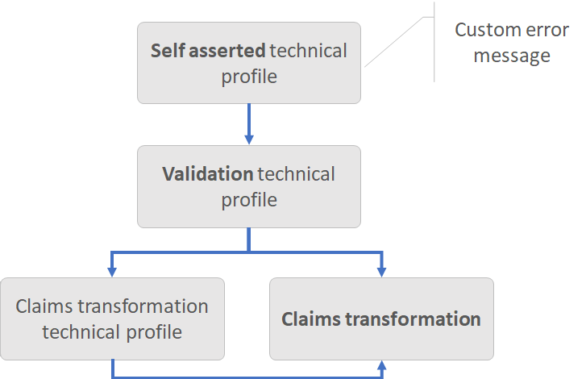

# Boolean claims transformations

This article provides examples for using the boolean claims transformations of the Identity Experience Framework schema in Azure Active Directory B2C (Azure AD B2C). For more information, see [ClaimsTransformations](claimstransformations.md).

## AndClaims

Performs an And operation of two boolean inputClaims and sets the outputClaim with result of the operation.

| Item  | TransformationClaimType  | Data Type  | Notes |
|-------| ------------------------ | ---------- | ----- |
| InputClaim | inputClaim1 | boolean | The first ClaimType to evaluate. |
| InputClaim | inputClaim2  | boolean | The second ClaimType to evaluate. |
|OutputClaim | outputClaim | boolean | The ClaimTypes that will be produced after this claims transformation has been invoked (true or false). |


### Example of AndClaims

The following claims transformation demonstrates how to And two boolean ClaimTypes: `isEmailNotExist`, and `isSocialAccount`. The output claim `presentEmailSelfAsserted` is set to `true` if the value of both input claims are `true`. In an orchestration step, you can use a precondition to preset a self-asserted page, only if a social account email is empty.

```xml
<ClaimsTransformation Id="CheckWhetherEmailBePresented" TransformationMethod="AndClaims">
  <InputClaims>
    <InputClaim ClaimTypeReferenceId="isEmailNotExist" TransformationClaimType="inputClaim1" />
    <InputClaim ClaimTypeReferenceId="isSocialAccount" TransformationClaimType="inputClaim2" />
  </InputClaims>
  <OutputClaims>
    <OutputClaim ClaimTypeReferenceId="presentEmailSelfAsserted" TransformationClaimType="outputClaim" />
  </OutputClaims>
</ClaimsTransformation>
```

- Input claims:
  - **inputClaim1**: true
  - **inputClaim2**: false
- Output claims:
  - **outputClaim**: false


## AssertBooleanClaimIsEqualToValue

Checks that boolean values of two claims are equal, and throws an exception if they are not.

| Item | TransformationClaimType  | Data Type  | Notes |
| ---- | ------------------------ | ---------- | ----- |
| inputClaim | inputClaim | boolean | The ClaimType to be asserted. |
| InputParameter |valueToCompareTo | boolean | The value to compare (true or false). |

The **AssertBooleanClaimIsEqualToValue** claims transformation is always executed from a [validation technical profile](validation-technical-profile.md) that is called by a [self-asserted technical profile](self-asserted-technical-profile.md). The **UserMessageIfClaimsTransformationBooleanValueIsNotEqual** self-asserted technical profile metadata controls the error message that the technical profile presents to the user. The error messages can be [localized](localization-string-ids.md#claims-transformations-error-messages).



### Example of AssertBooleanClaimIsEqualToValue

The following claims transformation demonstrates how to check the value of a boolean ClaimType with a `true` value. If the value of the `accountEnabled` ClaimType is false, an error message is thrown.

```xml
<ClaimsTransformation Id="AssertAccountEnabledIsTrue" TransformationMethod="AssertBooleanClaimIsEqualToValue">
  <InputClaims>
    <InputClaim ClaimTypeReferenceId="accountEnabled" TransformationClaimType="inputClaim" />
  </InputClaims>
  <InputParameters>
    <InputParameter Id="valueToCompareTo" DataType="boolean" Value="true" />
  </InputParameters>
</ClaimsTransformation>
```

- Input claims:
  - **inputClaim**: false
  - **valueToCompareTo**: true
- Result: Error thrown

### Calling the AssertBooleanClaimIsEqualToValue claims transformation

The following `Example-AssertBoolean` validation technical profile calls the `AssertAccountEnabledIsTrue` claims transformation.

```xml
<TechnicalProfile Id="Example-AssertBoolean">
  <DisplayName>Unit test</DisplayName>
  <Protocol Name="Proprietary" Handler="Web.TPEngine.Providers.ClaimsTransformationProtocolProvider, Web.TPEngine, Version=1.0.0.0, Culture=neutral, PublicKeyToken=null" />
  <OutputClaims>
    <OutputClaim ClaimTypeReferenceId="ComparisonResult" DefaultValue="false" />
  </OutputClaims>
  <OutputClaimsTransformations>
    <OutputClaimsTransformation ReferenceId="AssertAccountEnabledIsTrue" />
  </OutputClaimsTransformations>
  <UseTechnicalProfileForSessionManagement ReferenceId="SM-Noop" />
</TechnicalProfile>
```

The self-asserted technical profile calls the validation `Example-AssertBoolean` technical profile.

```xml
<TechnicalProfile Id="SelfAsserted-AssertDateTimeIsGreaterThan">
  <DisplayName>Example</DisplayName>
  <Protocol Name="Proprietary" Handler="Web.TPEngine.Providers.SelfAssertedAttributeProvider, Web.TPEngine, Version=1.0.0.0, Culture=neutral, PublicKeyToken=null" />
  <Metadata>
    <Item Key="ContentDefinitionReferenceId">api.selfasserted</Item>
    <Item Key="UserMessageIfClaimsTransformationBooleanValueIsNotEqual">Custom error message if account is disabled.</Item>
  </Metadata>
  ...
  <ValidationTechnicalProfiles>
    <ValidationTechnicalProfile ReferenceId="Example-AssertBoolean" />
  </ValidationTechnicalProfiles>
</TechnicalProfile>
```

## CompareBooleanClaimToValue

Checks that boolean value of a claim is equal to `true` or `false`, and return the result of the compression.

| Item | TransformationClaimType  | Data Type  | Notes |
| ---- | ------------------------ | ---------- | ----- |
| InputClaim | inputClaim | boolean | The ClaimType to be asserted. |
| InputParameter |valueToCompareTo | boolean | The value to compare (true or false). |
| OutputClaim | compareResult | boolean | The ClaimType that is produced after this ClaimsTransformation has been invoked. |

### Example of CompareBooleanClaimToValue

The following claims transformation demonstrates how to check the value of a boolean ClaimType with a `true` value. If the value of the `IsAgeOver21Years` ClaimType is equal to `true`, the claims transformation returns `true`, otherwise `false`.

```xml
<ClaimsTransformation Id="AssertAccountEnabled" TransformationMethod="CompareBooleanClaimToValue">
  <InputClaims>
    <InputClaim ClaimTypeReferenceId="IsAgeOver21Years" TransformationClaimType="inputClaim" />
  </InputClaims>
  <InputParameters>
    <InputParameter Id="valueToCompareTo" DataType="boolean" Value="true" />
  </InputParameters>
  <OutputClaims>
    <OutputClaim  ClaimTypeReferenceId="accountEnabled" TransformationClaimType="compareResult"/>
  </OutputClaims>
</ClaimsTransformation>
```

- Input claims:
  - **inputClaim**: false
- Input parameters:
  - **valueToCompareTo**: true
- Output claims:
  - **compareResult**: false

## NotClaims

Performs a Not operation of the boolean inputClaim and sets the outputClaim with result of the operation.

| Item | TransformationClaimType | Data Type | Notes |
| ---- | ----------------------- | --------- | ----- |
| InputClaim | inputClaim | boolean | The claim to be operated. |
| OutputClaim | outputClaim | boolean | The ClaimTypes that are produced after this ClaimsTransformation has been invoked (true or false). |

### Example of NotClaims

The following claim transformation demonstrates how to perform logical negation on a claim.

```xml
<ClaimsTransformation Id="CheckWhetherEmailBePresented" TransformationMethod="NotClaims">
  <InputClaims>
    <InputClaim ClaimTypeReferenceId="userExists" TransformationClaimType="inputClaim" />
  </InputClaims>
  <OutputClaims>
    <OutputClaim ClaimTypeReferenceId="userExists" TransformationClaimType="outputClaim" />
  </OutputClaims>
</ClaimsTransformation>
```

- Input claims:
  - **inputClaim**: false
- Output claims:
  - **outputClaim**: true

## OrClaims

Computes an Or of two boolean inputClaims and sets the outputClaim with result of the operation.

| Item | TransformationClaimType | Data Type | Notes |
| ---- | ----------------------- | --------- | ----- |
| InputClaim | inputClaim1 | boolean | The first ClaimType to evaluate. |
| InputClaim | inputClaim2 | boolean | The second ClaimType to evaluate. |
| OutputClaim | outputClaim | boolean | The ClaimTypes that will be produced after this ClaimsTransformation has been invoked (true or false). |

### Example of OrClaims

The following claims transformation demonstrates how to `Or` two boolean ClaimTypes. In the orchestration step, you can use a precondition to preset a self-asserted page, if the value of one of the claims is `true`.

```xml
<ClaimsTransformation Id="CheckWhetherEmailBePresented" TransformationMethod="OrClaims">
  <InputClaims>
    <InputClaim ClaimTypeReferenceId="isLastTOSAcceptedNotExists" TransformationClaimType="inputClaim1" />
    <InputClaim ClaimTypeReferenceId="isLastTOSAcceptedGreaterThanNow" TransformationClaimType="inputClaim2" />
  </InputClaims>
  <OutputClaims>
    <OutputClaim ClaimTypeReferenceId="presentTOSSelfAsserted" TransformationClaimType="outputClaim" />
  </OutputClaims>
</ClaimsTransformation>
```

- Input claims:
  - **inputClaim1**: true
  - **inputClaim2**: false
- Output claims:
  - **outputClaim**: true

## Next steps

- Find more [claims transformation samples](https://github.com/azure-ad-b2c/unit-tests/tree/main/claims-transformation) on the Azure AD B2C community GitHub repo