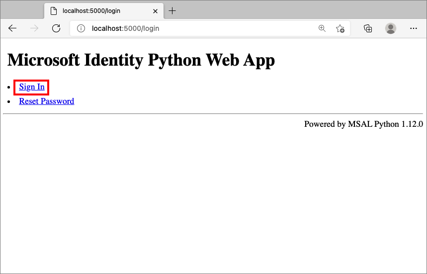
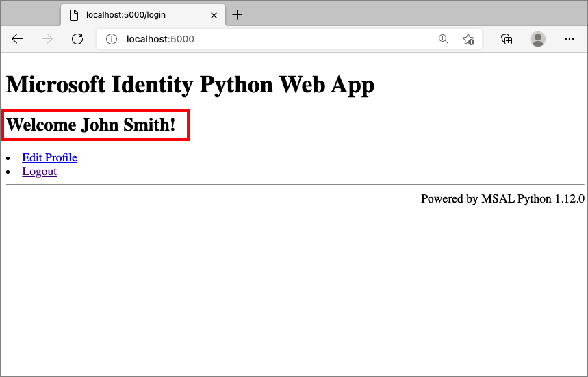
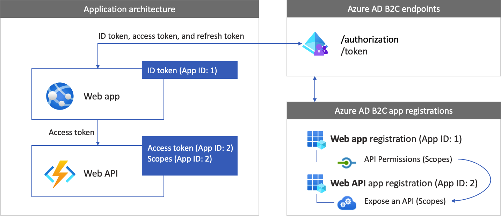

# Configure authentication in a sample Python web app by using Azure AD B2C

This article uses a sample Python web application to illustrate how to add Azure Active Directory B2C (Azure AD B2C) authentication to your web applications.

## Overview

OpenID Connect (OIDC) is an authentication protocol that's built on OAuth 2.0. You can use OIDC to securely sign users in to an application. This web app sample uses the [Microsoft Authentication Library (MSAL) for Python](https://github.com/AzureAD/microsoft-authentication-library-for-python). The MSAL for Python simplifies adding authentication and authorization support to Python web apps. 

The sign-in flow involves the following steps:

1. Users go to the web app and select **Sign-in**. 
1. The app initiates an authentication request and redirects users to Azure AD B2C.
1. Users [sign up or sign in](add-sign-up-and-sign-in-policy.md), [reset the password](add-password-reset-policy.md), or sign in with a [social account](add-identity-provider.md).
1. After users sign in successfully, Azure AD B2C returns an ID token to the app.
1. The app exchanges the authorization code with an ID token, validates the ID token, reads the claims, and then returns a secure page to users.


### Sign-out

[!INCLUDE [active-directory-b2c-app-integration-sign-out-flow](../../includes/active-directory-b2c-app-integration-sign-out-flow.md)] 

## Prerequisites

A computer that's running: 

* [Visual Studio Code](https://code.visualstudio.com/) or another code editor
* [Python](https://nodejs.org/en/download/) 2.7+ or 3+ 

## Step 1: Configure your user flow

[!INCLUDE [active-directory-b2c-app-integration-add-user-flow](../../includes/active-directory-b2c-app-integration-add-user-flow.md)]

## Step 2: Register a web application

To enable your application to sign in with Azure AD B2C, register your app in the Azure AD B2C directory. Registering your app establishes a trust relationship between the app and Azure AD B2C.  

During app registration, you'll specify the *Redirect URI*. The redirect URI is the endpoint to which users are redirected by Azure AD B2C after they authenticate with Azure AD B2C. The app registration process generates an *Application ID*, also known as the *client ID*, that uniquely identifies your app. After your app is registered, Azure AD B2C uses both the application ID and the redirect URI to create authentication requests. 

### Step 2.1: Register the app

To create the web app registration, do the following:

1. Sign in to the [Azure portal](https://portal.azure.com).
1. Make sure you're using the directory that contains your Azure AD B2C tenant. Select the **Directories + subscriptions** icon in the portal toolbar.
1. On the **Portal settings | Directories + subscriptions** page, find your Azure AD B2C directory in the **Directory name** list, and then select **Switch**.
1. In the Azure portal, search for and select **Azure AD B2C**.
1. Select **App registrations**, and then select **New registration**.
1. Under **Name**, enter a name for the application (for example, *webapp1*).
1. Under **Supported account types**, select **Accounts in any identity provider or organizational directory (for authenticating users with user flows)**. 
1. Under **Redirect URI**, select **Web** and then, in the URL box, enter `http://localhost:5000/getAToken`.
1. Under **Permissions**, select the **Grant admin consent to openid and offline access permissions** checkbox.
1. Select **Register**.
1. Select **Overview**.
1. Record the **Application (client) ID** for later use, when you configure the web application.

      


### Step 2.2: Create a web app client secret

[!INCLUDE [active-directory-b2c-app-integration-client-secret](../../includes/active-directory-b2c-app-integration-client-secret.md)]

## Step 3: Get the web app sample

[Download the zip file](https://github.com/Azure-Samples/ms-identity-python-webapp/archive/master.zip), or clone the sample web application from GitHub. 

```bash
git clone https://github.com/Azure-Samples/ms-identity-python-webapp.git
```

Extract the sample file to a folder where the total length of the path is 260 or fewer characters.

## Step 4: Configure the sample web app

In the project's root directory, do the following:

1. Rename the *app_config.py* file to *app_config.py.OLD*.
1. Rename the *app_config_b2c.py* file to *app_config.py*. 

Open the *app_config.py* file. This file contains information about your Azure AD B2C identity provider. Update the following app settings properties: 

|Key  |Value  |
|---------|---------|
|`b2c_tenant`| The first part of your Azure AD B2C [tenant name](tenant-management.md#get-your-tenant-name) (for example, `contoso`).|
|`CLIENT_ID`| The web API application ID from [step 2.1](#step-21-register-the-app).|
|`CLIENT_SECRET`| The client secret you created in [step 2.2](#step-22-create-a-web-app-client-secret). To help increase security, consider storing it instead in an environment variable, as recommended in the comments. |
|`*_user_flow`|The user flows or custom policy you created in [step 1](#step-1-configure-your-user-flow).|
| | |

Your final configuration file should look like the following Python code:

```python
import os

b2c_tenant = "contoso"
signupsignin_user_flow = "B2C_1_signupsignin"
editprofile_user_flow = "B2C_1_profileediting"
resetpassword_user_flow = "B2C_1_passwordreset"
authority_template = "https://{tenant}.b2clogin.com/{tenant}.onmicrosoft.com/{user_flow}"

CLIENT_ID = "11111111-1111-1111-1111-111111111111" # Application (client) ID of app registration

CLIENT_SECRET = "xxxxxxxxxxxxxxxxxxxxxxxx" # Placeholder - for use ONLY during testing.
```

> [!IMPORTANT]
> As noted in the code snippet comments, we recommend that you *do not store secrets in plaintext* in your application code. The hard-coded variable is used in the code sample *for convenience only*. Consider using an environment variable or a secret store, such as an Azure key vault.


## Step 5: Run the sample web app

1. In your console or terminal, switch to the directory that contains the sample. For example:

    ```console
    cd ms-identity-python-webapp
    ```
1. Install the required packages from PyPi and run the web app on your local machine by running the following commands:

    ```console
    pip install -r requirements.txt
    flask run --host localhost --port 5000
    ```

    The console window displays the port number of the locally running application:

    ```console
     * Serving Flask app "app" (lazy loading)
     * Environment: production
       WARNING: This is a development server. Do not use it in a production deployment.
       Use a production WSGI server instead.
     * Debug mode: off
     * Running on `http://localhost:5000/` (Press CTRL+C to quit)
    ```

 
1. To view the web application running on your local machine, go to `http://localhost:5000`. 

1. Select **Sign In**.

    


1. Complete the sign-up or sign-in process.

1. After successful authentication, you'll see your display name, as shown here: 

    


## Step 6: Call to a web API

To enable your app to sign in with Azure AD B2C and call a web API, you must register two applications in the Azure AD B2C directory.  

- The **web application** (Python) registration you already created in [Step 2](#step-2-register-a-web-application). This app registration enables your app to sign in with Azure AD B2C.  The app registration process generates an *Application ID*, also known as the *client ID*, that uniquely identifies your app. For example, **App ID: 1**.

- The **web API** registration enables your app to call a protected web API. The registration exposes the web API permissions (scopes). The app registration process generates an *Application ID* that uniquely identifies your web API (for example, *App ID: 2*). Grant your app (App ID: 1) permissions to the web API scopes (App ID: 2).  

The app registrations and the application architecture are described in the following diagrams:

 

[!INCLUDE [active-directory-b2c-app-integration-call-api](../../includes/active-directory-b2c-app-integration-call-api.md)]

### Step 6.1: Register the web API app

[!INCLUDE [active-directory-b2c-app-integration-register-api](../../includes/active-directory-b2c-app-integration-register-api.md)]

### Step 6.2: Configure scopes

[!INCLUDE [active-directory-b2c-app-integration-api-scopes](../../includes/active-directory-b2c-app-integration-api-scopes.md)]

### Step 6.3: Grant the web app permissions

[!INCLUDE [active-directory-b2c-app-integration-grant-permissions](../../includes/active-directory-b2c-app-integration-grant-permissions.md)]

### Step 6.4: Configure your web API

This sample acquires an access token with the relevant scopes, which the web app can use for a web API. To call a web API from the code, use an existing web API or create a new one. For more information, see [Enable authentication in your own web API by using Azure AD B2C](enable-authentication-web-api.md).

### Step 6.5: Configure the sample app with the web API

Open the *app_config.py* file. This file contains information about your Azure AD B2C identity provider. Update the following properties of the app settings: 

|Key  |Value  |
|---------|---------|
|`ENDPOINT`| The URI of your web API (for example, `https://localhost:44332/hello`).|
|`SCOPE`| The web API [scopes](#step-62-configure-scopes) that you created.|
| | |

Your final configuration file should look like the following Python code:

```python
import os

b2c_tenant = "contoso"
signupsignin_user_flow = "B2C_1_signupsignin"
editprofile_user_flow = "B2C_1_profileediting"
resetpassword_user_flow = "B2C_1_passwordreset"
authority_template = "https://{tenant}.b2clogin.com/{tenant}.onmicrosoft.com/{user_flow}"

CLIENT_ID = "11111111-1111-1111-1111-111111111111" # Application (client) ID of app registration

CLIENT_SECRET = "xxxxxxxxxxxxxxxxxxxxxxxx" # Placeholder - for use ONLY during testing.

### More code here

# This is the API resource endpoint
ENDPOINT = 'https://localhost:44332' 


SCOPE = ["https://contoso.onmicrosoft.com/api/demo.read", "https://contoso.onmicrosoft.com/api/demo.write"] 
```

### Step 6.6: Run the sample app

1. In your console or terminal, switch to the directory that contains the sample. 
1. Stop the app. and then rerun it.
1. Select **Call Microsoft Graph API**.

    

## Step 7: Deploy your application 

In a production application, the app registration redirect URI is ordinarily a publicly accessible endpoint where your app is running, such as `https://contoso.com/getAToken`. 

You can add and modify redirect URIs in your registered applications at any time. The following restrictions apply to redirect URIs:

* The reply URL must begin with the scheme `https`.
* The reply URL is case-sensitive. Its case must match the case of the URL path of your running application. 

## Next steps
* Learn how to [Configure authentication options in a Python web app by using Azure AD B2C](enable-authentication-python-web-app-options.md).
