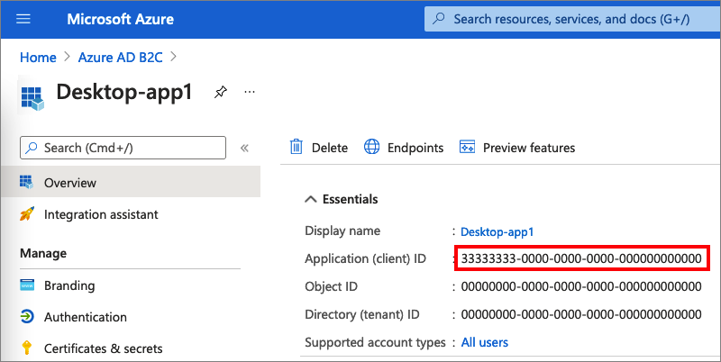
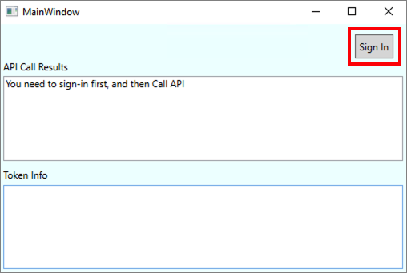
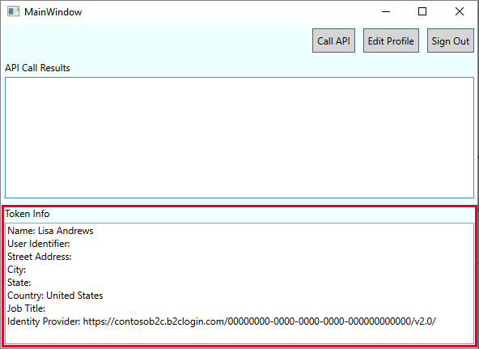

# Configure authentication in a sample WPF desktop app by using Azure AD B2C

This article uses a sample [Windows Presentation Foundation (WPF) desktop](/visualstudio/designers/getting-started-with-wpf.md) application to illustrate how to add Azure Active Directory B2C (Azure AD B2C) authentication to your desktop apps.

## Overview

OpenID Connect (OIDC) is an authentication protocol built on OAuth 2.0. You can use OIDC to securely sign users in to an application. This desktop app sample uses the [Microsoft Authentication Library (MSAL)](../active-directory/develop/msal-overview.md) with OIDC authorization code Proof Key for Code Exchange (PKCE) flow. The MSAL is a Microsoft-provided library that simplifies adding authentication and authorization support to desktop apps. 

The sign-in flow involves following steps:

1. Users open the app and select **sign-in**.
1. The app opens the desktop device's system browser and starts an authentication request to Azure AD B2C.
1. Users [sign up or sign in](add-sign-up-and-sign-in-policy.md), [reset the password](add-password-reset-policy.md), or sign in with a [social account](add-identity-provider.md).
1. After users sign in successfully, Azure AD B2C returns an authorization code to the app.
1. The app takes the following actions:
    1. It exchanges the authorization code to an ID token, access token, and refresh token.
    1. It reads the ID token claims.
    1. It stores the tokens in an in-memory cache for later use.

### App registration overview

To enable your app to sign in with Azure AD B2C and call a web API, register two applications in the Azure AD B2C directory.  

- The **desktop application** registration enables your app to sign in with Azure AD B2C. During app registration, specify the *Redirect URI*. The redirect URI is the endpoint to which users are redirected by Azure AD B2C after they've authenticated with Azure AD B2C. The app registration process generates an *application ID*, also known as the *client ID*, which uniquely identifies your desktop app (for example, *App ID: 1*).

- The  **web API** registration enables your app to call a protected web API. The registration exposes the web API permissions (scopes). The app registration process generates an *application ID*, which uniquely identifies your web API (for example, *App ID: 2*). Grant your desktop app (App ID: 1) permissions to the web API scopes (App ID: 2). 

The application registration and architecture are illustrated in the following diagrams:

 

### Call to a web API

[!INCLUDE [active-directory-b2c-app-integration-call-api](../../includes/active-directory-b2c-app-integration-call-api.md)]

### The sign-out flow

[!INCLUDE [active-directory-b2c-app-integration-sign-out-flow](../../includes/active-directory-b2c-app-integration-sign-out-flow.md)]

## Prerequisites

A computer that's running [Visual Studio 2019](https://www.visualstudio.com/downloads/) with .NET desktop development.

## Step 1: Configure your user flow

[!INCLUDE [active-directory-b2c-app-integration-add-user-flow](../../includes/active-directory-b2c-app-integration-add-user-flow.md)]

## Step 2: Register your applications

Create the desktop app and the web API application registration, and specify the scopes of your web API.

### Step 2.1: Register the web API app

[!INCLUDE [active-directory-b2c-app-integration-register-api](../../includes/active-directory-b2c-app-integration-register-api.md)]

### Step 2.2: Configure web API app scopes

[!INCLUDE [active-directory-b2c-app-integration-api-scopes](../../includes/active-directory-b2c-app-integration-api-scopes.md)]


### Step 2.3: Register the desktop app

To create the desktop app registration, do the following:

1. Sign in to the [Azure portal](https://portal.azure.com).
1. Select **App registrations**, and then select **New registration**.
1. Under **Name**, enter a name for the application (for example, *desktop-app1*).
1. Under **Supported account types**, select **Accounts in any identity provider or organizational directory (for authenticating users with user flows)**. 
1. Under **Redirect URI**, select **Public client/native (desktop & desktop)** and then, in the URL box, enter `https://your-tenant-name.b2clogin.com/oauth2/nativeclient`. Replace `your-tenant-name` with your [tenant name](tenant-management.md#get-your-tenant-name). For more options, see [Configure redirect URI](enable-authentication-wpf-desktop-app-options.md#configure-the-redirect-uri).
1. Select **Register**.
1. After the app registration is completed, select **Overview**.
1. Record the **Application (client) ID** for later use, when you configure the desktop application.
      

### Step 2.4: Grant the desktop app permissions for the web API

[!INCLUDE [active-directory-b2c-app-integration-grant-permissions](../../includes/active-directory-b2c-app-integration-grant-permissions.md)]

## Step 3: Configure the sample web API

This sample acquires an access token with the relevant scopes that the desktop app can use for a web API.  To call a web API from code, do the following:

1. Use an existing web API, or create a new one. For more information, see [Enable authentication in your own web API using Azure AD B2C](enable-authentication-web-api.md).
1. After you configure the web API, copy the URI of the web API endpoint. You will use the web API endpoint in the next steps.

> [!TIP]
> If you don't have a web API, you can still run this sample. In this case, the app returns the access token but won't be able to call the web API. 

## Step 4: Get the WPF desktop app sample

1. [Download the .zip file](https://github.com/Azure-Samples/active-directory-b2c-dotnet-desktop.git), or clone the sample web application from the [GitHub repo](https://github.com/Azure-Samples/active-directory-b2c-dotnet-desktop.git). 

    ```bash
    git clone https://github.com/Azure-Samples/active-directory-b2c-dotnet-desktop.git
    ``` 

1. Open the **active-directory-b2c-wpf** solution (the *active-directory-b2c-wpf.sln* file) in Visual Studio.


## Step 5: Configure the sample desktop app

In the **active-directory-b2c-wpf** project, open the *App.xaml.cs* file. The `App.xaml.cs` class members contain information about your Azure AD B2C identity provider. The desktop app uses this information to establish a trust relationship with Azure AD B2C, sign users in and out, acquire tokens, and validate them. 

Update the following class members:

|Key  |Value  |
|---------|---------|
|`TenantName`|The first part of your Azure AD B2C [tenant name](tenant-management.md#get-your-tenant-name) (for example, `contoso.b2clogin.com`).|
|`ClientId`|The desktop application ID from [step 2.3](#step-23-register-the-desktop-app).|
|`PolicySignUpSignIn`| The sign-up or sign-in user flow or custom policy that you created in [step 1](#step-1-configure-your-user-flow).|
|`PolicyEditProfile`|The edit profile user flow or custom policy that you created in [step 1](#step-1-configure-your-user-flow).|
|`ApiEndpoint`| (Optional) The web API endpoint that you created in [step 3](#step-3-configure-the-sample-web-api) (for example, `https://contoso.azurewebsites.net/hello`).|
| `ApiScopes` | The web API scopes that you created in [step 2.4](#step-24-grant-the-desktop-app-permissions-for-the-web-api).|
| | | 

Your final *App.xaml.cs* file should look like the following C# code:

```csharp
public partial class App : Application
{

private static readonly string TenantName = "contoso";
private static readonly string Tenant = $"{TenantName}.onmicrosoft.com";
private static readonly string AzureAdB2CHostname = $"{TenantName}.b2clogin.com";
private static readonly string ClientId = "<web-api-app-application-id>";
private static readonly string RedirectUri = $"https://{TenantName}.b2clogin.com/oauth2/nativeclient";

public static string PolicySignUpSignIn = "b2c_1_susi";
public static string PolicyEditProfile = "b2c_1_edit_profile";
public static string PolicyResetPassword = "b2c_1_reset";

public static string[] ApiScopes = { $"https://{Tenant}//api/tasks.read" };
public static string ApiEndpoint = "https://contoso.azurewebsites.net/hello";
```

## Step 6: Run and test the desktop app

1. [Restore the NuGet packages](/nuget/consume-packages/package-restore.md).
1. Select F5 to build and run the sample.
1. Select **Sign In**, and then sign up or sign in with your Azure AD B2C local or social account.

    

1. After a successful sign-up or sign-in, the token details are displayed on the lower pane of the WPF app.

     

1. Select **Call API** to call your web API.


## Next steps

* Learn how to [Configure authentication options in a WPF desktop app by using Azure AD B2C](enable-authentication-wpf-desktop-app-options.md).
