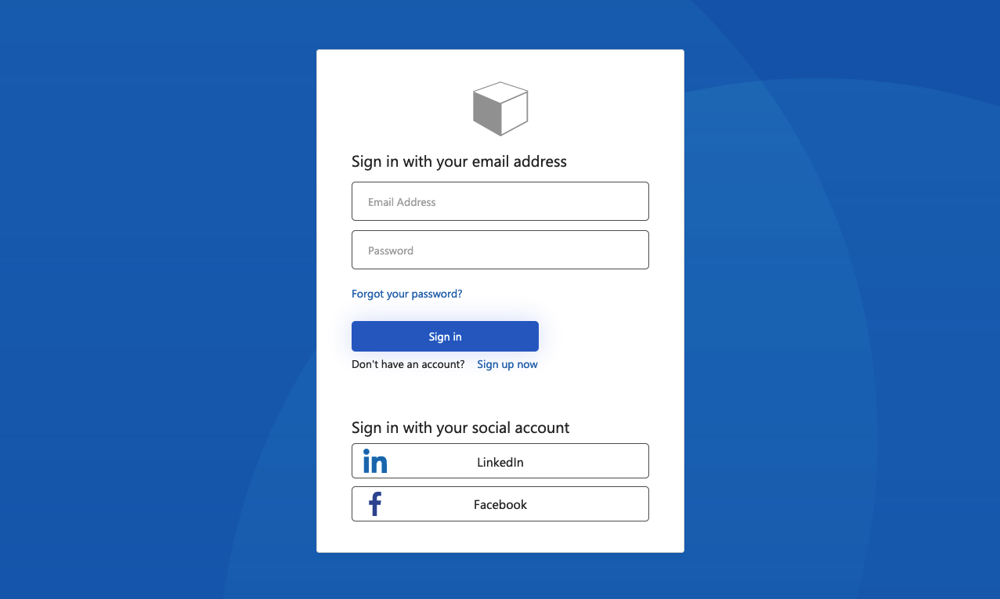
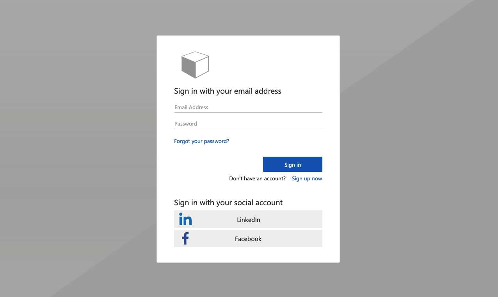
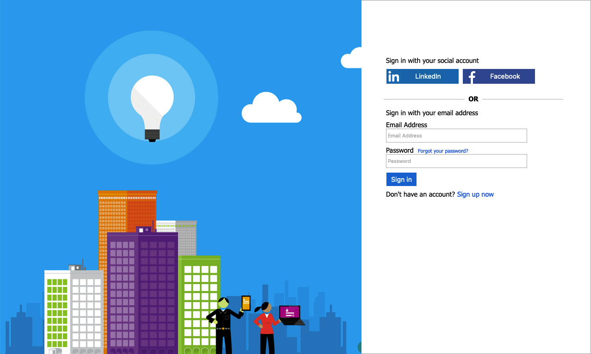
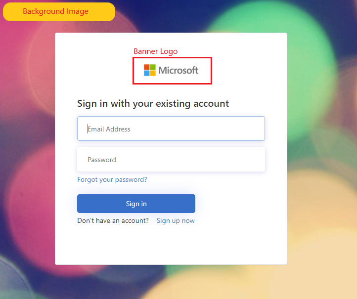
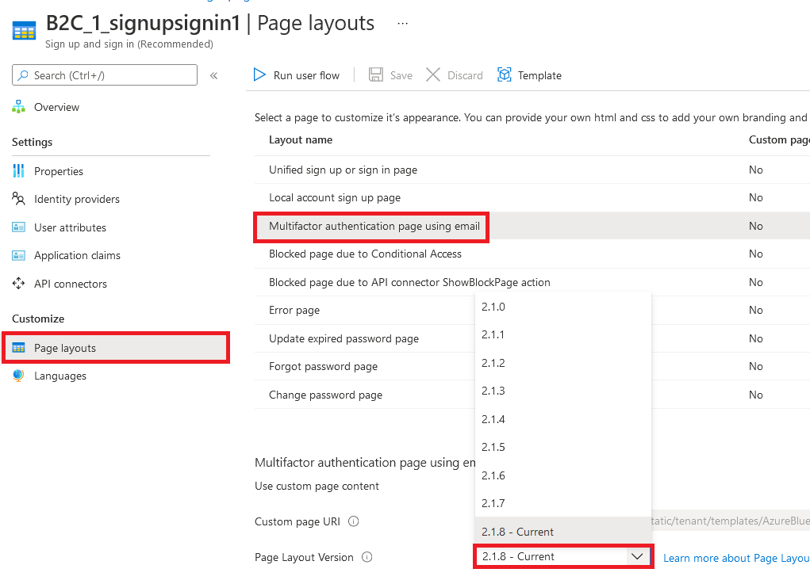

# Customize the user interface in Azure Active Directory B2C

[!INCLUDE [active-directory-b2c-choose-user-flow-or-custom-policy](../../includes/active-directory-b2c-choose-user-flow-or-custom-policy.md)]

Branding and customizing the user interface that Azure Active Directory B2C (Azure AD B2C) displays to your customers, helps provide a seamless user experience in your application. These experiences include signing up, signing in, profile editing, and password resetting. In this article, you customize your Azure AD B2C pages using page template, and company branding. 

> [!TIP]
> To customize other aspects of your user flow pages beyond the banner logo, background image, or background color, see how to [customize the UI with HTML template](customize-ui-with-html.md).

## Prerequisites

[!INCLUDE [active-directory-b2c-customization-prerequisites](../../includes/active-directory-b2c-customization-prerequisites.md)]

## Overview

Azure AD B2C provide several built-in templates you can choose from to give your user experience pages a professional look. These layout templates can also and serve as starting point for your own customization, using the [company branding](#company-branding) feature.

> [!TIP]
> To customize other aspects of your user flow pages beyond the page layout template, banner logo, background image, or background color, see how to [customize the UI with HTML template](customize-ui-with-html.md).

### Ocean Blue

Example of the Ocean Blue template rendered on sign up sign in page:



### Slate Gray

Example of the Slate Gray template rendered on sign up sign in page:



### Classic

Example of the Classic template rendered on sign up sign in page:



### Company branding

You can customize your Azure AD B2C pages with a banner logo, background image, and background color by using Azure Active Directory [Company branding](../active-directory/fundamentals/customize-branding.md). The company branding includes signing up, signing in, profile editing, and password resetting. 

The following example shows a *Sign up and sign in* page with a custom logo, background image, using Ocean Blue template:




## Select a page layout template

::: zone pivot="b2c-user-flow"

1. Sign in to the [Azure portal](https://portal.azure.com).
1. Select the **Directory + Subscription** icon in the portal toolbar, and then select the directory that contains your Azure AD B2C tenant.
1. In the Azure portal, search for and select **Azure AD B2C**.
1. Select **User flows**.
1. Select a user flow you want to customize.
1. Under **Customize** in the left menu, select **Page layouts** and then select a **Template**.
    

When you choose a template, the selected layout is applied to all pages in your user flow. The URI for each page is visible in the **Custom page URI** field.

::: zone-end

::: zone pivot="b2c-custom-policy"

To select a page layout template, set the `LoadUri` element of the [content definitions](contentdefinitions.md). The following example shows the content definition identifiers and the corresponding `LoadUri`. 

Ocean Blue:

```xml
<ContentDefinitions>
  <ContentDefinition Id="api.error">
    <LoadUri>~/tenant/templates/AzureBlue/exception.cshtml</LoadUri>
  </ContentDefinition>
  <ContentDefinition Id="api.idpselections">
    <LoadUri>~/tenant/templates/AzureBlue/idpSelector.cshtml</LoadUri>
  </ContentDefinition>
  <ContentDefinition Id="api.idpselections.signup">
    <LoadUri>~/tenant/templates/AzureBlue/idpSelector.cshtml</LoadUri>
  </ContentDefinition>
  <ContentDefinition Id="api.signuporsignin">
    <LoadUri>~/tenant/templates/AzureBlue/unified.cshtml</LoadUri>
  </ContentDefinition>
  <ContentDefinition Id="api.selfasserted">
    <LoadUri>~/tenant/templates/AzureBlue/selfAsserted.cshtml</LoadUri>
  </ContentDefinition>
  <ContentDefinition Id="api.selfasserted.profileupdate">
    <LoadUri>~/tenant/templates/AzureBlue/selfAsserted.cshtml</LoadUri>
  </ContentDefinition>
  <ContentDefinition Id="api.localaccountsignup">
    <LoadUri>~/tenant/templates/AzureBlue/selfAsserted.cshtml</LoadUri>
  </ContentDefinition>
  <ContentDefinition Id="api.localaccountpasswordreset">
    <LoadUri>~/tenant/templates/AzureBlue/selfAsserted.cshtml</LoadUri>
  </ContentDefinition>
  <ContentDefinition Id="api.phonefactor">
    <LoadUri>~/tenant/templates/AzureBlue/multifactor-1.0.0.cshtml</LoadUri>
  </ContentDefinition>
</ContentDefinitions>
```

Slate Gray:

```xml
<ContentDefinitions>
  <ContentDefinition Id="api.error">
    <LoadUri>~/tenant/templates/MSA/exception.cshtml</LoadUri>
  </ContentDefinition>
  <ContentDefinition Id="api.idpselections">
    <LoadUri>~/tenant/templates/MSA/idpSelector.cshtml</LoadUri>
  </ContentDefinition>
  <ContentDefinition Id="api.idpselections.signup">
    <LoadUri>~/tenant/templates/MSA/idpSelector.cshtml</LoadUri>
  </ContentDefinition>
  <ContentDefinition Id="api.signuporsignin">
    <LoadUri>~/tenant/templates/MSA/unified.cshtml</LoadUri>
  </ContentDefinition>
  <ContentDefinition Id="api.selfasserted">
    <LoadUri>~/tenant/templates/MSA/selfAsserted.cshtml</LoadUri>
  </ContentDefinition>
  <ContentDefinition Id="api.selfasserted.profileupdate">
    <LoadUri>~/tenant/templates/MSA/selfAsserted.cshtml</LoadUri>
  </ContentDefinition>
  <ContentDefinition Id="api.localaccountsignup">
    <LoadUri>~/tenant/templates/MSA/selfAsserted.cshtml</LoadUri>
  </ContentDefinition>
  <ContentDefinition Id="api.localaccountpasswordreset">
    <LoadUri>~/tenant/templates/MSA/selfAsserted.cshtml</LoadUri>
  </ContentDefinition>
  <ContentDefinition Id="api.phonefactor">
    <LoadUri>~/tenant/templates/MSA/multifactor-1.0.0.cshtml</LoadUri>
  </ContentDefinition>
</ContentDefinitions>
```

Classic: 

```xml
<ContentDefinitions>
  <ContentDefinition Id="api.error">
    <LoadUri>~/tenant/templates/default/exception.cshtml</LoadUri>
  </ContentDefinition>
  <ContentDefinition Id="api.idpselections">
    <LoadUri>~/tenant/templates/default/idpSelector.cshtml</LoadUri>
  </ContentDefinition>
  <ContentDefinition Id="api.idpselections.signup">
    <LoadUri>~/tenant/templates/default/idpSelector.cshtml</LoadUri>
  </ContentDefinition>
  <ContentDefinition Id="api.signuporsignin">
    <LoadUri>~/tenant/templates/AzureBlue/unified.cshtml</LoadUri>
  </ContentDefinition>
  <ContentDefinition Id="api.selfasserted">
    <LoadUri>~/tenant/templates/default/selfAsserted.cshtml</LoadUri>
  </ContentDefinition>
  <ContentDefinition Id="api.selfasserted.profileupdate">
    <LoadUri>~/tenant/templates/default/selfAsserted.cshtml</LoadUri>
  </ContentDefinition>
  <ContentDefinition Id="api.localaccountsignup">
    <LoadUri>~/tenant/templates/default/selfAsserted.cshtml</LoadUri>
  </ContentDefinition>
  <ContentDefinition Id="api.localaccountpasswordreset">
    <LoadUri>~/tenant/templates/default/selfAsserted.cshtml</LoadUri>
  </ContentDefinition>
  <ContentDefinition Id="api.phonefactor">
    <LoadUri>~/tenant/templates/default/multifactor-1.0.0.cshtml</LoadUri>
  </ContentDefinition>
</ContentDefinitions>
```
::: zone-end


## Configure company branding

To customize your user flow pages, you first configure company branding in Azure Active Directory, then you enable it in the page layouts of your user flows in Azure AD B2C.

Start by setting the banner logo, background image, and background color within **Company branding**.

1. Sign in to the [Azure portal](https://portal.azure.com).
1. Select the **Directory + subscription** filter in the top menu, and then select the directory that contains your Azure AD B2C tenant.
1. In the Azure portal, search for and select **Azure AD B2C**.
1. Under **Manage**, select **Company branding**.
1. Follow the steps in [Add branding to your organization's Azure Active Directory sign-in page](../active-directory/fundamentals/customize-branding.md).

Keep these things in mind when you configure company branding in Azure AD B2C:

* Company branding in Azure AD B2C is currently limited to **background image**, **banner logo**, and **background color** customization. The other properties in the company branding pane, for example those in **Advanced settings**, are *not supported*.
* In your user flow pages, the background color is shown before the background image is loaded. We recommended you choose a background color that closely matches the colors in your background image for a smoother loading experience.
* The banner logo appears in the verification emails sent to your users when they initiate a sign-up user flow.


## Enable company branding in user flow pages

::: zone pivot="b2c-user-flow"

Once you've configured company branding, enable it in your user flows.

1. In the left menu of the Azure portal, select **Azure AD B2C**.
1. Under **Policies**, select **User flows (policies)**.
1. Select the user flow for which you'd like to enable company branding. Company branding is **not supported** for the standard *Sign in* and standard *Profile editing* user flow types.
1. Under **Customize**, select **Page layouts**, and then select the layout you'd like to brand. For example, select **Unified sign up or sign in page**.
1. For the **Page Layout Version (Preview)**, choose version **1.2.0** or above.
1. Select **Save**.

If you'd like to brand all pages in the user flow, set the page layout version for each page layout in the user flow.



::: zone-end

::: zone pivot="b2c-custom-policy"

Once you've configured company branding, enable it in your custom policy. Configure the [page layout version](contentdefinitions.md#migrating-to-page-layout) with page `contract` version for *all* of the content definitions in your custom policy. The format of the value must contain the word `contract`: _urn:com:microsoft:aad:b2c:elements:**contract**:page-name:version_. To specify a page layout in your custom policies that use an old **DataUri** value.

Learn how to [Migrating to page layout](contentdefinitions.md#migrating-to-page-layout) with page version.

The following example shows the content definition identifiers and the corresponding **DataUri** with page contract: 

```xml
<ContentDefinitions>
  <ContentDefinition Id="api.error">
    <DataUri>urn:com:microsoft:aad:b2c:elements:contract:globalexception:1.2.0</DataUri>
  </ContentDefinition>
  <ContentDefinition Id="api.idpselections">
    <DataUri>urn:com:microsoft:aad:b2c:elements:contract:providerselection:1.2.0</DataUri>
  </ContentDefinition>
  <ContentDefinition Id="api.idpselections.signup">
    <DataUri>urn:com:microsoft:aad:b2c:elements:contract:providerselection:1.2.0</DataUri>
  </ContentDefinition>
  <ContentDefinition Id="api.signuporsignin">
    <DataUri>urn:com:microsoft:aad:b2c:elements:contract:unifiedssp:1.2.0</DataUri>
  </ContentDefinition>
  <ContentDefinition Id="api.selfasserted">
    <DataUri>urn:com:microsoft:aad:b2c:elements:contract:selfasserted:1.2.0</DataUri>
  </ContentDefinition>
  <ContentDefinition Id="api.selfasserted.profileupdate">
    <DataUri>urn:com:microsoft:aad:b2c:elements:contract:selfasserted:1.2.0</DataUri>
  </ContentDefinition>
  <ContentDefinition Id="api.localaccountsignup">
    <DataUri>urn:com:microsoft:aad:b2c:elements:contract:selfasserted:1.2.0</DataUri>
  </ContentDefinition>
  <ContentDefinition Id="api.localaccountpasswordreset">
    <DataUri>urn:com:microsoft:aad:b2c:elements:contract:selfasserted:1.2.0</DataUri>
  </ContentDefinition>
  <ContentDefinition Id="api.phonefactor">
    <DataUri>urn:com:microsoft:aad:b2c:elements:contract:multifactor:1.2.0</DataUri>
  </ContentDefinition>
</ContentDefinitions>
```

::: zone-end


## Next steps

Find more information about how you can customize the user interface of your applications in [Customize the user interface of your application in Azure Active Directory B2C](customize-ui-with-html.md).
