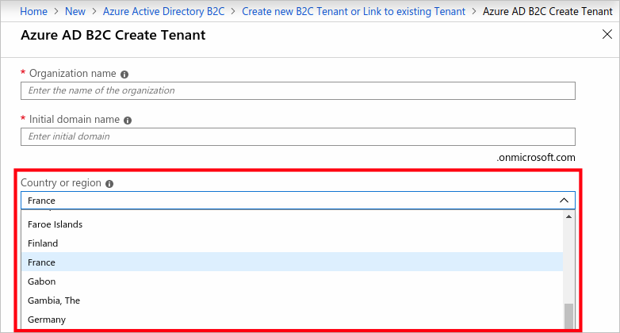

# Azure Active Directory B2C: Region availability & data residency

Azure AD B2C identity data is stored in a geographical location based on the country/region provided when you create the tenant.

Region availability and data residency are two different concepts that apply to Azure AD B2C. This article explains the differences between these two concepts, and compares how they apply to Azure versus Azure AD B2C.

Azure AD B2C is **generally available worldwide** with the option for **data residency** in the **United States, Europe, Asia Pacific, or Australia**.

[Region availability](#region-availability) refers to where a service is available for use.

[Data residency](#data-residency) refers to where user data is stored.

## Region availability

Azure AD B2C is available worldwide via the Azure public cloud. You can see availability of this service in both Azure's [Products Available By Region](https://azure.microsoft.com/regions/services/) page and the [Active Directory B2C pricing calculator](https://azure.microsoft.com/pricing/details/active-directory-b2c/). Also, Azure AD B2C service is highly available. Learn more about [Service Level Agreement (SLA) for Azure Active Directory B2C](https://azure.microsoft.com/en-us/support/legal/sla/active-directory-b2c/v1_1/).
## Data residency

Azure AD B2C stores user data in the United States, Europe, the Asia Pacific region, or Australia.

Data residency is determined by the country/region you select when you [create an Azure AD B2C tenant](tutorial-create-tenant.md):

Data resides in the **United States** for the following countries/regions:

> United States (US), Canada (CA), Costa Rica (CR), Dominican Republic (DO), El Salvador (SV), Guatemala (GT), Mexico (MX), Panama (PA), Puerto Rico (PR) and Trinidad & Tobago (TT)

Data resides in **Europe** for the following countries/regions:

> Algeria (DZ), Austria (AT), Azerbaijan (AZ), Bahrain (BH), Belarus (BY), Belgium (BE), Bulgaria (BG), Croatia (HR), Cyprus (CY), Czech Republic (CZ), Denmark (DK), Egypt (EG), Estonia (EE), Finland (FT), France (FR), Germany (DE), Greece (GR), Hungary (HU), Iceland (IS), Ireland (IE), Israel (IL), Italy (IT), Jordan (JO), Kazakhstan (KZ), Kenya (KE), Kuwait (KW), Latvia (LV), Lebanon (LB), Liechtenstein (LI), Lithuania (LT), Luxembourg (LU), North Macedonia (ML), Malta (MT), Montenegro (ME), Morocco (MA), Netherlands (NL), Nigeria (NG), Norway (NO), Oman (OM), Pakistan (PK), Poland (PL), Portugal (PT), Qatar (QA), Romania (RO), Russia (RU), Saudi Arabia (SA), Serbia (RS), Slovakia (SK), Slovenia (ST), South Africa (ZA), Spain (ES), Sweden (SE), Switzerland (CH), Tunisia (TN), Turkey (TR), Ukraine (UA), United Arab Emirates (AE) and United Kingdom (GB)

Data resides in **Asia Pacific** for the following countries/regions:

> Afghanistan (AF), Hong Kong SAR (HK), India (IN), Indonesia (ID), Japan (JP), Korea (KR), Malaysia (MY), Philippines (PH), Singapore (SG), Sri Lanka (LK), Taiwan (TW), and Thailand (TH)

Data resides in **Australia** for the following countries/regions:

> Australia and New Zealand

The following countries/regions are in the process of being added to the list. For now, you can still use Azure AD B2C by picking any of the countries/regions above.

> Argentina, Brazil, Chile, Colombia, Ecuador, Iraq, Paraguay, Peru, Uruguay, and Venezuela

## Remote profile solution

With Azure AD B2C [custom policies](custom-policy-overview.md), you can integrate with [RESTful API services](api-connectors-overview.md), which allow you to store and read user profiles from a remote database (such as a marketing database, CRM system, or any line-of-business application).  
- During the sign-up and profile editing flows, Azure AD B2C calls a custom REST API to persist the user profile to the remote data source. The user's credentials are stored in Azure AD B2C directory. 
- Upon sign-in, after credentials validation with a local or social account, Azure AD B2C invokes the REST API, which sends the user's unique identifier as a user primary key (email address or user objectId). The REST API reads the data from the remote database and returns the user profile.  

After sign-up, profile editing, or sign-in is complete, Azure AD B2C includes the user profile in the access token that is returned to the application. For more information, see the [Azure AD B2C Remote profile sample solution](https://github.com/azure-ad-b2c/samples/tree/master/policies/remote-profile) in GitHub.

## Next steps

- [Create an Azure AD B2C tenant](tutorial-create-tenant.md).
