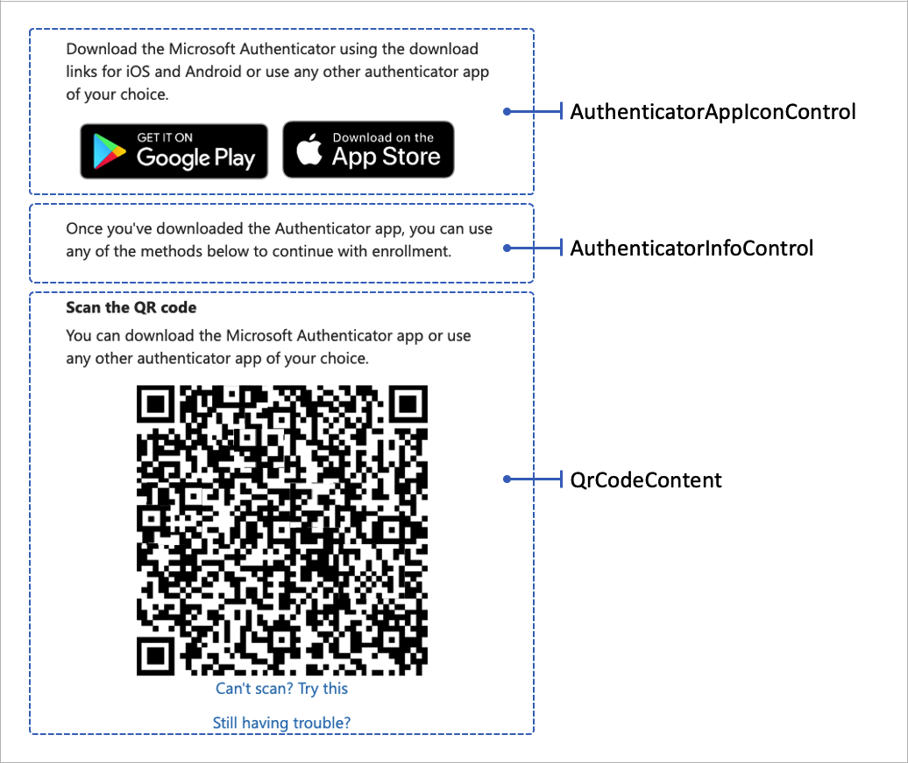
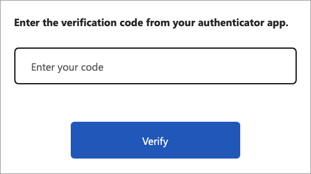

# TOTP display control

Use time-based one-time password (TOTP) [display controls](display-controls.md) to enable multifactor authentication (MFA) using the TOTP method. End users need to use an authenticator app that generates TOTP codes, such as the [Microsoft Authenticator app](https://www.microsoft.com/security/mobile-authenticator-app) or any other authenticator app that supports TOTP verification.

To enable TOTP within your custom policy, use the following display controls:

- **totpQrCodeControl** - Render the QR code and a deep link. When the user scans the QR code or opens the deep link, the authenticator app opens so the user can complete the enrollment process.  
- **AuthenticatorAppIconControl** - Render the Microsoft Authenticator app icon with a link to download the app to the user's mobile device.
- **AuthenticatorInfoControl** - Render the TOTP introduction.

The following screenshot illustrates the TOTP enrollment page showing the three display controls.




The following XML snippet shows the three display controls:

```xml
  <DisplayControls>
    <!-- Render the QR code by taking the URI (qrCodeContent) input claim and rendering it as a QR code-->
    <DisplayControl Id="totpQrCodeControl" UserInterfaceControlType="QrCodeControl">
      <InputClaims>
        <InputClaim ClaimTypeReferenceId="qrCodeContent" />
      </InputClaims>
      <DisplayClaims>
        <DisplayClaim ClaimTypeReferenceId="qrCodeContent" ControlClaimType="QrCodeContent" />
      </DisplayClaims>
    </DisplayControl>

    <!-- Render the TOTP information by taking the totpIdentifier and the secretKey input claims and rendering them in plain text-->
    <DisplayControl Id="authenticatorInfoControl" UserInterfaceControlType="AuthenticatorInfoControl">
      <InputClaims>
        <InputClaim ClaimTypeReferenceId="totpIdentifier" />
        <InputClaim ClaimTypeReferenceId="secretKey" />
      </InputClaims>
      <DisplayClaims>
        <DisplayClaim ClaimTypeReferenceId="totpIdentifier" />
        <DisplayClaim ClaimTypeReferenceId="secretKey" />
      </DisplayClaims>
    </DisplayControl>

    <!-- Render the authenticator apps icon. -->
    <DisplayControl Id="authenticatorAppIconControl" UserInterfaceControlType="AuthenticatorAppIconControl" />
  </DisplayControls>
```

The display controls are referenced from a [self-asserted technical profile](self-asserted-technical-profile.md). The self-asserted technical profile uses input claims transformation to prepare the required `qrCodeContent` and `secretKey` input claims.

The input claims transformations must be called in the following order:

1. The `CreateSecret` claims transformation type of [CreateOtpSecret](string-transformations.md#createotpsecret). The claims transformation creates a TOTP secret key. This key is later stored in the user's profile in Azure AD B2C, and is shared with the authenticator app. The authenticator app uses the key to generate a TOTP code the user needs to go through MFA. Your custom policy uses the key to validate the TOTP code provided by the user.
1. The `CreateIssuer` claims transformation type of [CreateStringClaim](string-transformations.md#createstringclaim). The claims transformation creates the TOTP issuer name. The issuer name is your tenant name, such as "Contoso demo".
1. The `CreateUriLabel` claims transformation type of [FormatStringMultipleClaims](string-transformations.md#formatstringmultipleclaims).  The claims transformation creates the TOTP URI label. The label is a combination of the user's unique identifier, such as email address, and the issuer name, for example, `Contoso demo:emily@fabrikam.com`.
1. The `CreateUriString` claims transformation type of [BuildUri](string-transformations.md#buildUri). The claims transformation creates the TOTP URI string. The string is a combination of the URI label and the secret key, for example, `otpauth://totp/Contoso%20demo:emily@fabrikam.com?secret=fay2lj7ynpntjgqa&issuer=Contoso+demo`. This URI label is rendered by the display control in a QR code format and a deep link.

The following XML code shows the `EnableOTPAuthentication` self-asserted technical profile with its input claims transformation, input claims, and display controls. 

```xml
<TechnicalProfile Id="EnableOTPAuthentication">
  <DisplayName>Sign up with Authenticator app</DisplayName>
  <Protocol Name="Proprietary" Handler="Web.TPEngine.Providers.SelfAssertedAttributeProvider, Web.TPEngine, Version=1.0.0.0, Culture=neutral, PublicKeyToken=null" />
  <Metadata>
    <Item Key="ContentDefinitionReferenceId">api.selfasserted.totp</Item>
    <Item Key="language.button_continue">Continue</Item>
  </Metadata>
  <CryptographicKeys>
    <Key Id="issuer_secret" StorageReferenceId="B2C_1A_TokenSigningKeyContainer" />
  </CryptographicKeys>
  <InputClaimsTransformations>
    <InputClaimsTransformation ReferenceId="CreateSecret" />
    <InputClaimsTransformation ReferenceId="CreateIssuer" />
    <InputClaimsTransformation ReferenceId="CreateUriLabel" />
    <InputClaimsTransformation ReferenceId="CreateUriString" />
  </InputClaimsTransformations>
  <InputClaims>
    <InputClaim ClaimTypeReferenceId="qrCodeContent" />
    <InputClaim ClaimTypeReferenceId="secretKey" />
  </InputClaims>
  <DisplayClaims>
    <DisplayClaim DisplayControlReferenceId="authenticatorAppIconControl" />
    <DisplayClaim ClaimTypeReferenceId="QrCodeScanInstruction" />
    <DisplayClaim DisplayControlReferenceId="totpQrCodeControl" />
    <DisplayClaim DisplayControlReferenceId="authenticatorInfoControl" />
  </DisplayClaims>
  <OutputClaims>
    <OutputClaim ClaimTypeReferenceId="objectId" />
    <OutputClaim ClaimTypeReferenceId="secretKey" />
  </OutputClaims>
  <UseTechnicalProfileForSessionManagement ReferenceId="SM-MFA-TOTP" />
</TechnicalProfile>
```

## Verification flow

The verification TOTP code is done by another self-asserted technical profile that uses display claims and a validation technical profile. For more information, see [Define an Azure AD MFA technical profile in an Azure AD B2C custom policy](multi-factor-auth-technical-profile.md).

The following screenshot illustrates a TOTP verification page.



## Next steps

- Learn how to validate a TOTP code in [Define an Azure AD MFA technical profile](multi-factor-auth-technical-profile.md).