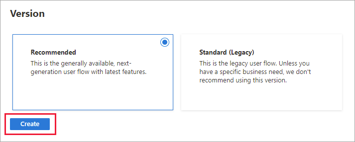
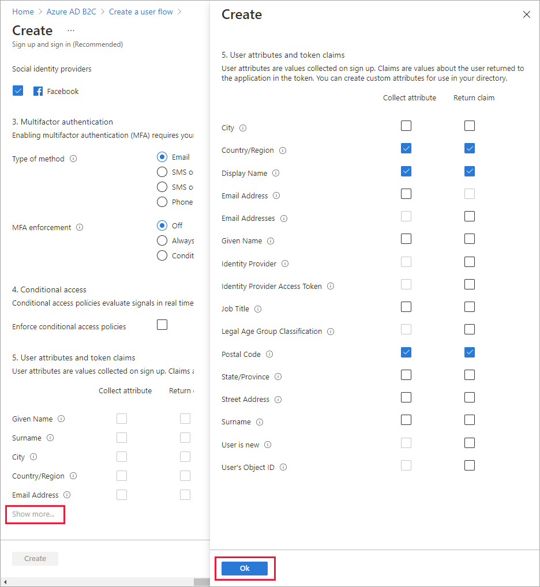

# Enable authentication in a web application using Azure Active Directory B2C

This tutorial shows you how to use Azure Active Directory B2C (Azure AD B2C) to sign in and sign up users in an ASP.NET web application. Azure AD B2C enables your applications to authenticate to social accounts, enterprise accounts, and Azure Active Directory accounts using open standard protocols.

## Prerequisites

* Install [Visual Studio 2019](https://www.visualstudio.com/downloads/) with the **ASP.NET and web development** workload.

## Step 1: Configure your user flow
In Azure AD B2C, you can define the business logic that users follow to gain access to your application. For example, you can determine the sequence of steps users follow when they sign in, sign up, edit a profile, or reset a password. After completing the sequence, the user acquires a token and gains access to your application.

If you have not already created a user flow:
1. Sign in to the [Azure portal](https://portal.azure.com).
2. Select the **Directory + Subscription** icon in the portal toolbar, and then select the directory that contains your Azure AD B2C tenant.
3. In the Azure portal, search for and select **Azure AD B2C**.
4. Under **Policies**, select **User flows**, and then select **New user flow**.

    

5. On the **Create a user flow** page, select the **Sign up and sign in** user flow.

    

6. Under **Select a version**, select **Recommended**, and then select **Create**. ([Learn more](user-flow-versions.md) about user flow versions.)

    

7. Enter a **Name** for the user flow. For example, *signupsignin1*.
8. For **Identity providers**, select **Email sign-up**.
9. For **User attributes and claims**, choose the claims and attributes that you want to collect and send from the user during sign-up. For example, select **Show more**, and then choose attributes and claims for **Country/Region**, **Display Name**, and **Postal Code**. Click **OK**.

    

10. Click **Create** to add the user flow. A prefix of *B2C_1* is automatically prepended to the name.
11. Follow the steps to [handle the flow for "Forgot your password?"](add-password-reset-policy.md?pivots=b2c-user-flow.md#self-service-password-reset-recommended) within the sign-up or sign-in policy.

## Step 2: Register a web application

## Step 3: Configure the sample application