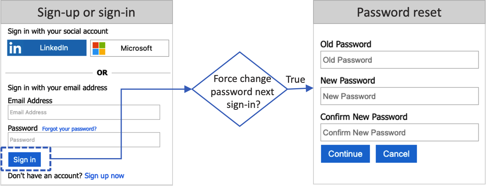

# Set up a force password reset flow in Azure Active Directory B2C

[!INCLUDE [active-directory-b2c-choose-user-flow-or-custom-policy](../../includes/active-directory-b2c-choose-user-flow-or-custom-policy.md)]

As an administrator, you can reset a user's password if the user hasn't received a password, forgets their password, or is unable to sign. In this article, you'll learn how to force a password reset whenever a password expires or needs to be changed.

## Overview

The [sign-in and sign-up journey](add-sign-up-and-sign-in-policy.md) checks the value of the [forceChangePasswordNextSignIn attribute](user-profile-attributes.md#password-profile-property). The value of the attribute changes to true when an administrator resets a user's password via the Azure portal. If this attribute is set to true, Azure AD B2C forces a password reset. After the password is reset, the value of the attribute changes back to false.

The password reset flow is applicable to local accounts in Azure AD B2C that use an [email address](identity-provider-local.md#email-sign-in) or [username](identity-provider-local.md#username-sign-in) with a password for sign-in. The password reset flow doesn't apply to federated accounts.

### Force a password reset after 90 days

By default, passwords don't expire. An administrator can change a user's password expiration policy using [MS Graph](microsoft-graph-operation.md). If force password reset is enabled *and* password expiration is enabled for a user, the user is forced to reset the password every 90 days.

For more information on how to set a user's password expiration policy, see [Password policy attribute](user-profile-attributes.md#password-policy-attribute).

## Prerequisites

[!INCLUDE [active-directory-b2c-customization-prerequisites](../../includes/active-directory-b2c-customization-prerequisites.md)]

## Configure your policy

::: zone pivot="b2c-user-flow"

To enable the **Forced password reset** setting in a sign-up or sign-in user flow:

1. Sign in to the [Azure portal](https://portal.azure.com).
1. Select the **Directory + Subscription** icon in the portal toolbar, and then select the directory that contains your Azure AD B2C tenant.
1. In the Azure portal, search for and select **Azure AD B2C**.
1. Select **User flows**.
1. Select the sign-up or sign-in user flow (of type **Recommended**) that you want to customize.
1. In the left menu under **Settings**, select **Properties**.
1. Under **Password complexity**, select **Forced password reset**.
1. Select **Save**.

### Test the user flow

1. Sign in to the [Azure portal](https://portal.azure.com) as a user administrator or a password administrator. For more information about the available roles, see [Assigning administrator roles in Azure Active Directory](../active-directory/roles/permissions-reference#available-roles).
1. Select the **Directory + Subscription** icon in the portal toolbar, and then select the directory that contains your Azure AD B2C tenant.
1. In the Azure portal, search for and select **Azure AD B2C**.
1. Select **Users**, search for and select the user you'll use to test the password reset, and then select **Reset Password**.
2. In the Azure portal, search for and select **Azure AD B2C**.
3. Select **User flows**.
4. Select a sign-up or sign-in user flow (of type **Recommended**) that you want to test.
5. Select **Run user flow**.
6. For **Application**, select the web application named *webapp1* that you previously registered. The **Reply URL** should show `https://jwt.ms`.
7. Select **Run user flow**.
8. Sign in with the user account for which you reset the password.
9. You now must change the password for the user. Change the password and select **Continue**. The token is returned to `https://jwt.ms` and should be displayed to you.

::: zone-end

::: zone pivot="b2c-custom-policy"

This feature is currently available only for user flows.

::: zone-end

## Next steps

Set up a [self-service password reset](add-password-reset-policy.md).