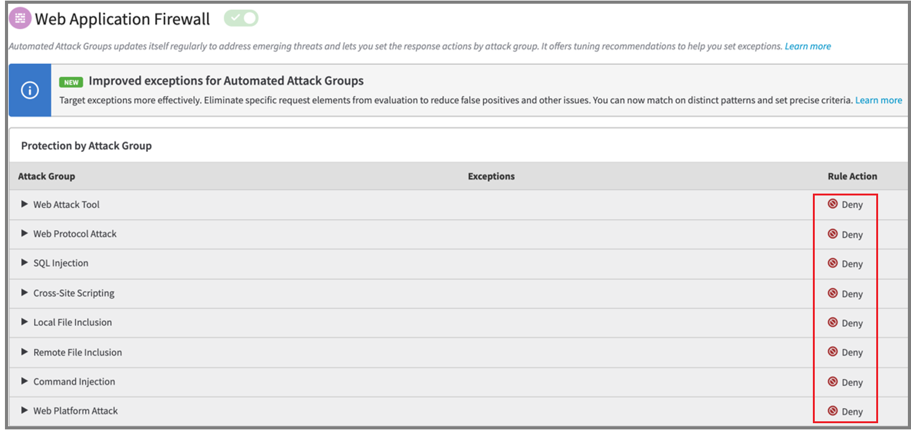

# Configure Azure Active Directory B2C with Akamai Web Application Protector

Learn to enable Akamai Web Application Protector (WAP) for Azure Active Directory B2C (Azure AD B2C) tenant using custom domains. Akamai WAP helps organization protect their web applications from malicious attacks that aim to exploit vulnerabilities such as SQL injection and Cross site scripting.

Learn more on akamai.com: [What Is a Web Application Firewall (WAF)?](https://www.akamai.com/glossary/what-is-a-waf)

Benefits of using WAF:

* Control traffic management to your services
* Configure in in front of an Azure AD B2C tenant
* Manipulate traffic to protect and secure your identity infrastructure

This article applies to:

WAP: [Web Application Protector](https://www.akamai.com/products/web-application-protector)
KSD: [Kona Site Defender](https://www.akamai.com/us/en/products/security/kona-site-defender.jsp) 

## Prerequisites

* An Azure subscription
  * If you don't have one, get an [Azure free account](https://azure.microsoft.com/free/)
* An Azure AD B2C tenant linked to your Azure subscription
  * See, [Tutorial: Create an Azure Active Directory B2C tenant](tutorial-create-tenant.md) 
* An Akamai WAP account
  * Go to akamai.com for [Explore all Akamai products and trials](https://www.akamai.com/us/en/akamai-free-trials.jsp)

## Scenario description

Akamai WAP integration includes the following components:

* **Azure AD B2C** – the authorization server that verifies user credentials with custom policies in the tenant. Also known as the identity provider (IdP).
* **Azure Front Door** – enables custom domains for the Azure B2C tenant
  * Traffic from Akamai WAP routs to Azure Front Door then goes to the Azure AD B2C tenant
  * [What is Azure Front Door?](../frontdoor/front-door-overview.md) 
* **Akamai WAP** – The web application firewall that manages traffic sent to the authorization server
  * See, [Web Application Protector](https://www.akamai.com/us/en/resources/waf.jsp)

## Integrate with Azure AD B2C

1. To use custom domains in Azure AD B2C, it's required to use custom domain feature provided by Azure Front Door. Learn how to [enable Azure AD B2C custom domains](./custom-domain.md?pivots=b2c-user-flow).  

1. After custom domain for Azure AD B2C is successfully configured using Azure Front Door, [test the custom domain](./custom-domain.md?pivots=b2c-custom-policy#test-your-custom-domain) before proceeding further.  

## Onboard with Akamai

[Sign-up](https://www.akamai.com) and create an Akamai account.

### Create and configure property

1. [Create a new property](https://control.akamai.com/wh/CUSTOMER/AKAMAI/en-US/WEBHELP/property-manager/property-manager-help/GUID-14BB87F2-282F-4C4A-8043-B422344884E6.html).

1. Configure the property settings as:

    | Property | Value |
    |:---------------|:---------------|
    |Property version | Select Standard or Enhanced TLS (preferred) |
    |Property hostnames | Add a property hostname. This is the name of your custom domain, for example, `login.domain.com`.   Create or modify a certificate with the appropriate settings for the custom domain name. Learn more about [creating a certificate](https://learn.akamai.com/en-us/webhelp/property-manager/https-delivery-with-property-manager/GUID-9EE0EB6A-E62B-4F5F-9340-60CBD093A429.html). |

1. Set the origin server property configuration settings as:

    |Property| Value |
    |:-----------|:-----------|
    | Origin type | Your origin |
    | Origin server hostname | yourafddomain.azurefd.net |
    | Forward host header | Incoming Host Header |
    | Cache key hostname| Incoming Host Header |

### Configure DNS

Create a CNAME record in your DNS such as `login.domain.com` that points to the Edge hostname in the Property hostname field.

### Configure Akamai WAF

1. [Configure Akamai WAF](https://learn.akamai.com/en-us/webhelp/kona-site-defender/kona-site-defender-quick-start/GUID-6294B96C-AE8B-4D99-8F43-11B886E6C39A.html#GUID-6294B96C-AE8B-4D99-8F43-11B886E6C39A).

1. Ensure that **Rule Actions** for all items listed under the **Attack Group** are set to **Deny**.

    

Learn more about [how the control works and configuration options](https://control.akamai.com/dl/security/GUID-81C0214B-602A-4663-839D-68BCBFF41292.html).

<!-- docutune:ignore "Security Center" -->

### Test the settings

Check the following to ensure all traffic to Azure AD B2C is going through the custom domain:

- Make sure all incoming requests to Azure AD B2C custom domain are routed via Akamai WAF and using valid TLS connection.
- Ensure all cookies are set correctly by Azure AD B2C for the custom domain.
- The Akamai WAF dashboard available under Defender for Cloud console display charts for all traffic that pass through the WAF along with any attack traffic.

## Next steps

- [Configure a custom domain in Azure AD B2C](./custom-domain.md?pivots=b2c-user-flow)

- [Get started with custom policies in Azure AD B2C](./tutorial-create-user-flows.md?pivots=b2c-custom-policy&tabs=applications)
