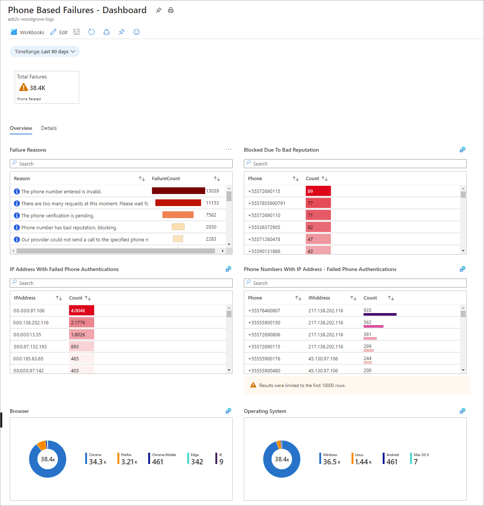
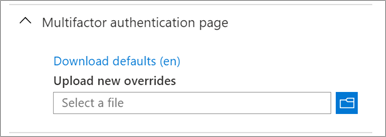

# Tips for more secure phone-based multi-factor authentication (MFA)

[!INCLUDE [active-directory-b2c-public-preview](../../includes/active-directory-b2c-public-preview.md)]

Any Azure Active Directory B2C (Azure AD B2C) tenant can be prone to fraud attacks during the sign-up process where the user is asked to register phone number as MFA and the voice call method is chosen. Every voice call generates cost, and fraudsters can take advantage of this by creating multiple accounts that place phone call but never end up completing MFA registration process. As a result, the number of failed sign-ups increase, and this prevents other users with no ill-intent in the tenant to be affected by not being able to sign up for a new account due to fraudsters exhausting allowed sign up attempts.

## Prerequisites

Set up a [log analytics workspace](azure-monitor.md).

## Phone-based MFA events workbook

Here are few screen shots from the draft workbook created to highlight phone related failures. The workbooks are available at [https://github.com/azure-ad-b2c/siem#phone-authentication-failures](https://github.com/azure-ad-b2c/siem#phone-authentication-failures).

### Overview tab

You'll find the following data on the **Overview** tab:

- Phone Authentication Failure Reasons
- Phone Number Failures Per IP Address  
- Blocked Phone Number Listing  
- IP Address – Failed Phone Authentications
- Phone Failures – Client Browsers
- Phone Failures – Client Operating Systems

### Details tab

The following data is reported on the **Details** tab:

- Azure AD B2C Policy – Failed Phone Authentications
- Failed Phone Authentications by Phone Number – Time Chart (timeline adjustable)
- Failed Phone Authentications by Azure AD B2C Policy – Time Chart (timeline adjustable)
- Failed Phone Authentications by IP Address– Time Chart (time line adjustable)
- Clickable: Select Phone Number to view detail listing of failures

## Using the workbook

You can use the workbook to understand phone-based MFA events and identify potential users abusing telephony service.

1. Understand what’s normal for your tenant by answering these questions:

   - Where are the regions you expect phone-based MFAs to happen?
   - Are the reasons for failing the phone-based MFA something expected or considered as normal?

2. Recognize the characteristics of fraudulent sign-up:

   - **Location-based**: Look for any accounts where you don’t expect to see users signing up from **Phone Number Failures Per IP Address**.

   > [!NOTE]
   > The IP Address provided is an approximate region.

   - **Velocity-based**: You can look at **Failed Phone Authentications Overtime (Per Day)**, which indicates phone numbers are making abnormal number of failed phone authentication attempts per day, ordered from highest (left) to lowest (right).

3. To mitigate fraudulent sign-ups, follow these steps:

   - Use **Recommended** versions of user flows to:
      - Enable email-OTP for MFA (this will be effective for both sign-up and sign-in)
      - Configure Conditional Access policy to block sign-ins based on location (this will only be effective for sign-ins, not sign-ups)
      - Use API Connectors to integrate with anti-bot solution like reCAPTCHA (this is effective for sign-up)

   - Remove country codes that aren't relevant to your organization from the drop-down menu where the user verifies their phone number. The change will go into effect for future sign-ups.

      1. Click into your user flow, then navigate to **Languages**. Select **English en** for the United States, or select another language depending on your geographical location in the table. In the right panel that opens up, click on **Download defaults (en)**.
 
      

      1. There should be a .json file downloaded. Open the json file and search for “DEFAULT”
      1. Replace the line with `"Value": "{\"DEFAULT\":\"Country/Region\",\"US\":\"United States\"}"`. Be sure to set **Overrides** to `true`.
      - You can customize the list of country codes you want to allow by adding country codes. Find the full country code list under countryList in this link: https://docs.microsoft.com/en-us/azure/active-directory-b2c/localization-string-ids#phone-factor-authentication-page-example
      1. Save the file and upload back in the panel from earlier step under “Upload new overrides”
      1. Close the panel and click “Run user flow”
      1. Confirm that “United States” is the only country code available in the dropdown:
 
4.	If any of your end-users are accidentally blocked, they'll need to contact their help desk or support team.

## Next steps

Read [Identity Protection and Conditional Access for Azure AD B2C](conditional-access-identity-protection-overview.md) 
Apply [Conditional Access to user flows in Azure Active Directory B2C](conditional-access-user-flow.md)