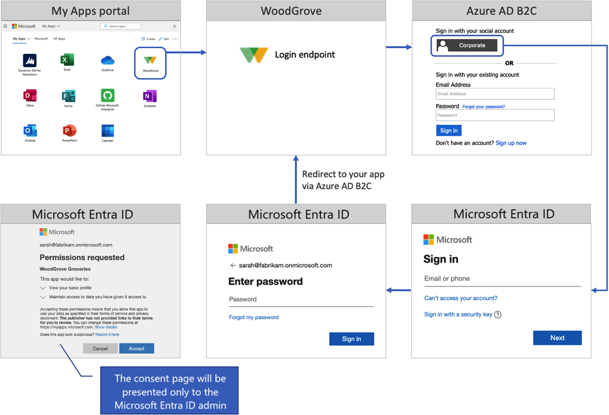

# Publish your Azure AD B2C app to the Azure AD app gallery

The Azure Active Directory (Azure AD) app gallery is a catalog of thousands of apps. The app gallery makes it easy to deploy and configure single sign-on (SSO) and automate user setup. You can find popular cloud apps in the gallery, such as Workday, ServiceNow, and Zoom.

This article describes how to publish your Azure Active Directory B2C (Azure AD B2C) app in the Azure AD app gallery. When your app is published, it's listed among the options that customers can choose from when they're adding apps to their Azure AD tenant.

Here are some benefits of adding your Azure AD B2C app to the app gallery:  

- Your app is a verified integration with Microsoft.
- SSO access is enabled between your app and Azure AD apps.
- Customers can find your app in the gallery with a quick search.
- App configuration is simple and minimal.
- Customers get a step-by-step configuration tutorial.
- Customers can assign the app to various users and groups within their organization.
- The tenant administrator can grant tenant-wide admin consent to your app.

## Sign in flow overview

The sign in flow involves the following steps:

1. Users go to the [My Apps portal](https://myapps.microsoft.com/) and select your app, which opens the app sign in URL.
1. The app sign in URL starts an authorization request and redirects users to the Azure AD B2C authorization endpoint.
1. Users choose to sign in with their Azure AD "Corporate" account. Azure AD B2C takes them to the Azure AD authorization endpoint, where they sign in with their work account.
1. If the Azure AD SSO session is active, Azure AD issues an access token without prompting users to sign in again. If the Azure AD session expires or becomes invalid, users are prompted to sign in again.

Depending on the users' SSO session and Azure AD identity settings, they might be prompted to:

- Provide their email address or phone number.
- Enter their password or sign in with the [Microsoft authenticator app](https://www.microsoft.com/p/microsoft-authenticator/9nblgggzmcj6).
- Complete multifactor authentication.
- Accept the consent page. Your customer's tenant administrator can [grant tenant-wide admin consent to an app](../active-directory/manage-apps/grant-admin-consent.md). When consent is granted, the consent page won't be presented to users.

Upon successful sign in, Azure AD returns a token to Azure AD B2C. Azure AD B2C validates and reads the token claims, and then returns a token to your application.

## Prerequisites

[!INCLUDE [active-directory-b2c-customization-prerequisites-custom-policy](../../includes/active-directory-b2c-customization-prerequisites-custom-policy.md)]

## Step 1: Register your application in Azure AD B2C

To enable sign in to your app with Azure AD B2C, register your app in the Azure AD B2C directory. Registering your app establishes a trust relationship between the app and Azure AD B2C. 

If you haven't already done so, [register a web application](tutorial-register-applications.md). Later, you'll register this app with the Azure app gallery.

## Step 2: Set up sign in for multitenant Azure AD

To allow employees and consumers from any Azure AD tenant to sign in by using Azure AD B2C, follow the guidance for [setting up sign in for multitenant Azure AD](identity-provider-azure-ad-multi-tenant.md?pivots=b2c-custom-policy).

## Step 3: Prepare your app

In your app, copy the URL of the sign in endpoint. If you use the [web application sample](configure-authentication-sample-web-app.md), the sign in URL is `https://localhost:5001/MicrosoftIdentity/Account/SignIn?`. This URL is where the Azure AD app gallery takes users to sign in to your app.

In production environments, the app registration redirect URI is ordinarily a publicly accessible endpoint where your app is running, such as `https://woodgrovedemo.com/Account/SignIn`. The reply URL must begin with `https`.

## Step 4: Publish your Azure AD B2C app

Finally, add the multitenant app to the Azure AD app gallery. Follow the instructions in [Publish your app to the Azure AD app gallery](../active-directory/manage-apps/v2-howto-app-gallery-listing.md). To add your app to the app gallery, do the following:

1. [Create and publish documentation](../active-directory/manage-apps/v2-howto-app-gallery-listing.md#create-and-publish-documentation).
1. [Submit your app](../active-directory/manage-apps/v2-howto-app-gallery-listing.md#submit-your-application) with the following information:

    |Question  |Answer you should provide  |
    |---------|---------|
    |What type of request do you want to submit?| Select **List my application in the gallery**.|
    |What feature would you like to enable when listing your application in the gallery? | Select **Federated SSO (SAML, WS-Fed & OpenID Connect)**. | 
    | Select your application federation protocol| Select **OpenID Connect & OAuth 2.0**. |
    | Application (Client) ID | Provide the ID of [your Azure AD B2C application](#step-1-register-your-application-in-azure-ad-b2c). |
    | Application sign in URL|Provide the app sign in URL as it's configured in [Step 3. Prepare your app](#step-3-prepare-your-app).|
    | Multitenant| Select **Yes**. |
    | | |

## Next steps

- Learn how to [Publish your app to the Azure AD app gallery](../active-directory/manage-apps/v2-howto-app-gallery-listing.md).
