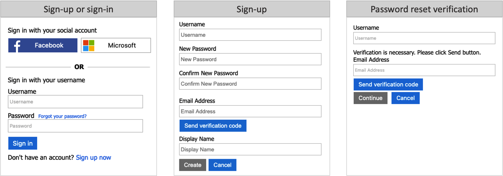
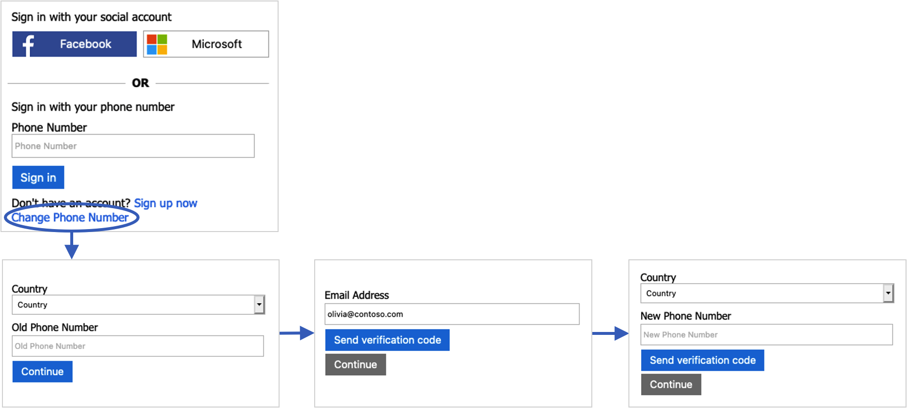
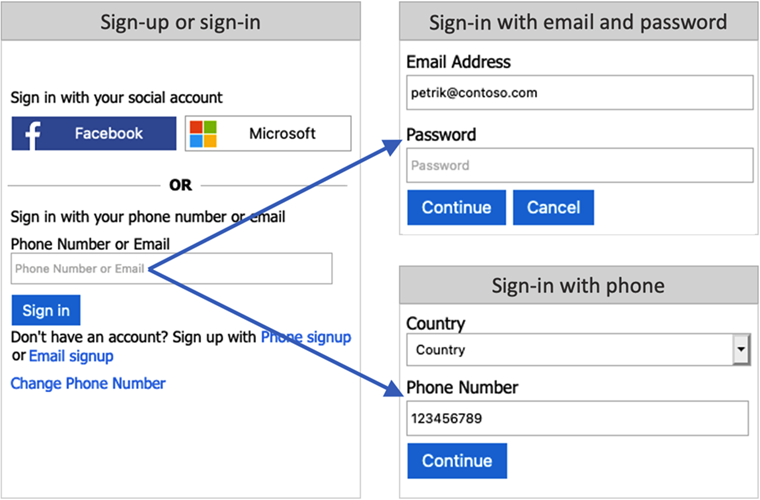

# Sign-in options in Azure AD B2C

Azure AD B2C offers several sign-up and sign-in methods for users of your applications. When users sign up for your application, you determine whether they'll use a username, email address, or phone number to create local accounts in your Azure AD B2C tenant. You can also federate with social identity providers (like Facebook, LinkedIn, and Twitter) and standard identity protocols (like OAuth 2.0, OpenID Connect, and more).

This article gives an overview of Azure AD B2C sign-in options.

## Email sign-in

Email sign-up is enabled by default in your local account identity provider settings. With the email option, users can sign in and sign up with their email address and password.

- **Sign-in**: Users are prompted to provide their email and password.
- **Sign-up**: users are prompted for an email address, which is verified at sign-up (optional) and becomes their login ID. The user then enters any other information requested on the sign-up page, for example, display name, given name, and surname. Then they select **Continue** to create an account.
- **Password reset**: Users enter and verify their email, after which the user can reset the password

Learn how to configure email sign-in in your local account identity provider.
## Username sign-in

Your local account identity provider includes a Username option that lets users sign up and sign in to your application with a username and password.

- **Sign-in**: Users are prompted to provide their username and password.
- **Sign-up**: Users will be prompted for a username, which will become their login ID. Users will also be prompted for an email address, which will be verified at sign-up. The email address will be used during a password reset flow. The user enters any other information requested on the sign-up page, for example, Display Name, Given Name, and Surname. The user then selects Continue to create the account.
- **Password reset**: Users must enter their username and the associated email address. The email address must be verified, after which, the user can reset the password.

## Phone sign-in

Phone sign-in is a passwordless option in your local account identity provider settings. This method lets users sign up for your app using a phone number as their primary identifier. One-time passwords are sent to your users via SMS text messages. Users will have the following experience during sign-up and sign-in:

- **Sign-in**: If the user has an existing account with phone number as their identifier, the user enters their phone number and selects *Sign in*. They confirm the country and phone number by selecting *Continue*, and a one-time verification code is sent to their phone. The user enters the verification code and selects *Continue* to sign in.
- **Sign-up**: If the user doesn't already have an account for your application, they can create one by clicking on the *Sign up now* link.
    1. A sign-up page appears, where the user selects their *Country*, enters their phone number, and selects *Send Code*. 
    1. A one-time verification code is sent to the user's phone number. The user enters the *Verification Code* on the sign-up page, and then selects *Verify Code*. (If the user can't retrieve the code, they can select *Send New Code*).
    1. The user enters any other information requested on the sign-up page, for example, Display Name, Given Name, and Surname. Then select Continue.
    1. Next, the user is asked to provide a **recovery email**. The user enters their email address, and then selects *Send verification code*. A code is sent to the user's email inbox, which they can retrieve and enter in the Verification code box. Then the user selects Verify code.
    1. Once the code is verified, the user selects *Create* to create their account.

### Pricing for phone sign-in

One-time passwords are sent to your users by using SMS text messages. Depending on your mobile network operator, you may be charged for each message sent. For pricing information, see the **Separate Charges** section of [Azure Active Directory B2C pricing](https://azure.microsoft.com/pricing/details/active-directory-b2c/).

> [!NOTE]
> Multi-factor authentication (MFA) is disabled by default when you configure a user flow with phone sign-up. You can enable MFA in user flows with phone sign-up, but because a phone number is used as the primary identifier, email one-time passcode is the only option available for the second authentication factor.

### Phone recovery

When you enable phone sign-up and sign-in for your user flows, it's also a good idea to enable the recovery email feature. With this feature, a user can provide an email address that can be used to recover their account when they don't have their phone. This email address is used for account recovery only. It can't be used for signing in.

- When the recovery email prompt is **On**, a user signing up for the first time is prompted to verify a backup email. A user who hasn't provided a recovery email before is asked to verify a backup email during next sign in.

- When recovery email is **Off**, a user signing up or signing in isn't shown the recovery email prompt.

The following screenshots demonstrate the phone recovery flow:

## Phone or email sign-in

You can choose to combine the [phone sign-in](#phone-sign-in), and the [email sign-in](#email-sign-in) in your local account identity provider settings. In the sign-up or sign-in page, user can type a phone number, or email address. Based on the user input, Azure AD B2C takes the user to the corresponding flow.

## Federated sign-in

You can configure Azure AD B2C to allow users to sign in to your application with credentials from external social or enterprise identity providers (IdPs). Azure AD B2C supports many [external identity providers](add-identity-provider.md) and any identity provider that supports OAuth 1.0, OAuth 2.0, OpenID Connect, and SAML protocols. 

With external identity provider federation, you can offer your consumers the ability to sign in with their existing social or enterprise accounts, without having to create a new account just for your application.

On the sign-up or sign-in page, Azure AD B2C presents a list of external identity providers the user can choose for sign-in. Once they select one of the external identity providers, they're redirected to the selected provider's website to complete the sign in process. After the user successfully signs in, they're returned to Azure AD B2C for authentication of the account in your application.

You can add identity providers that are supported by Azure Active Directory B2C (Azure AD B2C) to your [user flows](user-flow-overview.md) using the Azure portal. You can also add identity providers to your [custom policies](user-flow-overview.md).

## Next steps

- Find out more about the built-in policies provided by [User flows in Azure Active Directory B2C](user-flow-overview.md).
- [Configure your local account identity provider](identity-provider-local.md).
