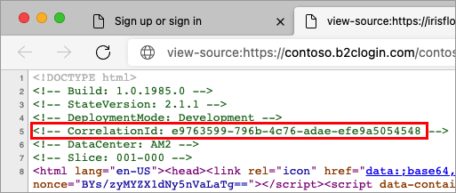
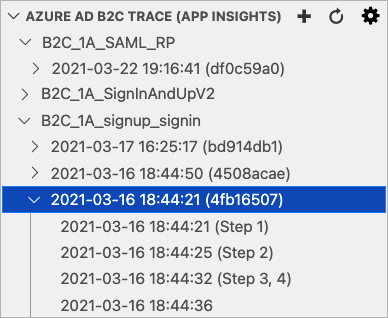
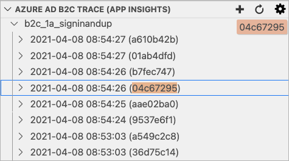
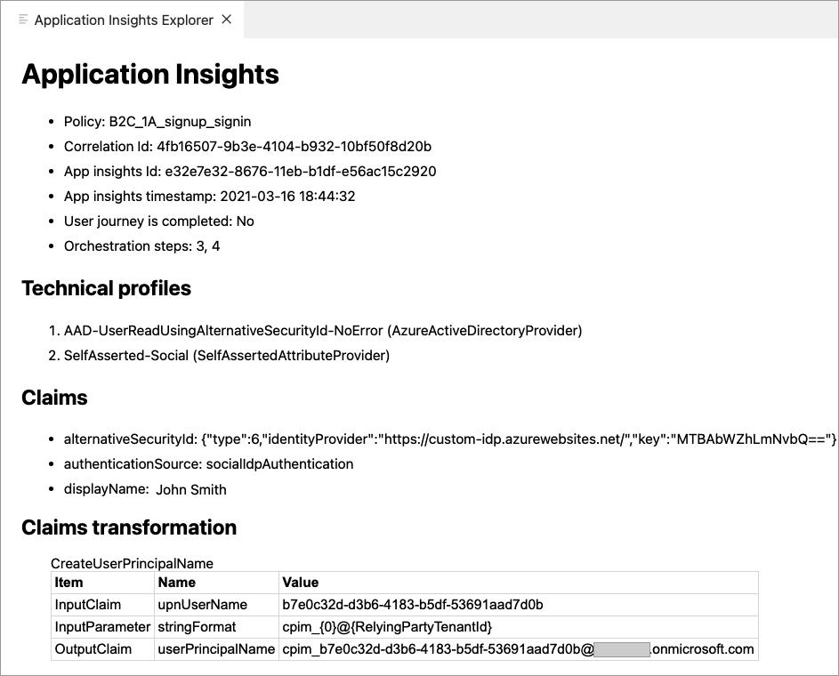
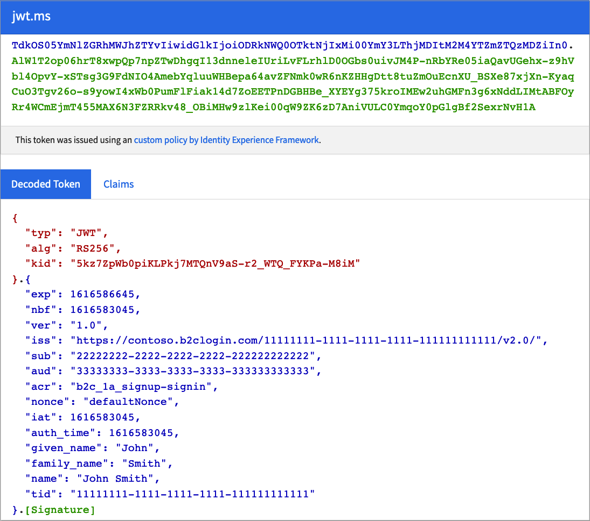
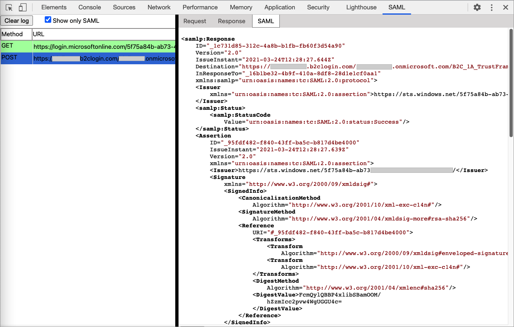
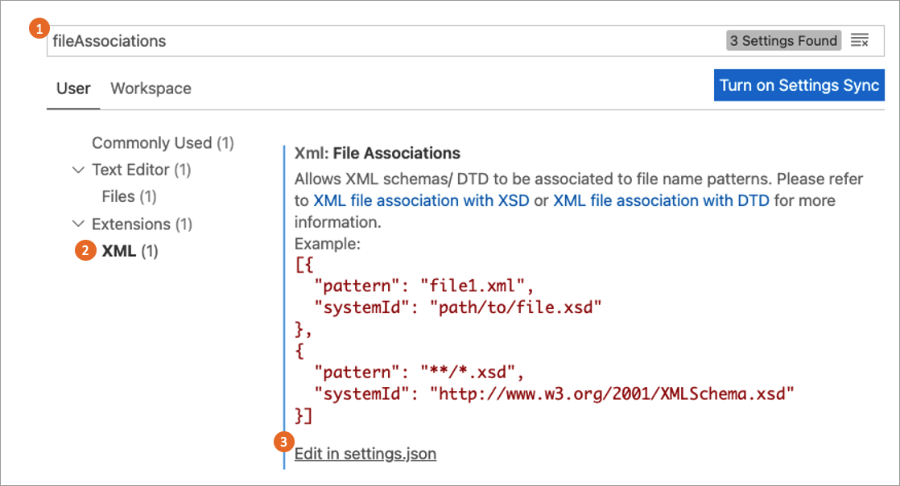
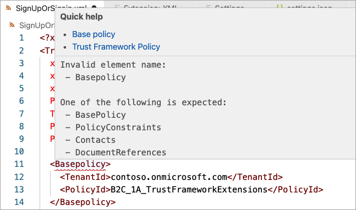
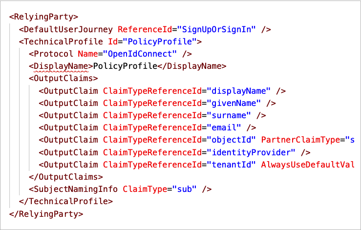
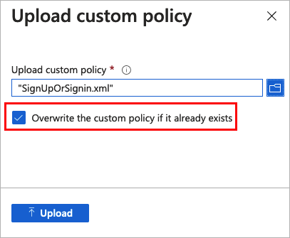

# Troubleshoot Azure AD B2C custom policies and user flows

You app needs to react to certain errors coming from B2C. This article provides some of the common errors.

::: zone pivot="b2c-user-flow"

## Password reset error


- The error
- The solution
    - Respond back with new auth request
    - Use recommended SSPR + a link to this article https://docs.microsoft.com/en-us/azure/active-directory-b2c/add-password-reset-policy?pivots=b2c-user-flow#self-service-password-reset-recommended 


## User cancelled the operation
- The error

blah blah blah
- The solution
-
blah blah blah

::: zone-end

::: zone pivot="b2c-custom-policy"

If you use Azure Active Directory B2C (Azure AD B2C) [custom policies](custom-policy-overview.md), you might experience challenges with policy language XML format or runtime issues. This article describes some tools and tips that can help you discover and resolve issues. 

This article focuses on troubleshooting your Azure AD B2C custom policy configuration. It doesn't address the relying party application or its identity library.

## Azure AD B2C correlation ID overview

Azure AD B2C correlation ID is a unique identifier value that is attached to authorization requests. It passes through all the orchestration steps a user is taken through. With the correlation ID, you can:

- Identify sign-in activity in your application and track the performance of your policy.
- Find the sign-in request's Azure Application Insights logs.
- Pass the correlation ID to your REST API and use it to identify the sign-in flow. 

The correlation ID is changed every time a new session is established. When you debug your policies, make sure that you close existing browser tabs or open a new in-private mode browser.

### Get the Azure AD B2C correlation ID

You can find the correlation ID in the Azure AD B2C sign-up or sign-in page. In your browser, select **view source**. The correlation appears as a comment at the top of the page.



Copy the correlation ID, and then continue the sign-in flow. Use the correlation ID to observe the sign-in behavior. For more information, see [Troubleshooting with Application Insights](#troubleshooting-with-application-insights).

### Echo the Azure AD B2C correlation ID

You can include the correlation ID in your Azure AD B2C tokens. To include the correlation ID:

1. Open the extensions file of your policy. For example, <em>`SocialAndLocalAccounts/`**`TrustFrameworkExtensions.xml`**</em>.
1. Search for the [BuildingBlocks](buildingblocks.md) element. If the element doesn't exist, add it.
1. Locate the [ClaimsSchema](claimsschema.md) element. If the element doesn't exist, add it.
1. Add the correlation ID claim to the **ClaimsSchema** element.  

    ```xml
    <!-- 
    <BuildingBlocks>
      <ClaimsSchema> -->
        <ClaimType Id="correlationId">
          <DisplayName>correlation ID</DisplayName>
          <DataType>string</DataType>
        </ClaimType>
      <!-- 
      </ClaimsSchema>
    </BuildingBlocks>-->
    ```

1. Open the relying party file of your policy. For example, <em>`SocialAndLocalAccounts/`**`SignUpOrSignIn.xml`**</em> file. The output claim will be added to the token after a successful user journey and sent to the application. Modify the technical profile element in the relying party section to add the `correlationId` as an output claim.
 
    ```xml
    <RelyingParty>
      <DefaultUserJourney ReferenceId="SignUpOrSignIn" />
      <TechnicalProfile Id="PolicyProfile">
        <DisplayName>PolicyProfile</DisplayName>
        <Protocol Name="OpenIdConnect" />
        <OutputClaims>
          ...
          <OutputClaim ClaimTypeReferenceId="correlationId" DefaultValue="{Context:CorrelationId}" />
        </OutputClaims>
        <SubjectNamingInfo ClaimType="sub" />
      </TechnicalProfile>
    </RelyingParty>
    ```


## Troubleshooting with Application Insights

To diagnose problems with your custom policies, use [Application Insights](troubleshoot-with-application-insights.md). Application Insights traces the activity of your custom policy user journey. It provides a way to diagnose exceptions and observe the exchange of claims between Azure AD B2C and the various claims providers that are defined by technical profiles, such as identity providers, API-based services, the Azure AD B2C user directory, and other services.  

We recommend installing the [Azure AD B2C extension](https://marketplace.visualstudio.com/items?itemName=AzureADB2CTools.aadb2c) for [VS Code](https://code.visualstudio.com/). With the Azure AD B2C extension, the logs are organized for you by policy name, correlation ID (Application Insights presents the first digit of the correlation ID), and the log timestamp. This feature helps you find the relevant log based on the local timestamp and see the user journey as executed by Azure AD B2C. 

> [!NOTE]
> - There is a short delay, typically less than five minutes, before you can see new logs in Application Insights.
> - The community has developed the Visual Studio Code extension for Azure AD B2C to help identity developers. The extension is not supported by Microsoft and is made available strictly as-is.

A single sign-in flow can issue more than one Azure Application Insights trace. In the following screenshot, the *B2C_1A_signup_signin* policy has three logs. Each log represents part of the sign-in flow.

The following screenshot shows the Azure AD B2C extension for VS Code with Azure Application Insights trace explorer.



### Filter the trace log

With the focus on the Azure AD B2C trace explorer, start to type the first digit of the correlation ID, or a time you want to find. You will see a filter box in the top-right of the Azure AD B2C trace explorer showing what you have typed so far, and matching trace logs will be highlighted.  



Hovering over the filter box and selecting **Enable Filter on Type** will show only matching trace logs. Use the **'X' Clear button** to clear the filter.


### Application Insights trace log details

When you select an Azure Application Insights trace, the extension opens the **Application Insights details** window with the following information:

- **Application Insights** - Generic information about the trace log, including the policy name, correlation ID, Azure Application Insights trace ID, and trace timestamp.
- **Technical profiles** -  List of technical profiles that appear in the trace log.
- **Claims** - Alphabetical list of claims that appear in the trace log and their values. If a claim appears in the trace log multiple times with different values, a `=>` sign designates the newest value. You can review these claims to determine if expected claim values are set correctly. For example, if you have a precondition that checks a claim value, the claims section can help you determine why an expected flow behaves differently.
- **Claims transformation** - List of claims transformations that appear in the trace log. Each claims transformation contains the input claims, input parameters, and output claims. The claims transformation section gives insight into the data sent in and the outcome of the claims transformation.
- **Tokens** - List of tokens that appear in the trace log. The tokens include the underlying federated OAuth, and OpenId Connect identity provider's tokens. The federated identity provider's token gives details about how the identity provider returns the claims to Azure AD B2C so you can map the identity provider technical profile output claims. 
- **Exceptions** - List of exceptions or fatal errors that appear in the trace log.
- **Application Insights JSON** -  The raw data the returns from the Application Insights.

The following screenshot shows an example of the Application Insights trace log details window.  



## Troubleshoot JWT tokens

For JWT token validation and debugging purposes, your can decode JWTs using a site like [https://jwt.ms](https://jwt.ms). Create a test application that can redirect to `https://jwt.ms` for token inspection. If you haven't already done so, [register a web application](tutorial-register-applications.md), and [enable ID token implicit grant](tutorial-register-applications.md#enable-id-token-implicit-grant). 



Use **Run now** and `https://jwt.ms` to test your policies independently of your web or mobile application. This website acts like a relying party application. It displays the contents of the JSON web token (JWT) that is generated by your Azure AD B2C policy.

## Troubleshoot SAML protocol

To help configure and debug the integration with your service provider, you can use a browser extension for the SAML protocol, for example, [SAML DevTools extension](https://chrome.google.com/webstore/detail/saml-devtools-extension/jndllhgbinhiiddokbeoeepbppdnhhio) for Chrome, [SAML-tracer](https://addons.mozilla.org/es/firefox/addon/saml-tracer/) for FireFox, or [Edge or IE Developer tools](https://techcommunity.microsoft.com/t5/microsoft-sharepoint-blog/gathering-a-saml-token-using-edge-or-ie-developer-tools/ba-p/320957).

The following screenshot demonstrates how the SAML DevTools extension presents the SAML request Azure AD B2C sends to the identity provider, and the SAML response.



Using these tools, you can check the integration between your application and Azure AD B2C. For example:

- Check whether the SAML request contains a signature and determine what algorithm is used to sign in the authorization request.
- Check if Azure AD B2C returns an error message.
- Check if the assertion section is encrypted.
- Get the name of the claims return the identity provider.

You can also trace the exchange of messages between your client browser and Azure AD B2C, with [Fiddler](https://www.telerik.com/fiddler). It can help you get an indication of where your user journey is failing in your orchestration steps.

## Troubleshoot policy validity

After you finish developing your policy, you upload the policy to Azure AD B2C. there might be some issues with your policy. Use the following methods to ensure your policy integrity/validity.

The most common error in setting up custom policies is improperly formatted XML. A good XML editor is nearly essential. It displays XML natively, color-codes content, pre-fills common terms, keeps XML elements indexed, and can validate against an XML schema.

We recommend using [Visual Studio Code](https://code.visualstudio.com/). Then install an XML extension, such as [XML Language Support by Red Hat](https://marketplace.visualstudio.com/items?itemName=redhat.vscode-xml). The XML extension let's you validate the XML schema before you upload your XML file, using custom policy [XSD](https://raw.githubusercontent.com/Azure-Samples/active-directory-b2c-custom-policy-starterpack/master/TrustFrameworkPolicy_0.3.0.0.xsd) schema definition.

You can use the XML file association strategy to bind the XML file the XSD by adding the following settings into your VS Code `settings.json` file. To do so:

1. From VS Code, click on the **Settings**. For more information, see [User and Workspace Settings](https://code.visualstudio.com/docs/getstarted/settings).
1. Search for **fileAssociations**, then under the **Extension**, select the **XML**.
1. Select **Edit in settings.json**.

    
1. In the settings.json, add the following JSON code:

    ```json
    "xml.fileAssociations": [
      {
        "pattern": "**.xml",
        "systemId": "https://raw.githubusercontent.com/Azure-Samples/active-directory-b2c-custom-policy-starterpack/master/TrustFrameworkPolicy_0.3.0.0.xsd"
      }
    ]
    ```

The following example shows an XML validation error. When you move your mouse over the element name, the extension list the expected elements.



In the following case, the `DisplayName` element is correct. But, in the wrong order. The  `DisplayName` should be before the `Protocol` element. To fix the issue, move your mouse over the `DisplayName` element to the correct order of the elements.



## Upload policies and policy validation

Validation of the XML policy file is performed automatically on upload. Most errors cause the upload to fail. Validation includes the policy file that you are uploading. It also includes the chain of files the upload file refers to (the relying party policy file, the extensions file, and the base file).

> [!TIP]
> Azure AD B2C runs additional validation for relying party policy. When having an issue with your policy, even if you edit only the extension policy, it's a good practice to upload the relying party policy as well. 

This section contains the common validation errors and probable solutions.

### Schema validation error found ...has invalid child element '{name}'

Your policy contains an invalid XML element, or the XML element is valid, but appear to be in the wrong order. To fix this type of error, check out the [Troubleshoot policy validity](#troubleshoot-policy-validity) section.

### There is a duplicate key sequence '{number}' 

A user [journey](userjourneys.md) or [sub journey](subjourneys.md) consist of an ordered list of orchestration steps that are executed in sequence. After you change your journey, renumber the steps sequentially without skipping any integers from 1 to N.

> [!TIP]
> You can use the [Azure AD B2C extension](https://marketplace.visualstudio.com/items?itemName=AzureADB2CTools.aadb2c) for [VS Code](https://code.visualstudio.com/) `(Shift+Ctrl+r)` command to renumber all of the user journeys and sub journeys orchestration steps in your policy.

### ...was expected to have step with order "{number}" but it was not found...

Check the previous error.

### Orchestration step order "{number}" in user journey "{name}" ...is followed by a claims provider selection step and must be a claims exchange, but it is of type...

The orchestration steps type of `ClaimsProviderSelection`, and `CombinedSignInAndSignUp` contain a list of options a user can choose from. It must follow by type of `ClaimsExchange` with one or more claims exchange.

The following orchestration steps cause this type or error. The second orchestration step must be type of `ClaimsExchange`, not `ClaimsProviderSelection`.

```xml
<!-- 
<UserJourneys>
  <UserJourney Id="SignUpOrSignIn">
    <OrchestrationSteps>-->
      <OrchestrationStep Order="1" Type="CombinedSignInAndSignUp" ContentDefinitionReferenceId="api.signuporsignin">
        <ClaimsProviderSelections>
          <ClaimsProviderSelection TargetClaimsExchangeId="FacebookExchange"/>
          <ClaimsProviderSelection ValidationClaimsExchangeId="LocalAccountSigninEmailExchange"/>
        </ClaimsProviderSelections>
        <ClaimsExchanges>
          <ClaimsExchange Id="LocalAccountSigninEmailExchange" TechnicalProfileReferenceId="SelfAsserted-LocalAccountSignin-Email"/>
        </ClaimsExchanges>
      </OrchestrationStep> 
      
      <OrchestrationStep Order="2" Type="ClaimsProviderSelection">
        ...
      </OrchestrationStep>
      ...
    <!--
    </OrchestrationSteps>
  </UserJourney>
</UserJourneys> -->
```

### ...step {number} with 2 claims exchanges. It must be preceded by a claims provider selection in order to determine which claims exchange can be used

An orchestration step type of `ClaimsExchange` must have a single `ClaimsExchange`, unless the previous step is type of `ClaimsProviderSelection`, or `CombinedSignInAndSignUp`. The following orchestration steps cause this type of error. The sixth step contains two claims exchange. 

```xml
<!-- 
<UserJourneys>
  <UserJourney Id="SignUpOrSignIn">
    <OrchestrationSteps>-->
      ...
      <OrchestrationStep Order="5" Type="ClaimsExchange">
        ...
        <ClaimsExchanges>
          <ClaimsExchange Id="SelfAsserted-Social" TechnicalProfileReferenceId="SelfAsserted-Social"/>
        </ClaimsExchanges>
      </OrchestrationStep>
      <OrchestrationStep Order="6" Type="ClaimsExchange">
        <ClaimsExchanges>
          <ClaimsExchange Id="Call-REST-First-API" TechnicalProfileReferenceId="Call-REST-First-API"/>
          <ClaimsExchange Id="Call-REST-Second-API" TechnicalProfileReferenceId="Call-REST-Second-API"/>
        </ClaimsExchanges>
      </OrchestrationStep>
      ...
    <!--
    </OrchestrationSteps>
  </UserJourney>
</UserJourneys> -->
```

To fix this type of error, use two orchestration steps. Each orchestration step with one claims exchange.

```xml
<!-- 
<UserJourneys>
  <UserJourney Id="SignUpOrSignIn">
    <OrchestrationSteps>-->
      ...
      <OrchestrationStep Order="5" Type="ClaimsExchange">
        ...
        <ClaimsExchanges>
          <ClaimsExchange Id="SelfAsserted-Social" TechnicalProfileReferenceId="SelfAsserted-Social"/>
        </ClaimsExchanges>
      </OrchestrationStep>
      <OrchestrationStep Order="6" Type="ClaimsExchange">
        <ClaimsExchanges>
          <ClaimsExchange Id="Call-REST-First-API" TechnicalProfileReferenceId="Call-REST-First-API"/>
        </ClaimsExchanges>
      </OrchestrationStep>
      <OrchestrationStep Order="7" Type="ClaimsExchange">
        <ClaimsExchanges>
          <ClaimsExchange Id="Call-REST-Second-API" TechnicalProfileReferenceId="Call-REST-Second-API"/>
        </ClaimsExchanges>
      </OrchestrationStep>
      ...
    <!--
    </OrchestrationSteps>
  </UserJourney>
</UserJourneys> -->
```

### There is a duplicate key sequence '{name}'

A journey has multiple `ClaimsExchange` with the same `Id`. The following steps cause this type of error. The ID *AADUserWrite* appears twice in the user journey.

```xml
<!-- 
<UserJourneys>
  <UserJourney Id="SignUpOrSignIn">
    <OrchestrationSteps>-->
      ...
      <OrchestrationStep Order="7" Type="ClaimsExchange">
        <ClaimsExchanges>
          <ClaimsExchange Id="AADUserWrite" TechnicalProfileReferenceId="AAD-UserWriteUsingAlternativeSecurityId"/>
        </ClaimsExchanges>
      </OrchestrationStep>
      <OrchestrationStep Order="8" Type="ClaimsExchange">
        <ClaimsExchanges>
          <ClaimsExchange Id="AADUserWrite" TechnicalProfileReferenceId="Call-REST-API"/>
        </ClaimsExchanges>
      </OrchestrationStep>
      ...
    <!--
    </OrchestrationSteps>
  </UserJourney>
</UserJourneys> -->
```

To fix this type of error, change the eighth orchestration steps' claims exchange to a unique name, such as *Call-REST-API*.

```xml
<!-- 
<UserJourneys>
  <UserJourney Id="SignUpOrSignIn">
    <OrchestrationSteps>-->
      ...
      <OrchestrationStep Order="7" Type="ClaimsExchange">
        <ClaimsExchanges>
          <ClaimsExchange Id="AADUserWrite" TechnicalProfileReferenceId="AAD-UserWriteUsingAlternativeSecurityId"/>
        </ClaimsExchanges>
      </OrchestrationStep>
      <OrchestrationStep Order="8" Type="ClaimsExchange">
        <ClaimsExchanges>
          <ClaimsExchange Id="Call-REST-API" TechnicalProfileReferenceId="Call-REST-API"/>
        </ClaimsExchanges>
      </OrchestrationStep>
      ...
    <!--
    </OrchestrationSteps>
  </UserJourney>
</UserJourneys> -->
```

### ...makes a reference to ClaimType with id "{claim name}" but neither the policy nor any of its base policies contain such an element

This type of error happens when your policy makes a reference to a claim that is not declared in the [claims schema](claimsschema.md). Claims must be defined in at least one of the files in the policy. 

For example, a technical profile with the *schoolId* output claim. But the output claim *schoolId* is never declared in the policy, or in an ancestor  policy.

```xml
<OutputClaims>
  <OutputClaim ClaimTypeReferenceId="schoolId" />
  ...
</OutputClaims>
```

To fix this type of error, check whether the `ClaimTypeReferenceId` value is misspelled, or does not exist in the schema. If the claim is defined in the extensions policy, but it's also being used in the base policy. Make sure the claim is defined in the policy it's used in, or in an upper level policy.

Adding the claim to the claims schema solves this type of error.

```xml
<!--
<BuildingBlocks>
  <ClaimsSchema> -->
    <ClaimType Id="schoolId">
      <DisplayName>School name</DisplayName>
      <DataType>string</DataType>
      <UserHelpText>Enter your school name</UserHelpText>
      <UserInputType>TextBox</UserInputType>
    </ClaimType>
  <!-- 
  </ClaimsSchema>
</BuildingBlocks> -->
```

### ...makes a reference to a ClaimsTransformation with ID...

The cause for this error is similar to the one for the claim error. Check the previous error.

### User is currently logged as a user of 'yourtenant.onmicrosoft.com' tenant...

You login with an account from a tenant that is different than the policy you try to upload. For example, you sign-in with admin@contoso.onmicrosoft.com, while your policy `TenantId` is set to `fabrikam.onmicrosoft.com`.

```xml
<TrustFrameworkPolicy ...
  TenantId="fabrikam.onmicrosoft.com"
  PolicyId="B2C_1A_signup_signin"
  PublicPolicyUri="http://fabrikam.onmicrosoft.com/B2C_1A_signup_signin">

  <BasePolicy>
    <TenantId>fabrikam.onmicrosoft.com</TenantId>
    <PolicyId>B2C_1A_TrustFrameworkExtensions</PolicyId>
  </BasePolicy>
  ...
</TrustFrameworkPolicy>
```

- Check that the `TenantId` value in the `<TrustFrameworkPolicy\>` and `<BasePolicy\>` elements match your target Azure AD B2C tenant.

### Claim type "{name}" is the output claim of the relying party's technical profile, but it is not an output claim in any of the steps of user journey...

In a relying party policy, you added an output claim, but the output claim is not an output claim in any of the steps of user journey. Azure AD B2C can't read the claim value from the claims bag.

In the following example, the *schoolId* claim is an output claim of the relying party's technical profile, but it is not an output claim in any of the steps of *SignUpOrSignIn* user journey.

```xml
<RelyingParty>
  <DefaultUserJourney ReferenceId="SignUpOrSignIn" />
  <TechnicalProfile Id="PolicyProfile">
    <DisplayName>PolicyProfile</DisplayName>
    <Protocol Name="OpenIdConnect" />
    <OutputClaims>
      <OutputClaim ClaimTypeReferenceId="schoolId" />
      ...
    </OutputClaims>
    <SubjectNamingInfo ClaimType="sub" />
  </TechnicalProfile>
</RelyingParty>
``` 

To fix this type of error, make sure the output claims appears in at least one orchestration steps' technical profile output claims collection. If your user journey can't output the claim, in the relying party technical profile, set a default value, such as empty string.  

```xml
<OutputClaim ClaimTypeReferenceId="schoolId" DefaultValue="" />
```

### Input string was not in a correct format

You set incorrect value type to a claim from another type. For example, you define an integer claim.

```xml
<!--
<BuildingBlocks>
  <ClaimsSchema> -->
    <ClaimType Id="age">
      <DisplayName>Age</DisplayName>
      <DataType>int</DataType>
    </ClaimType>
  <!--
  </ClaimsSchema>
</BuildingBlocks> -->
```

Then you try to set a string value:

```xml
<OutputClaim ClaimTypeReferenceId="age" DefaultValue="ABCD" />
```

To fix this type of error, make sure you set the correct value, such as `DefaultValue="0"`.


### Tenant "{name}" already has a policy with id "{name}". Another policy with the same id cannot be stored

You try to upload a policy to your tenant, but a policy with same name is already uploaded to your tenant. 

To fix this type of error, when you upload the policy, select the **Overwrite the custom policy if it already exists** checkbox.



::: zone-end


## Next steps

- Learn how to [collect Azure Active Directory B2C logs with Application Insights](troubleshoot-with-application-insights.md).

