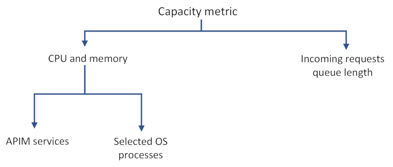
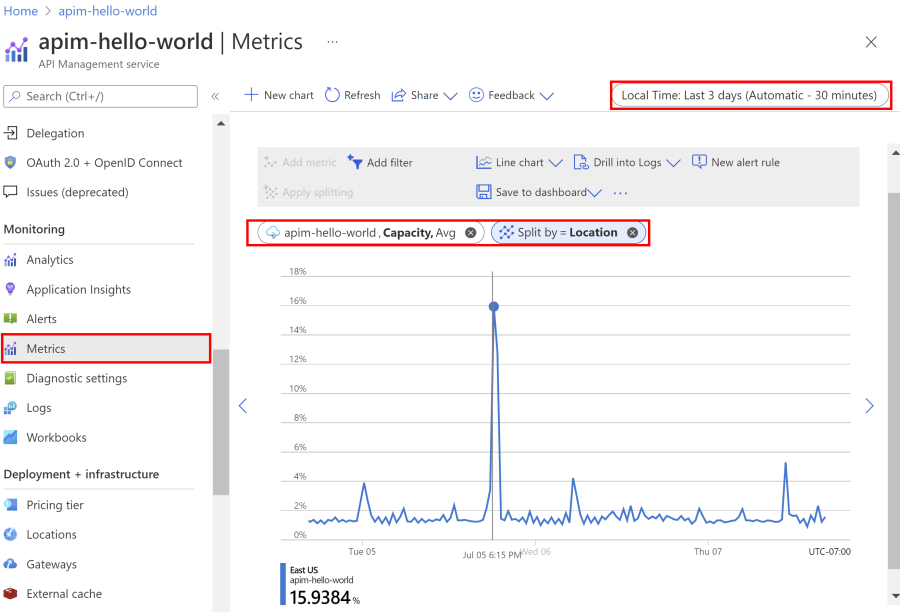

# Capacity of an Azure API Management instance

**Capacity** is the most important [Azure Monitor metric](api-management-howto-use-azure-monitor.md#view-metrics-of-your-apis) for making informed decisions whether to scale an API Management instance to accommodate more load. Its construction is complex and imposes certain behavior.

This article explains what the **capacity** is and how it behaves. It shows how to access **capacity** metrics in the Azure portal and suggests when to consider scaling or upgrading your API Management instance.

> [!IMPORTANT]
> This article discusses how you can monitor and scale your Azure API Management instance based upon its capacity metric. However, it is equally important to understand what happens when an individual API Management instance has actually *reached* its capacity. Azure API Management will not apply any service-level throttling to prevent a physical overload of the instances. When an instance reaches its physical capacity, it will behave similar to any overloaded web server that is unable to process incoming requests: latency will increase, connections will get dropped, timeout errors will occur, and so on. This means that API clients should be prepared to deal with this possibility as they do with any other external service (for example, by applying retry policies).

## Prerequisites

To follow the steps from this article, you must have:

+ An active Azure subscription.

    [!INCLUDE [quickstarts-free-trial-note](../../includes/quickstarts-free-trial-note.md)]

+ An APIM instance. For more information, see [Create an Azure API Management instance](get-started-create-service-instance.md).

[!INCLUDE [premium-dev-standard-basic.md](../../includes/api-management-availability-premium-dev-standard-basic.md)]

## What is capacity

**Capacity** is an indicator of load on an API Management instance. It reflects resources usage (CPU, memory) and network queue lengths. CPU and memory usage reveals consumption of resources by:

+ API Management data plane services, such as request processing, which can include forwarding requests or running a policy.
+ API Management management plane services, such as management actions applied via the Azure portal or Azure Resource Manager, or load coming from the [developer portal](api-management-howto-developer-portal.md).
+ Selected operating system processes, including processes that involve cost of TLS handshakes on new connections.
+ Platform updates, such as GuestOS updates on the underlying compute resources for the instanc.e

Total **capacity** is an average of its own values from every unit of an API Management instance.

Although the **capacity metric** is designed to surface problems with your API Management instance, there are cases when problems won't be reflected in changes in the **capacity metric**.

## Capacity metric behavior

Because of its construction, in real life **capacity** can be impacted by many variables, for example:

+ connection patterns (new connection on a request vs reusing the existing connection)
+ size of a request and response
+ policies configured on each API or number of clients sending requests.

The more complex operations on the requests are, the higher the **capacity** consumption will be. For example, complex transformation policies consume much more CPU than a simple request forwarding. Slow backend service responses will increase it too.

> [!IMPORTANT]
> **Capacity** is not a direct measure of the number of requests being processed.

**Capacity** can also spike intermittently or be greater than zero even if there are no requests being processed. It happens because of system- or platform-specific actions and should not be taken into consideration when deciding whether to scale an instance.

Low **capacity metric** doesn't necessarily mean that your API Management instance isn't experiencing any problems.
  
## Use the Azure Portal to examine capacity
  
  

1. Navigate to your APIM instance in the [Azure portal](https://portal.azure.com/).
2. Select **Metrics**.
3. From the purple section, select **Capacity** metric from available metrics and leave the default **Avg** aggregation.

    > [!TIP]
    > You should always look at a **capacity** metric breakdown per location to avoid wrong interpretations.

4. From the green section, select **Location** for splitting the metric by dimension.
5. Pick a desired timeframe from the top bar of the section.

    You can set a metric alert to let you know when something unexpected is happening. For example, get notifications when your APIM instance has been exceeding its expected peak capacity for over 20 minutes.

    >[!TIP]
    > You can configure alerts to let you know when your service is running low on capacity or use Azure Monitor autoscaling functionality to automatically add an Azure API Management unit. Scaling operation can take around 30 minutes, so you should plan your rules accordingly.  
    > Only scaling the master location is allowed.

## Use capacity for scaling decisions

**Capacity** is the metric for making decisions whether to scale an API Management instance to accommodate more load. Consider:

+ Looking at a long-term trend and average.
+ Ignoring sudden spikes that are most likely not related to any increase in load (see "Capacity metric behavior" section for explanation).
+ Upgrading or scaling your instance, when **capacity**'s value exceeds 60% or 70% for a longer period of time (for example 30 minutes). Different values may work better for your service or scenario.

>[!TIP]  
> If you are able to estimate your traffic beforehand, test your APIM instance on workloads you expect. You can increase the request load on your tenant gradually and monitor what value of the capacity metric corresponds to your peak load. Follow the steps from the previous section to use Azure portal to understand how much capacity is used at any given time.

## Next steps

- [How to scale or upgrade an Azure API Management service instance](upgrade-and-scale.md)
- [Optimize and save on your cloud spending](../cost-management-billing/costs/quick-acm-cost-analysis.md?WT.mc_id=costmanagementcontent_docsacmhorizontal_-inproduct-learn)