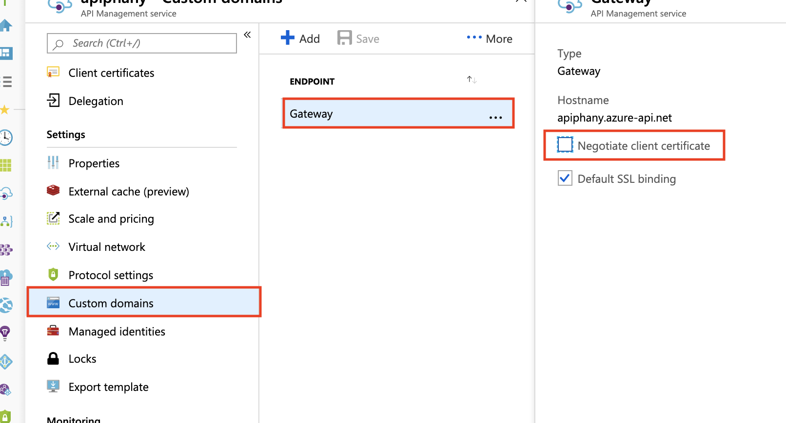
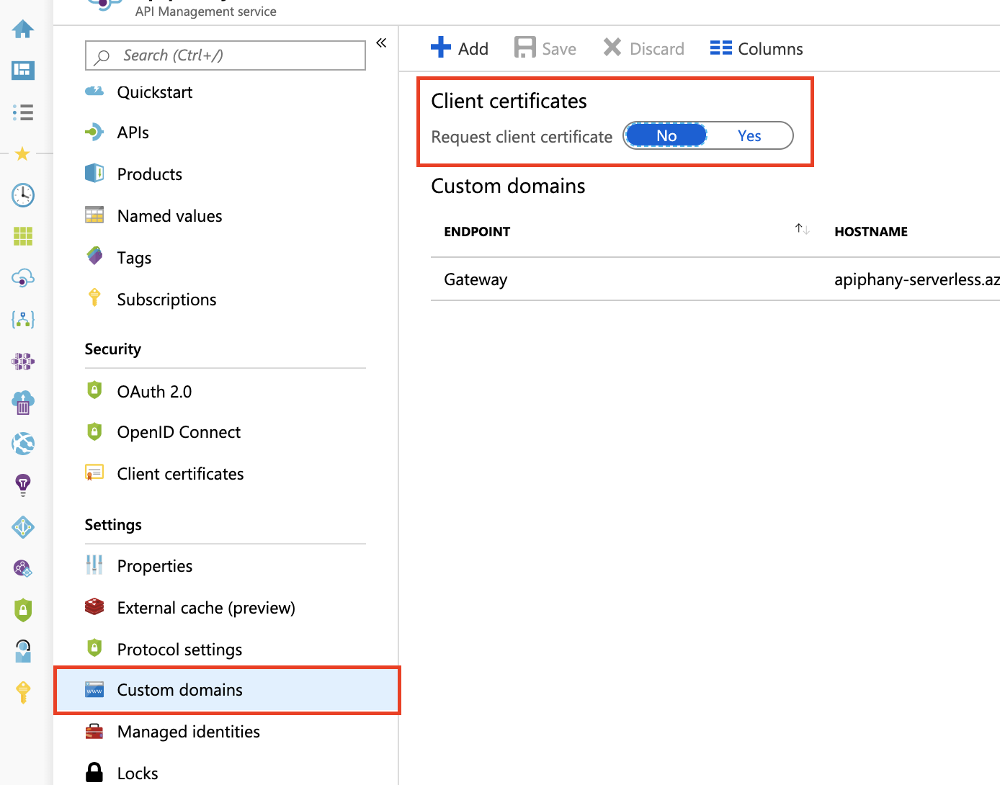

# How to secure APIs using client certificate authentication in API Management

API Management provides the capability to secure access to APIs (i.e., client to API Management) using client certificates. You can validate certificates presented by the connecting client and check certificate properties against desired values using policy expressions.

For information about securing access to the back-end service of an API using client certificates (i.e., API Management to backend), see [How to secure back-end services using client certificate authentication](./api-management-howto-mutual-certificates.md)

> [!IMPORTANT]
> To receive and verify client certificates over HTTP/2 in the Developer, Basic, Standard, or Premium tiers you must turn on the "Negotiate client certificate" setting on the "Custom domains" blade as shown below.



> [!IMPORTANT]
> To receive and verify client certificates in the Consumption tier you must turn on the "Request client certificate" setting on the "Custom domains" blade as shown below.



## Policy to validate client certificates

Use the [validate-client-certificate](api-management-access-restriction-policies.md#validate-client-certificate) policy to validate one or more attributes of a client certificate used to access APIs hosted in your API Management instance.

Configure the policy to validate one or more attributes including certificate issuer, subject, thumbprint, whether the certificate is validated against online revocation list, and others.

For more information, see [API Management access restriction policies](api-management-access-restriction-policies.md).

## Certificate validation with context variables

You can also create policy expressions with the [`context` variable](api-management-policy-expressions.md#ContextVariables) to check client certificates. Examples in the following sections show expressions using the `context.Request.Certificate` property and other `context` properties.

> [!IMPORTANT]
> Starting May 2021, the `context.Request.Certificate` property only requests the certificate when the API Management instance's [`hostnameConfiguration`](/rest/api/apimanagement/2020-12-01/api-management-service/create-or-update#hostnameconfiguration) sets the `negotiateClientCertificate` property to True. By default, `negotiateClientCertificate` is set to False.

### Checking the issuer and subject

Below policies can be configured to check the issuer and subject of a client certificate:

```xml
<choose>
    <when condition="@(context.Request.Certificate == null || !context.Request.Certificate.Verify() || context.Request.Certificate.Issuer != "trusted-issuer" || context.Request.Certificate.SubjectName.Name != "expected-subject-name")" >
        <return-response>
            <set-status code="403" reason="Invalid client certificate" />
        </return-response>
    </when>
</choose>
```

> [!NOTE]
> To disable checking certificate revocation list use `context.Request.Certificate.VerifyNoRevocation()` instead of `context.Request.Certificate.Verify()`.
> If client certificate is self-signed, root (or intermediate) CA certificate(s) must be [uploaded](api-management-howto-ca-certificates.md) to API Management for `context.Request.Certificate.Verify()` and `context.Request.Certificate.VerifyNoRevocation()` to work.

### Checking the thumbprint

Below policies can be configured to check the thumbprint of a client certificate:

```xml
<choose>
    <when condition="@(context.Request.Certificate == null || !context.Request.Certificate.Verify() || context.Request.Certificate.Thumbprint != "DESIRED-THUMBPRINT-IN-UPPER-CASE")" >
        <return-response>
            <set-status code="403" reason="Invalid client certificate" />
        </return-response>
    </when>
</choose>
```

> [!NOTE]
> To disable checking certificate revocation list use `context.Request.Certificate.VerifyNoRevocation()` instead of `context.Request.Certificate.Verify()`.
> If client certificate is self-signed, root (or intermediate) CA certificate(s) must be [uploaded](api-management-howto-ca-certificates.md) to API Management for `context.Request.Certificate.Verify()` and `context.Request.Certificate.VerifyNoRevocation()` to work.

### Checking a thumbprint against certificates uploaded to API Management

The following example shows how to check the thumbprint of a client certificate against certificates uploaded to API Management:

```xml
<choose>
    <when condition="@(context.Request.Certificate == null || !context.Request.Certificate.Verify()  || !context.Deployment.Certificates.Any(c => c.Value.Thumbprint == context.Request.Certificate.Thumbprint))" >
        <return-response>
            <set-status code="403" reason="Invalid client certificate" />
        </return-response>
    </when>
</choose>

```

> [!NOTE]
> To disable checking certificate revocation list use `context.Request.Certificate.VerifyNoRevocation()` instead of `context.Request.Certificate.Verify()`.
> If client certificate is self-signed, root (or intermediate) CA certificate(s) must be [uploaded](api-management-howto-ca-certificates.md) to API Management for `context.Request.Certificate.Verify()` and `context.Request.Certificate.VerifyNoRevocation()` to work.

> [!TIP]
> Client certificate deadlock issue described in this [article](https://techcommunity.microsoft.com/t5/Networking-Blog/HTTPS-Client-Certificate-Request-freezes-when-the-Server-is/ba-p/339672) can manifest itself in several ways, e.g. requests freeze, requests result in `403 Forbidden` status code after timing out, `context.Request.Certificate` is `null`. This problem usually affects `POST` and `PUT` requests with content length of approximately 60KB or larger.
> To prevent this issue from occurring turn on "Negotiate client certificate" setting for desired hostnames on the "Custom domains" blade as shown in the first image of this document. This feature is not available in the Consumption tier.

## Next steps

-   [How to secure back-end services using client certificate authentication](./api-management-howto-mutual-certificates.md)
-   [How to upload certificates](./api-management-howto-mutual-certificates.md)
