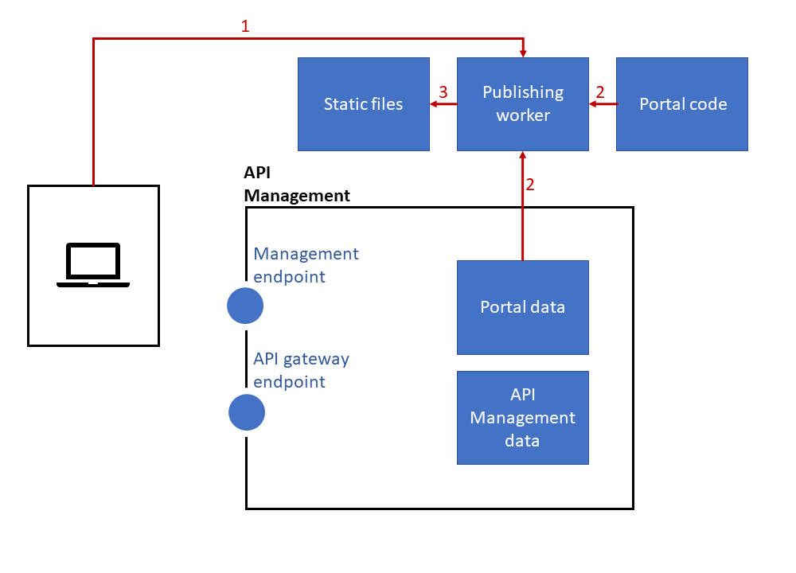

# Alternative processes for self hosted portal

## Edit content through files, not visual editor

In the [self-hosting tutorial](dev-portal-self-host-the-portal.md) we described the workflow of editing content and customizing the portal through the built-in visual editor. You can also use REST API to fetch the underlying data files, edit them directly in a text editor, and upload new versions through API calls.

## Bring your own CMS

By default, portal's content (e.g., pages) is retrieved from, saved to, and stored in an API Management service.

You can configure your portal deployment to use a different data source - for example, a headless CMS to manage your content. 

Examples on how to achieve that are coming soon.

## Build for production

If you would like to host the development environment of the portal online for collaboration purposes, use production builds of the designer and the publisher. Production builds bundle the files, exclude source maps, etc.

Create a bundle in the `./dist/designer` directory by running the command:

```sh
npm run build-designer
```

The result is a single page application, so you can still deploy it to a static web host, e.g. Azure Blob Storage Static Website.

Similarly, place a compiled and optimized publisher in the `./dist/publisher` folder:

```sh
npm run build-publisher
```

## Using Function App to publish the portal



Running the publishing step in the cloud is an alternative to executing it locally.

To implement it with an Azure Function App, you will need to first:

- [Create an Azure Function](../azure-functions/functions-create-first-azure-function.md). The Function needs to be a JavaScript language Function.
- Install Azure Functions Core Tools:
    ```sh
    npm install –g azure-function-core-tools
    ```

### Step 1: Configure output storage

You will be will be uploading the content directly to website hosting ("$web" container of output storage), instead of a local folder. You need to account for that in the `./src/config.publish.json` file:

```json
{
   ...
   "outputBlobStorageContainer": "$web",
   "outputBlobStorageConnectionString": "DefaultEndpointsProtocol=...",
   ...
}
```

### Step 2: Build and deploy the Function App

There is a sample HTTP Trigger Function in the `./examples` folder. To build it and place it in `./dist/function`, run the following command:

```sh
npm run build-function
```

Then, login to Azure and deploy it:

```sh
az login
cd ./dist/function
func azure functionapp publish <function app name>
```

Once it is deployed, you can invoke it with an HTTP call:

```sh
curl -X POST https://<function app name>.azurewebsites.net/api/publish
```

## Hosting and CDN

Although in the previous section we suggested using Azure Storage Account as a hosting for your website, you can publish the files through any solution, including services of hosting providers.

You can also front the files with a Content Delivery Network (CDN) to reduce page loading times. We recommend using [Azure CDN](https://azure.microsoft.com/services/cdn/).
