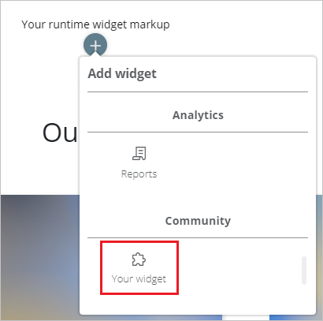

---
title: Use community widgets
titleSuffix: Azure API Management
description: Learn about community widgets and how to inject and use them in your code. 
author: erikadoyle
ms.author: apimpm
ms.date: 02/05/2021
ms.service: api-management
ms.topic: how-to
---

# Use community widgets

All developers place their community-contributed widgets in the `/community/widgets/` folder of the repository. Each has been accepted by the developer portal team. You can use the widgets by injecting them into your self-hosted version of the portal. At this time, the managed version of the portal doesn't support community widgets.

> [!NOTE]
> The developer portal team thoroughly inspects all contributed widgets and their dependencies. However, the team can’t guarantee it’s safe to load the widgets. Use your own judgment when deciding if you want to use a widget contributed by the community. Refer to our [widget contribution guidelines](dev-portal-widget-contribution-guidelines.md#guidelines) to learn about our preventive measures.

## Inject and use external widgets

1. Go to the widget's folder in the `/community/widgets` directory. Read the widget's description in the `readme.md` file.

1. Register the widget in the portal's modules:

    1. `src/apim.design.module.ts` - a module that registers design-time dependencies.
    
        ```typescript
        import { WidgetNameDesignModule } from "../community/widgets/<widget-name>/widget.design.module";
    
        ...
    
            injector.bindModule(new WidgetNameDesignModule());
        ```
    
    1. `src/apim.publish.module.ts` - a module that registers publish-time dependencies.
    
        ```typescript
        import { WidgetNamePublishModule } from "../community/widgets/<widget-name>/widget.publish.module";
    
        ...
    
            injector.bindModule(new WidgetNamePublishModule());
        ```
    
    1. `src/apim.runtime.module.ts` - a module that registers run-time dependencies.
    
        ```typescript
        import { WidgetNameRuntimeModule } from "../community/widgets/<widget-name>/widget.runtime.module";
    
        ...
    
            injector.bindModule(new WidgetNameRuntimeModule());
        ```

1. Check if the widget has an `npm_dependencies` file.

1. If so, copy the commands from the file and run them in the repository's top directory.

    Doing so will install the widget's dependencies.

1. Run `npm start`.

You can see the widget in the **Community** category in the widget selector.



## Next steps

- [Testing self-hosted portal](dev-portal-testing.md)
