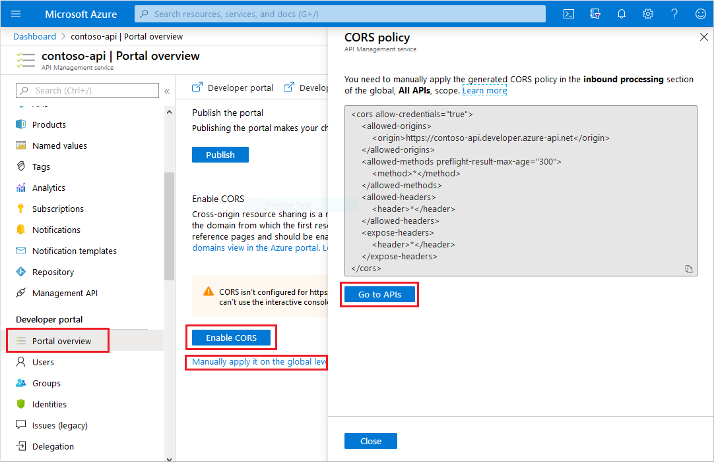

# Enable CORS for interactive console in the API Management developer portal 
Cross-origin resource sharing (CORS) is an HTTP-header based mechanism that allows a server to indicate any origins (domain, scheme, or port) other than its own from which a browser should permit loading resources. 

To let visitors to the developer portal use the interactive test console in the API reference pages, enable a [CORS policy](cors-policy.md) for APIs in your API Management instance. If the developer portal's domain name isn't an allowed origin for cross-domain API requests, test console users will see a CORS error.  

For certain scenarios, you can configure the developer portal as CORS proxy instead of enabling a CORS policy for APIs.

[!INCLUDE [premium-dev-standard-basic.md](../../includes/api-management-availability-premium-dev-standard-basic.md)]

## Prerequisites 

+ Complete the following quickstart: [Create an Azure API Management instance](get-started-create-service-instance.md)

[!INCLUDE [api-management-navigate-to-instance](../../includes/api-management-navigate-to-instance.md)]

## Enable CORS for APIs

You can enable a setting to configure a CORS policy automatically for all APIs in your API Management instance. You can also configure a CORS policy manually.

> [!NOTE]
> Only one CORS policy is executed. If you specify multiple CORS policies (for example, on the API level and on the all-APIs level), your interactive console may not work as expected.

### Enable CORS policy automatically

1. In the left menu of your API Management instance, under **Developer portal**, select **Portal overview**.
1. Under **Enable CORS**, the status of CORS policy configuration is displayed. A  warning box indicates an absent or misconfigured policy.
1. To enable CORS from the developer portal for all APIs, select **Enable CORS**.

### Enable CORS policy manually

1. Select the **Manually apply it on the global level** link to see the generated policy code.
2. Navigate to **All APIs** in the **APIs** section of your API Management instance.
3. Select the **</>** icon in the **Inbound processing** section.
4. Insert the policy in the **\<inbound\>** section of the XML file. Make sure the **\<origin\>** value matches your developer portal's domain.

> [!NOTE]
> 
> If you apply the CORS policy in the Product scope, instead of the API(s) scope, and your API uses subscription key authentication through a header, your console won't work.
>
> The browser automatically issues an `OPTIONS` HTTP request, which doesn't contain a header with the subscription key. Because of the missing subscription key, API Management can't associate the `OPTIONS` call with a Product, so it can't apply the CORS policy.
>
> As a workaround you can pass the subscription key in a query parameter.

## CORS proxy option

For some scenarios (for example, if the API Management gateway is network isolated), you can choose to configure the developer portal as a CORS proxy itself, instead of enabling a CORS policy for your APIs. The CORS proxy routes the interactive console's API calls through the portal's backend in your API Management service.

> [!NOTE]
> If the APIs are exposed through a self-hosted gateway or your service is in a virtual network, the connectivity from the API Management developer portal's backend service to the gateway is required. 

To configure the CORS proxy, access the developer portal as an administrator:

1. On the **Overview** page of your API Management instance, select **Developer portal**. The developer portal opens in a new browser tab.
1. In the left menu of the administrative interface, select **Pages** > **APIs** > **Details**.
1. On the **APIs: Details** page, select the **Operation: Details** widget, and select **Edit widget**.
1. Select **Use CORS proxy**.
1. Save changes to the portal, and [republish the portal](api-management-howto-developer-portal-customize.md#publish).

## CORS configuration for self-hosted developer portal

If you [self-host the developer portal](developer-portal-self-host.md), the following configuration is needed to enable CORS:

* Specify the portal's backend endpoint using the `backendUrl` option in the configuration files. Otherwise, the self-hosted portal isn't aware of the location of the backend service.

* Add **Origin** domain values to the self-hosted portal configuration specifying the environments where the self-hosted portal is hosted. [Learn more](developer-portal-self-host.md#configure-cors-settings-for-developer-portal-backend)

## Related content

* For more information about configuring a policy, see [Set or edit policies](set-edit-policies.md).
* For details about the CORS policy, see the [cors](cors-policy.md) policy reference.