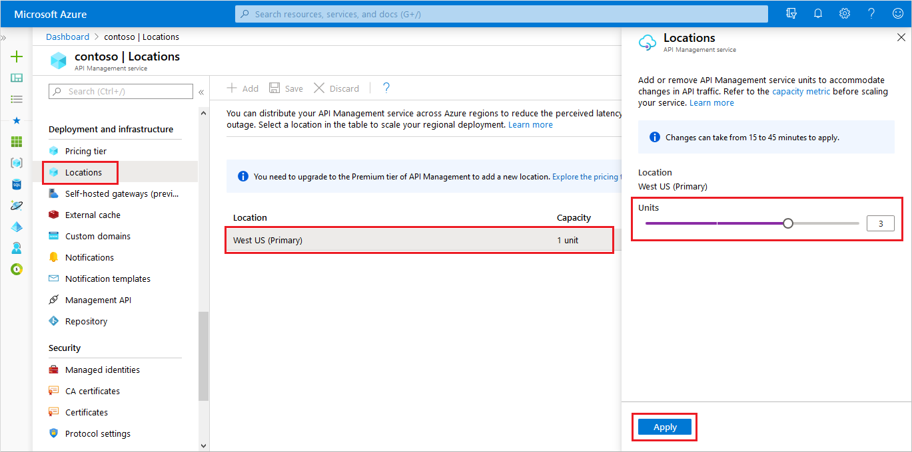

# Upgrade and scale an Azure API Management instance  

Customers can scale an Azure API Management instance in a dedicated service tier by adding and removing units. A **unit** is composed of dedicated Azure resources and has a certain load-bearing capacity expressed as a number of API calls per second. This number doesn't represent a call limit, but rather an estimated maximum throughput value to allow for rough capacity planning. Actual throughput and latency vary broadly depending on factors such as number and rate of concurrent connections, the kind and number of configured policies, request and response sizes, and backend latency.

[!INCLUDE [premium-dev-standard-basic.md](../../includes/api-management-availability-premium-dev-standard-basic.md)]

> [!NOTE]
> API Management instances in the **Consumption** tier scale automatically based on the traffic. Currently, you cannot upgrade from or downgrade to the Consumption tier.

The throughput and price of each unit depend on the [service tier](api-management-features.md) in which the unit exists. If you need to increase capacity for a service within a tier, you should add a unit. If the tier that is currently selected in your API Management instance doesn't allow adding more units, you need to upgrade to a higher-level tier.

>[!NOTE]
>See [API Management pricing](https://azure.microsoft.com/pricing/details/api-management/?ref=microsoft.com&utm_source=microsoft.com&utm_medium=docs&utm_campaign=visualstudio) for features, scale limits, and estimated throughput in each tier. To get more accurate throughput numbers, you need to look at a realistic scenario for your APIs. See [Capacity of an Azure API Management instance](api-management-capacity.md).

## Prerequisites

To follow the steps from this article, you must:

+ Have an API Management instance. For more information, see [Create an Azure API Management instance](get-started-create-service-instance.md). 

+ Understand the concept of [Capacity of an Azure API Management instance](api-management-capacity.md).

## Upgrade and scale  

You can choose between four dedicated tiers: **Developer**, **Basic**,  **Standard**, and **Premium**. 

* The **Developer** tier should be used to evaluate the service; it shouldn't be used for production. The **Developer** tier doesn't have SLA and you can't scale this tier (add/remove units). 

* **Basic**, **Standard**, and **Premium** are production tiers that have SLA and can be scaled. For pricing details and scale limits, see [API Management pricing](https://azure.microsoft.com/pricing/details/api-management/#pricing).

* The **Premium** tier enables you to distribute a single Azure API Management instance across any number of desired Azure regions. When you initially create an Azure API Management service, the instance contains only one unit and resides in a single Azure region (the **primary** region).

    Additional regions can be easily added. When adding a region, you specify the number of units you want to allocate. For example, you can have one unit in the primary region and five units in some other region. You can tailor the number of units to the traffic you have in each region. For more information, see [How to deploy an Azure API Management service instance to multiple Azure regions](api-management-howto-deploy-multi-region.md).

* You can upgrade and downgrade to and from any dedicated service tier. Downgrading can remove some features. For example, downgrading to Standard or Basic from the Premium tier can remove virtual networks or multi-region deployment.

> [!NOTE]
> The upgrade or scale process can take from 15 to 45 minutes to apply. You get notified when it is done.

## Scale your API Management instance

1. Navigate to your API Management instance in the [Azure portal](https://portal.azure.com/).
1. Select **Locations** from the menu.
1. Select the row with the location you want to scale.
1. Specify the new number of **Units** - use the slider if available, or type the number.
1. Select **Apply**.

> [!NOTE]
> In the Premium service tier, you can optionally configure availability zones and a virtual network in a selected location. For more information, see [Deploy API Management service to an additional location](api-management-howto-deploy-multi-region.md#-deploy-api-management-service-to-an-additional-region).

## Change your API Management service tier

1. Navigate to your API Management instance in the [Azure portal](https://portal.azure.com/).
1. Select **Pricing tier** in the menu.
1. Select the desired service tier from the dropdown. Use the slider to specify the number of units for your API Management service after the change.
1. Select **Save**.

## Downtime during scaling up and down
If you're scaling from or to the Developer tier, there will be downtime. Otherwise, there is no downtime. 

## Compute isolation

If your security requirements include [compute isolation](../azure-government/azure-secure-isolation-guidance.md#compute-isolation), you can use the **Isolated** pricing tier. This tier ensures the compute resources of an API Management service instance consume the entire physical host and provide the necessary level of isolation required to support, for example, US Department of Defense Impact Level 5 (IL5) workloads. To get access to the Isolated tier, [create a support request](../azure-portal/supportability/how-to-create-azure-support-request.md). 

## Next steps

- [How to deploy an Azure API Management service instance to multiple Azure regions](api-management-howto-deploy-multi-region.md)
- [How to automatically scale an Azure API Management service instance](api-management-howto-autoscale.md)
- [Plan and manage costs for API Management](plan-manage-costs.md)
- [API Management limits](../azure-resource-manager/management/azure-subscription-service-limits.md#api-management-limits)