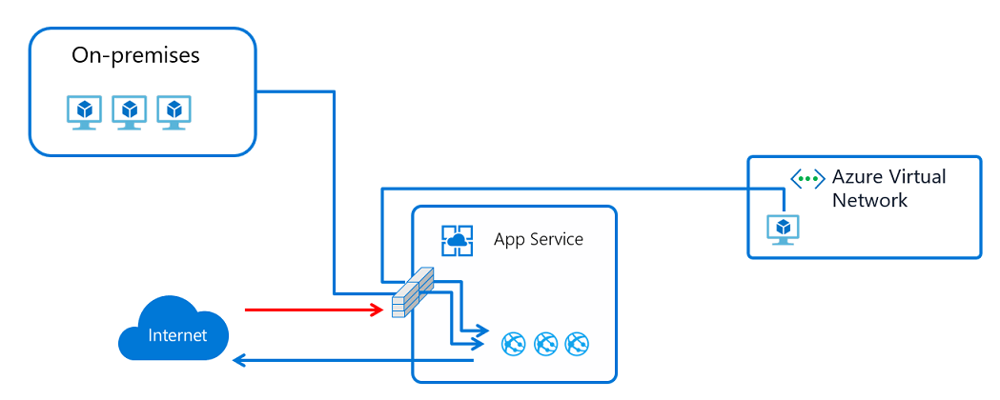
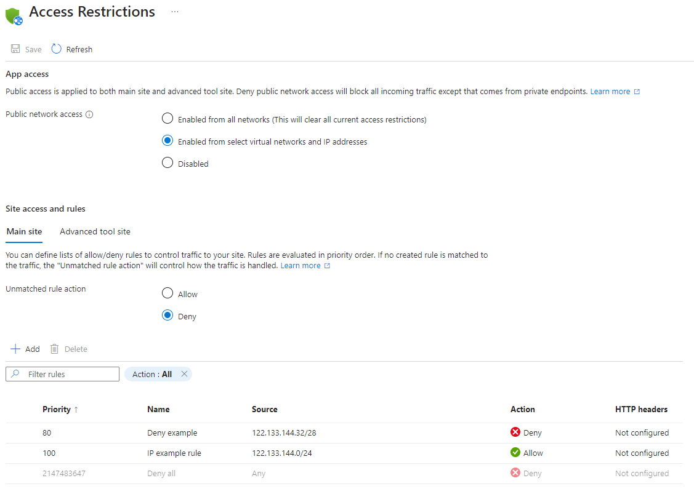
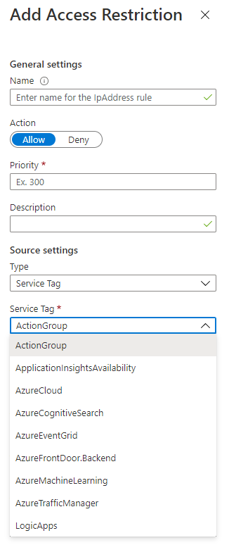
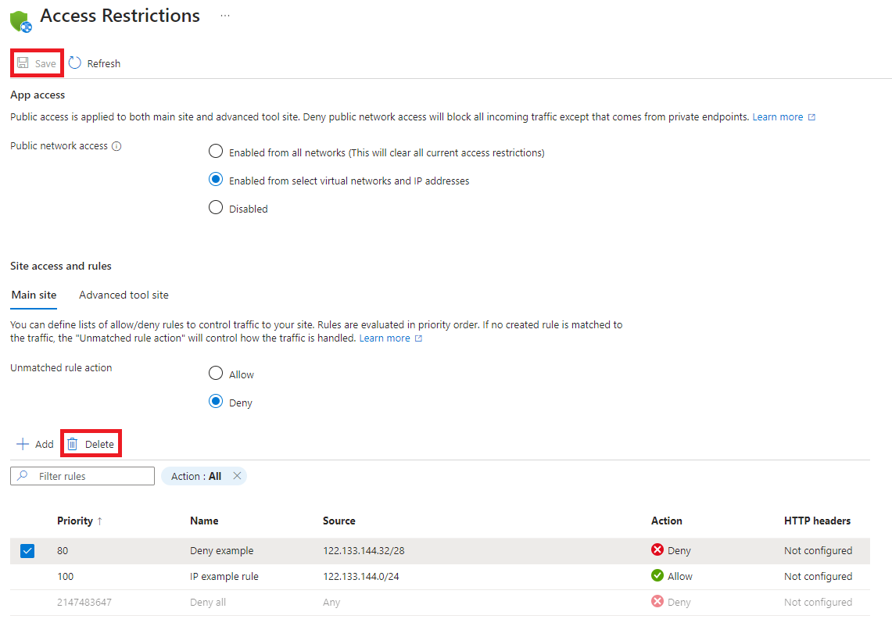

# Set up Azure App Service access restrictions

By setting up access restrictions, you can define a priority-ordered allow/deny list that controls network access to your app. The list can include IP addresses or Azure Virtual Network subnets. When there are one or more entries, an implicit *deny all* exists at the end of the list.

The access restriction capability works with all Azure App Service-hosted workloads. The workloads can include web apps, API apps, Linux apps, Linux container apps, and Functions.

When a request is made to your app, the FROM address is evaluated against the rules in your access restriction list. If the FROM address is in a subnet that's configured with service endpoints to Microsoft.Web, the source subnet is compared against the virtual network rules in your access restriction list. If the address isn't allowed access based on the rules in the list, the service replies with an [HTTP 403](https://en.wikipedia.org/wiki/HTTP_403) status code.

The access restriction capability is implemented in the App Service front-end roles, which are upstream of the worker hosts where your code runs. Therefore, access restrictions are effectively network access-control lists (ACLs).

The ability to restrict access to your web app from an Azure virtual network is enabled by [service endpoints][serviceendpoints]. With service endpoints, you can restrict access to a multi-tenant service from selected subnets. It doesn't work to restrict traffic to apps that are hosted in an App Service Environment. If you're in an App Service Environment, you can control access to your app by applying IP address rules.

> [!NOTE]
> The service endpoints must be enabled both on the networking side and for the Azure service that they're being enabled with. For a list of Azure services that support service endpoints, see [Virtual Network service endpoints](../virtual-network/virtual-network-service-endpoints-overview.md).
>



## Manage access restriction rules in the portal

To add an access restriction rule to your app, do the following:

1. Sign in to the Azure portal.

1. On the left pane, select **Networking**.

1. On the **Networking** pane, under **Access Restrictions**, select **Configure Access Restrictions**.

     

1. On the **Access Restrictions** page, review the list of access restriction rules that are defined for your app.

   

   The list displays all the current restrictions that are applied to the app. If you have a virtual network restriction on your app, the table shows whether the service endpoints are enabled for Microsoft.Web. If no restrictions are defined on your app, the app is accessible from anywhere.  

### Add an access restriction rule

To add an access restriction rule to your app, on the **Access Restrictions** pane, select **Add rule**. After you add a rule, it becomes effective immediately. 

Rules are enforced in priority order, starting from the lowest number in the **Priority** column. An implicit *deny all* is in effect after you add even a single rule.

On the **Add Access Restriction** pane, when you create a rule, do the following:

1. Under **Action**, select either **Allow** or **Deny**.  

   
   
1. Optionally, enter a name and description of the rule.
1. In the **Priority** box, enter a priority value.
1. In the **Type** drop-down list, select the type of rule.

The different types of rules are described in the following sections.

> [!NOTE]
> - There is a limit of 512 access restriction rules. If you require more than 512 access restriction rules, we suggest that you consider installing a standalone security product, such as Azure Front Door, Azure App Gateway, or an alternative WAF.
>
#### Set an IP address-based rule

Follow the procedure as outlined in the preceding section, but with the following addition:
* For step 4, in the **Type** drop-down list, select **IPv4** or **IPv6**. 

Specify the **IP Address Block** in Classless Inter-Domain Routing (CIDR) notation for both the IPv4 and IPv6 addresses. To specify an address, you can use something like *1.2.3.4/32*, where the first four octets represent your IP address and */32* is the mask. The IPv4 CIDR notation for all addresses is 0.0.0.0/0. To learn more about CIDR notation, see [Classless Inter-Domain Routing](https://en.wikipedia.org/wiki/Classless_Inter-Domain_Routing). 

#### Set a service endpoint-based rule

* For step 4, in the **Type** drop-down list, select **Virtual Network**.

Specify the **Subscription**, **Virtual Network**, and **Subnet** drop-down lists, matching what you want to restrict access to.

By using service endpoints, you can restrict access to selected Azure virtual network subnets. If service endpoints aren't already enabled with Microsoft.Web for the subnet that you selected, they'll be automatically enabled unless you select the **Ignore missing Microsoft.Web service endpoints** check box. The scenario where you might want to enable service endpoints on the app but not the subnet depends mainly on whether you have the permissions to enable them on the subnet. 

If you need someone else to enable service endpoints on the subnet, select the **Ignore missing Microsoft.Web service endpoints** check box. Your app will be configured for service endpoints in anticipation of having them enabled later on the subnet. 


You can't use service endpoints to restrict access to apps that run in an App Service Environment. When your app is in an App Service Environment, you can control access to it by applying IP access rules. 

With service endpoints, you can configure your app with application gateways or other web application firewall (WAF) devices. You can also configure multi-tier applications with secure back ends. For more information, see [Networking features and App Service](networking-features.md) and [Application Gateway integration with service endpoints](networking/app-gateway-with-service-endpoints.md).

> [!NOTE]
> - Service endpoints aren't currently supported for web apps that use IP Secure Sockets Layer (SSL) virtual IP (VIP).
>
#### Set a service tag-based rule (preview)

* For step 4, in the **Type** drop-down list, select **Service Tag (preview)**.

Each service tag represents a list of IP ranges from Azure services. A list of these services and links to the specific ranges can be found in the [service tag documentation][servicetags].

The following list of service tags is supported in access restriction rules during the preview phase:
* ActionGroup
* AzureCloud
* AzureCognitiveSearch
* AzureConnectors
* AzureEventGrid
* AzureFrontDoor.Backend
* AzureMachineLearning
* AzureSignalR
* AzureTrafficManager
* LogicApps
* ServiceFabric


### Edit a rule

1. To begin editing an existing access restriction rule, on the **Access Restrictions** page, click on the rule you want to edit.

1. On the **Edit Access Restriction** pane, make your changes, and then select **Update rule**. Edits are effective immediately, including changes in priority ordering.

   

   > [!NOTE]
   > When you edit a rule, you can't switch between rule types. 

### Delete a rule

To delete a rule, on the **Access Restrictions** page, select the ellipsis (**...**) next to the rule you want to delete, and then select **Remove**.



## Access restriction advanced scenarios
The following sections describe some advanced scenarios using access restrictions.
### Block a single IP address

When you add your first access restriction rule, the service adds an explicit *Deny all* rule with a priority of 2147483647. In practice, the explicit *Deny all* rule is the final rule to be executed, and it blocks access to any IP address that's not explicitly allowed by an *Allow* rule.

For a scenario where you want to explicitly block a single IP address or a block of IP addresses, but allow access to everything else, add an explicit *Allow All* rule.


### Restrict access to an SCM site 

In addition to being able to control access to your app, you can restrict access to the SCM site that's used by your app. The SCM site is both the web deploy endpoint and the Kudu console. You can assign access restrictions to the SCM site from the app separately or use the same set of restrictions for both the app and the SCM site. When you select the **Same restrictions as \<app name>** check box, everything is blanked out. If you clear the check box, your SCM site settings are reapplied. 


### Restrict access to a specific Azure Front Door instance (preview)
Traffic from Azure Front Door to your application originates a from well known set of IP ranges defined in the AzureFrontDoor.Backend service tag. Using a service tag restriction rule, you can restrict traffic to only originate from Azure Front Door. To ensure traffic only originates from your specific instance, you will need to further filter the incoming requests based on the unique http header that Azure Front Door sends. During preview you can achieve this with PowerShell or REST/ARM. 

* PowerShell example (Front Door id can be found in the Azure portal):

   ```azurepowershell-interactive
    $frontdoorId = "xxxxxxx-xxxx-xxxx-xxxx-xxxxxxxxxxxx"
    Add-AzWebAppAccessRestrictionRule -ResourceGroupName "ResourceGroup" -WebAppName "AppName" `
      -Name "Front Door example rule" -Priority 100 -Action Allow -ServiceTag AzureFrontDoor.Backend `
      -HttpHeader @{'x-azure-fdid' = $frontdoorId}
    ```
## Manage access restriction rules programmatically

You can add access restrictions programmatically by doing either of the following: 

* Use [the Azure CLI](/cli/azure/webapp/config/access-restriction?view=azure-cli-latest&preserve-view=true). For example:
   
  ```azurecli-interactive
  az webapp config access-restriction add --resource-group ResourceGroup --name AppName \
    --rule-name 'IP example rule' --action Allow --ip-address 122.133.144.0/24 --priority 100
  ```

* Use [Azure PowerShell](/powershell/module/Az.Websites/Add-AzWebAppAccessRestrictionRule?view=azps-5.2.0&preserve-view=true). For example:


  ```azurepowershell-interactive
  Add-AzWebAppAccessRestrictionRule -ResourceGroupName "ResourceGroup" -WebAppName "AppName"
      -Name "Ip example rule" -Priority 100 -Action Allow -IpAddress 122.133.144.0/24
  ```
   > [!NOTE]
   > Working with service tags, http headers or multi-source rules requires at least version 5.1.0. You can verify the version of the installed module with: **Get-InstalledModule -Name Az**

You can also set values manually by doing either of the following:

* Use an [Azure REST API](/rest/api/azure/) PUT operation on the app configuration in Azure Resource Manager. The location for this information in Azure Resource Manager is:

  management.azure.com/subscriptions/**subscription ID**/resourceGroups/**resource groups**/providers/Microsoft.Web/sites/**web app name**/config/web?api-version=2020-06-01

* Use an ARM template. As an example, you can use resources.azure.com and edit the ipSecurityRestrictions block to add the required JSON.

  The JSON syntax for the earlier example is:

  ```json
  {
    "properties": {
      "ipSecurityRestrictions": [
        {
          "ipAddress": "122.133.144.0/24",
          "action": "Allow",
          "priority": 100,
          "name": "IP example rule"
        }
      ]
    }
  }
  ```
  The JSON syntax for an advanced example using service tag and http header restriction is:
  ```json
  {
    "properties": {
      "ipSecurityRestrictions": [
        {
          "ipAddress": "AzureFrontDoor.Backend",
          "tag": "ServiceTag",
          "action": "Allow",
          "priority": 100,
          "name": "Azure Front Door example",
          "headers": {
            "x-azure-fdid": [
              "xxxxxxxx-xxxx-xxxx-xxxx-xxxxxxxxxxxx"
            ]
          }
        }
      ]
    }
  }
  ```
## Set up Azure Functions access restrictions

Access restrictions are also available for function apps with the same functionality as App Service plans. When you enable access restrictions, you also disable the Azure portal code editor for any disallowed IPs.

## Next steps
[Access restrictions for Azure Functions](../azure-functions/functions-networking-options.md#inbound-access-restrictions)  
[Application Gateway integration with service endpoints](networking/app-gateway-with-service-endpoints.md)

<!--Links-->
[serviceendpoints]: ../virtual-network/virtual-network-service-endpoints-overview.md
[servicetags]: ../virtual-network/service-tags-overview.md