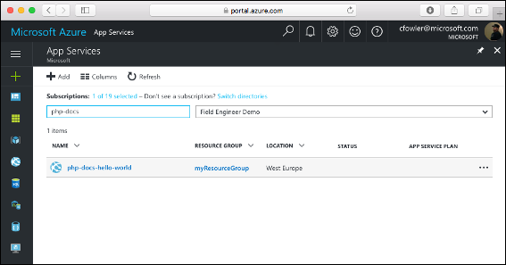
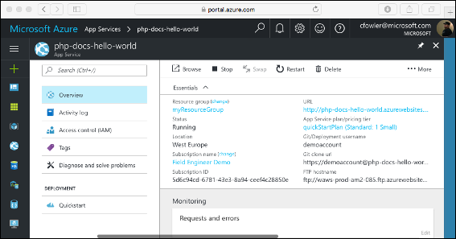

[Azure App Service](../../overview.md) provides a highly scalable, self-patching web hosting service.  This quickstart tutorial shows how to deploy a PHP app to Azure App Service on Linux using the Azure portal.

This quickstart configures an App Service app in the **Free** tier and incurs no cost for your Azure subscription.

This quickstart shows you how to make these changes within your browser, without having to install the development environment tools on your machine.


You can follow the steps here using a Mac, Windows, or Linux machine. Once the prerequisites are installed, it takes about five minutes to complete the steps.

[!INCLUDE [quickstarts-free-trial-note](../../../../includes/quickstarts-free-trial-note.md)]

## Prerequisites

- Have an Azure account with an active subscription. [Create an account for free](https://azure.microsoft.com/free/?utm_source=campaign&utm_campaign=vscode-tutorial-app-service-extension&mktingSource=vscode-tutorial-app-service-extension).
- Have a GitHub account to fork a repository.

## Fork the sample repository

1. In your browser, navigate to the repository containing [the sample code](https://github.com/Azure-Samples/php-docs-hello-world).

1. In the upper right corner, select **Fork**.

    <!-- TODO: screenshot here -->

1. On the **Create a new fork** screen, accept the defaults. Select **Create fork**.

    >[!NOTE]
    > This should take you to the new fork. Your fork URL will look something like this: https://github.com/YOUR_GITHUB_ACCOUNT_NAME/php-docs-hello-world

### Update the fork's default branch

1. From the fork repository, select **Settings**.

1. Under **Code and automation**, select **Branches**.

1. Under **Default branch**, to the right of `master`, select the Rename branch button.

1. In the **Rename this branch** pop-up, enter `main`.

1. Select **Rename branch**.

> [!TIP]
> The branch name change isn't required by App Service. However, since many repositories are changing their default branch to `main`, this quickstart also shows you how to deploy a repository from `main`.

## Deploy to Azure

### Sign in to Azure portal

Sign in to the Azure portal at https://portal.azure.com.


### Create Azure resources

1. Type **app services** in the search. Under **Services**, select **App Services**.

<!-- TODO: screenshot here -->

1. In the **App Services** page, select **Create**.

1. In the **Basics** tab, under **Project details**, ensure the correct subscription is selected and then select to **Create new** resource group. Type *myResourceGroup* for the name.

<!-- TODO: screenshot here -->

1. Under **Instance details**, type a globally unique name for your web app and select **Code**. Select *PHP 8.0* **Runtime stack**, *Linux* **Operating System**, and a **Region** you want to serve your app from.

<!-- TODO: screenshot here -->

1. Under **App Service Plan**, select **Create new** App Service Plan. Type *myAppServicePlan* for the name. To change to the Free tier, select **Change size**, select **Dev/Test** tab, select **F1**, and select the **Apply** button at the bottom of the page.

<!-- TODO: screenshot here -->
    
1. Select the **Review + create** button at the bottom of the page.

<!-- TODO: screenshot here -->

1. After validation runs, select the **Create** button at the bottom of the page.

1. After deployment is complete, select **Go to resource**.

<!-- TODO: screenshot here -->

### Set up continuous deployment

This step will set up continuous deployment using GitHub actions.

1. In the Azure portal, navigate to the app service.
   
1. Select **Deployment Center**.

1. Under **Settings**, select a **Source**. For this quickstart, select `GitHub`.

1. In the section under **GitHub**, select the following settings:
    - Organization: Select the respective organization.
    - Repository: Select `php-docs-hello-world`.
    - Branch: Select `main`.

1. Select **Save**.

> [!TIP]
> This quickstart uses GitHub. Additional continuous deployment sources include Bitbucket, Local Git, Azure Repos, and External Git. FTPS is also a supported deployment method.

   
### Browse to the app

Browse to the deployed application using your web browser.

```
http://<app-name>.azurewebsites.net
```

The PHP sample code is running in an Azure App Service Linux web app.


**Congratulations!** You've deployed your first PHP app to App Service using the Azure portal.

## Update in GitHub and redeploy the code

1. Browse to your GitHub fork of php-docs-hello-world.

1. On your repo page, press `.` to start Visual Studio code within your browser.

    > [!NOTE]
    > The URL will change from GitHub.com to GitHub.dev. This feature only works with repos that have files. This does not work on empty repos.

1. Edit index.php so that it shows "Hello Azure!" instead of "Hello World!"

    ```php
    <?php
        echo "Hello World!";
    ?>
    ```

1. From the Source Control menu, select the Stage Changes button to stage the change.

1. Enter a commit message such as `"Hello Azure"`. Then, select Commit and Push.

1. Once deployment has completed, return to the browser window that opened during the **Browse to the app** step, and refresh the page.

    

## Manage your new Azure app

1. Go to the <a href="https://portal.azure.com" target="_blank">Azure portal</a> to manage the web app you created. Search for and select **App Services**.

    

2. Select the name of your Azure app.

    

    Your web app's **Overview** page will be displayed. Here, you can perform basic management tasks like **Browse**, **Stop**, **Restart**, and **Delete**.

    

    The web app menu provides different options for configuring your app.

[!INCLUDE [cli-samples-clean-up](../../../../includes/cli-samples-clean-up.md)]

## Next steps

> [!div class="nextstepaction"]
> [PHP with MySQL](../../tutorial-php-mysql-app.md)

> [!div class="nextstepaction"]
> [Configure PHP app](../../configure-language-php.md)
