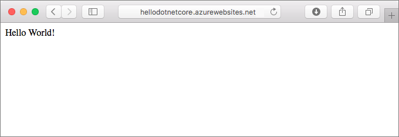

::: zone pivot="platform-linux"


## Create the app locally

::: zone pivot="development-environment-vs"

::: zone-end

::: zone pivot="development-environment-vscode"

::: zone-end

::: zone pivot="development-environment-cli"

::: zone-end


## Run the app locally

::: zone pivot="development-environment-vs"

::: zone-end

::: zone pivot="development-environment-vscode"

::: zone-end

::: zone pivot="development-environment-cli"

::: zone-end

Run the application locally so that you see how it should look when you deploy it to Azure.

```bash
dotnet run
```

Open a web browser, and navigate to the app at `http://localhost:5000`.

You see the **Hello World** message from the sample app displayed in the page.


[Having issues? Let us know.](https://aka.ms/DotNetAppServiceLinuxQuickStart)

## Sign into Azure

::: zone pivot="development-environment-vs"

::: zone-end

::: zone pivot="development-environment-vscode"

::: zone-end

::: zone pivot="development-environment-cli"

::: zone-end

In your terminal window, log into Azure with the following command:

```azurecli
az login
```

## Deploy the app

::: zone pivot="development-environment-vs"

::: zone-end

::: zone pivot="development-environment-vscode"

::: zone-end

::: zone pivot="development-environment-cli"

::: zone-end

Deploy the code in your local folder (*hellodotnetcore*) using the `az webapp up` command:

```azurecli
az webapp up --sku F1 --name <app-name>
```

- If the `az` command isn't recognized, be sure you have the Azure CLI installed as described in [Set up your initial environment](#set-up-your-initial-environment).
- Replace `<app-name>` with a name that's unique across all of Azure (*valid characters are `a-z`, `0-9`, and `-`*). A good pattern is to use a combination of your company name and an app identifier.
- The `--sku F1` argument creates the web app on the Free pricing tier. Omit this argument to use a faster premium tier, which incurs an hourly cost.
- You can optionally include the argument `--location <location-name>` where `<location-name>` is an available Azure region. You can retrieve a list of allowable regions for your Azure account by running the [`az account list-locations`](/cli/azure/appservice#az-appservice-list-locations) command.

The command may take a few minutes to complete. While running, it provides messages about creating the resource group, the App Service plan and hosting app, configuring logging, then performing ZIP deployment. It then gives the message, "You can launch the app at http://&lt;app-name&gt;.azurewebsites.net", which is the app's URL on Azure.

# [.NET Core 3.1](#tab/netcore31)


# [.NET 5.0](#tab/net50)

<!-- Deploy the code in your local folder (*hellodotnetcore*) using the `az webapp up` command:

```azurecli
az webapp up --sku B1 --name <app-name> --os-type linux
```

- If the `az` command isn't recognized, be sure you have the Azure CLI installed as described in [Set up your initial environment](#set-up-your-initial-environment).
- Replace `<app-name>` with a name that's unique across all of Azure (*valid characters are `a-z`, `0-9`, and `-`*). A good pattern is to use a combination of your company name and an app identifier.
- The `--sku B1` argument creates the web app in the Basic pricing tier, which incurs an hourly cost. Omit this argument to use a faster premium tier, which costs more.
- You can optionally include the argument `--location <location-name>` where `<location-name>` is an available Azure region. You can retrieve a list of allowable regions for your Azure account by running the [`az account list-locations`](/cli/azure/appservice#az-appservice-list-locations) command.

The command may take a few minutes to complete. While running, it provides messages about creating the resource group, the App Service plan and hosting app, configuring logging, then performing ZIP deployment. It then gives the message, "You can launch the app at http://&lt;app-name&gt;.azurewebsites.net", which is the app's URL on Azure. -->


---

[Having issues? Let us know.](https://aka.ms/DotNetAppServiceLinuxQuickStart)

[!include [az webapp up command note](../../includes/app-service-web-az-webapp-up-note.md)]

## Browse to the app

::: zone pivot="development-environment-vs"

::: zone-end

::: zone pivot="development-environment-vscode"

::: zone-end

::: zone pivot="development-environment-cli"

::: zone-end

Browse to the deployed application using your web browser.

```bash
http://<app_name>.azurewebsites.net
```

The .NET Core sample code is running in App Service on Linux with a built-in image.



**Congratulations!** You've deployed your first .NET Core app to App Service on Linux.

[Having issues? Let us know.](https://aka.ms/DotNetAppServiceLinuxQuickStart)

## Update and redeploy the code

::: zone pivot="development-environment-vs"

::: zone-end

::: zone pivot="development-environment-vscode"

::: zone-end

::: zone pivot="development-environment-cli"

::: zone-end

In the local directory, open the _Startup.cs_ file. Make a small change to the text in the method call `context.Response.WriteAsync`:

```csharp
await context.Response.WriteAsync("Hello Azure!");
```

Save your changes, then redeploy the app using the `az webapp up` command again:

```azurecli
az webapp up --os-type linux
```

This command uses values that are cached locally in the *.azure/config* file, including the app name, resource group, and App Service plan.

Once deployment has completed, switch back to the browser window that opened in the **Browse to the app** step, and hit refresh.


[Having issues? Let us know.](https://aka.ms/DotNetAppServiceLinuxQuickStart)

## Manage your new Azure app

::: zone pivot="development-environment-vs"

::: zone-end

::: zone pivot="development-environment-vscode"

::: zone-end

::: zone pivot="development-environment-cli"

::: zone-end

Go to the <a href="https://portal.azure.com" target="_blank">Azure portal</a> to manage the app you created.

From the left menu, click **App Services**, and then click the name of your Azure app.

:::image type="content" source="./media/quickstart-dotnetcore/portal-app-service-list-up.png" alt-text="Screenshot of the App Services page showing an example Azure app selected.":::

You see your app's **Overview** page. Here, you can perform basic management tasks like browse, stop, start, restart, and delete.


The left menu provides different pages for configuring your app.

[!INCLUDE [cli-samples-clean-up](../../includes/cli-samples-clean-up.md)]

[Having issues? Let us know.](https://aka.ms/DotNetAppServiceLinuxQuickStart)

## Next steps

::: zone pivot="development-environment-vs"

::: zone-end

::: zone pivot="development-environment-vscode"

::: zone-end

::: zone pivot="development-environment-cli"

::: zone-end

> [!div class="nextstepaction"]
> [Tutorial: ASP.NET Core app with SQL Database](tutorial-dotnetcore-sqldb-app.md)

> [!div class="nextstepaction"]
> [Configure ASP.NET Core app](configure-language-dotnetcore.md)

::: zone-end