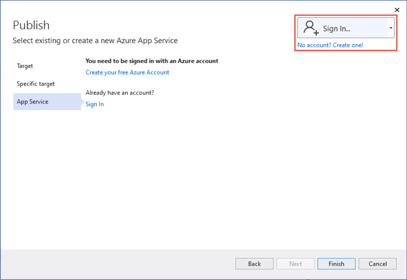
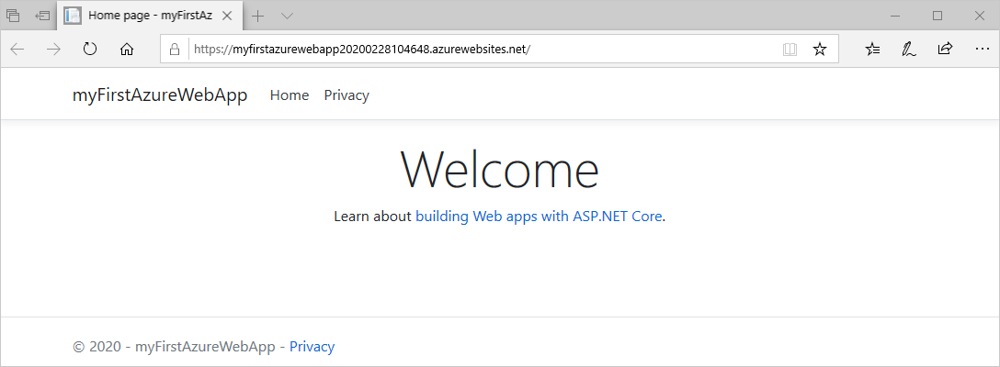
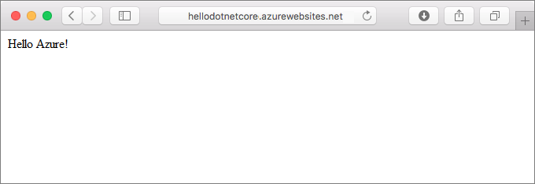
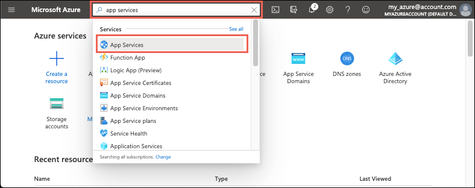

<!--

As a .NET developer, when choosing an IDE and .NET TFM - you map to various OS requirements.
For example, if you choose Visual Studio - you're developing the app on Windows, but you can still
target cross-platform with .NET Core 3.1 or .NET 5.0.

| .NET / IDE         | Visual Studio | Visual Studio for Mac | Visual Studio Code | Command line   |
|--------------------|---------------|-----------------------|--------------------|----------------|
| .NET Core 3.1      | Windows       | macOS                 | Cross-platform     | Cross-platform |
| .NET 5.0           | Windows       | macOS                 | Cross-platform     | Cross-platform |
| .NET Framework 4.8 | Windows       | N/A                   | Windows            | Windows        |

-->

# Quickstart: Create an ASP.NET web app in Azure

In this quickstart, you'll learn how to create and deploy your first ASP.NET web app to [Azure App Service](overview.md). App Service supports various versions of .NET apps, and provides a highly scalable, self-patching web hosting service. When you're finished, you'll have an Azure resource group consisting of an App Service hosting plan and an App Service with a deployed web application.

## Prerequisites

::: zone pivot="development-environment-vs"

- An Azure account with an active subscription. [Create an account for free](https://azure.microsoft.com/free/dotnet).
- <a href="https://www.visualstudio.com/downloads" target="_blank">Visual Studio 2019</a> with the **ASP.NET and web development** workload.

  If you've already installed Visual Studio 2019:

  - Install the latest updates in Visual Studio by selecting **Help** > **Check for Updates**.
  - Add the workload by selecting **Tools** > **Get Tools and Features**.

::: zone-end

::: zone pivot="development-environment-vscode"

- An Azure account with an active subscription. [Create an account for free](https://azure.microsoft.com/free/dotnet).
- <a href="https://www.visualstudio.com/downloads" target="_blank">Visual Studio Code</a>.
- The <a href="https://marketplace.visualstudio.com/items?itemName=ms-vscode.vscode-node-azure-pack" target="_blank">Azure Tools</a> extension.

### [.NET Core 3.1](#tab/netcore31)

<a href="https://dotnet.microsoft.com/download/dotnet-core/3.1" target="_blank">
    Install the latest .NET Core 3.1 SDK
</a>.

### [.NET 5.0](#tab/net50)

<a href="https://dotnet.microsoft.com/download/dotnet/5.0" target="_blank">
    Install the latest .NET 5.0 SDK
</a>.

### [.NET Framework 4.8](#tab/netframework48)

<a href="https://dotnet.microsoft.com/download/dotnet-framework/net48" target="_blank">
    Install the .NET Framework 4.8 Developer Pack
</a>.

> [!TIP]
> If you're using Visual Studio, the .NET Framework 4.8 Developer Pack is only needed when not installed through Visual Studio. To ensure that the *.NET Framework 4.8 SDK* is installed, verify it is checked in **Tools** > **Get Tools and Features** > **Individual components**.

---

::: zone-end

::: zone pivot="development-environment-cli"

- An Azure account with an active subscription. [Create an account for free](https://azure.microsoft.com/free/dotnet).
- The <a href="/cli/azure/install-azure-cli" target="_blank">Azure CLI</a>.

### [.NET Core 3.1](#tab/netcore31)

<a href="https://dotnet.microsoft.com/download/dotnet-core/3.1" target="_blank">
    Install the latest .NET Core 3.1 SDK
</a>.

### [.NET 5.0](#tab/net50)

<a href="https://dotnet.microsoft.com/download/dotnet/5.0" target="_blank">
    Install the latest .NET 5.0 SDK
</a>.

### [.NET Framework 4.8](#tab/netframework48)

<a href="https://dotnet.microsoft.com/download/dotnet-framework/net48" target="_blank">
    Install the .NET Framework 4.8 Developer Pack
</a>.

---

::: zone-end

[Having issues? Let us know.](https://aka.ms/DotNetAppServiceLinuxQuickStart)

## Create an ASP.NET web app

::: zone pivot="development-environment-vs"

### [.NET Core 3.1](#tab/netcore31)

1. Open Visual Studio and then select **Create a new project**.
1. In **Create a new project**, find and choose **ASP.NET Web Core App**, then select **Next**.
1. In **Configure your new project**, name the application _MyFirstAzureWebApp_, and then select **Next**.

   :::image type="content" source="media/quickstart-dotnet/configure-webapp-net.png" alt-text="Configure ASP.NET Core 3.1 web app" border="true":::

1. You can deploy any type of ASP.NET web app to Azure. Select **.NET Core 3.1 (Long-term support)**.
1. Make sure **Authentication Type** is set to **Nne**. Select **Create**.

   :::image type="content" source="media/quickstart-dotnet/vs-additional-info-netcoreapp3.1.png" alt-text="Visual Studio - .NET Core 3.1" border="true":::

1. From the Visual Studio menu, select **Debug** > **Start Without Debugging** to run the web app locally.

   :::image type="content" source="media/quickstart-dotnet/local-webapp-net.png" alt-text="Visual Studio - .NET Core 3.1 browse locally" lightbox="media/quickstart-dotnet/local-webapp-net.png" border="true":::

### [.NET 5.0](#tab/net50)

1. Open Visual Studio and then select **Create a new project**.
1. In **Create a new project**, find and choose **ASP.NET Web Core App**, then select **Next**.
1. In **Configure your new project**, name the application _MyFirstAzureWebApp_, and then select **Next**.

   :::image type="content" source="media/quickstart-dotnet/configure-webapp-net.png" alt-text="Configure ASP.NET 5.0 web app" border="true":::

1. You can deploy any type of ASP.NET web app to Azure. Select **.NET Core 5.0 (Current)**.
1. Make sure **Authentication Type** is set to **Nne**. Select **Create**.

   :::image type="content" source="media/quickstart-dotnet/vs-additional-info-net5.0.png" alt-text="Visual Studio - .NET Core 5.0" border="true":::

1. From the Visual Studio menu, select **Debug** > **Start Without Debugging** to run the web app locally.

   :::image type="content" source="media/quickstart-dotnet/local-webapp-net.png" alt-text="Visual Studio - .NET 5.0 browse locally" lightbox="media/quickstart-dotnet/local-webapp-net.png" border="true":::

### [.NET Framework 4.8](#tab/netframework48)

1. Open Visual Studio and then select **Create a new project**.
1. In **Create a new project**, find and choose **ASP.NET Web Application (.NET Framework)**, then select **Next**.
1. In **Configure your new project**, name the application _MyFirstAzureWebApp_, and then select **Create**.

   :::image type="content" source="media/quickstart-dotnet/configure-webapp-netframework48.png" alt-text="Configure ASP.NET Framework 4.8 web app" border="true":::

1. You can deploy any type of ASP.NET web app to Azure. For this quickstart, choose the **MVC** template.
1. Make sure authentication is set to **No Authentication**. Select **Create**.

   :::image type="content" source="media/quickstart-dotnet/vs-mvc-no-auth-netframework48.png" alt-text="Select MVC" border="true":::

1. From the Visual Studio menu, select **Debug** > **Start Without Debugging** to run the web app locally.

   :::image type="content" source="media/quickstart-dotnet/vs-local-webapp-netframework48.png" alt-text="Visual Studio - .NET Framework 4.8 browse locally" lightbox="media/quickstart-dotnet/vs-local-webapp-netframework48.png" border="true":::

---

::: zone-end

::: zone pivot="development-environment-vscode"

Create a new folder named _MyFirstAzureWebApp_, and open it in Visual Studio Code. Open the <a href="https://code.visualstudio.com/docs/editor/integrated-terminal" target="_blank">Terminal</a> window, and create a new .NET web app using the [`dotnet new webapp`](/dotnet/core/tools/dotnet-new#web-options) command.

### [.NET Core 3.1](#tab/netcore31)

```dotnetcli
dotnet new webapp -f netcoreapp3.1
```

### [.NET 5.0](#tab/net50)

```dotnetcli
dotnet new webapp -f net5.0
```

### [.NET Framework 4.8](#tab/netframework48)

```dotnetcli
dotnet new webapp --target-framework-override net48
```

> [!IMPORTANT]
> The `--target-framework-override` flag is a free-form text replacement of the target framework moniker (TFM) for the project, and makes *no guarantees* that the supporting template exists or compiles. You can only build and run .NET Framework apps on Windows.

---

From the **Terminal** in Visual Studio Code, run the application locally using the [`dotnet run`](/dotnet/core/tools/dotnet-run) command.

```dotnetcli
dotnet run
```

Open a web browser, and navigate to the app at `https://localhost:5001`.


### [.NET Core 3.1](#tab/netcore31)

You'll see the template ASP.NET Core 3.1 web app displayed in the page.

:::image type="content" source="media/quickstart-dotnet/local-webapp-net.png" alt-text="VS Code - run .NET Core 3.1 in browser locally" lightbox="media/quickstart-dotnet/local-webapp-net.png" border="true":::

### [.NET 5.0](#tab/net50)

You'll see the template ASP.NET Core 5.0 web app displayed in the page.

:::image type="content" source="media/quickstart-dotnet/local-webapp-net.png" alt-text="VS Code - run .NET 5.0 in browser locally" lightbox="media/quickstart-dotnet/local-webapp-net.png" border="true":::

### [.NET Framework 4.8](#tab/netframework48)

You'll see the template ASP.NET Framework 4.8 web app displayed in the page.

:::image type="content" source="media/quickstart-dotnet/local-webapp-net48.png" alt-text="VS Code - run .NET 4.8 in browser locally" lightbox="media/quickstart-dotnet/local-webapp-net48.png" border="true":::

---

::: zone-end

::: zone pivot="development-environment-cli"

Open a terminal window on your machine to a working directory. Create a new .NET web app using the [`dotnet new webapp`](/dotnet/core/tools/dotnet-new#web-options) command, and then change directories into the newly created app.

### [.NET Core 3.1](#tab/netcore31)

```dotnetcli
dotnet new webapp -n MyFirstAzureWebApp -f netcoreapp3.1 && cd MyFirstAzureWebApp
```

### [.NET 5.0](#tab/net50)

```dotnetcli
dotnet new webapp -n MyFirstAzureWebApp -f net5.0 && cd MyFirstAzureWebApp
```

### [.NET Framework 4.8](#tab/netframework48)

```dotnetcli
dotnet new webapp -n MyFirstAzureWebApp --target-framework-override net48 && cd MyFirstAzureWebApp
```

> [!IMPORTANT]
> The `--target-framework-override` flag is a free-form text replacement of the target framework moniker (TFM) for the project, and makes *no guarantees* that the supporting template exists or compiles. You can only build .NET Framework apps on Windows.

---

From the same terminal session, run the application locally using the [`dotnet run`](/dotnet/core/tools/dotnet-run) command.

```dotnetcli
dotnet run
```

Open a web browser, and navigate to the app at `https://localhost:5001`.


### [.NET Core 3.1](#tab/netcore31)

You'll see the template ASP.NET Core 3.1 web app displayed in the page.

:::image type="content" source="media/quickstart-dotnet/local-webapp-net.png" alt-text="VS Code - run .NET Core 3.1 in browser locally" lightbox="media/quickstart-dotnet/local-webapp-net.png" border="true":::

### [.NET 5.0](#tab/net50)

You'll see the template ASP.NET Core 5.0 web app displayed in the page.

:::image type="content" source="media/quickstart-dotnet/local-webapp-net.png" alt-text="VS Code - run .NET 5.0 in browser locally" lightbox="media/quickstart-dotnet/local-webapp-net.png" border="true":::

### [.NET Framework 4.8](#tab/netframework48)

You'll see the template ASP.NET Framework 4.8 web app displayed in the page.

:::image type="content" source="media/quickstart-dotnet/local-webapp-net48.png" alt-text="VS Code - run .NET 4.8 in browser locally" lightbox="media/quickstart-dotnet/local-webapp-net48.png" border="true":::

---

[Having issues? Let us know.](https://aka.ms/DotNetAppServiceLinuxQuickStart)

::: zone-end

## Publish your web app

To publish your web app, you must first create and configure a new App Service that you can publish your app to.

As part of setting up the App Service, you'll create:

- A new [resource group](../azure-resource-manager/management/overview.md#terminology) to contain all of the Azure resources for the service.
- A new [Hosting Plan](overview-hosting-plans.md) that specifies the location, size, and features of the web server farm that hosts your app.

Follow these steps to create your App Service and publish your web app:

::: zone pivot="development-environment-vs"

1. In **Solution Explorer**, right-click the **MyFirstAzureWebApp** project and select **Publish**.
1. In **Publish**, select **Azure** and then **Next**.

   :::image type="content" source="media/quickstart-dotnet/vs-publish-target-azure.png" alt-text="Publish - target Azure" border="true":::

1. Your options depend on whether you're signed in to Azure already and whether you have a Visual Studio account linked to an Azure account. Select either **Add an account** or **Sign in** to sign in to your Azure subscription. If you're already signed in, select the account you want.

   

1. To the right of **App Service instances**, select **+**.

   

1. For **Subscription**, accept the subscription that is listed or select a new one from the drop-down list.
1. For **Resource group**, select **New**. In **New resource group name**, enter *myResourceGroup* and select **OK**.
1. For **Hosting Plan**, select **New**.
1. In the **Hosting Plan: Create new** dialog, enter the values specified in the following table:

   | Setting          | Suggested value          | Description                                                           |
   |------------------|--------------------------|-----------------------------------------------------------------------|
   | **Hosting Plan** | *MyFirstAzureWebAppPlan* | Name of the App Service plan.                                         |
   | **Location**     | *West Europe*            | The datacenter where the web app is hosted.                           |
   | **Size**         | *Free*                   | [Pricing tier][app-service-pricing-tier] determines hosting features. |

   

1. In **Name**, enter a unique app name that includes only the valid characters are `a-z`, `A-Z`, `0-9`, and `-`. You can accept the automatically generated unique name. The URL of the web app is `http://<app-name>.azurewebsites.net`, where `<app-name>` is your app name.
1. Select **Create** to create the Azure resources.

   

   Once the wizard completes, the Azure resources are created for you and you are ready to publish.

1. Select **Finish** to close the wizard.
1. In the **Publish** page, click **Publish**. Visual Studio builds, packages, and publishes the app to Azure, and then launches the app in the default browser.

   

**Congratulations!** Your ASP.NET Core web app is running live in Azure App Service.

### [.NET Core 3.1](#tab/netcore31)

Do we

### [.NET 5.0](#tab/net50)


Need to

### [.NET Framework 4.8](#tab/netframework48)

Discuss hosting platform now?

---

::: zone-end

::: zone pivot="development-environment-vscode"

Deploy using Azure Tools 

::: zone-end

::: zone pivot="development-environment-cli"

Deploy the code in your local folder *MyFirstAzureWebApp* using the `az webapp up` command:

```azurecli
az webapp up --sku F1 --name <app-name>
```

- If the `az` command isn't recognized, be sure you have the Azure CLI installed as described in [Prerequisites](#prerequisites).
- Replace `<app-name>` with a name that's unique across all of Azure (*valid characters are `a-z`, `0-9`, and `-`*). A good pattern is to use a combination of your company name and an app identifier.
- The `--sku F1` argument creates the web app on the Free pricing tier. Omit this argument to use a faster premium tier, which incurs an hourly cost.
- You can optionally include the argument `--location <location-name>` where `<location-name>` is an available Azure region. You can retrieve a list of allowable regions for your Azure account by running the [`az account list-locations`](/cli/azure/appservice#az-appservice-list-locations) command.

The command may take a few minutes to complete. While running, it provides messages about creating the resource group, the App Service plan and hosting app, configuring logging, then performing ZIP deployment. It then gives the message, "You can launch the app at http://&lt;app-name&gt;.azurewebsites.net", which is the app's URL on Azure.

Browse to the deployed application using your web browser.

```bash
http://<app_name>.azurewebsites.net
```

The .NET Core sample code is running in App Service on Linux with a built-in image.


**Congratulations!** You've deployed your first .NET Core app to App Service on Linux.

::: zone-end

## Update the app and redeploy

::: zone pivot="development-environment-vs"

Follow these steps to update and redeploy your web app:

1. In **Solution Explorer**, under your project, open **Pages** > **Index.cshtml**.
1. Replace the entire `<div>` tag with the following code:

   ```html
   <div class="jumbotron">
       <h1>ASP.NET in Azure!</h1>
       <p class="lead">This is a simple app that we've built that demonstrates how to deploy a .NET app to Azure App Service.</p>
   </div>
   ```

1. To redeploy to Azure, right-click the **MyFirstAzureWebApp** project in **Solution Explorer** and select **Publish**.
1. In the **Publish** summary page, select **Publish**.

    When publishing completes, Visual Studio launches a browser to the URL of the web app.
    <!-- TODO: update this image -->
    

::: zone-end

::: zone pivot="development-environment-vscode"

::: zone-end

::: zone pivot="development-environment-cli"

In the local directory, open the _Startup.cs_ file. Make a small change to the text in the method call `context.Response.WriteAsync`:

```csharp
await context.Response.WriteAsync("Hello Azure!");
```

Save your changes, then redeploy the app using the `az webapp up` command again:

```azurecli
az webapp up --os-type linux
```

This command uses values that are cached locally in the *.azure/config* file, including the app name, resource group, and App Service plan.

Once deployment has completed, switch back to the browser window that opened in the **Browse to the app** step, and hit refresh.



[Having issues? Let us know.](https://aka.ms/DotNetAppServiceLinuxQuickStart)

::: zone-end

## Manage the Azure app

To manage your web app, go to the [Azure portal](https://portal.azure.com), and search for and select **App Services**.



On the **App Services** page, select the name of your web app.

:::image type="content" source="./media/quickstart-dotnetcore/select-app-service.png" alt-text="Screenshot of the App Services page with an example web app selected.":::

The **Overview** page for your web app, contains options for basic management like browse, stop, start, restart, and delete. The left menu provides further pages for configuring your app.


<!--
## Clean up resources - H2 added from the next three includes
-->
::: zone pivot="development-environment-vs"
[!INCLUDE [Clean-up Portal web app resources](../../includes/clean-up-section-portal-web-app.md)]
::: zone-end

::: zone pivot="development-environment-vscode"
[!INCLUDE [Clean-up Portal web app resources](../../includes/clean-up-section-portal-web-app.md)]
::: zone-end

::: zone pivot="development-environment-cli"
[!INCLUDE [Clean-up CLI resources](../../includes/cli-samples-clean-up.md)]
::: zone-end

## Next steps

In this quickstart, you used created and deployed an ASP.NET web app to Azure App Service. Advance to the next article to learn how to create expand this app to connect to a SQL database:

> [!div class="nextstepaction"]
> [Tutorial: ASP.NET Core app with SQL database](tutorial-dotnetcore-sqldb-app.md)

> [!div class="nextstepaction"]
> [Configure ASP.NET Core app](configure-language-dotnetcore.md)

[app-service-pricing-tier]: https://azure.microsoft.com/pricing/details/app-service/?ref=microsoft.com&utm_source=microsoft.com&utm_medium=docs&utm_campaign=visualstudio
