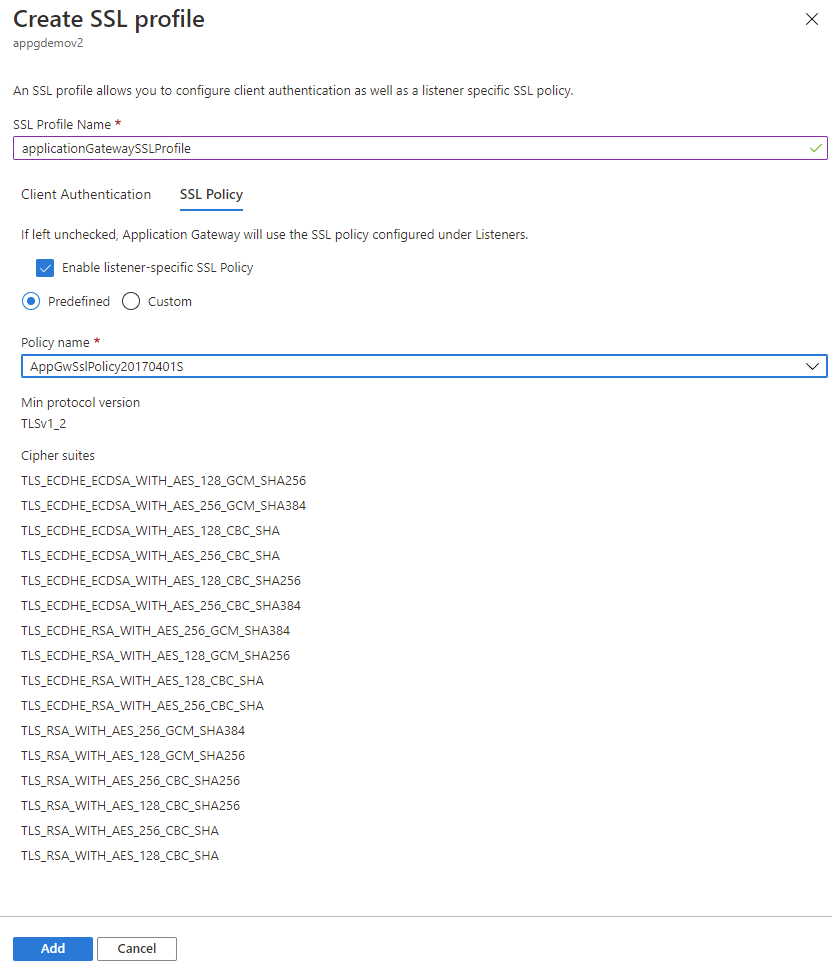

# Configure listener-specific SSL policies on Application Gateway through portal

This article describes how to use the Azure portal to configure listener-specific SSL policies on your Application Gateway. Listener-specific SSL policies allow you to configure specific listeners to use different SSL policies from each other. You'll still be able to set a default SSL policy that all listeners will use unless overwritten by the listener-specific SSL policy. 

> [!NOTE]
> Only Standard_v2 and WAF_v2 SKUs support listener specific policies as listener specific policies are part of SSL profiles, and SSL profiles are only supported on v2 gateways. 

If you don't have an Azure subscription, create a [free account](https://azure.microsoft.com/free/?WT.mc_id=A261C142F) before you begin.

## Create a new Application Gateway

First create a new Application Gateway as you would usually through the portal - there are no additional steps needed in the creation to configure listener-specific SSL policies. For more information on how to create an Application Gateway in portal, check out our [portal quickstart tutorial](./quick-create-portal.md).

## Set up a listener-specific SSL policy

To set up a listener-specific SSL policy, you'll need to first go to the **SSL settings** tab in the Portal and create a new SSL profile. When you create an SSL profile, you'll see two tabs: **Client Authentication** and **SSL Policy**. The **SSL Policy** tab is to configure a listener-specific SSL policy. The **Client Authentication** tab is where to upload a client certificate(s) for mutual authentication - for more information, check out [Configuring a mutual authentication](./mutual-authentication-portal.md).

> [!NOTES]
> - We recommend using TLS 1.2 as this version will be mandated in the future.
>
> - You don't have to configure client authentication on an SSL profile to associate it to a listener. You can have only client authentication configure, or only listener specific SSL policy configured, or both configured in your SSL profile.
> 
> - Using a new Predefined or Customv2 policy enhances SSL security and performance for the entire gateway (SSL Policy and SSL Profile). Therefore, at a given point, you cannot have listeners on both older as well as new SSL (predefined or custom) policies. 
> 
>   Example: If you are using SSL Policy and SSL Profile with older policies/ciphers, selecting a new Predefined or Customv2 policy for one of them will automatically apply the same policy for the other configuration too. You can, however, customize a specific one later within the realm of the new policies such that only the new 
> predefined policies, or customv2 policies, or combination of these co-exist on a gateway. 

1. Search for **Application Gateway** in portal, select **Application gateways**, and click on your existing Application Gateway.

2. Select **SSL settings** from the left-side menu.

3. Click on the plus sign next to **SSL Profiles** at the top to create a new SSL profile.

4. Enter a name under **SSL Profile Name**. In this example, we call our SSL profile *applicationGatewaySSLProfile*. 

5. Go to the **SSL Policy** tab and check the **Enable listener-specific SSL Policy** box. 

6. Set up your listener-specific SSL policy given your requirements. You can choose between predefined SSL policies and customizing your own SSL policy. For more information on SSL policies, visit [SSL policy overview](./application-gateway-ssl-policy-overview.md). We recommend using TLS 1.2

7. Select **Add** to save.

    
    
## Associate the SSL profile with a listener

Now that we've created an SSL profile with a listener-specific SSL policy, we need to associate the SSL profile to the listener to put the listener-specific policy in action. 

1. Navigate to your existing Application Gateway. If you just completed the steps above, you don't need to do anything here. 

2. Select **Listeners** from the left-side menu. 

3. Click on **Add listener** if you don't already have an HTTPS listener set up. If you already have an HTTPS listener, click on it from the list. 

4. Fill out the **Listener name**, **Frontend IP**, **Port**, **Protocol**, and other **HTTPS Settings** to fit your requirements.

5. Check the **Enable SSL Profile** checkbox so that you can select which SSL Profile to associate with the listener. 

6. Select the SSL profile you created from the dropdown list. In this example, we choose the SSL profile we created from the earlier steps: *applicationGatewaySSLProfile*. 

7. Continue configuring the remainder of the listener to fit your requirements. 

8. Click **Add** to save your new listener with the SSL profile associated to it. 

            

### Limitations
There is a limitation right now on Application Gateway where different listeners using the same port cannot have SSL policies (predefined or custom) with different TLS protocol versions. Choosing the same TLS version for different listeners will work for configuring cipher suite preference for each listener. However, to use different TLS protocol versions for separate listeners, you will need to use distinct ports for each.

## Next steps

> [!div class="nextstepaction"]
> [Manage web traffic with an application gateway using the Azure CLI](./tutorial-manage-web-traffic-cli.md)
