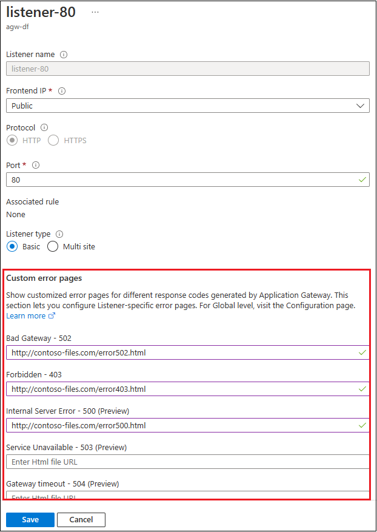

# Create Application Gateway custom error pages

Application Gateway allows you to create customized error pages instead of displaying default ones. You can use your branding and layout for errors related to different response codes. Some scenarios for setting custom error pages are

- Showing a **maintenance or status page** for 502 Bad Gateway response code. This is useful when your application gateway has no backend server to route traffic to during scheduled maintenance or an unforeseen issue with backend pool servers.
- Showing a customized **unauthorized access page** for 403 Forbidden response code that occurs when the WAF is in prevention mode and blocks malicious traffic.
- Showing a company-branded page with contact details in case of an issue.

## Supported response codes
The custom error pages are supported for the following response codes: 

| Response Code | Description |
| ---------- | ---------- |
| 400 | Bad request (In preview) |
| 403 | Forbidden |
| 405 | Method not allowed (In preview) |
| 408 | Request timeout (In preview) |
| 500 | Internal Server Error (In preview) |
| 502 | Bad gateway |
| 503 | Service unavailable (In preview) |
| 504 | Gateway timeout (In preview) |

> [!Note]
> - API version 2022-09-01 or later should be used to configure error pages for the new response codes (in preview).
> - Response code 404 (Page not found) is currently unsupported.
> - The custom error pages are displayed for response codes generated by Application Gateway. If an error originates from the backend server, it is passed along unmodified to the client.

## Configuration levels

The custom error pages can be defined at a Global or Listener level:

- **Global level** - The error pages set at a global level are applied to all the listeners of that application gateway. Its configuration through the Azure portal is currently not supported.
- **Listener level** - The error pages at a listener level gives you granular control to set error pages for application served by that listener.

> [!Note]
> When using a combination of Global and Listener-level error pages for a gateway, you must explicitly mention the URLs for all desired response codes for that listener. A listener-specific configuration overrides all preceding global configurations applicable to that listener.

## Requirements

To create a custom error page, you should 
- know the response code for which a custom error page is needed.
- know the corresponding remote location (URL) for the HTML page. This must be a publicly accessible file.
- ensure the error page is publicly accessible and return a 200 response.
- ensure the error page should be in \*.htm or \*.html extension type.
- ensure the page size is less than 1 MB.

You may reference internal or external images/CSS for this HTML file. For externally referenced resources, use absolute URLs that are publicly accessible. Be aware of the HTML file size when using base64-encoded inline images, javascript, or CSS.

> [!Note]
>  - Relative links are not supported.

After you specify an error page, application gateway verifies internet connectivity to the file and will save the file to the local application gateway cache. The HTML page will be served by the application gateway, whereas externally referenced resources (such as images, javascript, css files) are fetched directly by the client. To modify an existing custom error page, you must point to a different blob location in the application gateway configuration. Application gateway doesn't periodically check the blob location to fetch new versions.

## How it works?
After you specify an error page in your application gateway's configuration, your gateway verifies the connectivity to the HTML page over the internet. It then downloads the file on its local cache. 

When a client faces an error, your application gateway returns a response code and that HTML page. Any externally referenced resources (such as images, JavaScript, and CSS files) are fetched directly by the client. 

Your application gateway doesn't periodically check the source file's location to fetch a new version. You can perform any configuration update on the gateway to manually update the file's cache. For example, changing the error URL from page 1 to page 2 and then back to page 1, or upon adding a new listener.

## Portal configuration

Steps to configure **listener-specific** custom error pages:

1. Navigate to Application Gateway in the portal and choose the required resource.

2. Select **Listeners** and navigate to a particular listener for which you want to specify an error page.

3. Under **Custom error pages** section, specify publicly accessible URLs for the required status codes.

4. Select Save.

   

## Azure PowerShell configuration

You can use Azure PowerShell to configure a custom error page. For example, a global custom error page:

```powershell
$appgw   = Get-AzApplicationGateway -Name <app-gateway-name> -ResourceGroupName <resource-group-name>

$updatedgateway = Add-AzApplicationGatewayCustomError -ApplicationGateway $appgw -StatusCode HttpStatus502 -CustomErrorPageUrl "http://<website-url>"
```

Or a listener level error page:

```powershell
$appgw   = Get-AzApplicationGateway -Name <app-gateway-name> -ResourceGroupName <resource-group-name>

$listener01 = Get-AzApplicationGatewayHttpListener -Name <listener-name> -ApplicationGateway $appgw

$updatedlistener = Add-AzApplicationGatewayHttpListenerCustomError -HttpListener $listener01 -StatusCode HttpStatus502 -CustomErrorPageUrl "http://<website-url>"
```

For more information, see [Add-AzApplicationGatewayCustomError](/powershell/module/az.network/add-azapplicationgatewaycustomerror) and [Add-AzApplicationGatewayHttpListenerCustomError](/powershell/module/az.network/add-azapplicationgatewayhttplistenercustomerror).

## Next steps

For information about Application Gateway diagnostics, see [Backend health, diagnostic logs, and metrics for Application Gateway](application-gateway-diagnostics.md).
