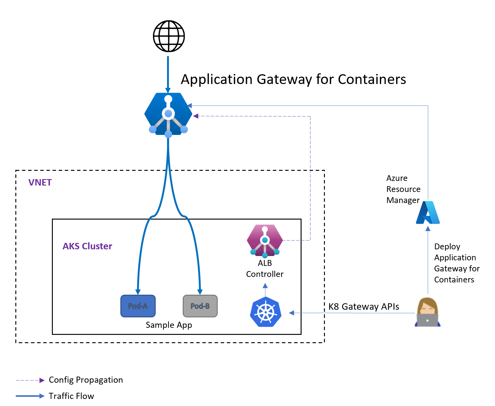

---

title: How Application Gateway for Containers works
titlesuffix: Azure Application Load Balancer
description: This article provides information about how Application Gateway for Containers accepts incoming requests and routes them to a backend target.
services: application-gateway
author: greglin
ms.service: application-gateway
ms.subservice: traffic-controller
ms.topic: conceptual
ms.date: 6/20/2023
ms.author: greglin
---

# How Application Gateway for Containers works

Application Gateway for Containers is made up of three components:
- Application Gateway for Containers
- Frontends
- Associations

The following dependencies are also referenced in an Application Gateway for Containers deployment:
- Private IP address
- Subnet Delegation
- User-assigned Managed Identity

## Application Gateway for Containers Concepts

### Application Gateway for Containers
- Application Gateway for Containers is a parent resource that deploys the control plane
- The control plane is what orchestrates date plane proxy configuration based on customer intent.
- Application Gateway for Containers has two child resources; associations and frontends
  - Child resources are exclusive to only their parent Application Gateway for Containers and may not be referenced by additional Application Gateway for Containers

### Application Gateway for Containers Frontends
- An Application Gateway for Containers Frontend defines the entry point client traffic should be received by a given Application Gateway for Containers
   - A frontend can't be associated to multiple Application Gateway for Containers
   - Each frontend provides a unique FQDN that can be referenced by a customer's CNAME record 
   - Private IP addresses are currently unsupported
- A single Application Gateway for Containers can support multiple Frontends

### Application Gateway for Containers Association
- An Application Gateway for Containers Association defines a connection point into a virtual network.  An association is a 1:1 mapping of an association resource to an Azure Subnet that has been delegated.
- Application Gateway for Containers are designed to allow for multiple associations
   - The current number of associations is currently limited to 1
- During creation of an association, the underlying data plane is provisioned and connected to a subnet within the defined virtual network's subnet
- Each association should assume at least 256 addresses are available in the subnet at time of provisioning.
   - A minimum /24 subnet mask for new deployment, assuming nothing has been provisioning in the subnet).
      - If n number of Application Gateway for Containers are provisioned, with the assumption each Application Gateway for Containers contains one association, and the desired is to share the same subnet, the available required addresses should be n*256.
   - All Application Gateway for Containers association resources should match the same region as the Application Gateway for Containers parent resource

## Azure / General concepts

### Private IP address
- A private IP address isn't explicitly defined as an Azure Resource Manager resource.  A private IP address would refer to a specific host address within a given virtual network's subnet.

### Subnet Delegation
- Microsoft.ServiceNetworking/trafficControllers is the namespace adopted by Application Gateway for Containers and may be delegated to a virtual network's subnet.
- When delegation occurs, provisioning of Application Gateway for Containers resources doesn't happen, nor is there an exclusive mapping to an Application Gateway for Containers association resource.
- Any number of subnets can have a subnet delegation that is the same or different to Application Gateway for Containers.  Once defined, no other resources, other than the defined service, can be provisioned into the subnet unless explicitly defined by the service's implementation.

### User-assigned Managed Identity
- Managed identities for Azure resources eliminate the need to manage credentials in code.
- A User Managed Identity is required for the Azure Load Balancer Controller to make changes to Application Gateway for Containers
- Azure Application Gateway for Containers Configuration Manager is a built-in RBAC role that is delegated to the Application Gateway for Containers resource to enable the Azure Load Balancer controller to use the least required permissions to make changes to the Application Gateway for Containers resource.

## How Application Gateway for Containers accepts a request
Each Application Gateway for Containers frontend provides a generated Fully Qualified Domain Name managed by Azure.  The FQDN may be used as-is or customers may opt to mask the FQDN with a CNAME record.

Before a client sends a request to Application Gateway for Containers, the client resolves a CNAME that points to the frontend's FQDN; or the client may directly resolve the FQDN provided by Application Gateway for Containers by using a DNS server.

The DNS resolver translates the DNS record to an IP address.

When the client initiates the request, the DNS name specified is passed as a host header to Application Gateway for Containers on the defined frontend.

A set of routing rules evaluates how the request for that hostname should be initiated to a defined backend target.

## How Application Gateway for Containers routes a request

### Modifications to the request
Application Gateway for Containers inserts two additional headers to all requests before requests are initiated from Application Gateway for Containers to a backend target:
- x-forwarded-proto
- x-request-id

x-forwarded-proto returns the protocol received by Application Gateway for Containers from the client.  The value is either http or https.
X-request-id is a unique guid generated by Application Gateway for Containers for each client request and presented in the forwarded request to the backend target. The guid consists of 32 alphanumeric characters, separated by dashes (for example: d23387ab-e629-458a-9c93-6108d374bc75). This guid can be used to correlate a request received by Application Gateway for Containers and initiated to a backend target as defined in access logs.

