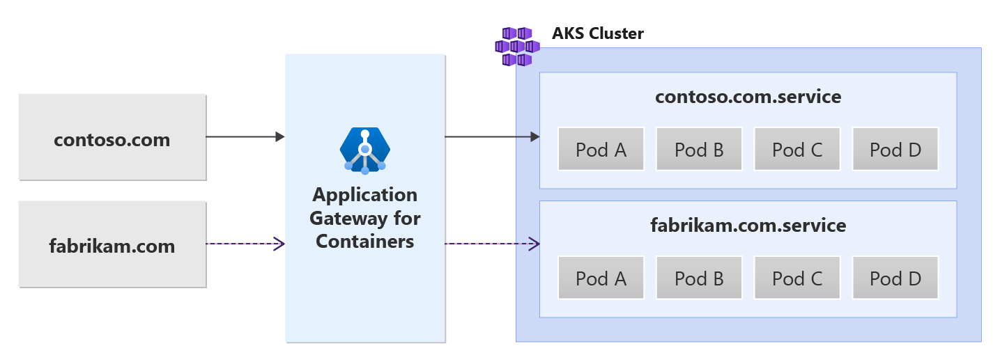

--- 
title: Multi-site hosting with Application Gateway for Containers - Ingress API 
description: Learn how to host multiple sites with Application Gateway for Containers using the Ingress API.
services: application-gateway
author: greglin
ms.service: application-gateway
ms.subservice: appgw-for-containers
ms.topic: how-to
ms.date: 11/07/2023
ms.author: greglin
---

# Multi-site hosting with Application Gateway for Containers - Ingress API 

This document helps you set up an example application that uses the Ingress API to demonstrate hosting multiple sites on the same Kubernetes Ingress resource / Application Gateway for Containers frontend. Steps are provided to:
- Create an [Ingress](https://kubernetes.io/docs/reference/generated/kubernetes-api/v1.27/#ingressrule-v1-networking-k8s-io) resource with two hosts.

## Background

Application Gateway for Containers enables multi-site hosting by allowing you to configure more than one web application on the same port. Two or more unique sites can be hosted using unique backend services. See the following example scenario:



## Prerequisites

1. If you follow the BYO deployment strategy, ensure that you set up your Application Gateway for Containers resources and [ALB Controller](quickstart-deploy-application-gateway-for-containers-alb-controller.md)
2. If you follow the ALB managed deployment strategy, ensure provisioning of your [ALB Controller](quickstart-deploy-application-gateway-for-containers-alb-controller.md) and the Application Gateway for Containers resources via the [ApplicationLoadBalancer custom resource](quickstart-create-application-gateway-for-containers-managed-by-alb-controller.md).
3. Deploy sample HTTP application
  Apply the following deployment.yaml file on your cluster to create a sample web application to demonstrate path, query, and header based routing.  
  ```bash
  kubectl apply -f https://trafficcontrollerdocs.blob.core.windows.net/examples/traffic-split-scenario/deployment.yaml
  ```
  
  This command creates the following on your cluster:
  - a namespace called `test-infra`
  - two services called `backend-v1` and `backend-v2` in the `test-infra` namespace
  - two deployments called `backend-v1` and `backend-v2` in the `test-infra` namespace

## Deploy the required Ingress resource

# [ALB managed deployment](#tab/alb-managed)

1. Create an Ingress
```bash
kubectl apply -f - <<EOF
apiVersion: networking.k8s.io/v1
kind: Ingress
metadata:
  name: ingress-01
  namespace: test-infra
  annotations:
    alb.networking.azure.io/alb-name: alb-test
    alb.networking.azure.io/alb-namespace: alb-test-infra
spec:
  ingressClassName: azure-alb-external
  rules:
    - host: contoso.com
      http:
        paths:
          - path: /
            pathType: Prefix
            backend:
              service:
                name: backend-v1
                port:
                  number: 8080
    - host: fabrikam.com
      http:
        paths:
          - path: /
            pathType: Prefix
            backend:
              service:
                name: backend-v2
                port:
                  number: 8080
EOF
```


# [Bring your own (BYO) deployment](#tab/byo)

1. Set the following environment variables

```bash
RESOURCE_GROUP='<resource group name of the Application Gateway For Containers resource>'
RESOURCE_NAME='alb-test'

RESOURCE_ID=$(az network alb show --resource-group $RESOURCE_GROUP --name $RESOURCE_NAME --query id -o tsv)
FRONTEND_NAME='frontend'
```

2. Create an Ingress
```bash
kubectl apply -f - <<EOF
apiVersion: networking.k8s.io/v1
kind: Ingress
metadata:
  name: ingress-01
  namespace: test-infra
  annotations:
    alb.networking.azure.io/alb-id: $RESOURCE_ID
    alb.networking.azure.io/alb-frontend: $FRONTEND_NAME
spec:
  ingressClassName: azure-alb-external
  rules:
    - host: contoso.com
      http:
        paths:
          - path: /
            pathType: Prefix
            backend:
              service:
                name: backend-v1
                port:
                  number: 8080
    - host: fabrikam.com
      http:
        paths:
          - path: /
            pathType: Prefix
            backend:
              service:
                name: backend-v2
                port:
                  number: 8080
EOF
```

---

Once the ingress resource is created, ensure the status shows the hostname of your load balancer and that both ports are listening for requests.
```bash
kubectl get ingress ingress-01 -n test-infra -o yaml
```

Example output of successful Ingress creation.
```yaml
apiVersion: networking.k8s.io/v1
kind: Ingress
metadata:
  annotations:
    alb.networking.azure.io/alb-frontend: FRONTEND_NAME
    alb.networking.azure.io/alb-id: /subscriptions/xxxxxxxx-xxxx-xxxx-xxxx-xxxxxxxxxxxx/resourcegroups/yyyyyyyy/providers/Microsoft.ServiceNetworking/trafficControllers/zzzzzz
    kubectl.kubernetes.io/last-applied-configuration: |
      {"apiVersion":"networking.k8s.io/v1","kind":"Ingress","metadata":{"annotations":{"alb.networking.azure.io/alb-frontend":"FRONTEND_NAME","alb.networking.azure.io/alb-id":"/subscriptions/xxxxxxxx-xxxx-xxxx-xxxx-xxxxxxxxxxxx/resourcegroups/yyyyyyyy/providers/Microsoft.ServiceNetworking/trafficControllers/zzzzzz"},"name"
:"ingress-01","namespace":"test-infra"},"spec":{"ingressClassName":"azure-alb-external","rules":[{"host":"example.com","http":{"paths":[{"backend":{"service":{"name":"echo","port":{"number":80}}},"path":"/","pathType":"Prefix"}]}}],"tls":[{"hosts":["example.com"],"secretName":"listener-tls-secret"}]}}
  creationTimestamp: "2023-07-22T18:02:13Z"
  generation: 2
  name: ingress-01
  namespace: test-infra
  resourceVersion: "278238"
  uid: 17c34774-1d92-413e-85ec-c5a8da45989d
spec:
  ingressClassName: azure-alb-external
  rules:
    - host: contoso.com
      http:
        paths:
          - path: /
            pathType: Prefix
            backend:
              service:
                name: backend-v1
                port:
                  number: 8080
    - host: fabrikam.com
      http:
        paths:
          - path: /
            pathType: Prefix
            backend:
              service:
                name: backend-v2
                port:
                  number: 8080
status:
  loadBalancer:
    ingress:
    - hostname: xxxxxxxxxxxxxxxxxxxxxxxxxxxxxxxx.fzyy.alb.azure.com
      ports:
      - port: 80
        protocol: TCP
```

## Test access to the application

Now we're ready to send some traffic to our sample application, via the FQDN assigned to the frontend. Use the following command to get the FQDN.

```bash
fqdn=$(kubectl get ingress ingress-01 -n test-infra -o jsonpath='{.status.loadBalancer.ingress[0].hostname}'')
```

Next, specify the server name indicator using the curl command, `contoso.com` for the frontend FQDN should return a response from the backend-v1 service.

```bash
fqdnIp=$(dig +short $fqdn)
curl -k --resolve contoso.com:80:$fqdnIp http://contoso.com
```

Via the response we should see:
```json
{
 "path": "/",
 "host": "contoso.com",
 "method": "GET",
 "proto": "HTTP/1.1",
 "headers": {
  "Accept": [
   "*/*"
  ],
  "User-Agent": [
   "curl/7.81.0"
  ],
  "X-Forwarded-For": [
   "xxx.xxx.xxx.xxx"
  ],
  "X-Forwarded-Proto": [
   "http"
  ],
  "X-Request-Id": [
   "dcd4bcad-ea43-4fb6-948e-a906380dcd6d"
  ]
 },
 "namespace": "test-infra",
 "ingress": "",
 "service": "",
 "pod": "backend-v1-5b8fd96959-f59mm"
}
```

Next, specify server name indicator using the curl command, `fabrikam.com` for the frontend FQDN should return a response from the backend-v1 service.

```bash
fqdnIp=$(dig +short $fqdn)
curl -k --resolve fabrikam.com:80:$fqdnIp http://fabrikam.com
```

Via the response we should see:
```json
{
 "path": "/",
 "host": "fabrikam.com",
 "method": "GET",
 "proto": "HTTP/1.1",
 "headers": {
  "Accept": [
   "*/*"
  ],
  "User-Agent": [
   "curl/7.81.0"
  ],
  "X-Forwarded-For": [
   "xxx.xxx.xxx.xxx"
  ],
  "X-Forwarded-Proto": [
   "http"
  ],
  "X-Request-Id": [
   "adae8cc1-8030-4d95-9e05-237dd4e3941b"
  ]
 },
 "namespace": "test-infra",
 "ingress": "",
 "service": "",
 "pod": "backend-v2-594bd59865-ppv9w"
}
```

Congratulations, you've installed ALB Controller, deployed a backend application, and routed traffic to two different backend services using different hostnames with the Ingress API on Application Gateway for Containers.
