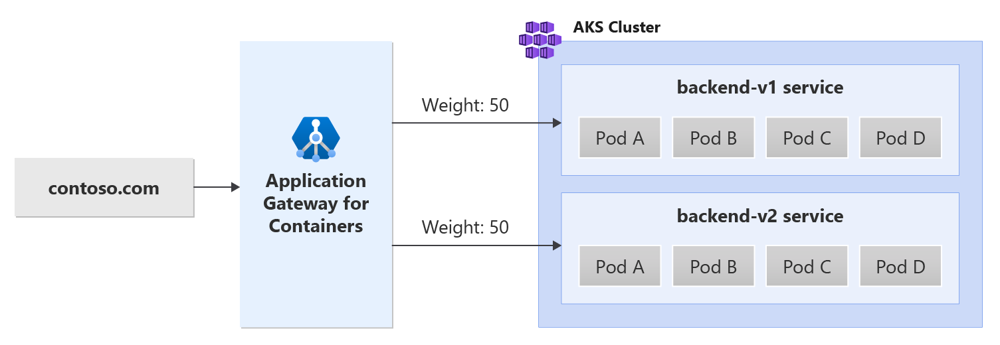

---

title: Traffic Splitting with Application Gateway for Containers - Gateway API 
description: Learn how to configure traffic splitting / weighted round robin with Application Gateway for Containers.
services: application-gateway
author: greglin
ms.service: application-gateway
ms.subservice: appgw-for-containers
ms.topic: how-to
ms.date: 09/20/2023
ms.author: greglin
---

# Traffic splitting with Application Gateway for Containers - Gateway API 

This document helps set up an example application that uses the following resources from Gateway API:
- [Gateway](https://gateway-api.sigs.k8s.io/concepts/api-overview/#gateway) - creating a gateway with one http listener
- [HTTPRoute](https://gateway-api.sigs.k8s.io/v1alpha2/api-types/httproute/) - creating an HTTP route that references two backend services having different weights

## Background

Application Gateway for Containers enables you to set weights and shift traffic between different backend targets. See the following example scenario:



## Prerequisites

1. If following the BYO deployment strategy, ensure you have set up your Application Gateway for Containers resources and [ALB Controller](quickstart-deploy-application-gateway-for-containers-alb-controller.md)
2. If following the ALB managed deployment strategy, ensure you have provisioned your [ALB Controller](quickstart-deploy-application-gateway-for-containers-alb-controller.md) and provisioned the Application Gateway for Containers resources via the  [ApplicationLoadBalancer custom resource](quickstart-create-application-gateway-for-containers-managed-by-alb-controller.md).
3. Deploy sample HTTP application
  Apply the following deployment.yaml file on your cluster to create a sample web application to demonstrate traffic splitting / weighted round robin support.
  ```bash
  kubectl apply -f https://trafficcontrollerdocs.blob.core.windows.net/examples/traffic-split-scenario/deployment.yaml
  ```
  
  This command creates the following on your cluster:
  - a namespace called `test-infra`
  - two services called `backend-v1` and `backend-v2` in the `test-infra` namespace
  - two deployments called `backend-v1` and `backend-v2` in the `test-infra` namespace

## Deploy the required Gateway API resources

# [ALB managed deployment](#tab/alb-managed)

Create a gateway:

```bash
kubectl apply -f - <<EOF
apiVersion: gateway.networking.k8s.io/v1beta1
kind: Gateway
metadata:
  name: gateway-01
  namespace: test-infra
  annotations:
    alb.networking.azure.io/alb-namespace: alb-test-infra
    alb.networking.azure.io/alb-name: alb-test
spec:
  gatewayClassName: azure-alb-external
  listeners:
  - name: http
    port: 80
    protocol: HTTP
    allowedRoutes:
      namespaces:
        from: Same
EOF
```

[!INCLUDE [application-gateway-for-containers-frontend-naming](../../../includes/application-gateway-for-containers-frontend-naming.md)]

# [Bring your own (BYO) deployment](#tab/byo)

1. Set the following environment variables

```bash
RESOURCE_GROUP='<resource group name of the Application Gateway For Containers resource>'
RESOURCE_NAME='alb-test'

RESOURCE_ID=$(az network alb show --resource-group $RESOURCE_GROUP --name $RESOURCE_NAME --query id -o tsv)
FRONTEND_NAME='frontend'
```

2. Create a Gateway
```bash
kubectl apply -f - <<EOF
apiVersion: gateway.networking.k8s.io/v1beta1
kind: Gateway
metadata:
  name: gateway-01
  namespace: test-infra
  annotations:
    alb.networking.azure.io/alb-id: $RESOURCE_ID
spec:
  gatewayClassName: azure-alb-external
  listeners:
  - name: http
    port: 80
    protocol: HTTP
    allowedRoutes:
      namespaces:
        from: Same
  addresses:
  - type: alb.networking.azure.io/alb-frontend
    value: $FRONTEND_NAME
EOF
```

---

Once the gateway resource has been created, ensure the status is valid, the listener is _Programmed_, and an address is assigned to the gateway.
```bash
kubectl get gateway gateway-01 -n test-infra -o yaml
```

Example output of successful gateway creation.
```yaml
status:
  addresses:
  - type: IPAddress
    value: xxxx.yyyy.alb.azure.com
  conditions:
  - lastTransitionTime: "2023-06-19T21:04:55Z"
    message: Valid Gateway
    observedGeneration: 1
    reason: Accepted
    status: "True"
    type: Accepted
  - lastTransitionTime: "2023-06-19T21:04:55Z"
    message: Application Gateway For Containers resource has been successfully updated.
    observedGeneration: 1
    reason: Programmed
    status: "True"
    type: Programmed
  listeners:
  - attachedRoutes: 0
    conditions:
    - lastTransitionTime: "2023-06-19T21:04:55Z"
      message: ""
      observedGeneration: 1
      reason: ResolvedRefs
      status: "True"
      type: ResolvedRefs
    - lastTransitionTime: "2023-06-19T21:04:55Z"
      message: Listener is accepted
      observedGeneration: 1
      reason: Accepted
      status: "True"
      type: Accepted
    - lastTransitionTime: "2023-06-19T21:04:55Z"
      message: Application Gateway For Containers resource has been successfully updated.
      observedGeneration: 1
      reason: Programmed
      status: "True"
      type: Programmed
    name: gateway-01-http
    supportedKinds:
    - group: gateway.networking.k8s.io
      kind: HTTPRoute
```

Once the gateway has been created, create an HTTPRoute
```bash
kubectl apply -f - <<EOF
apiVersion: gateway.networking.k8s.io/v1beta1
kind: HTTPRoute
metadata:
  name: traffic-split-route
  namespace: test-infra
spec:
  parentRefs:
  - name: gateway-01
  rules:
  - backendRefs:
    - name: backend-v1
      port: 8080
      weight: 50
    - name: backend-v2
      port: 8080
      weight: 50
EOF
```

Once the HTTPRoute resource has been created, ensure the route has been _Accepted_ and the Application Gateway for Containers resource has been _Programmed_.
```bash
kubectl get httproute traffic-split-route -n test-infra -o yaml
```

Verify the status of the Application Gateway for Containers resource has been successfully updated.

```yaml
status:
  parents:
  - conditions:
    - lastTransitionTime: "2023-06-19T22:18:23Z"
      message: ""
      observedGeneration: 1
      reason: ResolvedRefs
      status: "True"
      type: ResolvedRefs
    - lastTransitionTime: "2023-06-19T22:18:23Z"
      message: Route is Accepted
      observedGeneration: 1
      reason: Accepted
      status: "True"
      type: Accepted
    - lastTransitionTime: "2023-06-19T22:18:23Z"
      message: Application Gateway For Containers resource has been successfully updated.
      observedGeneration: 1
      reason: Programmed
      status: "True"
      type: Programmed
    controllerName: alb.networking.azure.io/alb-controller
    parentRef:
      group: gateway.networking.k8s.io
      kind: Gateway
      name: gateway-01
      namespace: test-infra
  ```

## Test Access to the Application

Now we're ready to send some traffic to our sample application, via the FQDN assigned to the frontend. Use the command below to get the FQDN.

```bash
fqdn=$(kubectl get gateway gateway-01 -n test-infra -o jsonpath='{.status.addresses[0].value}')
```

Curling this FQDN should return responses from the backends/pods as configured on the HTTPRoute.

```bash
# this curl command will return 50% of the responses from backend-v1
# and the remaining 50% of the responses from backend-v2
watch -n 1 curl http://$fqdn
```

Congratulations, you have installed ALB Controller, deployed a backend application and routed traffic to the application via the ingress on Application Gateway for Containers.
