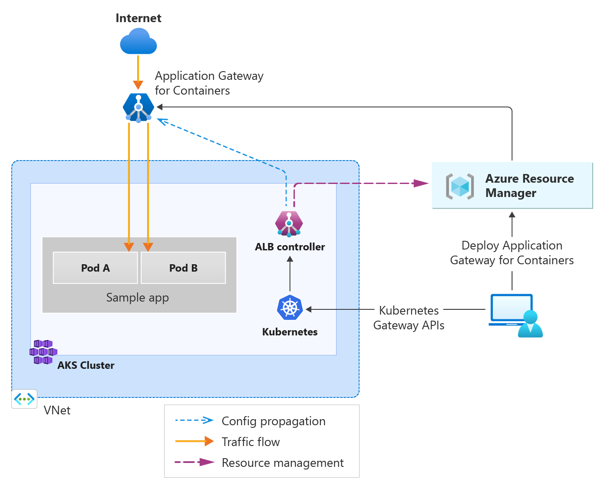

# What is Application Gateway for Containers? (preview)

Application Gateway for Containers is a new application (layer 7) [load balancing](/azure/architecture/guide/technology-choices/load-balancing-overview) and dynamic traffic management product for workloads running in a Kubernetes cluster. It extends Azure's Application Load Balancing portfolio and is a new offering under the Application Gateway product family. 

Application Gateway for Containers is the evolution of the [Application Gateway Ingress Controller](../ingress-controller-overview.md) (AGIC), a [Kubernetes](/azure/aks) application that enables Azure Kubernetes Service (AKS) customers to use Azure's native Application Gateway application load-balancer. In its current form, AGIC monitors a subset of Kubernetes Resources for changes and applies them to the Application Gateway, utilizing Azure Resource Manager (ARM). 

## How does it work?

Application Gateway for Containers is made up of three components:
- Application Gateway for Containers
- Frontends
- Associations

The following dependencies are also referenced in an Application Gateway for Containers deployment:
- Private IP address
- Subnet Delegation
- User-assigned Managed Identity

The architecture of Application Gateway for Containers is summarized in the following figure:

For details about how Application Gateway for Containers accepts incoming requests and routes them to a backend target, see [Application Gateway for Containers components](application-gateway-for-containers-components.md).

## Features and benefits

Application Gateway for Containers offers some entirely new features at release, such as:
- Traffic splitting 
- Weighted round robin 
- Mutual authentication to the backend target
- Kubernetes support for Ingress & Gateway API
- Flexible [deployment strategies](#deployment-strategies)
- Improved AKS orchestration by [increasing performance](#load-balancing-features) to sub second update times to add or move pods, routes and probes. 

Application Gateway for Containers offers an elastic and scalable ingress to AKS clusters and comprises a new data plane as well as control plane with [new set of ARM APIs](#implementation-of-gateway-api), different from existing Application Gateway. These APIs are different from the current implementation of Application Gateway. Application Gateway for Containers is outside the AKS cluster data plane and is responsible for ingress. The service is managed by an ALB controller component that runs inside the AKS cluster and adheres to Kubernetes Gateway APIs. 

### Load balancing features

Application Gateway for Containers supports the following features for traffic management:
- Performance improvements
  - Subsecond update times to add/remove pods, routes, probes
- Layer 7 HTTP/HTTPS request forwarding based on prefix/exact match on:
  - Hostname
  - Path
  - Headers
  - Query string match
  - Methods
  - Ports (80/443)
- HTTPS traffic management:
  - SSL termination
  - End to End SSL
- Ingress and Gateway API support
- Traffic Splitting / weighted round robin
- Mutual Authentication (mTLS) to backend target
- Health checks: Application Gateway for Containers determines the health of a backend before it registers it as healthy and capable of handling traffic
- Automatic retries
- TLS Policies
- Autoscaling
- Availability zone resiliency

### Deployment strategies

There are two deployment strategies for management of Application Gateway for Containers:

- **Bring your own (BYO) deployment:** In this deployment strategy, deployment and lifecycle of the Application Gateway for Containers resource, Association and Frontend resource is assumed via Azure portal, CLI, PowerShell, Terraform, etc. and referenced in configuration within Kubernetes.
   - **In Gateway API:** Every time you wish to create a new Gateway resource in Kubernetes, a Frontend resource should be provisioned in Azure prior and referenced by the Gateway resource. Deletion of the Frontend resource is responsible by the Azure administrator and isn't deleted when the Gateway resource in Kubernetes is deleted.
- **Managed by ALB Controller:** In this deployment strategy ALB Controller deployed in Kubernetes is responsible for the lifecycle of the Application Gateway for Containers resource and its sub resources. ALB Controller creates Application Gateway for Containers resource when an ApplicationLoadBalancer custom resource is defined on the cluster and its lifecycle is based on the lifecycle of the custom resource.
  - **In Gateway API:** Every time a Gateway resource is created referencing the ApplicationLoadBalancer resource, ALB Controller provisions a new Frontend resource and manage its lifecycle based on the lifecycle of the Gateway resource.

### Supported regions

Application Gateway for Containers is currently offered in the following regions:
- Australia East
- Central US
- East Asia
- East US
- East US2
- North Central US
- North Europe
- South Central US
- Southeast Asia
- UK South
- West US
- West Europe

### Implementation of gateway API

ALB Controller implements version [v1beta1](https://gateway-api.sigs.k8s.io/references/spec/#gateway.networking.k8s.io/v1beta1) of the [Gateway API](https://gateway-api.sigs.k8s.io/)

| Gateway API Resource      | Support | Comments     |
| ------------------------- | ------- | ------------ |
| [GatewayClass](https://gateway-api.sigs.k8s.io/references/spec/#gateway.networking.k8s.io%2fv1beta1.GatewayClass)          | Yes   |  |
| [Gateway](https://gateway-api.sigs.k8s.io/references/spec/#gateway.networking.k8s.io%2fv1beta1.Gateway)                    | Yes   | Support for HTTP and HTTPS protocol on the listener. The only ports allowed on the listener are 80 and 443. |
| [HTTPRoute](https://gateway-api.sigs.k8s.io/references/spec/#gateway.networking.k8s.io%2fv1beta1.HTTPRoute)                | Yes   | Currently doesn't support [HTTPRouteFilter](https://gateway-api.sigs.k8s.io/references/spec/#gateway.networking.k8s.io/v1beta1.HTTPRouteFilter) |
| [ReferenceGrant](https://gateway-api.sigs.k8s.io/references/spec/#gateway.networking.k8s.io%2fv1alpha2.ReferenceGrant)     | Yes   | Currently supports version v1alpha1 of this api |

## Reporting issues

For feedback, post a new idea in [feedback.azure.com](https://feedback.azure.com/)
For issues, raise a support request via the Azure portal on your Application Gateway for Containers resource.

## Pricing and SLA

For Application Gateway for Containers pricing information, see [Application Gateway pricing](https://azure.microsoft.com/pricing/details/application-gateway/).

While in Public Preview, Application Gateway for Containers follows [Preview supplemental terms](https://azure.microsoft.com/support/legal/preview-supplemental-terms/).

## What's new

To learn what's new with Application Gateway for Containers, see [Azure updates](https://azure.microsoft.com/updates/?category=networking&query=Application%20Gateway%20for%20Containers).

## Next steps

- [Concepts: Application Gateway for Containers components](application-gateway-for-containers-components.md)
- [Quickstart: Deploy Application Gateway for Containers ALB Controller](quickstart-deploy-application-gateway-for-containers-alb-controller.md)
