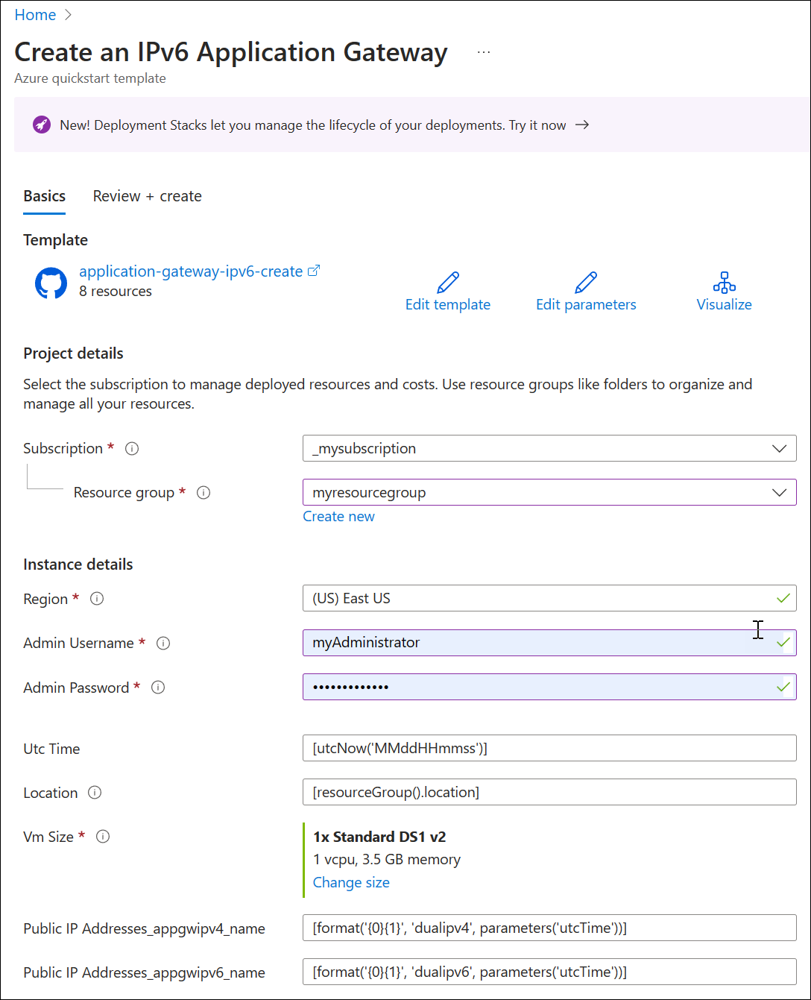
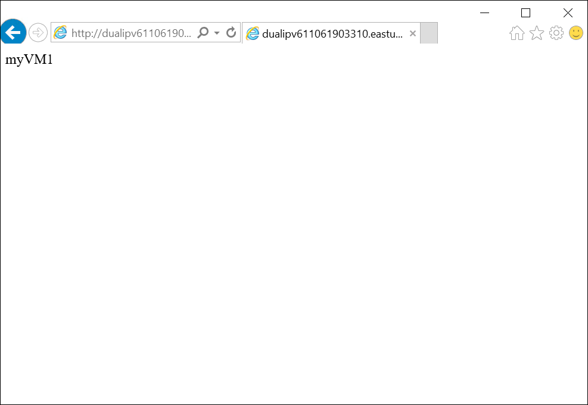

# Deploy an Azure Application Gateway with an IPv6 frontend - ARM template (Preview)

[!INCLUDE [About Azure Resource Manager](../../includes/resource-manager-quickstart-introduction.md)]

If your environment meets the prerequisites and you're familiar with using ARM templates, select the **Deploy to Azure** button. The template opens in the Azure portal.

:::image type="content" source="~/articles/reusable-content/ce-skilling/azure/media/template-deployments/deploy-to-azure-button.svg" alt-text="Button to Deploy the ARM template to Azure." link="https://portal.azure.com/#create/Microsoft.Template/uri/https%3A%2F%2Fraw.githubusercontent.com%2FAzure%2Fazure-quickstart-templates%2Fmaster%2Fquickstarts%2Fmicrosoft.network%2Fapplication-gateway-ipv6-create%2Fazuredeploy.json":::

> [!IMPORTANT]
> Application Gateway IPv6 frontend is currently in PREVIEW.<br>
> See the [Supplemental Terms of Use for Microsoft Azure Previews](https://azure.microsoft.com/support/legal/preview-supplemental-terms/) for legal terms that apply to Azure features that are in beta, preview, or otherwise not yet released into general availability.

## Prerequisites

- An Azure account with an active subscription. [Create an account for free](https://azure.microsoft.com/free/?WT.mc_id=A261C142F).
- You must [Register to the preview](ipv6-application-gateway-portal.md#register-to-the-preview) for Application Gateway IPv6 frontend.

## Review the template

This template creates a simple setup with a dual-stack public frontend IP, a basic listener to host a single site on the application gateway, a basic request routing rule, and two virtual machines in the backend pool.

  > [!NOTE]
  > Application Gateway's dual-stack frontend (Preview) supports up to four frontend IP addresses: Two IPv4 addresses (public and private) and two IPv6 addresses (public and private).

The template used in this quickstart is from [Azure Quickstart Templates](/samples/azure/azure-quickstart-templates/application-gateway-ipv6-create/)

:::code language="json" source="~/quickstart-templates/quickstarts/microsoft.network/application-gateway-ipv6-create/azuredeploy.json":::

Multiple Azure resources are defined in the template:

- [**Microsoft.Network/applicationgateways**](/azure/templates/microsoft.network/applicationgateways)
- [**Microsoft.Network/publicIPAddresses**](/azure/templates/microsoft.network/publicipaddresses) : one for the application gateway, and two for the virtual machines.
- [**Microsoft.Network/networkSecurityGroups**](/azure/templates/microsoft.network/networksecuritygroups)
- [**Microsoft.Network/virtualNetworks**](/azure/templates/microsoft.network/virtualnetworks)
- [**Microsoft.Compute/virtualMachines**](/azure/templates/microsoft.compute/virtualmachines) : two virtual machines
- [**Microsoft.Network/networkInterfaces**](/azure/templates/microsoft.network/networkinterfaces) : two for the virtual machines
- [**Microsoft.Compute/virtualMachine/extensions**](/azure/templates/microsoft.compute/virtualmachines/extensions) : to configure IIS and the web pages

## Deploy the template

Deploy the ARM template to Azure:

1. Select **Deploy to Azure** to sign in to Azure and open the template. The template creates an application gateway, the network infrastructure, and two virtual machines in the backend pool running IIS.

   :::image type="content" source="~/articles/reusable-content/ce-skilling/azure/media/template-deployments/deploy-to-azure-button.svg" alt-text="Button to Deploy the ARM template to Azure." link="https://portal.azure.com/#create/Microsoft.Template/uri/https%3A%2F%2Fraw.githubusercontent.com%2FAzure%2Fazure-quickstart-templates%2Fmaster%2Fquickstarts%2Fmicrosoft.network%2Fapplication-gateway-ipv6-create%2Fazuredeploy.json":::

2. Select or create your resource group, type the virtual machine **Admin Username** and **Admin Password**.

   

   > [!NOTE]
   > Select a region that is the same as your resource group. If the region does not support the Standard DS1 v2 virtual machine SKU, this SKU is not displayed and you must choose a different size.

3. Select **Review + Create** and then select **Create**.

   The deployment can take 20 minutes or longer to complete.

## Validate the deployment

Although IIS isn't required to create the application gateway, it can be used to verify that Azure successfully created the application gateway. 

To use IIS to test the application gateway:

1. Find the public IP address and DNS name for the application gateway on its **Overview** page. In the following example, the DNS name is **dualipv611061903310.eastus.cloudapp.azure.com**.

   [  ](./media/ipv6-application-gateway-arm-template/ipv6-address.png#lightbox)

2. Copy the public IP address or DNS name, and then paste it into the address bar of your browser to browse that IP address.

3. Check the response. A valid response verifies that the application gateway was successfully created and can successfully connect with the backend.

   

   Refresh the browser multiple times and you should see connections to both myVM1 and myVM2.

## Clean up resources

When you no longer need the resources that you created with the application gateway, delete the resource group. This process removes the application gateway and all the related resources.

To delete the resource group, call the `Remove-AzResourceGroup` cmdlet:

```azurepowershell-interactive
Remove-AzResourceGroup -Name <your resource group name>
```

## Next steps

> [!div class="nextstepaction"]
> [Manage web traffic with an application gateway using the Azure CLI](./tutorial-manage-web-traffic-cli.md)
