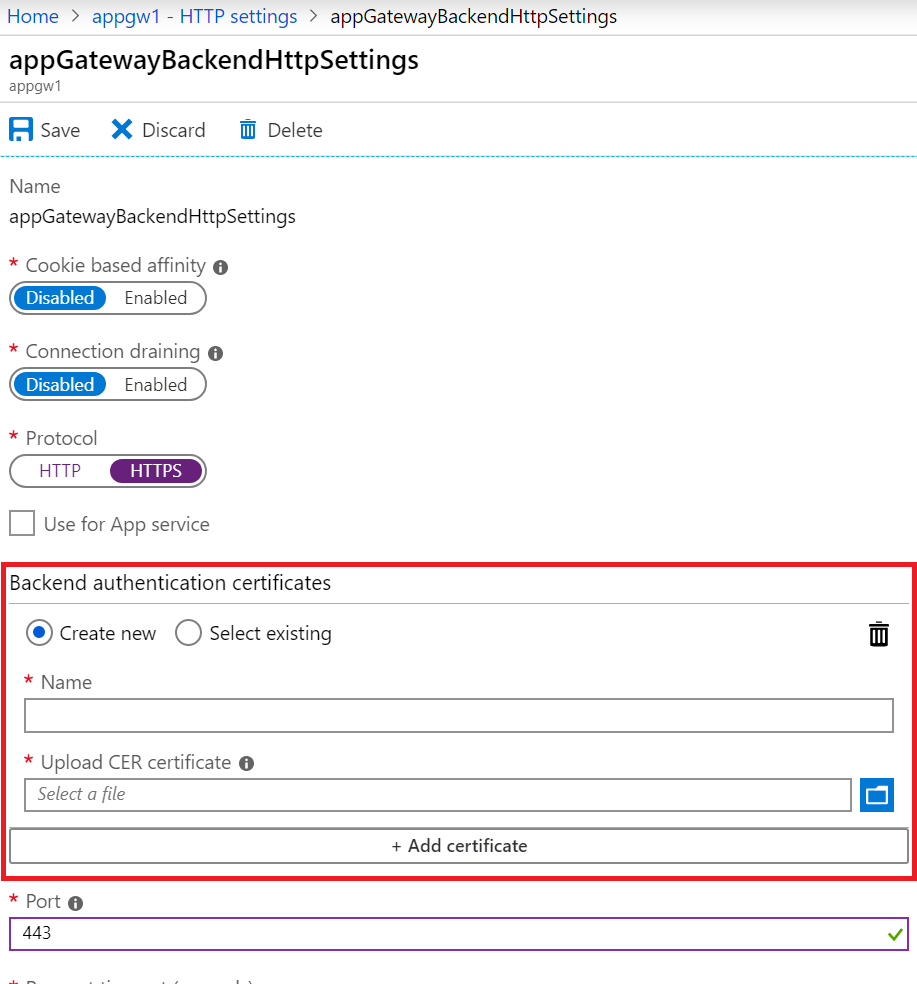

## Configure mutual authentication with Application Gateway through Portal

This article describes how to use the Azure portal to configure mutual authentication on your Application Gateway. Mutual authentication means Application Gateway authenticates the client sending the request using the client certificate you upload onto the Application Gateway. 

> [!NOTE]
> Application Gateway v2 SKU requires trusted root certificates for enabling mutual authentication. ***[DOUBLE CHECK]***

If you don't have an Azure subscription, create a [free account](https://azure.microsoft.com/free/?WT.mc_id=A261C142F) before you begin.

## Before you begin

To configure mutual authentication with an Application Gateway, you need a client certificate to upload to the gateway. The client certificate will be used to validate the certificate the client will present to Application Gateway.  

To learn more, especially about what kind of client certificates you can upload, see [Overview of mutual authentication with Application Gateway](./mutual-authentication-overview.md).

## Create a new Application Gateway

First create a new Application Gateway as you would usually through the portal - there are no additional steps needed in the creation to enable mutual authentication. For more information on how to create an Application Gateway in portal, check out our [portal quickstart tutorial](./quick-create-portal.md).

## Enable mutual authentication for an existing Application Gateway

To configure an existing application gateway with mutual authentication, you must first enable TLS termination in the listener. This action enables TLS encryption for communication between the client and the application gateway. Then, put those certificates for back-end servers in the HTTP settings on the Safe Recipients list. This configuration enables TLS encryption for communication between the application gateway and the back-end servers. That accomplishes end-to-end TLS encryption.

You'll need to use a listener with the HTTPS protocol and a certificate for enabling TLS termination. You can either use an existing listener that meets those conditions or create a new listener. If you choose the former option, you can ignore the following "Enable TLS termination in an existing application gateway" section and move directly to the "Add authentication/trusted root certificates for backend servers" section.

If you choose the latter option, apply the steps in the following procedure.
### Enable TLS termination in an existing application gateway

1. Select **All resources**, and then select **myAppGateway**.

2. Select **Listeners** from the left-side menu.

3. Select either **Basic** or **Multi-site** listener depending on your requirements.

4. Under **Protocol**, select **HTTPS**. A pane for **Certificate** appears.

5. Upload the PFX certificate you intend to use for TLS termination between the client and the application gateway.

   > [!NOTE]
   > For testing purposes, you can use a self-signed certificate. However, this is not advised for production workloads, because they're harder to manage and aren't completely secure. For more info, see [create a self-signed certificate](./create-ssl-portal.md#create-a-self-signed-certificate).

6. Add other required settings for the **Listener**, depending on your requirements.

7. Select **OK** to save.

### Add authentication/trusted root certificates of back-end servers

1. Select **All resources**, and then select **myAppGateway**.

2. Select **HTTP settings** from the left-side menu. You can either put certificates in an existing back-end HTTP setting on the Safe Recipients list or create a new HTTP setting. (In the next step, the certificate for the default HTTP setting, **appGatewayBackendHttpSettings**, is added to the Safe Recipients list.)

3. Select **appGatewayBackendHttpSettings**.

4. Under **Protocol**, select **HTTPS**. A pane for **Backend authentication certificates or Trusted root certificates** appears. 

5. Select **Create new**.

6. In the **Name** field, enter a suitable name.

7. Select the certificate file in the **Upload CER certificate** box.

   For Standard and WAF (v1) application gateways, you should upload the public key of your back-end server certificate in .cer format.

   

   For Standard_v2 and WAF_v2 application gateways, you should upload the root certificate of the back-end server certificate in .cer format. If the back-end certificate is issued by a well-known CA, you can select the **Use Well Known CA Certificate** check box, and then you don't have to upload a certificate.

   

8. Select **Save**.

## Next steps

> [!div class="nextstepaction"]
> [Manage web traffic with an application gateway using the Azure CLI](./tutorial-manage-web-traffic-cli.md)