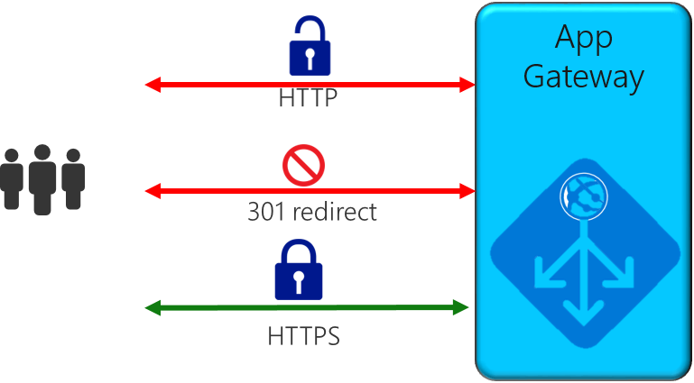

# Application Gateway redirect overview

You can use application gateway to redirect traffic.  It has a generic redirection mechanism which allows for redirecting traffic received at one listener to another listener or to an external site. This simplifies application configuration, optimizes the resource usage, and supports new redirection scenarios including global and path-based redirection.

A common redirection scenario for many web applications is to support automatic HTTP to HTTPS redirection to ensure all communication between application and its users occurs over an encrypted path. In the past, customers have used techniques such as creating a dedicated backend pool whose sole purpose is to redirect requests it receives on HTTP to HTTPS. With redirection support in Application Gateway, you can accomplish this simply by adding a new redirect configuration to a routing rule, and specifying another listener with HTTPS protocol as the target listener.

## Redirection types
A redirect type sets the response status code for the clients to understand the purpose of the redirect. The following types of redirection are supported:

- 301 (Moved permanently): Indicates that the target resource has been assigned a new permanent URI. Any future references to this resource will use one of the enclosed URIs. Use 301 status code for HTTP to HTTPS redirection.
- 302 (Found): Indicates that the target resource is temporarily under a different URI. Since the redirection can change on occasion, the client should continue to use the effective request URI for future requests.
- 307 (Temporary redirect): Indicates that the target resource is temporarily under a different URI. The user agent MUST NOT change the request method if it does an automatic redirection to that URI. Since the redirection can change over time, the client ought to continue using the original effective request URI for future requests.
- 308 (Permanent redirect): Indicates that the target resource has been assigned a new permanent URI. Any future references to this resource should use one of the enclosed URIs.

## Redirection capabilities:

-  **Listener redirection**
   
   Redirects from one listener to another listener. Listener redirection is commonly used to enables HTTP to HTTPS redirection.
   
- **Path-based redirection**

   This type of redirection enables redirection only on a specific site area, for example, redirecting HTTP to HTTPS requests for a shopping cart area denoted by /cart/\*.
   
- **Redirect to external site**

With this change, customers need to create a new redirect configuration object, which specifies the target listener or external site to which redirection is desired. The configuration element also supports options to enable appending the URI path and query string to the redirected URL. You can also choose the type of redirection. Once created, this redirect configuration is attached to the source listener via a new rule. When using a basic rule, the redirect configuration is associated with a source listener and is a global redirect. When a path-based rule is used, the redirect configuration is defined on the URL path map. So it only applies to the specific path area of a site.

### Next steps

[Configure URL redirection on an application gateway](tutorial-url-redirect-powershell.md)
