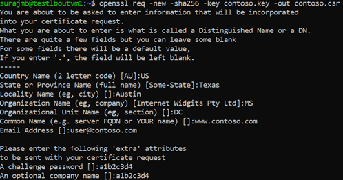
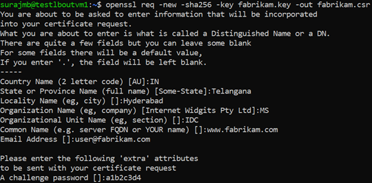
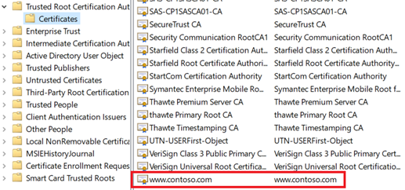

# Generate an Azure Application Gateway self-signed certificate with a custom root CA

The Application Gateway v2 SKU introduces the use of Trusted Root Certificates to allow backend servers. This removes authentication certificates that were required in the v1 SKU. The *root certificate* is a Base-64 encoded X.509(.CER) format root certificate from the backend certificate server. It identifies the root certificate authority (CA) that issued the server certificate and the server certificate is then used for the TLS/SSL communication.

Application Gateway trusts your website's certificate by default if it's signed by a well-known CA (for example, GoDaddy or DigiCert). You don't need to explicitly upload the root certificate in that case. For more information, see [Overview of TLS termination and end to end TLS with Application Gateway](ssl-overview.md). However, if you have a dev/test environment and don't want to purchase a verified CA signed certificate, you can create your own custom CA and create a self-signed certificate with it. 

> [!NOTE]
> Self-signed certificates are not trusted by default and they can be difficult to maintain. Also, they may use outdated hash and cipher suites that may not be strong. For better security, purchase a certificate signed by a well-known certificate authority.

In this article, you will learn how to:

- Create your own custom Certificate Authority
- Create a self-signed certificate signed by your custom CA
- Upload a self-signed root certificate to an Application Gateway to authenticate the backend server

## Prerequisites

- **[OpenSSL](https://www.openssl.org/) on a computer running Windows or Linux** 

   While there could be other tools available for certificate management, this tutorial uses OpenSSL. You can find OpenSSL bundled with many Linux distributions, such as Ubuntu.
- **A web server**

   For example, Apache, IIS, or NGINX to test the certificates.

- **An Application Gateway v2 SKU**
   
  If you don't have an existing application gateway, see [Quickstart: Direct web traffic with Azure Application Gateway - Azure portal](quick-create-portal.md).

## Create a root CA certificate

Create your root CA certificate using OpenSSL.

### Create the root key

1. Sign in to your computer where OpenSSL is installed and run the following command. This creates an encrypted key.

   ```
   openssl ecparam -out contoso.key -name prime256v1 -genkey
   ```
   
### Create a Root Certificate and self-sign it

1. Use the following command to generate the Certificate Signing Request (CSR).

   ```
   openssl req -new -sha256 -key contoso.key -out contoso.csr
   ```

1. When prompted, type the password for the root key, and the organizational information for the custom CA such as Country/Region, State, Org, OU, and the fully qualified domain name (this is the domain of the issuer).

   

1. Use the following command to generate the Root Certificate.

   ```
   openssl x509 -req -sha256 -days 365 -in contoso.csr -signkey contoso.key -out contoso.crt
   ```
   The previous commands create the root certificate. You'll use this to sign your server certificate.

## Create a server certificate

Next, you'll create a server certificate using OpenSSL.

### Create the certificate's key

Use the following command to generate the key for the server certificate.

   ```
   openssl ecparam -out fabrikam.key -name prime256v1 -genkey
   ```

### Create the CSR (Certificate Signing Request)

The CSR is a public key that is given to a CA when requesting a certificate. The CA issues the certificate for this specific request.

> [!NOTE]
> The CN (Common Name) for the server certificate must be different from the issuer's domain. For example, in this case, the CN for the issuer is `www.contoso.com` and the server certificate's CN is `www.fabrikam.com`.


1. Use the following command to generate the CSR:

   ```
   openssl req -new -sha256 -key fabrikam.key -out fabrikam.csr
   ```

1. When prompted, type the password for the root key, and the organizational information for the custom CA: Country/Region, State, Org, OU, and the fully qualified domain name. This is the domain of the website and it should be different from the issuer.

   

### Generate the certificate with the CSR and the key and sign it with the CA's root key

1. Use the following command to create the certificate:

   ```
   openssl x509 -req -in fabrikam.csr -CA  contoso.crt -CAkey contoso.key -CAcreateserial -out fabrikam.crt -days 365 -sha256
   ```
### Verify the newly created certificate

1. Use the following command to print the output of the CRT file and verify its content:

   ```
   openssl x509 -in fabrikam.crt -text -noout
   ```

   

1. Verify the files in your directory, and ensure you have the following files:

   - contoso.crt
   - contoso.key
   - fabrikam.crt
   - fabrikam.key

## Configure the certificate in your web server's TLS settings

In your web server, configure TLS using the fabrikam.crt and fabrikam.key files. If your web server can't take two files, you can combine them to a single .pem or .pfx file using OpenSSL commands.

### IIS

For instructions on how to import certificate and upload them as server certificate on IIS, see [HOW TO: Install Imported Certificates on a Web Server in Windows Server 2003](https://support.microsoft.com/help/816794/how-to-install-imported-certificates-on-a-web-server-in-windows-server).

For TLS binding instructions, see [How to Set Up SSL on IIS 7](/iis/manage/configuring-security/how-to-set-up-ssl-on-iis#create-an-ssl-binding-1).

### Apache

The following configuration is an example [virtual host configured for SSL](https://cwiki.apache.org/confluence/display/HTTPD/NameBasedSSLVHosts) in Apache:

```
<VirtualHost www.fabrikam:443>
      DocumentRoot /var/www/fabrikam
      ServerName www.fabrikam.com
      SSLEngine on
      SSLCertificateFile /home/user/fabrikam.crt
      SSLCertificateKeyFile /home/user/fabrikam.key
</VirtualHost>
```

### NGINX

The following configuration is an example [NGINX server block](https://nginx.org/docs/http/configuring_https_servers.html) with TLS configuration:


## Access the server to verify the configuration

1. Add the root certificate to your machine's trusted root store. When you access the website, ensure the entire certificate chain is seen in the browser.

   

   > [!NOTE]
   > It's assumed that DNS has been configured to point the web server name (in this example, www.fabrikam.com) to your web server's IP address. If not, you can edit the [hosts file](https://answers.microsoft.com/en-us/windows/forum/all/how-to-edit-host-file-in-windows-10/7696f204-2aaf-4111-913b-09d6917f7f3d) to resolve the name.
1. Browse to your website, and click the lock icon on your browser's address box to verify the site and certificate information.

## Verify the configuration with OpenSSL

Or, you can use OpenSSL to verify the certificate.

```
openssl s_client -connect localhost:443 -servername www.fabrikam.com -showcerts
```


## Upload the root certificate to Application Gateway's HTTP Settings

To upload the certificate in Application Gateway, you must export the .crt certificate into a .cer format Base-64 encoded. Since .crt already contains the public key in the base-64 encoded format, just rename the file extension from .crt to .cer. 

### Azure portal

To upload the trusted root certificate from the portal, select the **Backend Settings** and select **HTTPS**  in the **Backend protocol**.

:::image type="content" source="./media/self-signed-certificates/portal-cert.png" alt-text="Screenshot of adding a certificate using the portal.":::
### Azure PowerShell

Or, you can use Azure CLI or Azure PowerShell to upload the root certificate. The following code is an Azure PowerShell sample.

> [!NOTE]
> The following sample adds a trusted root certificate to the application gateway, creates a new HTTP setting and adds a new rule, assuming the backend pool and the listener exist already.

```azurepowershell
## Add the trusted root certificate to the Application Gateway

$gw=Get-AzApplicationGateway -Name appgwv2 -ResourceGroupName rgOne

Add-AzApplicationGatewayTrustedRootCertificate `
   -ApplicationGateway $gw `
   -Name CustomCARoot `
   -CertificateFile "C:\Users\surmb\Downloads\contoso.cer"

$trustedroot = Get-AzApplicationGatewayTrustedRootCertificate `
   -Name CustomCARoot `
   -ApplicationGateway $gw

## Get the listener, backend pool and probe

$listener = Get-AzApplicationGatewayHttpListener `
   -Name basichttps `
   -ApplicationGateway $gw

$bepool = Get-AzApplicationGatewayBackendAddressPool `
  -Name testbackendpool `
  -ApplicationGateway $gw

Add-AzApplicationGatewayProbeConfig `
  -ApplicationGateway $gw `
  -Name testprobe `
  -Protocol Https `
  -HostName "www.fabrikam.com" `
  -Path "/" `
  -Interval 15 `
  -Timeout 20 `
  -UnhealthyThreshold 3

$probe = Get-AzApplicationGatewayProbeConfig `
  -Name testprobe `
  -ApplicationGateway $gw

## Add the configuration to the HTTP Setting and don't forget to set the "hostname" field
## to the domain name of the server certificate as this will be set as the SNI header and
## will be used to verify the backend server's certificate. Note that TLS handshake will
## fail otherwise and might lead to backend servers being deemed as Unhealthy by the probes

Add-AzApplicationGatewayBackendHttpSettings `
  -ApplicationGateway $gw `
  -Name testbackend `
  -Port 443 `
  -Protocol Https `
  -Probe $probe `
  -TrustedRootCertificate $trustedroot `
  -CookieBasedAffinity Disabled `
  -RequestTimeout 20 `
  -HostName www.fabrikam.com

## Get the configuration and update the Application Gateway

$backendhttp = Get-AzApplicationGatewayBackendHttpSettings `
  -Name testbackend `
  -ApplicationGateway $gw

Add-AzApplicationGatewayRequestRoutingRule `
  -ApplicationGateway $gw `
  -Name testrule `
  -RuleType Basic `
  -BackendHttpSettings $backendhttp `
  -HttpListener $listener `
  -BackendAddressPool $bepool

Set-AzApplicationGateway -ApplicationGateway $gw 
```

### Verify the application gateway backend health

1. Click the **Backend Health** view of your application gateway to check if the probe is healthy.
1. You should see that the Status is **Healthy** for the HTTPS probe.


## Next steps

To learn more about SSL\TLS in Application Gateway, see [Overview of TLS termination and end to end TLS with Application Gateway](ssl-overview.md).
