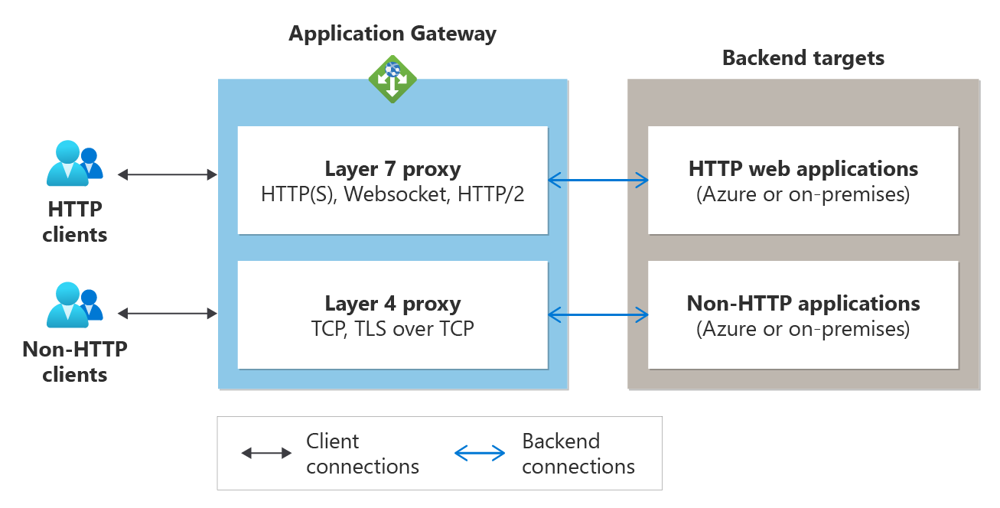

# Application Gateway TCP/TLS proxy overview

In addition to the existing Layer 7 capabilities (HTTP, HTTPS, WebSockets and HTTP/2), Azure Application Gateway now also supports Layer 4 (TCP protocol) and TLS (Transport Layer Security) proxying.

## Application Gateway Layer 4 capabilities

As a reverse proxy service, the Layer 4 operations of Application Gateway work similar to its Layer 7 proxy operations. A client establishes a TCP connection with Application Gateway, and Application Gateway itself initiates a new TCP connection to a backend server from the backend pool. The following figure shows typical operation.

 

Process flow:

1. A client initiates a TCP connection with Application Gateway by using the listener’s IP address and port number (frontend connection). The client’s request for a supported protocol from the application layer is sent to the Application Gateway on this frontend TCP connection.
2. The Application Gateway, in turn, establishes a new connection with one the backend targets from the associated backend pool (backend connection). The client's request is sent to backend server on this backend TCP connection.
3. The backend server sends response data to the application gateway, which is then forwarded to the client.
4. The same frontend TCP connection can be used for future requests from the client.

## Next steps