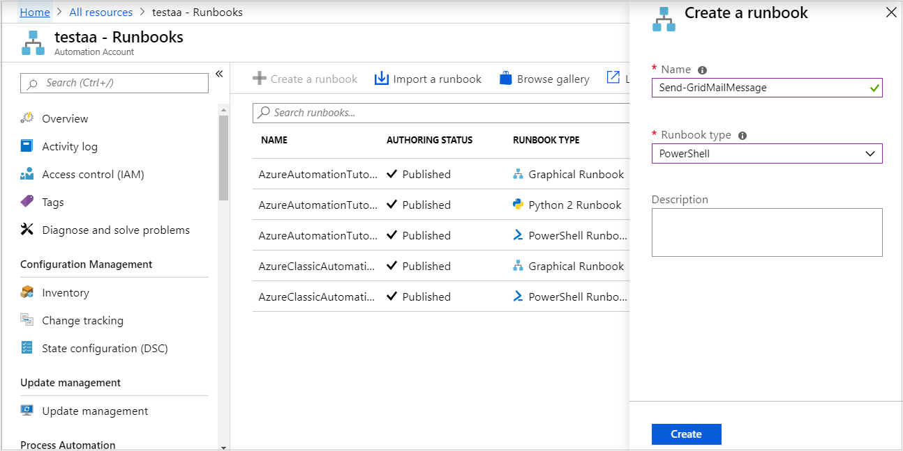

# Send an email from a runbook

You can send an email from a runbook with [SendGrid](https://sendgrid.com/solutions) using PowerShell. 

## Prerequisites

* Azure subscription. If you don't have one yet, you can  [activate your MSDN subscriber benefits](https://azure.microsoft.com/pricing/ember-offers/msdn-benefits-details/) or sign up for a [free account](https://azure.microsoft.com/free/?WT.mc_id=A261C142F).
* [A SendGrid account](/azure/sendgrid-dotnet-how-to-send-email#create-a-sendgrid-account).
* [Automation account](automation-offering-get-started.md) with **Az** modules.
* [Run As account](automation-create-runas-account.md) to store and execute the runbook.

## Create an Azure Key Vault

You can create an Azure Key Vault using the following PowerShell script. Replace the variable values with values specific to your environment. Use the embedded Azure Cloud Shell via the **Try It** button, located in the top right corner of the code block. You can also copy and run the code locally if you have the [Az modules](/powershell/azure/install-az-ps) installed on your local machine.

> [!NOTE]
> To retrieve your API key, use the steps in [Find your SendGrid API key](/azure/sendgrid-dotnet-how-to-send-email#to-find-your-sendgrid-api-key).

```azurepowershell-interactive
$SubscriptionId  =  "<subscription ID>"

# Sign in to your Azure account and select your subscription
# If you omit the SubscriptionId parameter, the default subscription is selected.
Connect-AzAccount -SubscriptionId $SubscriptionId

# Use Get-AzLocation to see your available locations.
$region = "southcentralus"
$KeyVaultResourceGroupName  = "mykeyvaultgroup"
$VaultName = "<Enter a universally unique vault name>"
$SendGridAPIKey = "<SendGrid API key>"
$AutomationAccountName = "testaa"

# Create new Resource Group, or omit this step if you already have a resource group.
New-AzResourceGroup -Name $KeyVaultResourceGroupName -Location $region

# Create the new key vault
$newKeyVault = New-AzKeyVault -VaultName $VaultName -ResourceGroupName $KeyVaultResourceGroupName -Location $region
$resourceId = $newKeyVault.ResourceId

# Convert the SendGrid API key into a SecureString
$Secret = ConvertTo-SecureString -String $SendGridAPIKey -AsPlainText -Force
Set-AzKeyVaultSecret -VaultName $VaultName -Name 'SendGridAPIKey' -SecretValue $Secret

# Grant access to the Key Vault to the Automation Run As account.
$connection = Get-AzAutomationConnection -ResourceGroupName $KeyVaultResourceGroupName -AutomationAccountName $AutomationAccountName -Name AzureRunAsConnection
$appID = $connection.FieldDefinitionValues.ApplicationId
Set-AzKeyVaultAccessPolicy -VaultName $VaultName -ServicePrincipalName $appID -PermissionsToSecrets Set, Get
```

For other ways to create an Azure Key Vault and store a secret, see [Key Vault quickstarts](/azure/key-vault/).

## Import required modules into your Automation account

To use Azure Key Vault within a runbook, you must import the following modules into your Automation account:

    * [Az.Profile](https://www.powershellgallery.com/packages/Az.Profile)
    * [Az.KeyVault](https://www.powershellgallery.com/packages/Az.KeyVault)

For instructions, see [Import Az modules](shared-resources/modules.md#import-az-modules).

## Create the runbook to send an email

After you have created a Key Vault and stored your `SendGrid` API key, it's time to create the runbook that retrieves the API key and sends an email. Let's use a runbook that uses `AzureRunAsConnection` as a [Run As account](automation-create-runas-account.md) to
authenticate with Azure to retrieve the secret from Azure Key Vault. We'll call the runbook **Send-GridMailMessage**. You can modify the PowerShell script used for example purposes, and reuse it for different scenarios.

1. Go to your Azure Automation account.
2. Under **Process Automation**, select **Runbooks**.
3. At the top of the list of runbooks, select **+ Create a runbook**.
4. On the Add Runbook page, enter **Send-GridMailMessage** for the runbook name. For the runbook type, select **PowerShell**. Then, select **Create**.
   
5. The runbook is created and the Edit PowerShell Runbook page opens.
   
6. Copy the following PowerShell example into the Edit page. Ensure that the `VaultName` specifies the name you've chosen for your Key Vault.

    ```powershell-interactive
    Param(
      [Parameter(Mandatory=$True)]
      [String] $destEmailAddress,
      [Parameter(Mandatory=$True)]
      [String] $fromEmailAddress,
      [Parameter(Mandatory=$True)]
      [String] $subject,
      [Parameter(Mandatory=$True)]
      [String] $content
    )

    $Conn = Get-AutomationConnection -Name AzureRunAsConnection
    Connect-AzAccount -ServicePrincipal -Tenant $Conn.TenantID -ApplicationId $Conn.ApplicationID -CertificateThumbprint $Conn.CertificateThumbprint | Out-Null
    $VaultName = "<Enter your vault name>"
    $SENDGRID_API_KEY = (Get-AzKeyVaultSecret -VaultName $VaultName -Name "SendGridAPIKey").SecretValueText
    $headers = New-Object "System.Collections.Generic.Dictionary[[String],[String]]"
    $headers.Add("Authorization", "Bearer " + $SENDGRID_API_KEY)
    $headers.Add("Content-Type", "application/json")

    $body = @{
    personalizations = @(
        @{
            to = @(
                    @{
                        email = $destEmailAddress
                    }
            )
        }
    )
    from = @{
        email = $fromEmailAddress
    }
    subject = $subject
    content = @(
        @{
            type = "text/plain"
            value = $content
        }
    )
    }

    $bodyJson = $body | ConvertTo-Json -Depth 4

    $response = Invoke-RestMethod -Uri https://api.sendgrid.com/v3/mail/send -Method Post -Headers $headers -Body $bodyJson
    ```

7. Select **Publish** to save and publish the runbook.

To verify that the runbook executes successfully, you can follow the steps under [Test a runbook](manage-runbooks.md#test-a-runbook) or [Start a runbook](start-runbooks.md).

If you don't initially see your test email, check your **Junk** and **Spam** folders.

## Clean up after the email operation

1. When the runbook is no longer needed, select it in the runbook list and click **Delete**.

2. Delete the Key Vault by using the [Remove-AzKeyVault](https://docs.microsoft.com/powershell/module/az.keyvault/remove-azkeyvault?view=azps-3.7.0) cmdlet.

```azurepowershell-interactive
$VaultName = "<your KeyVault name>"
$ResourceGroupName = "<your ResourceGroup name>"
Remove-AzKeyVault -VaultName $VaultName -ResourceGroupName $ResourceGroupName
```

## Next steps

* [Update Azure PowerShell modules](automation-update-azure-modules.md)
* [Forward Azure Automation job data to Azure Monitor logs](automation-manage-send-joblogs-log-analytics.md)
* [Use an alert to trigger an Azure Automation runbook](automation-create-alert-triggered-runbook.md)
* [Troubleshoot runbook issues](./troubleshoot/runbooks.md)
