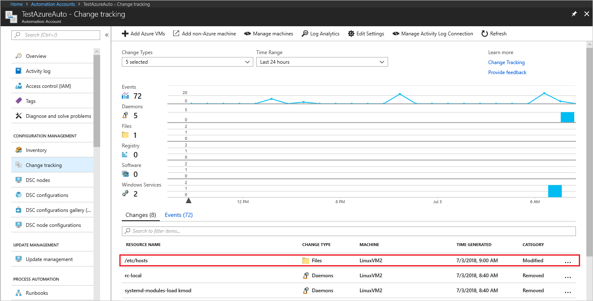

# Manage Change Tracking and Inventory

When you add a new file or registry key to track, Azure Automation enables it for [Change Tracking and Inventory](overview.md). This article describes how to configure tracking, review tracking results, and handle alerts when changes are detected.

Before using the procedures in this article, ensure that you've enabled Change Tracking and Inventory on your VMs using one of these techniques:

* [Enable Change Tracking and Inventory from an Automation account](enable-from-automation-account.md)
* [Enable Change Tracking and Inventory by browsing the Azure portal](enable-from-portal.md)
* [Enable Change Tracking and Inventory from a runbook](enable-from-runbook.md)
* [Enable Change Tracking and Inventory from an Azure VM](enable-from-vm.md)

## Limit the scope for the deployment

Change Tracking and Inventory uses a scope configuration within the workspace to target the computers to receive changes. For more information, see [Limit Change Tracking and Inventory deployment scope](manage-scope-configurations.md).

## Track files

You can use Change Tracking and Inventory to track changes to files and folders/directories. This section tells how to configure file tracking on Windows and on Linux.

### Configure file tracking on Windows

Use the following steps to configure file tracking on Windows computers:

1. Sign in to the [Azure portal](https://portal.azure.com).

2. In the Azure portal, select **All services**. In the list of resources, type **Automation**. As you begin typing, the list filters suggestions based on your input. Select **Automation Accounts**.

3. In your list of Automation accounts, select the account you chose when you enabled Change Tracking and Inventory.

4. In your Automation account, select **Change tracking** under **Configuration Management**.

5. Select **Edit Settings** (the gear symbol).

6. On the Workspace Configuration page, select **Windows Files**, then click **+ Add** to add a new file to track.

7. On the Add Windows File for Change Tracking pane, enter the information for the file or folder to track and click **Save**. The following table defines the properties that you can use for the information.

    |Property  |Description  |
    |---------|---------|
    |Enabled     | True if the setting is applied, and False otherwise.        |
    |Item Name     | Friendly name of the file to be tracked.        |
    |Group     | A group name for logically grouping files.        |
    |Enter Path     | The path to check for the file, for example, **c:\temp\\\*.txt**. You can also use environment variables, such as `%winDir%\System32\\\*.*`.       |
    |Path Type     | The type of path. Possible values are File and Folder.        |    
    |Recursion     | True if recursion is used when looking for the item to be tracked, and False otherwise.        |    
    |Upload file content | True to upload file content on tracked changes, and False otherwise.|

    If you plan on configuring monitoring of files and folders using wildcards, consider the following:

    - Wildcards are required for tracking multiple files.
    - Wildcards can only be used in the last segment of a path, such as *C:\folder\file* or */etc/*.conf*
    - If an environment variable includes a path that is not valid, validation will succeed but the path will fail when inventory runs.
    - When setting the path, avoid general paths such as *c:*.** which will result in too many folders being traversed.

8. Ensure that you specify True for **Upload file content**. This setting enables file content tracking for the indicated file path.

### Configure file tracking on Linux

Use the following steps to configure file tracking on Linux computers:

1. Select **Edit Settings** (the gear symbol).

2. On the Workspace Configuration page, select **Linux Files**, then select **+ Add** to add a new file to track.

3. On the **Add Linux File for Change Tracking** page, enter the information for the file or directory to track and then select **Save**. The following table defines the properties that you can use for the information.

    |Property  |Description  |
    |---------|---------|
    |Enabled     | True if the setting is applied, and False otherwise.        |
    |Item Name     | Friendly name of the file to be tracked.        |
    |Group     | A group name for logically grouping files.        |
    |Enter Path     | The path to check for the file, for example, **/etc/*.conf**.       |
    |Path Type     | The type of path. Possible values are File and Directory.        |
    |Recursion     | True if recursion is used when looking for the item to be tracked, and False otherwise.        |
    |Use Sudo     | True to use sudo when checking for the item, and False otherwise.   **Note:** The Use Sudo feature is currently available on the Azure portal and not yet implemented in the Change Tracking service. Therefore, when you edit the settings on the Azure portal, you will not find any change in the service.      |
    |Links     | Setting that determines how to deal with symbolic links when traversing directories. Possible values are:  Ignore - Ignores symbolic links and doesn't include the files/directories referenced. Follow - Follows the symbolic links during recursion and also includes the files/directories referenced. Manage - Follows the symbolic links and allows alteration of returned content. **Note:** The Manage option isn't recommended, as it doesn't support file content retrieval.    |
    |Upload file content | True to upload file content on tracked changes, and False otherwise. |

4. Ensure that you specify **True** for **Upload file content**. This setting enables file content tracking for the indicated file path.

   

## Track file contents

File content tracking allows you to view the contents of a file before and after a tracked change. The feature saves the file contents to a [storage account](../../storage/common/storage-account-overview.md) after each change occurs. Here are some rules to follow for tracking file contents:

* A standard storage account using the Resource Manager deployment model is required for storing file content.
* By default, storage accounts accept connections from clients on any network. If you have secured your storage account to allow only certain traffic, you need to modify your configuration rules to allow your Automation account to connect to it. See [Configure Azure Storage firewalls and virtual networks](../../storage/common/storage-network-security.md).
* Don't use premium and classic deployment model storage accounts. See [About Azure Storage accounts](../../storage/common/storage-account-create.md).
* You can connect the storage account to only one Automation account.
* Change Tracking and Inventory must be enabled in your Automation account.

>[!NOTE]
> If the file size is >1.25MB, the checksum calculation doesn't complete due to memory constraints.

### Enable tracking for file content changes

Use the following steps to enable tracking for changes to file contents:

1. Select **Edit Settings** (the gear symbol).

2. Select **File Content** and then select **Link**. This selection opens the **Add Content Location for Change Tracking** page.

   

3. Select the subscription and storage account to use for storing the file contents.

5. If you want to enable file content tracking for all existing tracked files, select **On** for **Upload file content for all settings**. You can change this setting for each file path later.

   

6. Change Tracking and Inventory shows storage account and Shared Access Signature (SAS) URIs when it enables file content change tracking. The signatures expire after 365 days, and you can recreate them by selecting **Regenerate**.

   

### View the contents of a tracked file

Once Change Tracking and Inventory detects a change for a tracked file, you can view the file contents on the Change Details pane.  

1. On the **Change tracking** page from your Automation account, choose a file in the list of changes and then select **View File Content Changes** to see the contents of the file. The change details pane shows you the standard before and after file information for each property.

   

2. You're viewing the file contents in a side-by-side view. You can select **Inline** to see an inline view of the changes.

## Track registry keys

Use the following steps to configure registry key tracking on Windows computers:

1. On the **Change tracking** page from your Automation account, select **Edit Settings** (the gear symbol).

2. On the Workspace Configuration page, select **Windows Registry**.

3. Select **+ Add** to add a new registry key to track.

4. On the **Add Windows Registry for Change Tracking** page, enter the information for the key to track and then select **Save**. The following table defines the properties that you can use for the information. When specifying a registry path, it must be the key and not a value.

    |Property  |Description  |
    |---------|---------|
    |Enabled     | True if a setting is applied, and False otherwise.        |
    |Item Name     | Friendly name of the registry key to track.        |
    |Group     | Group name for logically grouping registry keys.        |
    |Windows Registry Key   | Key name with path, for example, `HKEY_LOCAL_MACHINE\SOFTWARE\Microsoft\Windows\CurrentVersion\Explorer\User Shell Folders\Common Startup`.      |

## Search logs for change records

You can do various searches against the Azure Monitor logs for change records. With the Change tracking page open, click **Log Analytics** to open the Logs page. The following table provides sample log searches for change records.

|Query  |Description  |
|---------|---------|
|`ConfigurationData` &#124; `where ConfigDataType == "WindowsServices" and SvcStartupType == "Auto"` &#124; `where SvcState == "Stopped"` &#124; `summarize arg_max(TimeGenerated, *) by SoftwareName, Computer`         | Shows the most recent inventory records for Windows services that were set to Auto but were reported as being Stopped. Results are limited to the most recent record for the specified software name and computer.    |
|`ConfigurationChange` &#124; `where ConfigChangeType == "Software" and ChangeCategory == "Removed"` &#124; `order by TimeGenerated desc`|Shows change records for removed software.|

## Next steps

* For information about scope configurations, see [Limit Change Tracking and Inventory deployment scope](manage-scope-configurations.md).
* If you need to search logs stored in Azure Monitor Logs, see [Log searches in Azure Monitor Logs](../../azure-monitor/logs/log-query-overview.md).
* If finished with deployments, see [Remove Change Tracking and Inventory](remove-feature.md).
* To delete your VMs from Change Tracking and Inventory, see [Remove VMs from Change Tracking and Inventory](remove-vms-from-change-tracking.md).
* To troubleshoot feature errors, see [Troubleshoot Change Tracking and Inventory issues](../troubleshoot/change-tracking.md).
