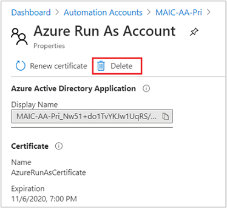

# Delete an Azure Automation Run As account

> [!IMPORTANT]
> Azure Automation Run As Account will retire on September 30, 2023 and will be replaced with Managed Identities. Before that date, you'll need to start migrating your runbooks to use [managed identities](automation-security-overview.md#managed-identities). For more information, see [migrating from an existing Run As accounts to managed identity](https://learn.microsoft.com/azure/automation/migrate-run-as-accounts-managed-identity?tabs=run-as-account#sample-scripts) to start migrating the runbooks from Run As account to managed identities before 30 September 2023.

Run As accounts in Azure Automation provide authentication for managing resources on the Azure Resource Manager or Azure Classic deployment model using Automation runbooks and other Automation features. This article describes how to delete a Run As or Classic Run As account. When you perform this action, the Automation account is retained. After you delete the Run As account, you can re-create it in the Azure portal or with the provided PowerShell script.

## Delete a Run As or Classic Run As account

1. In the Azure portal, open the Automation account.

2. In the left pane, select **Run As Accounts** in the account settings section.

3. On the Run As Accounts properties page, select either the Run As account or Classic Run As account that you want to delete.

4. On the Properties pane for the selected account, click **Delete**.

   

5. While the account is being deleted, you can track the progress under **Notifications** from the menu. Run As accounts can't be restored after deletion.

## Next steps

* [Application Objects and Service Principal Objects](../active-directory/develop/app-objects-and-service-principals.md).
* [Certificates overview for Azure Cloud Services](../cloud-services/cloud-services-certs-create.md).
