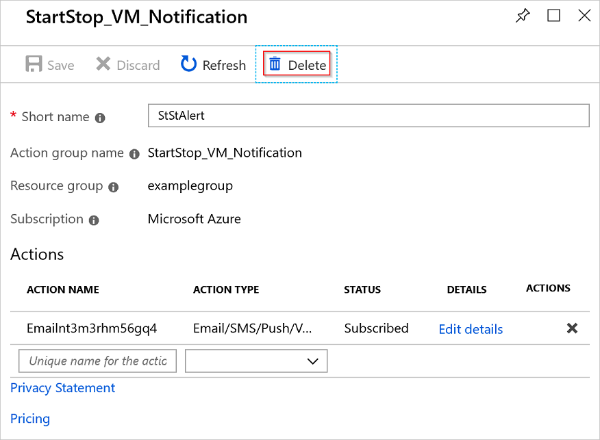

# Delete your Azure Automation account

 You can move resources through the Azure portal, PowerShell, the Azure CLI, or the REST API.

If you want to delete your Azure Automation account, you'll need to prepare the account first. The high-level steps for deleting your Automation account are:

1. [Disable your features.](#disable-features)
1. [Unlink your workspace.](#unlink-your-workspace)
1. [Delete the Automation account.](#delete-your-automation-account)

>[!NOTE]
>Azure Automation allows you to move some resources to a new resource group or subscription. Automation accounts are among the resources that can be moved. To learn more about the process, see [Move resources to a new resource group or subscription](../../azure-resource-manager/management/move-resource-group-and-subscription.md).

## Disable features

To unlink your workspace from your Automation account, you must first remove these feature resources in your workspace:

- Change Tracking and Inventory
- Update Management
- Start/Stop VMs during off-hours

1. In the Azure portal, locate your resource group.
1. Find each feature, and select **Delete** on the **Delete Resources** page.

    

If you prefer, you can delete the resources by using the [Remove-AzResource](/powershell/module/Az.Resources/Remove-AzResource) cmdlet:

```azurepowershell-interactive
$workspaceName = <myWorkspaceName>
$resourceGroupName = <myResourceGroup>
Remove-AzResource -ResourceType 'Microsoft.OperationsManagement/solutions' -ResourceName "ChangeTracking($workspaceName)" -ResourceGroupName $resourceGroupName
Remove-AzResource -ResourceType 'Microsoft.OperationsManagement/solutions' -ResourceName "Updates($workspaceName)" -ResourceGroupName $resourceGroupName
Remove-AzResource -ResourceType 'Microsoft.OperationsManagement/solutions' -ResourceName "Start-Stop-VM($workspaceName)" -ResourceGroupName $resourceGroupName
```

### Remove alert rules for Start/Stop VMs during off-hours

For Start/Stop VMs during off-hours, you also need to remove the alert rules created by the feature.

1. In the Azure portal, go to your resource group and select **Monitoring** > **Alerts** > **Manage alert rules**.

   

1. On the Rules page, you should see a list of the alerts configured in that resource group. The feature creates these rules:

    * AutoStop_VM_Child
    * ScheduledStartStop_Parent
    * SequencedStartStop_Parent

1. Select the rules one at a time, and select **Delete** to remove them.

    

    > [!IMPORTANT]
    > If you don't see any alert rules on the Rules page, change the **Status** field to **Disabled** to show disabled alerts. 

1. When you remove the alert rules, you must remove the action group created for Start/Stop VMs during off-hours notifications. In the Azure portal, select **Monitor** > **Alerts** > **Manage action groups**.

1. Select **StartStop_VM_Notification**. 

1. On the action group page, select **Delete**.

    

If you prefer, you can delete your action group by using the [Remove-AzActionGroup](/powershell/module/az.monitor/remove-azactiongroup) cmdlet:

```azurepowershell-interactive
Remove-AzActionGroup -ResourceGroupName <myResourceGroup> -Name StartStop_VM_Notification
```

## Unlink your workspace

Now you can unlink your workspace:

1. In the Azure portal, select **Automation account** > **Related Resources** > **Linked workspace**.

1. Select **Unlink workspace** to unlink the workspace from your Automation account.

    

## Delete your Automation account

Now that you've deleted or unlinked all of the account's resources, you can delete your Automation account. In the Azure portal, select **All services** > **Automation accounts** and click on the Delete button.


If you prefer, you can delete your Automation account by using the [Remove-AzAutomationAccount](/powershell/module/az.automation/remove-azautomationaccount) cmdlet:

```azurepowershell-interactive
Remove-AzAutomationAccount -Name "ContosoAutomationAccount" -Force -ResourceGroupName "ResourceGroup01"
```

## Next steps

To learn about moving resources in Azure, see [Move resources in Azure](../../azure-resource-manager/management/move-support-resources.md).
