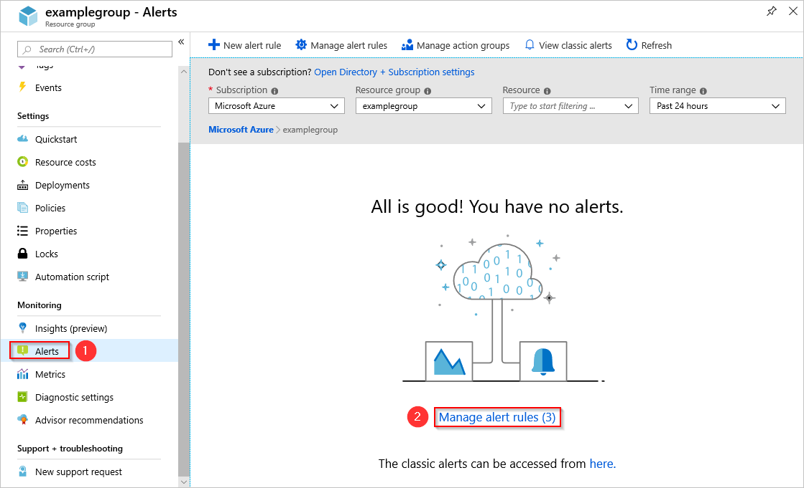

# Move your Azure Automation account to another subscription

Azure Automation allows you to move some resources to a new resource group or subscription. You can move resources through the Azure portal, PowerShell, the Azure CLI, or the REST API. To learn more about the process, see [Move resources to a new resource group or subscription](../../azure-resource-manager/management/move-resource-group-and-subscription.md).

The Automation account is one of the resources that you can move. In this article, you'll learn to move Automation accounts to another resource or subscription. The high-level steps for moving your Automation account are:

1. Disable your features.
2. Unlink your workspace.
3. Move the Automation account.
4. Re-enable your features.

## Remove features

To unlink your workspace from your Automation account, you must remove the feature resources in your workspace:

- Change Tracking and Inventory
- Update Management
- Start/Stop VMs during off-hours

1. In the Azure portal, locate your resource group.
2. Find each feature, and select **Delete** on the **Delete Resources** page.

    

If you prefer, you can delete the resources by using the [Remove-AzResource](/powershell/module/Az.Resources/Remove-AzResource) cmdlet:

```azurepowershell-interactive
$workspaceName = <myWorkspaceName>
$resourceGroupName = <myResourceGroup>
Remove-AzResource -ResourceType 'Microsoft.OperationsManagement/solutions' -ResourceName "ChangeTracking($workspaceName)" -ResourceGroupName $resourceGroupName
Remove-AzResource -ResourceType 'Microsoft.OperationsManagement/solutions' -ResourceName "Updates($workspaceName)" -ResourceGroupName $resourceGroupName
Remove-AzResource -ResourceType 'Microsoft.OperationsManagement/solutions' -ResourceName "Start-Stop-VM($workspaceName)" -ResourceGroupName $resourceGroupName
```

### Remove alert rules for Start/Stop VMs during off-hours

For Start/Stop VMs during off-hours, you also need to remove the alert rules created by the feature.

1. In the Azure portal, go to your resource group and select **Monitoring** > **Alerts** > **Manage alert rules**.

   

2. On the Rules page, you should see a list of the alerts configured in that resource group. The feature creates these rules:

    * AutoStop_VM_Child
    * ScheduledStartStop_Parent
    * SequencedStartStop_Parent

3. Select the rules one at a time, and select **Delete** to remove them.

    

    > [!NOTE]
    > If you don't see any alert rules on the Rules page, change the **Status** field to **Disabled** to show disabled alerts. 

4. When you remove the alert rules, you must remove the action group created for Start/Stop VMs during off-hours notifications. In the Azure portal, select **Monitor** > **Alerts** > **Manage action groups**.

5. Select **StartStop_VM_Notification**. 

6. On the action group page, select **Delete**.

    

If you prefer, you can delete your action group by using the [Remove-AzActionGroup](/powershell/module/az.monitor/remove-azactiongroup) cmdlet:

```azurepowershell-interactive
Remove-AzActionGroup -ResourceGroupName <myResourceGroup> -Name StartStop_VM_Notification
```

## Unlink your workspace

Now you can unlink your workspace:

1. In the Azure portal, select **Automation account** > **Related Resources** > **Linked workspace**. 

2. Select **Unlink workspace** to unlink the workspace from your Automation account.

    

## Move your Automation account

> [!NOTE]
> The movement of System assigned managed identity, and User-assigned managed identity takes place with the Automation account.

You can now move your Automation account and its runbooks. 

1. In the Azure portal, browse to the resource group of your Automation account. Select **Move** > **Move to another subscription**.

    

2. Select the resources in your resource group that you want to move. Ensure that you include your Automation account, runbooks, and Log Analytics workspace resources.


## Enable features

You must re-enable the features that you removed before the move:

1. To turn on Change Tracking and Inventory, select **Change Tracking and Inventory** in your Automation account. Choose the Log Analytics workspace that you moved over, and select **Enable**.

2. Repeat step 1 for Update Management.

    

3. Machines that are enabled with your features are visible when you've connected the existing Log Analytics workspace.

4. On the Add Solution page, choose your Log Analytics workspace and Automation account.

    

## Verify the move

When the move is complete, verify that the capabilities listed below are enabled. 

|Capability|Tests|Troubleshooting|
|---|---|---|
|Runbooks|A runbook can successfully run and connect to Azure resources.|[Troubleshoot runbooks](../troubleshoot/runbooks.md)
|Source control|You can run a manual sync on your source control repository.|[Source control integration](../source-control-integration.md)|
|Change tracking and inventory|Verify that you see current inventory data from your machines.|[Troubleshoot change tracking](../troubleshoot/change-tracking.md)|
|Update management|Verify that you see your machines and that they're healthy.</br>Run a test software update deployment.|[Troubleshoot update management](../troubleshoot/update-management.md)|
|Shared resources|Verify that you see all your shared resources, such as [credentials](../shared-resources/credentials.md) and [variables](../shared-resources/variables.md).|

## Next steps

To learn about moving resources in Azure, see [Move resources in Azure](../../azure-resource-manager/management/move-support-resources.md).
