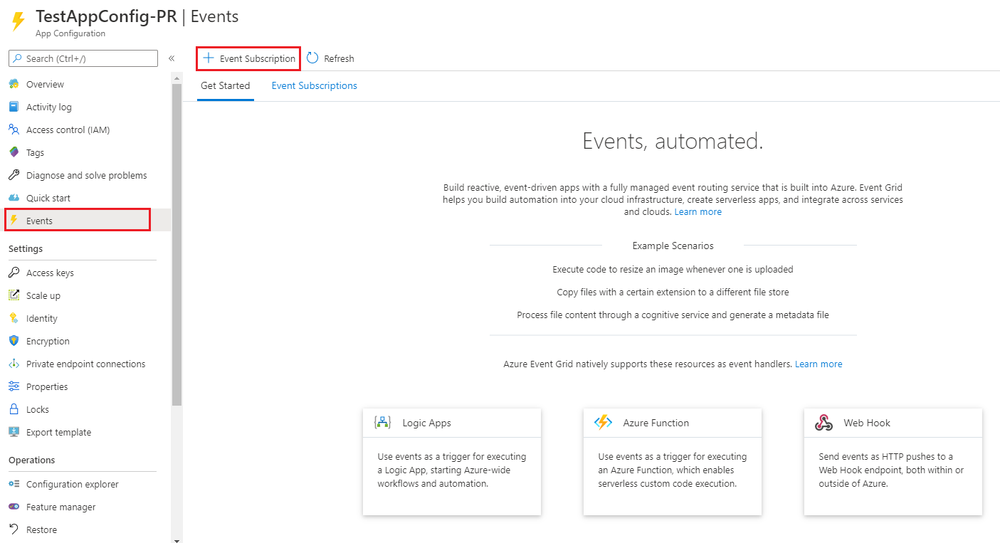
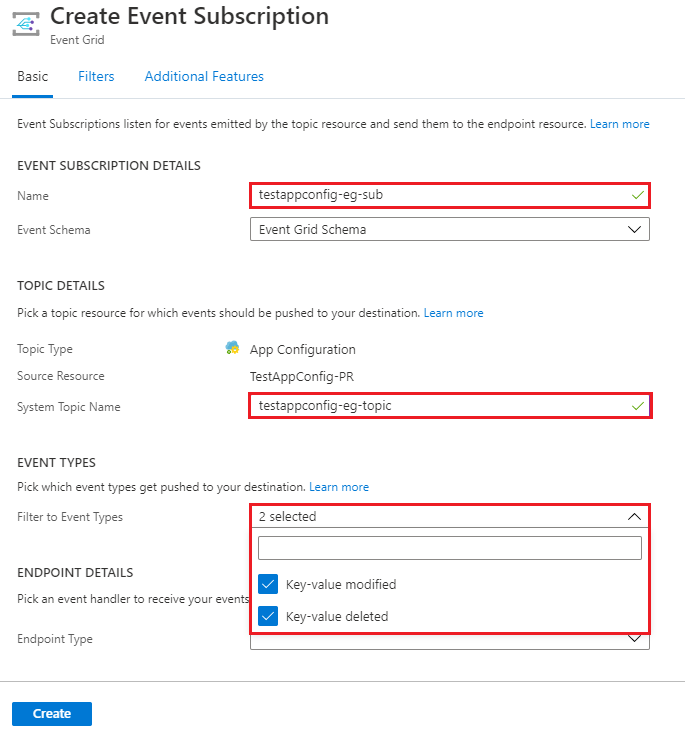
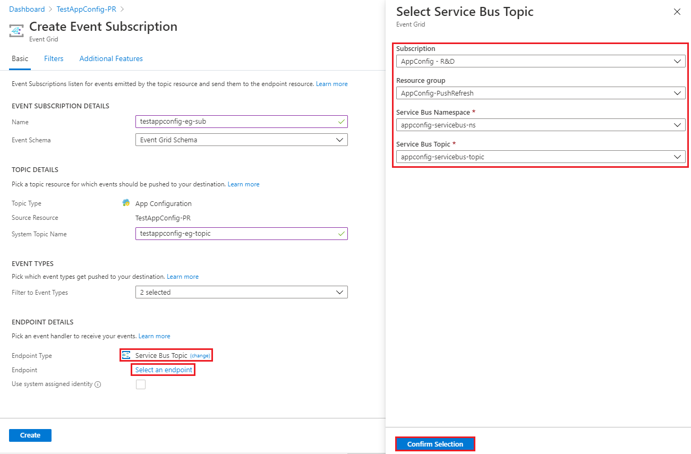
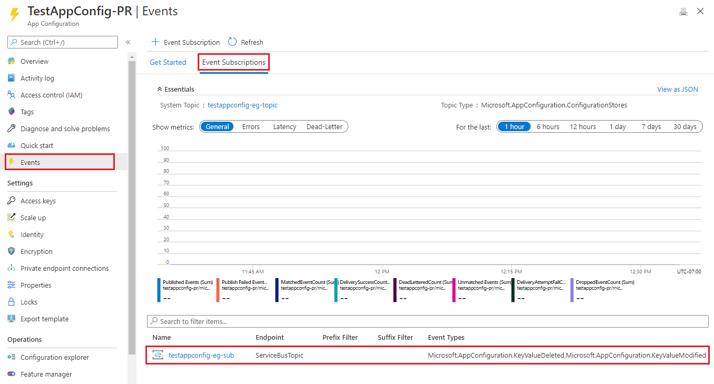

# Tutorial: Use dynamic configuration using push refresh in a Java Spring app

The App Configuration Java Spring client library supports updating configuration on demand without causing an application to restart. An application can be configured to detect changes in App Configuration using one or both of the following two approaches.

1. Poll Model: This is the default behavior that uses polling to detect changes in configuration. Once the cached value of a setting expires, the next call to `AppConfigurationRefresh`'s `refreshConfigurations` sends a request to the server to check if the configuration has changed, and pulls the updated configuration if needed.

1. Push Model: This uses [App Configuration events](./concept-app-configuration-event.md) to detect changes in configuration. Once App Configuration is set up to send key value change events with Event Grid, with a [Web Hook](../event-grid/handler-event-hubs), the application can use these events to optimize the total number of requests needed to keep the configuration updated.

This tutorial shows how you can implement dynamic configuration updates in your code using push refresh. It builds on the app introduced in the quickstarts. Before you continue, finish [Create a Java Spring app with App Configuration](./quickstart-java-spring-app.md) first.

You can use any code editor to do the steps in this tutorial. [Visual Studio Code](https://code.visualstudio.com/) is an excellent option that's available on the Windows, macOS, and Linux platforms.

In this tutorial, you learn how to:

> [!div class="checklist"]
> * Set up a subscription to send configuration change events from App Configuration to a Web Hook
> * Deploy an a Spring Boot application to App Service
> * Set up your Java Spring app to update its configuration in response to changes in App Configuration.
> * Consume the latest configuration in your application.

## Prerequisites

- Azure subscription - [create one for free](https://azure.microsoft.com/free/)
- A supported [Java Development Kit (JDK)](/java/azure/jdk) with version 8.
- [Apache Maven](https://maven.apache.org/download.cgi) version 3.0 or above.

[!INCLUDE [quickstarts-free-trial-note](../../includes/quickstarts-free-trial-note.md)]

## Setup Push Refresh

Open *pom.xml* and update the file with the following dependencies.

```xml
        <dependency>
            <groupId>com.azure.spring</groupId>
            <artifactId>azure-spring-cloud-appconfiguration-config-web</artifactId>
            <version>2.0.0</version>
        </dependency>

        <!-- Adds the Ability to Push Refresh -->
        <dependency>
            <groupId>org.springframework.boot</groupId>
            <artifactId>spring-boot-starter-actuator</artifactId>
        </dependency>
```

Setup [Maven App Service Deployment](../app-service/quickstart-java?tabs=javase)

```console
mvn com.microsoft.azure:azure-webapp-maven-plugin:1.12.0:config
```

Configure Azure App Configuration Push Refresh and Azure Service Bus

```properties
# Azure App Configuration Properties
spring.cloud.azure.appconfiguration.stores[0].connection-string= ${AppConfigurationConnectionString}
spring.cloud.azure.appconfiguration.stores[0].monitoring.enabled= true
spring.cloud.azure.appconfiguration.stores[0].monitoring.cacheExpiration= 30d
spring.cloud.azure.appconfiguration.stores[0].monitoring.triggers[0].key= sentinel
spring.cloud.azure.appconfiguration.stores[0].monitoring.push-notification.primary-token.name= myToken
spring.cloud.azure.appconfiguration.stores[0].monitoring.push-notification.primary-token.secret= myTokenSecret

management.endpoints.web.exposure.include= "appconfiguration-refresh"
```

A random delay is added before the cached value is marked as dirty to reduce potential throttling. The default maximum delay before the cached value is marked as dirty is 30 seconds.

> [!NOTE]
> Primary token name should be store in App Configuration and Primary token secret should be a Key Vault Reference.

> [!NOTE]
> Event Grid Web Hooks requires validation on creation. This can be done by following the [guide](../event-grid/webhook-event-delivery), or by starting your application with Azure App Configuration Spring Web Library configured and it will register it for you.

## Build and run the app locally

1. Set the environment variable:

    #### [Windows command prompt](#tab/cmd)

    ```cmd
    setx AppConfigurationConnectionString <connection-string-of-your-app-configuration-store>
    ```

    #### [PowerShell](#tab/powershell)

    ```PowerShell
    $Env:AppConfigurationConnectionString = <connection-string-of-your-app-configuration-store>
    ```

    #### [Bash](#tab/bash)

    ```bash
    export AppConfigurationConnectionString = <connection-string-of-your-app-configuration-store>
    ```

1. Run the following command to build the console app:

   ```shell
    mvn package
    ```

1. After the build successfully completes, run the following command to run the app locally:

    ```shell
    mvn spring-boot:deploy
    ```

## Set up Event subscription

1. Open the App Configuration resource in the Azure portal, then click on `+ Event Subscription` in the `Events` pane.

    

1. Enter a name for the `Event Subscription` and the `System Topic`.

    

1. Select the `Endpoint Type` as `Web Hook`, select `Select an endpoint`.

    

1. The endpoint is the URI of the application + "/actuator/appconfiguration-refresh?{your-token-name}={your-token-secret}". i.e. https://my-azure-webapp.azurewebsites.net/actuator/appconfiguration-refresh?myToken=myTokenSecret

1. Click on `Create` to create the event subscription.

> [!NOTE]
> When `Create` is selected a registration request for the Web Hook will be sent to your application. This is received by the Azure App Configuration client library, verified, and returns a valid response.

1. Click on `Event Subscriptions` in the `Events` pane to validated that the subscription was created successfully.

    

> [!NOTE]
> When subscribing for configuration changes, one or more filters can be used to reduce the number of events sent to your application. These can be configured either as [Event Grid subscription filters](../event-grid/event-filtering.md) or [Service Bus subscription filters](../service-bus-messaging/topic-filters.md). For example, a subscription filter can be used to only subscribe to events for changes in a key that starts with a specific string.

1. Open a browser window, and go to the URL: `http://localhost:8080`.  You will see the message associated with your key.

You can also use *curl* to test your application, for example:

```cmd
curl -X GET http://localhost:8080
```

1. Select **Configuration Explorer**, and update the values of the following keys:

    | Key | Value |
    |---|---|
    | application/config.message | Hello - Updated |

1. Refresh the browser page to see the new message displayed.

## Clean up resources

[!INCLUDE [azure-app-configuration-cleanup](../../includes/azure-app-configuration-cleanup.md)]

## Next steps

In this tutorial, you enabled your .NET Core app to dynamically refresh configuration settings from App Configuration. To learn how to use an Azure managed identity to streamline the access to App Configuration, continue to the next tutorial.

> [!div class="nextstepaction"]
> [Managed identity integration](./howto-integrate-azure-managed-service-identity.md)