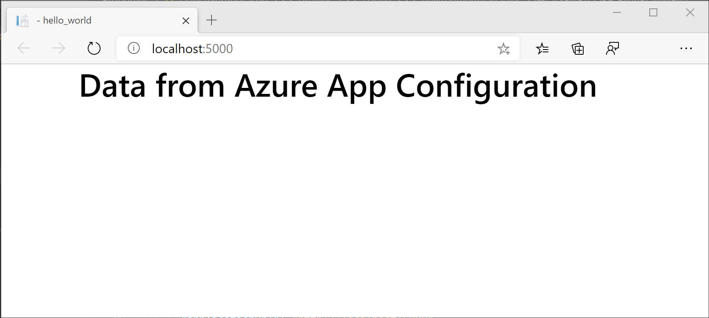
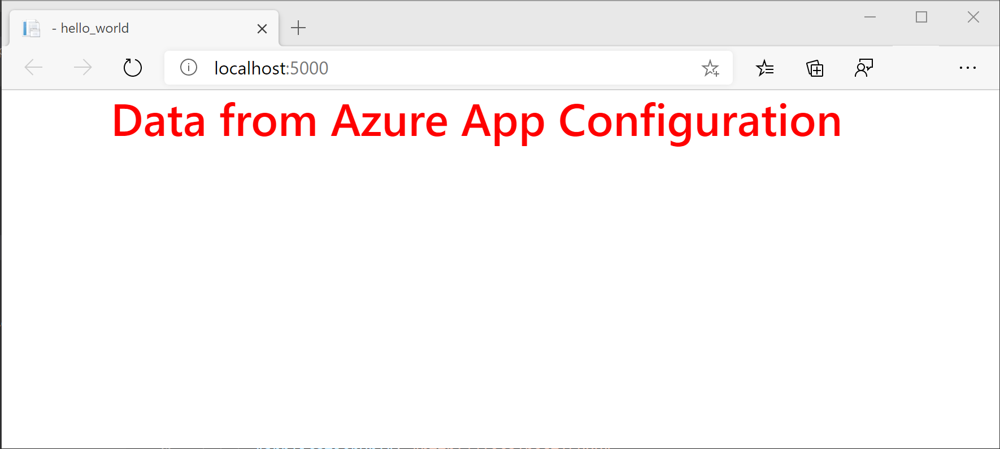

# Use labels to provide per-environment configuration values.

Many applications need to use different configurations for different environments. Suppose that an application has a configuration value that defines the connection string to use for its back-end database. The application developers use a different database from the one used in production. The database connection string that the application uses must change as the application moves from development to production.

In Azure App Configuration, you can use *labels* to define different values for the same key. For example, you can define a single key with different values for development and production. You can specify which label to load when connecting to App Configuration.

To demonstrate this functionality, you'll modify the web app created in [Quickstart: Create an ASP.NET Core app with Azure App Configuration](./quickstart-aspnet-core-app.md) to use different configuration settings for development versus production. Complete the quickstart before proceeding.

## Specify a label when adding a configuration value

In the Azure portal, go to **Configuration Explorer** and find the *TestApp:Settings:FontColor* key that you created in the quickstart. Select its context menu and then select **Add Value**.

> [!div class="mx-imgBorder"]
> 

On the **Add Value** screen, enter a **Value** of **red** and a **Label** of **Development**. Leave **Content type** empty. Select **Apply**.

## Load configuration values with a specified label

By default, Azure App Configuration only loads configuration values with no label. If you've defined labels for your configuration values, you'll want to specify the labels to use when connecting to App Configuration.

In the previous section, you created a different configuration value for the development environment. You use the `HostingEnvironment.EnvironmentName` variable to dynamically determine which environment the app currently runs in. To learn more, see [Use multiple environments in ASP.NET Core](/aspnet/core/fundamentals/environments).

Add a reference to the [Microsoft.Extensions.Configuration.AzureAppConfiguration](/dotnet/api/microsoft.extensions.configuration.azureappconfiguration) namespace in order to access the [KeyFilter](/dotnet/api/microsoft.extensions.configuration.azureappconfiguration.keyfilter) and [LabelFilter](/dotnet/api/microsoft.extensions.configuration.azureappconfiguration.labelfilter) classes.

```csharp
using Microsoft.Extensions.Configuration.AzureAppConfiguration;
``` 

Load configuration values with the label corresponding to the current environment by passing the environment name into the `Select` method:

```csharp
var builder = WebApplication.CreateBuilder(args);

builder.Configuration.AddAzureAppConfiguration(options =>
    {
            options.Connect(builder.Configuration.GetConnectionString("AppConfig"))
                // Load configuration values with no label
                .Select(KeyFilter.Any, LabelFilter.Null)
                // Override with any configuration values specific to current hosting env
                .Select(KeyFilter.Any, builder.Environment.EnvironmentName);
    });
```

> [!IMPORTANT]
> The preceding code snippet uses the Secret Manager tool to load App Configuration connection string. For information storing the connection string using the Secret Manager, see [Quickstart for Azure App Configuration with ASP.NET Core](quickstart-aspnet-core-app.md).

The `Select` method is called twice. The first time, it loads configuration values with no label. Then, it loads configuration values with the label corresponding to the current environment. These environment-specific values override any corresponding values with no label. You don't need to define environment-specific values for every key. If a key doesn't have a value with a label corresponding to the current environment, it uses the value with no label.

## Test in different environments

Open the `launchSettings.json` file under the `Properties` directory. Find the `config` entry under `profiles`. In the `environmentVariables` section, set the `ASPNETCORE_ENVIRONMENT` variable to `Production`.

With the new values set, build and run your application.

```dotnetcli
dotnet build
dotnet run
```

Use a web browser to go to `http://localhost:5000`. You'll notice that the font color is black.



Update `launchSettings.json` to set the `ASPNETCORE_ENVIRONMENT` variable to `Development`. Run `dotnet run` again. 

You'll notice that the font color is now red. This is because the application now uses the value of `TestApp:Settings:FontColor` that has the `Development` label. All other configuration values remain the same as their production values.



## Next steps

> [!div class="nextstepaction"]
> [Configuration in ASP.NET Core](/aspnet/core/fundamentals/configuration/)
