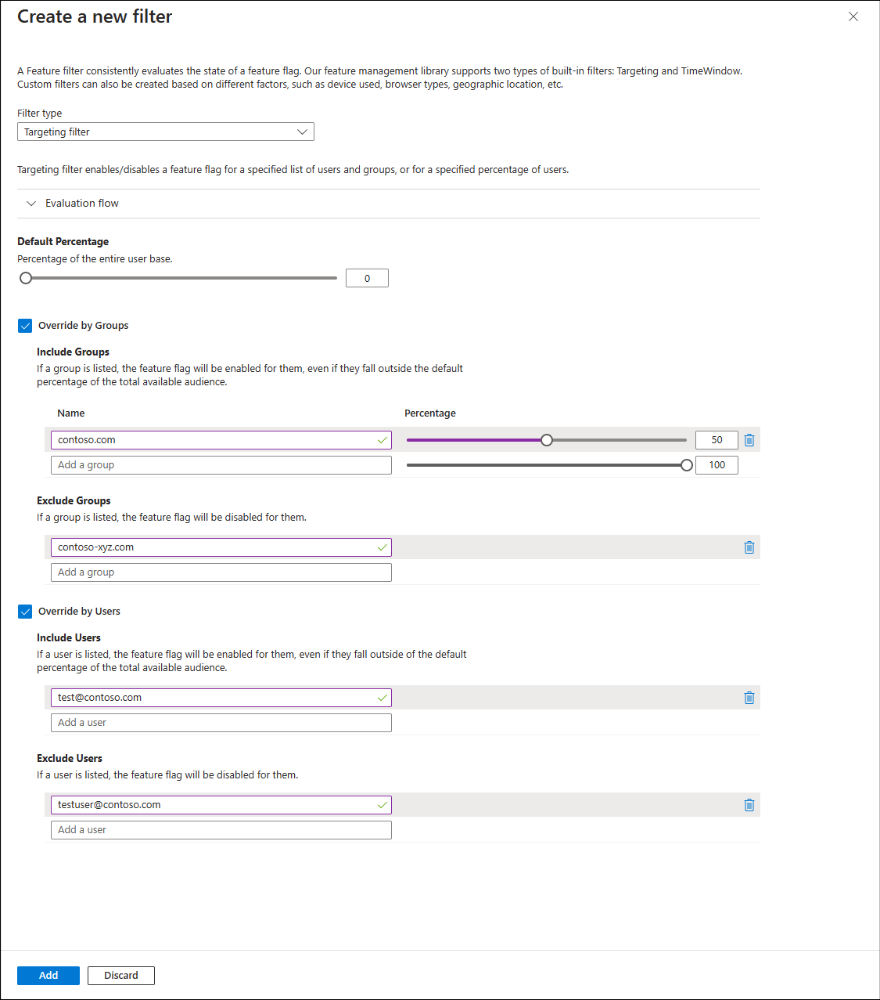
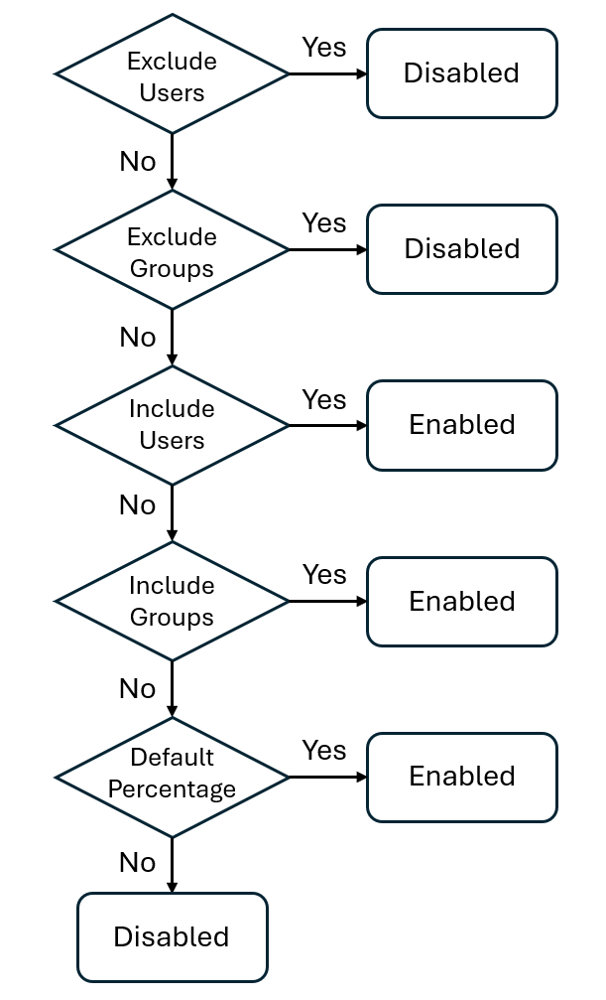
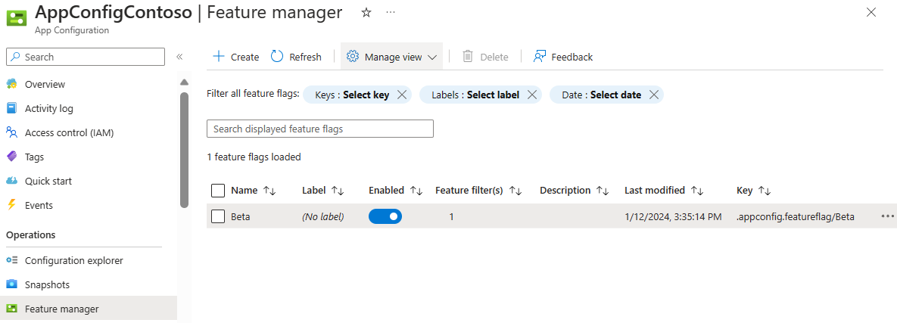

# Tutorial: Roll out features to targeted audiences

Targeting is a feature management strategy that enables developers to progressively roll out new features to their user base. The strategy is built on the concept of targeting a set of users known as the targeted audience. An audience is made up of specific users, groups, and a designated percentage of the entire user base.

- The users can be actual user accounts, but they can also be machines, devices, or any uniquely identifiable entities to which you want to roll out a feature.

- The groups are up to your application to define. For example, when targeting user accounts, you can use Microsoft Entra groups or groups denoting user locations. When targeting machines, you can group them based on rollout stages. Groups can be any common attributes based on which you want to categorize your audience.

The targeting filter is designed for this usage. This feature filter provides the capability to enable a feature for targeted audience. For more information about feature filter, please see this [article](./howto-feature-filters.md#tutorial-enable-conditional-features-with-feature-filters).

In this article, you will learn how to add and configure a targeting feature filter for your feature flags.

## Add a time window filter to a feature flag

1. If you don't have any feature flag, create a feature flag called *Beta* to the App Configuration store and leave **Label** and **Description** with their default values. For more information about how to add feature flags to a store using the Azure portal or the CLI, go to [Create a feature flag](./quickstart-azure-app-configuration-create.md#create-a-feature-flag).

1. In the Azure portal, go to your configuration store and select **Feature manager**.

    

1. On the line with the **Beta** feature flag you created in the quickstart, select the context menu and then **Edit**.

1. In the **Edit feature flag** pane that opens, check the **Enable feature flag** checkbox if it isn't already enabled. Then check the **Use feature filter** checkbox and select **Create**.

    

1. Select the **Targeting filter** in the filter type dropdown.

1. Select the **Override by Groups** and **Override by Users** checkbox.

1. Select the following options.

    - **Default percentage**: 0
    - **Include Groups**: Enter a **Name** of _contoso.com_ and a **Percentage** of _50_
    - **Exclude Groups**: `contoso-xyz.com`
    - **Include Users**: `test@contoso.com`
    - **Exclude Users**: `testuser@contoso.com`

    The feature filter screen will look like this.

    > [!div class="mx-imgBorder"]
    > 

    These settings result in the following behavior.

    - The feature flag is always disabled for user `testuser@contoso.com`, because `testuser@contoso.com` is listed in the _Exclude Users_ section.
    - The feature flag is always disabled for users in the `contoso-xyz.com`, because `contoso-xyz.com` is listed in the _Exclude Groups_ section.
    - The feature flag is always enabled for user `test@contoso.com`, because `test@contoso.com` is listed in the _Include Users_ section.
    - The feature flag is enabled for 50% of users in the _contoso.com_ group, because _contoso.com_ is listed in the _Include Groups_ section with a _Percentage_ of _50_.
    - The feature is always disabled for all other users, because the _Default percentage_ is set to _0_.

    > [!TIP]
    > For a given user, the targeting filter will be evaluated as below:
    >
    > 

1. Select **Add** to save the new feature filter and return to the **Edit feature flag** screen.

1. The feature filter you created is now listed in the feature flag details. Select **Apply** to save the new feature flag settings.

    > [!div class="mx-imgBorder"]
    > 

1. On the **Feature manager** page, the feature flag now has a **Feature filter(s)** value of **1**.

    > [!div class="mx-imgBorder"]
    > 

Now, you sucessfully added a targeting filter for your feature flag. This targeting filter will use the targeting rule you configured to enable or disable the feature flag for specific users and groups. The next step is to use the feature flag with the targeting filter in your application.

## Next steps

To learn how to use the feature flag with targeting filter in your application, continue to the following tutorial:

> [!div class="nextstepaction"]
> [ASP.NET](./howto-targetingfilter-aspnet-core.md)

To learn more about the feature filters, continue to the following tutorials:

> [!div class="nextstepaction"]
> [Enable conditional features with feature filters](./howto-feature-filters.md)

> [!div class="nextstepaction"]
> [Enable features on a schedule](./howto-timewindow-filter.md)