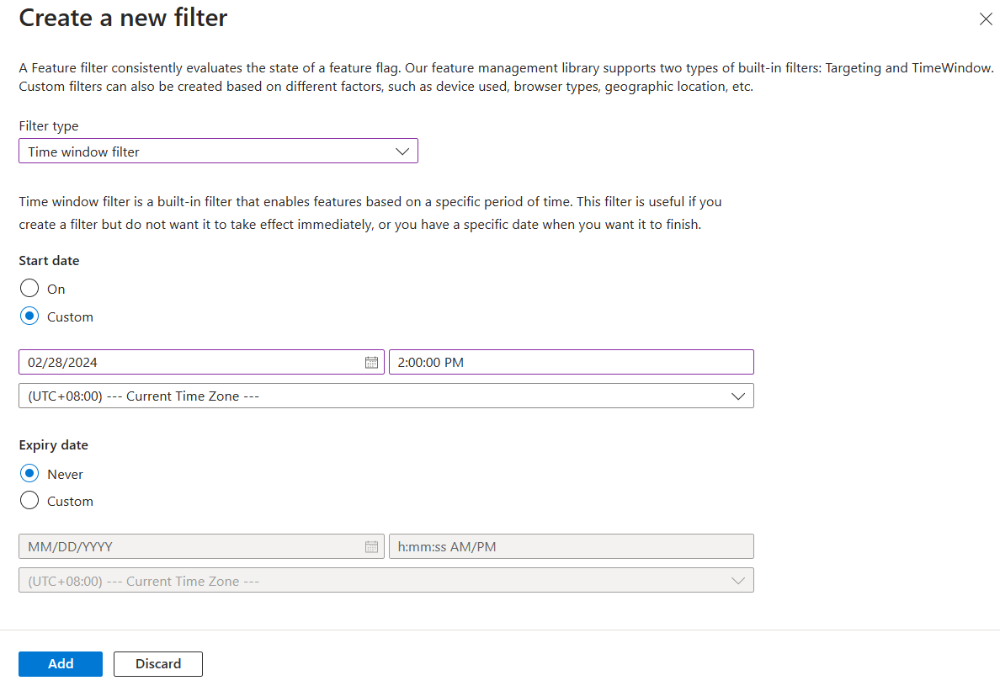

# Enable features on a schedule

[Feature filters](./howto-feature-filters.md#enable-conditional-features-with-feature-filters) allow a feature flag to be enabled or disabled dynamically. For instance, you might want to regulate the feature's availability on a schedule, such as enabling or disabling it until a certain moment. This can be accomplished using the time window filter, which provides the capability to enable a feature based on a time window. 

The time window filter is one of the built-in filters of the Microsoft `FeatureManagement` libraries. The time window filter can be accessible from the Azure App Configuration portal and you can add it to your feature flags. 

In this article, you will learn how to add and configure a time window feature filter for your feature flags.

## Add a time window filter to a feature flag

1. If you don't have any feature flag, create a feature flag called *Beta* to the App Configuration store and leave **Label** and **Description** with their default values. For more information about how to add feature flags to a store using the Azure portal or the CLI, go to [Create a feature flag](./quickstart-azure-app-configuration-create.md#create-a-feature-flag).

1. In the Azure portal, go to your configuration store and select **Feature manager**.

    > [!div class="mx-imgBorder"]
    > 

1. On the line with the **Beta** feature flag you created in the quickstart, select the context menu and then **Edit**.

1. In the **Edit feature flag** pane that opens, check the **Enable feature flag** checkbox if it isn't already enabled. Then check the **Use feature filter** checkbox and select **Create**.

    > [!div class="mx-imgBorder"]
    > 

1. 1. Select the **Time window filter** in the filter type dropdown.

1. Set the **Start date** to **Custom** and select a time a few minutes ahead of your current time. Set the **Expiry date** to **Never**

    > [!div class="mx-imgBorder"]
    > 

1. Select **Add** to save the new feature filter and return to the **Edit feature flag** screen.

1. The feature filter you created is now listed in the feature flag details. Select **Apply** to save the new feature flag settings.

    > [!div class="mx-imgBorder"]
    > 

1. On the **Feature manager** page, the feature flag now has a **Feature filter(s)** value of **1**.

    > [!div class="mx-imgBorder"]
    > 

Now, you sucessfully added a time window filter for your feature flag. This time window filter will disable your feature flag until the *Start* time you specificied. The next step is to use the feature flag with the time window filter in your application.

## Next steps

To learn how to use the feature flag with time window in your application, continue to the following tutorial:

> [!div class="nextstepaction"]
> [ASP.NET](./howto-timewindow-filter-aspnet-core.md)

To learn more about the feature filters, continue to the following tutorials:

> [!div class="nextstepaction"]
> [Enable conditional features with feature filters](./howto-feature-filter.md)

> [!div class="nextstepaction"]
> [Roll out features to targeting audience](./howto-targetingfilter.md)