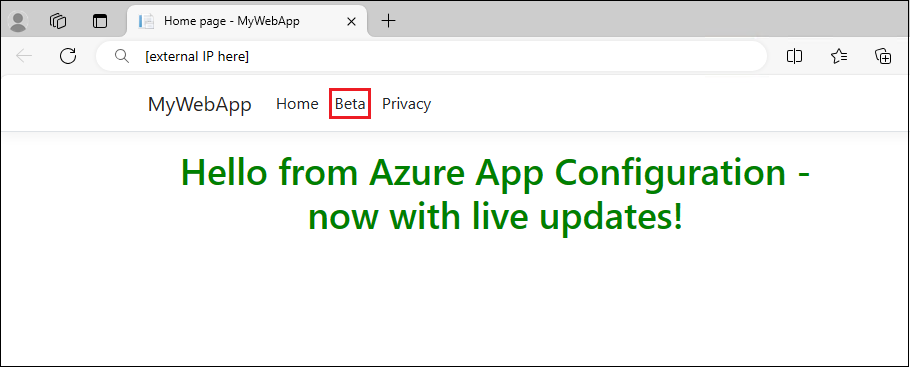
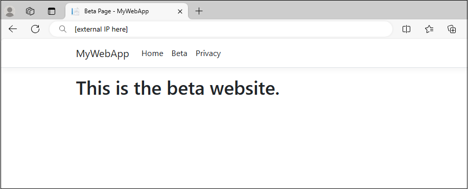

# Quickstart: Add feature flags to workloads in Azure Kubernetes Service

In this quickstart, you'll create a feature flag in Azure App Configuration and use it to dynamically control the visibility of a new web page in an ASP.NET Core app running in AKS without restarting or redeploying it.

## Prerequisites

Follow the documents to use dynamic configuration in Azure Kubernetes Service.

* [Quickstart: Use Azure App Configuration in Azure Kubernetes Service](./quickstart-azure-kubernetes-service.md)
* [Tutorial: Use dynamic configuration in Azure Kubernetes Service](./enable-dynamic-configuration-azure-kubernetes-service.md)

## Create a feature flag

Add a feature flag called *Beta* to the App Configuration store and leave **Label** and **Description** with their default values. For more information about how to add feature flags to a store using the Azure portal or the CLI, go to [Create a feature flag](./quickstart-azure-app-configuration-create.md#create-a-feature-flag).

    > [!div class="mx-imgBorder"]
    > 

## Use a feature flag

In this section, you will use feature flags in a simple ASP.NET web application and run it in Azure Kubernetes Service (AKS). 

1. Navigate into the project's directory you created in the [Quickstart](./quickstart-azure-kubernetes-service.md), and run the following command to add a reference to the [Microsoft.FeatureManagement.AspNetCore](https://www.nuget.org/packages/Microsoft.FeatureManagement.AspNetCore) NuGet package version 3.2.0 or later.

    ```dotnetcli
    dotnet add package Microsoft.FeatureManagement.AspNetCore
    ```

1. Open *program.cs*, and add feature management to the service collection of your app by calling `AddFeatureManagement`.

    ```csharp   
    // Existing code in Program.cs
    // ... ...

    // Add a JSON configuration source 
    builder.Configuration.AddJsonFile("config/mysettings.json", reloadOnChange: true, optional: false); 

    // Add feature management to the container of services.
    builder.Services.AddFeatureManagement();

    var app = builder.Build();

    // The rest of existing code in program.cs
    // ... ...
    ```
    
    Add `using Microsoft.FeatureManagement;` at the top of the file if it's not present.

1. Add a new empty Razor page named **Beta** under the *Pages* directory. It includes two files *Beta.cshtml* and *Beta.cshtml.cs*.

    Open *Beta.cshtml*, and update it with the following markup:

    ```cshtml
    @page
    @model MyWebApp.Pages.BetaModel
    @{
        ViewData["Title"] = "Beta Page";
    }

    <h1>This is the beta website.</h1>
    ```

    Open *Beta.cshtml.cs*, and add `FeatureGate` attribute to the `BetaModel` class. The `FeatureGate` attribute ensures the *Beta* page is accessible only when the *Beta* feature flag is enabled. If the *Beta* feature flag isn't enabled, the page will return 404 Not Found.

    ```csharp
    using Microsoft.AspNetCore.Mvc.RazorPages;
    using Microsoft.FeatureManagement.Mvc;

    namespace MyWebApp.Pages
    {
        [FeatureGate("Beta")]
        public class BetaModel : PageModel
        {
            public void OnGet()
            {
            }
        }
    }   
    ```

1. Open *Pages/_ViewImports.cshtml*, and register the feature manager Tag Helper using an `@addTagHelper` directive:

    ```cshtml
    @addTagHelper *, Microsoft.FeatureManagement.AspNetCore
    ```

    The preceding code allows the `<feature>` Tag Helper to be used in the project's *.cshtml* files.

1. Open *_Layout.cshtml* in the *Pages*\\*Shared* directory. Insert a new `<feature>` tag in between the *Home* and *Privacy* navbar items, as shown in the highlighted lines below.

    :::code language="html" source="../../includes/azure-app-configuration-navbar.md" range="22-36" highlight="6-10":::

    The `<feature>` tag ensures the *Beta* menu item is shown only when the *Beta* feature flag is enabled.

1. [Containerize the application](./quickstart-azure-kubernetes-service.md#containerize-the-application) and [Push the image to Azure Container Registry](./quickstart-azure-kubernetes-service.md#push-the-image-to-azure-container-registry). 

1. [Deploy the application](./quickstart-azure-kubernetes-service.md#deploy-the-application). Refresh the browser and the web page will look like this:

    

## Use Kubernetes Provider to load feature flags

1. Update the *appConfigurationProvider.yaml* file located in the *Deployment* directory with the following content.
   
    ```yaml
    apiVersion: azconfig.io/v1
    kind: AzureAppConfigurationProvider
    metadata:
      name: appconfigurationprovider-sample
    spec:
      endpoint: <your-app-configuration-store-endpoint>
      target:
        configMapName: configmap-created-by-appconfig-provider
        configMapData: 
          type: json
          key: mysettings.json
      auth:
        workloadIdentity:
          managedIdentityClientId: <your-managed-identity-client-id>
      featureFlag:
        selectors:
          - keyFilter: 'Beta'
        refresh:
          enabled: true
    ```

    > [!TIP]
    > When no `selectors` are specified in `featureFlag` section, the Kubernetes Provider will not load feature flags from your App Configuration store. The default refresh interval of feature flags is 30 seconds when `featureFlag.refresh` enabled. You can customize this behavior via the `featureFlag.refresh.interval` parameter.

1. Run the following command to apply the changes.

    ```console
    kubectl apply -f ./Deployment -n appconfig-demo
    ```

1. Update the **Beta** feature flag in your App Configuration store. Enable the flag by selecting the checkbox under **Enabled**.

1. After refreshing the browser multiple times, the updated content will become visible once the ConfigMap has been updated within 30 seconds.

    

1. Select the **Beta** menu. It will bring you to the beta website that you enabled dynamically.

    

## Clean up resources

Uninstall the App Configuration Kubernetes Provider from your AKS cluster if you want to keep the AKS cluster.

```console
helm uninstall azureappconfiguration.kubernetesprovider --namespace azappconfig-system
```

[!INCLUDE[Azure App Configuration cleanup](../../includes/azure-app-configuration-cleanup.md)]

## Next steps

In this quickstart, you:

* Added feature management capability to an ASP.NET Core app running in Azure Kubernetes Service (AKS).
* Connected your AKS cluster to your App Configuration store using the App Configuration Kubernetes Provider.
* Created a ConfigMap with key-values and feature flags from your App Configuration store.
* Ran the application with dynamic configuration from your App Configuration store without changing your application code.

To learn more about the Azure App Configuration Kubernetes Provider, see [Azure App Configuration Kubernetes Provider reference](./reference-kubernetes-provider.md).

To learn more about feature management capability, continue to the following tutorial.

> [!div class="nextstepaction"]
> [Enable features for targeted audiences](./howto-targetingfilter-aspnet-core.md)

> [!div class="nextstepaction"]
> [Use feature filters for conditional feature flags](./howto-feature-filters-aspnet-core.md)