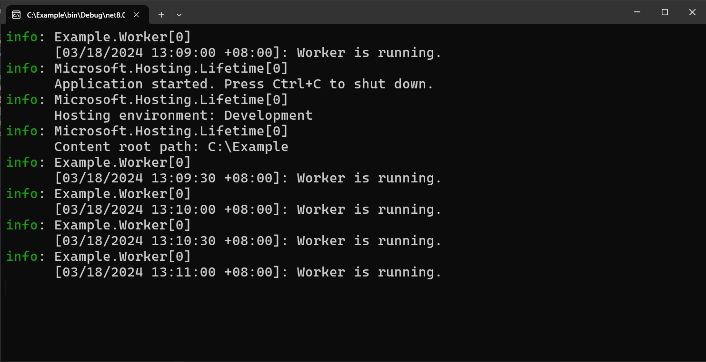
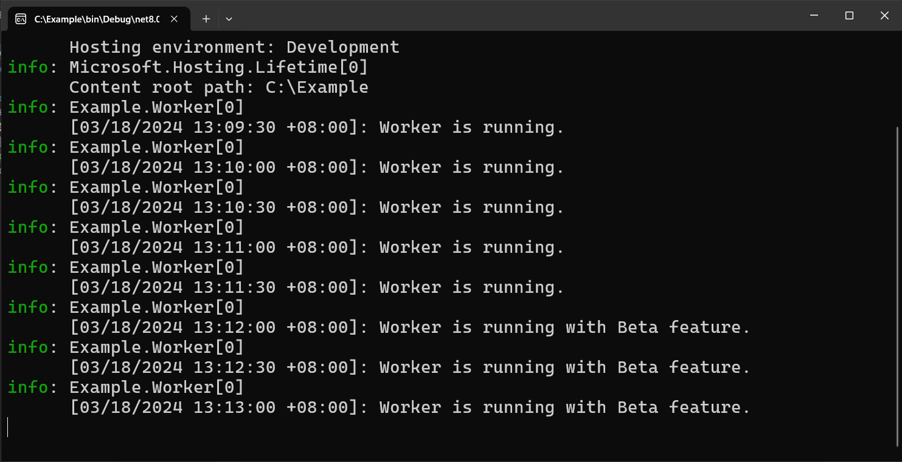

# Quickstart: Add feature flags to a .NET background service

In this quickstart, you incorporate Azure App Configuration into a .NET background service to create an end-to-end implementation of feature management. You can use the App Configuration service to centrally store all your feature flags and control their states.

## Prerequisites

- An Azure account with an active subscription. [Create one for free](https://azure.microsoft.com/free/).
- An App Configuration store. [Create a store](./quickstart-azure-app-configuration-create.md#create-an-app-configuration-store).
- [.NET SDK](https://dotnet.microsoft.com/download) - also available in the [Azure Cloud Shell](https://shell.azure.com).

## Add a feature flag

Add a feature flag called *Beta* to the App Configuration store and leave **Label** and **Description** with their default values. For more information about how to add feature flags to a store using the Azure portal or the CLI, go to [Create a feature flag](./quickstart-azure-app-configuration-create.md#create-a-feature-flag).

> [!div class="mx-imgBorder"]
> 

## Create a .NET background service

You use the [.NET command-line interface (CLI)](/dotnet/core/tools/) to create a new .NET console app project. The advantage of using the .NET CLI over Visual Studio is that it's available across the Windows, macOS, and Linux platforms.  Alternatively, use the preinstalled tools available in the [Azure Cloud Shell](https://shell.azure.com).

1. Create a new folder for your project.

2. In the new folder, run the following command to create a new .NET console app project:

    ```dotnetcli
    dotnet new worker
    ```

## Use feature flag

1. Add references to the `Microsoft.Extensions.Configuration.AzureAppConfiguration` and `Microsoft.FeatureManagement` NuGet packages by running the following commands:

    ```dotnetcli
    dotnet add package Microsoft.Extensions.Configuration.AzureAppConfiguration
    dotnet add package Microsoft.FeatureManagement
    ```

1. Run the following command to restore packages for your project:

    ```dotnetcli
    dotnet restore
    ```

1. Open *Program.cs* and add the following statements:

    ```csharp
    using Microsoft.Extensions.Configuration;
    using Microsoft.Extensions.Configuration.AzureAppConfiguration;
    using Microsoft.FeatureManagement;
    ```

1. Connect to App Configuration. Register configuration and feature management services.

    ```csharp
    builder.Configuration.AddAzureAppConfiguration(options =>
    {
        options.Connect(Environment.GetEnvironmentVariable("ConnectionString"))
            .UseFeatureFlags(featureFlagOptions => {
                // Set the feature flag refresh expiration time to 5 seconds
                featureFlagOptions.CacheExpirationInterval = TimeSpan.FromSeconds(5);
            });

        // Register the refresher so that the Worker service can consume it through DI
        builder.Services.AddSingleton(options.GetRefresher());
    });

    builder.Services.AddFeatureManagement();
    ```

1. Open *Worker.cs* and add a reference to the .NET Feature Management library.

    ```csharp
    using Microsoft.FeatureManagement;
    ```

1. Inject `IConfigurationRefresher` and `IFeatureManager` to the `Worker` service and switch the running mode depending on the `Beta` feature flag state.

    ```csharp
    public class Worker : BackgroundService
    {
        private readonly ILogger<Worker> _logger;
        private readonly IConfigurationRefresher _refresher;
        private readonly IFeatureManager _featureManager;

        public Worker(ILogger<Worker> logger, IConfigurationRefresher refresher, IFeatureManager featureManager)
        {
            _logger = logger;
            _refresher = refresher;
            _featureManager = featureManager;
        }

        protected override async Task ExecuteAsync(CancellationToken stoppingToken)
        {
            while (!stoppingToken.IsCancellationRequested)
            {
                if (_refresher != null)
                {
                    await _refresher.TryRefreshAsync(stoppingToken);
                }

                if (_logger.IsEnabled(LogLevel.Information))
                {
                    if (await _featureManager.IsEnabledAsync("Beta"))
                    {
                        _logger.LogInformation("[{time}]: Worker running in Beta mode.", DateTimeOffset.Now);
                    }
                    else
                    {
                        _logger.LogInformation("[{time}]: Worker running in stable mode.", DateTimeOffset.Now);
                    }
                }
                await Task.Delay(1000, stoppingToken);
            }
        }
    }
    ```

## Build and run the app locally

1. Set an environment variable named **ConnectionString**, and set it to the access key to your App Configuration store. At the command line, run the following command.

    ### [Windows command prompt](#tab/windowscommandprompt)

    To build and run the app locally using the Windows command prompt, run the following command.

    ```console
    setx ConnectionString "connection-string-of-your-app-configuration-store"
    ```

    Restart the command prompt to allow the change to take effect. Print the value of the environment variable to validate that it's set properly.

    ### [PowerShell](#tab/powershell)

    If you use Windows PowerShell, run the following command.

    ```azurepowershell
    $Env:ConnectionString = "connection-string-of-your-app-configuration-store"
    ```

    ### [macOS](#tab/unix)

    If you use macOS, run the following command.

    ```console
    export ConnectionString='connection-string-of-your-app-configuration-store'
    ```

    Restart the command prompt to allow the change to take effect. Print the value of the environment variable to validate that it's set properly.

    ### [Linux](#tab/linux)

    If you use Linux, run the following command.

    ```console
    export ConnectionString='connection-string-of-your-app-configuration-store'
    ```

    Restart the command prompt to allow the change to take effect. Print the value of the environment variable to validate that it's set properly.

    ---

1. Run the following command to build the console app.

    ```dotnetcli
    dotnet build
    ```

1. After the build successfully completes, run the following command to run the app locally.

    ```dotnetcli
    dotnet run
    ```

1. You should see the following outputs in the console.

    

1. Sign in to the [Azure portal](https://portal.azure.com). Select **All resources**, and select the App Configuration store that you created previously. 

1. Select **Feature manager** and locate the **Beta** feature flag. Enable the flag by selecting the checkbox under **Enabled**.

1. Wait for about 5 seconds. You should see the service mode has changed.

    

## Clean up resources

[!INCLUDE [azure-app-configuration-cleanup](../../includes/azure-app-configuration-cleanup.md)]

## Next steps

In this quickstart, you added feature management capability to a .NET background service on top of dynamic configuration. For more information about dynamic configuration, continue to the following tutorial.

> [!div class="nextstepaction"]
> [Enable dynamic configuration](./enable-dynamic-configuration-dotnet.md)

To enable feature management capability for other types of apps, continue to the following tutorials.

> [!div class="nextstepaction"]
> [Use feature flags in .NET apps](./quickstart-feature-flag-dotnet.md)

> [!div class="nextstepaction"]
> [Use feature flags in ASP.NET Core apps](./quickstart-feature-flag-aspnet-core.md)

To learn more about managing feature flags in Azure App Configuration, continue to the following tutorial.

> [!div class="nextstepaction"]
> [Manage feature flags in Azure App Configuration](./manage-feature-flags.md)
