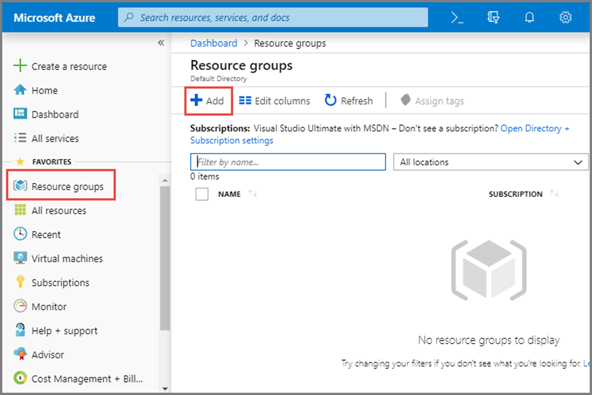
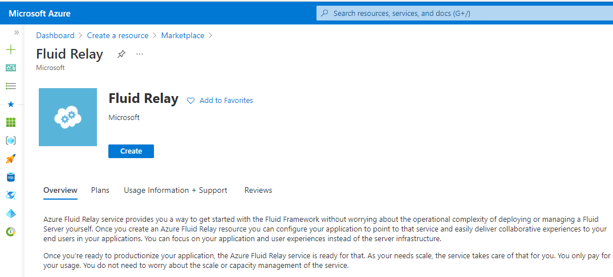
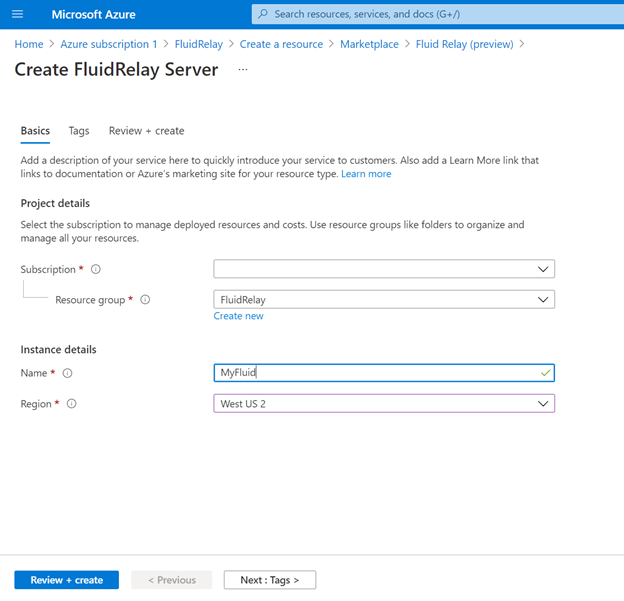
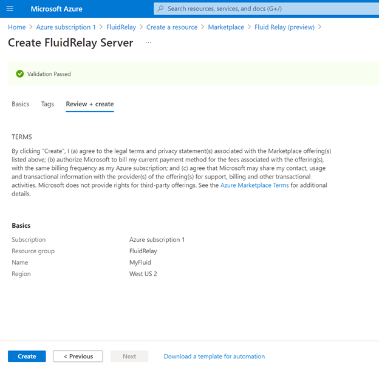
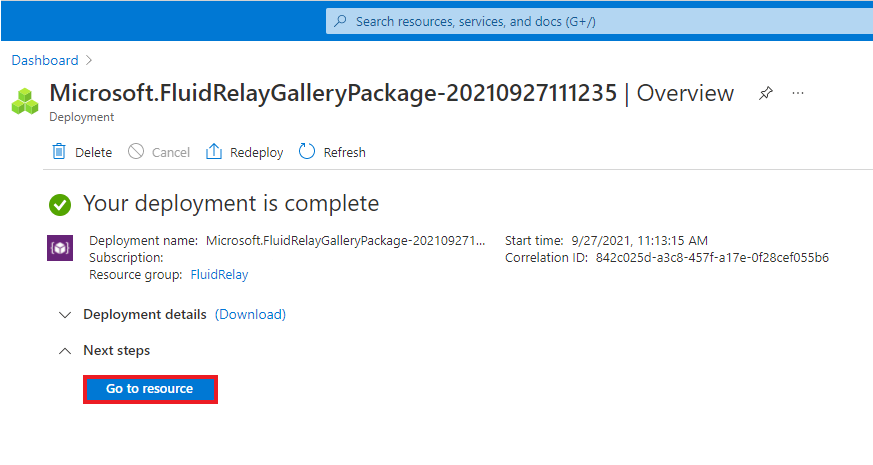

# How to: Provision an Azure Fluid Relay service

Before you can connect your app to an Azure Fluid Relay server, you must provision an Azure Fluid Relay server resource on your Azure account. This article walks through the steps to get your Azure Fluid Relay service provisioned and ready to use. 

> [!NOTE]
> The [Fluid Framework](https://fluidframework.com/) is an open source, platform independent framework. [Azure Fluid Relay](../overview/overview.md) is a turnkey implementation of a Fluid Framework server, and is recommended for production deployments.

## Prerequisites

To create an Azure Fluid Relay service, you must have an Azure account. If you don't have an account, you can can [try Azure for free](https://azure.com/free).

## Create a resource group
A resource group is a logical collection of Azure resources. All resources are deployed and managed in a resource group. To create a resource group:

1. Sign in to the [Azure portal](https://portal.azure.com/).

2. In the left navigation, select **Resource groups**. Then select **Add**.

3. For Subscription, select the name of the Azure subscription in which you want to create the resource group.
4. Type a unique name for the resource group. The system immediately checks to see if the name is available in the currently selected Azure subscription.
5. Select a region for the resource group.
6. Select **Review + Create**.
7. On the Review + Create page, select **Create**.

## Create a Fluid Relay resource
Each Azure Fluid Relay server resource provides a tenant for you to use in your Fluid application. Within that tenant, you’ll be able to create many containers/sessions. To create a Fluid Relay in your resource group using the portal:

1. In the Azure portal, and select **Create a resource** at the top left of the screen.
2. Search for 'Fluid'
 

3. Select **Fluid Relay**, and select **Create**.
 

4. On the Create page, take the following steps:
    1. Select the subscription in which you want to create the namespace.
    2. Select the resource group you created in the previous step.
    3. Enter a name for the Fluid Relay resource.
    4. Select a location for the namespace.
    > [!NOTE]
    > During the public preview, the only the West US2 and West Europe regions are supported

5. Click the **Review + Create** button at the bottom of the page.
 

6. On the Review + Create page, review the settings, and select *Create*. Wait for the deployment to complete.
 

7. On the Deployment page, select **Go to resource** to navigate to the page for your namespace.
 

8. Confirm that you see the Fluid Relay page similar to this example.
  
## Next steps
You just created a resource group and an provisioned an Azure Fluid Relay resource in that group. Next, you can connect to your Azure Fluid Relay service in your app.

