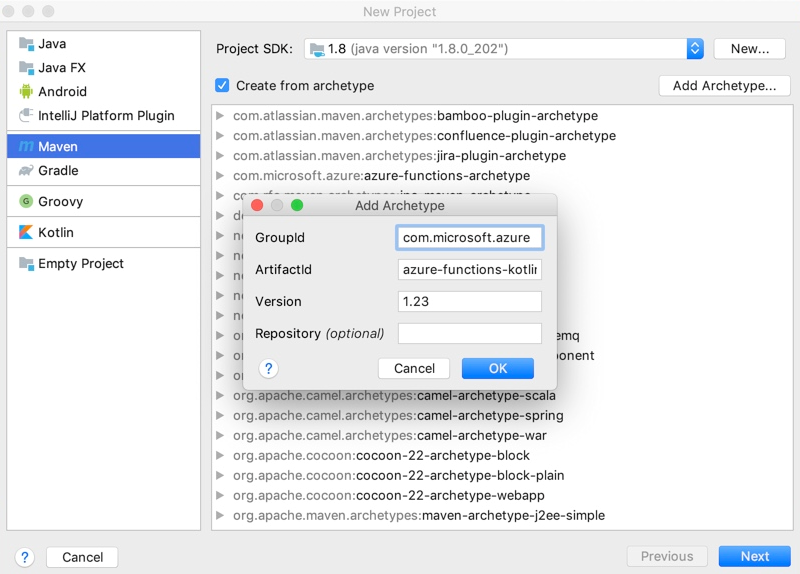

# Quickstart: Create your first HTTP triggered function with Kotlin and IntelliJ

This article shows you how to create a [serverless](https://azure.microsoft.com/overview/serverless-computing/) function project with IntelliJ IDEA and Apache Maven. It also shows how to locally debug your function code in the integrated development environment (IDE) and then deploy the function project to Azure.

[!INCLUDE [quickstarts-free-trial-note](../../includes/quickstarts-free-trial-note.md)]

## Set up your development environment

To develop a function with Kotlin and IntelliJ, install the following software:

- [Java Developer Kit](/azure/developer/java/fundamentals/java-jdk-long-term-support) (JDK), version 8
- [Apache Maven](https://maven.apache.org), version 3.0 or higher
- [IntelliJ IDEA](https://www.jetbrains.com/idea/download), Community or Ultimate versions with Maven
- [Azure CLI](/cli/azure)
- [Version 2.x](functions-run-local.md#v2) of the Azure Functions Core Tools. It provides a local development environment for writing, running, and debugging Azure Functions.

> [!IMPORTANT]
> The JAVA_HOME environment variable must be set to the install location of the JDK to complete the steps in this article.

## Create a Functions project

1. In IntelliJ IDEA, select **Create New Project**.  
1. In the **New Project** window, select **Maven** from the left pane.
1. Select the **Create from archetype** check box, and then select **Add Archetype** for the [azure-functions-kotlin-archetype](https://mvnrepository.com/artifact/com.microsoft.azure/azure-functions-kotlin-archetype).
1. In the **Add Archetype** window, complete the fields as follows:
    - _GroupId_: com.microsoft.azure
    - _ArtifactId_: azure-functions-kotlin-archetype
    - _Version_: Use the latest version from [the central repository](https://mvnrepository.com/artifact/com.microsoft.azure/azure-functions-kotlin-archetype)
      
1. Select **OK**, and then select **Next**.
1. Enter your details for current project, and select **Finish**.

Maven creates the project files in a new folder with the same name as the _ArtifactId_ value. The project's generated code is a simple [HTTP-triggered](./functions-bindings-http-webhook.md) function that echoes the body of the triggering HTTP request.

## Run functions locally in the IDE

> [!NOTE]
> To run and debug functions locally, make sure you've installed [Azure Functions Core Tools, version 2](functions-run-local.md#v2).

1. Import changes manually or enable [auto import](https://www.jetbrains.com/help/idea/creating-and-optimizing-imports.html).
1. Open the **Maven Projects** toolbar.
1. Expand **Lifecycle**, and then open **package**. The solution is built and packaged in a newly created target directory.
1. Expand **Plugins** > **azure-functions** and open **azure-functions:run** to start the Azure Functions local runtime.  
    

1. Close the run dialog box when you're done testing your function. Only one function host can be active and running locally at a time.

## Debug the function in IntelliJ

1. To start the function host in debug mode, add **-DenableDebug** as the argument when you run your function. You can either change the configuration in [maven goals](https://www.jetbrains.com/help/idea/maven-support.html#run_goal) or run the following command in a terminal window:  

   ```
   mvn azure-functions:run -DenableDebug
   ```

   This command causes the function host to open a debug port at 5005.

1. On the **Run** menu, select **Edit Configurations**.
1. Select **(+)** to add a **Remote**.
1. Complete the _Name_ and _Settings_ fields, and then select **OK** to save the configuration.
1. After setup, select **Debug < Remote Configuration Name >** or press Shift+F9 on your keyboard to start debugging.

   

1. When you're finished, stop the debugger and the running process. Only one function host can be active and running locally at a time.

## Deploy the function to Azure

1. Before you can deploy your function to Azure, you must [log in by using the Azure CLI](/cli/azure/authenticate-azure-cli?view=azure-cli-latest).

   ``` azurecli
   az login
   ```

1. Deploy your code into a new function by using the `azure-functions:deploy` Maven target. You can also select the **azure-functions:deploy** option in the Maven Projects window.

   ```
   mvn azure-functions:deploy
   ```

1. Find the URL for your function in the Azure CLI output after  the function has been successfully deployed.

   ``` output
   [INFO] Successfully deployed Function App with package.
   [INFO] Deleting deployment package from Azure Storage...
   [INFO] Successfully deleted deployment package fabrikam-function-20170920120101928.20170920143621915.zip
   [INFO] Successfully deployed Function App at https://fabrikam-function-20170920120101928.azurewebsites.net
   [INFO] ------------------------------------------------------------------------
   ```

## Next steps

Now that you have deployed your first Kotlin function to Azure, review the [Java Functions developer guide](functions-reference-java.md) for more information on developing Java and Kotlin functions.
- Add additional functions with different triggers to your project by using the `azure-functions:add` Maven target.
